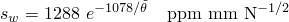
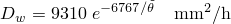
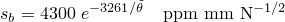
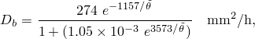
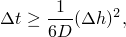
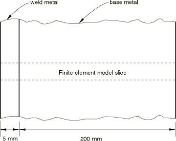
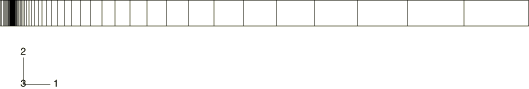
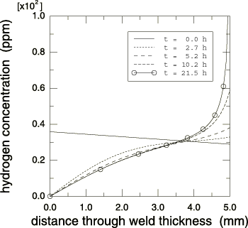
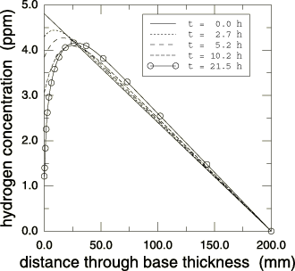

# 8.1.1 Hydrogen diffusion in a vessel wall section

**Product: **Abaqus/Standard  

This one-dimensional problem provides a simple verification of the mass diffusion capability in Abaqus. The uncoupled mass diffusion formulation used in Abaqus is described in ["Mass diffusion analysis," Section 6.9.1 of the Abaqus Analysis User's Guide](../usb/usb-link.md#usb-anl-amassdiffusion), and ["Mass diffusion analysis," Section 2.13.1 of the Abaqus Theory Guide](../stm/stm-link.md#stm-anl-massdiffusion).

The physical problem considered here is that of a pressure vessel shell wall fabricated from 2 1/4 Cr–1 Mo steel alloy base metal with an internal weld overlay of Type 347 stainless steel. These vessels are typically used at high temperatures and under high pressure conditions. Under such service conditions hydrogen dissolves into the alloys (Fujii et al., 1982) and during cooldown may cause disbonding of the weld overlay from the base metal and, possibly, crack initiation and growth in the base metal due to hydrogen embrittlement. In this example we are concerned with the hydrogen diffusion aspect of the problem.

### Problem description

The problem is shown in [Figure 8.1.1--1](ch08s01aex127.md#sxmh2odiff-wallsection) and consists of a section of the vessel wall made up of a 200-mm thick base metal and a 5-mm thick weld metal. The problem is one-dimensional, the only gradient being through the thickness of the wall. The purpose of the analysis is to predict the evolution of hydrogen concentration through the wall thickness during cooling caused by a shutdown.

### Geometry and model

Since the problem is one-dimensional, we use a plane mesh with only one element in the *y*-direction (see [Figure 8.1.1--2](ch08s01aex127.md#sxmh2odiff-model)). The mesh is graded, with more elements near the interface between the two materials because we expect very high concentration gradients in this vicinity.

The material properties of the two metals given by Fujii et al. (1982) are strongly dependent on temperature and can be written as follows.

Solubility in weld metal:

Diffusivity in weld metal:

Solubility in base metal:

Diffusivity in base metal:

where  is temperature in kelvins. These temperature-dependent properties are entered in Abaqus in tabulated form, as shown in the input listings.

The wall is initially at a uniform temperature of 727.5 K (454.4C), and during the shutdown schedule it cools down to 298.15 K (25.0C) at a constant rate over a period of 21.5 hours.

The boundary conditions are as follows. Under the initial steady-state conditions the exterior of the weld metal has a hydrogen concentration of 35.85 ppm, which corresponds to a normalized concentration of 0.1225 N1/2mm1. Normalized concentration is used as the primary solution variable (continuous over the discretized domain) and is given as the concentration divided by the solubility. The exterior of the base metal has a zero hydrogen concentration. As the cooling period begins, the hydrogen concentration at the exterior of the weld metal is assumed to drop to zero instantaneously.

### Time stepping

The problem is run in two parts. The first part consists of a step in which a single increment of steady-state uncoupled mass diffusion analysis is performed with an arbitrary time step to establish the initial steady-state hydrogen concentration distribution corresponding to the initial temperature.

The hydrogen diffusion during cooling is then analyzed in four subsequent mass diffusion transient analysis steps, using automatic time stepping. This need not be done in four separate steps. We do it here because the results given by Fujii et al. (1982), with which we compare the Abaqus results, are presented at four specific times during the transient: 2.7 h (673.15 K, 400.0C), 5.2 h (623.15 K, 350.0C), 10.2 h (523.15 K, 250.0C), and 21.5 h (298.15 K, 25.0C).

The accuracy of the time integration for the mass diffusion transient analysis steps, during which cooling occurs, is controlled by the DCMAX parameter. This parameter specifies the allowable normalized concentration change per time step. Even in a linear problem such as this, DCMAX controls the accuracy of the solution because the time integration operator is not exact (the backward difference rule is used). In this case DCMAX is chosen as 0.01 N1/2mm1, which is a very tight value. This is necessary to obtain an acceptably accurate integration of the concentration because the solubility of the materials decreases significantly (by more than two orders of magnitude in the base metal) as the temperature decreases and, therefore, the changes in concentration become larger for a given change in normalized concentration.

An important issue in transient diffusion problems is the choice of initial time step. As in any transient problem, the spatial element size and the time step are related to the extent that time steps smaller than a certain size may lead to spurious oscillations in the solution and, therefore, provide no useful information. This coupling of the spatial and temporal approximations is always most obvious at the start of diffusion problems, immediately after prescribed changes in the boundary values. For the mass diffusion case the suggested guideline for choosing the initial time increment (see ["Mass diffusion analysis," Section 6.9.1 of the Abaqus Analysis User's Guide](../usb/usb-link.md#usb-anl-amassdiffusion)) is 

where  is a characteristic element size near the disturbance (that is, near the weld metal surface in our case), and *D* is the diffusivity of the material. For the weld metal in our model we choose a typical  0.125 mm and we have  0.85 mm2/h at the initial temperature, which gives  0.003 h. For the base metal in our model we choose a typical  1.25 mm and we have  4.88 mm2/h at the initial temperature, which gives  0.053 h. Based on these calculations an initial time step of 0.1 h is used, which gives an initial solution with no oscillations, as expected.

### Results and discussion

[Figure 8.1.1--3](ch08s01aex127.md#sxmh2odiff-dist-weld) shows hydrogen concentration distributions in the weld metal for the initial steady-state condition and four different times during the cooling period. [Figure 8.1.1--4](ch08s01aex127.md#sxmh2odiff-dist-base) shows corresponding hydrogen concentration distributions in the base metal. These results compare very well with those presented by Fujii et al. (1982) which are not plotted here since they would appear almost indistinguishable from the Abaqus results.

It can be observed that, although the primary solution variable (the normalized concentration) remains continuous across the material interface during the transient, the hydrogen concentration becomes increasingly discontinuous across the interface. During the cooling process the hydrogen concentration in the base metal decreases, whereas the hydrogen concentration in the weld metal increases very significantly, reaching a peak at the weld metal side of the interface.

### Input files

[hydrodiffvesselwall_2d.inp](../eif/hydrodiffvesselwall_2d.inp)

Two-dimensional analysis.

[hydrodiffvesselwall_3d.inp](../eif/hydrodiffvesselwall_3d.inp)

Three-dimensional analysis.

[hydrodiffvesselwall_3d_po.inp](../eif/hydrodiffvesselwall_3d_po.inp)

[*POST OUTPUT](../key/key-link.md#usb-kws-hpostoutput) analysis of hydrodiffvesselwall_3d.inp.

[hydrodiffvesselwall_fick.inp](../eif/hydrodiffvesselwall_fick.inp)

Two-dimensional analysis using Fick's law.

[hydrodiffvesselwall_nonlinear.inp](../eif/hydrodiffvesselwall_nonlinear.inp)

Nonlinear version (including concentration dependence on the material properties) of the two-dimensional analysis.

[hydrodiffvesselwall_heat.inp](../eif/hydrodiffvesselwall_heat.inp)

Heat transfer analysis that writes temperatures to a results file for use in hydrodiffvesselwall_massdiff.inp.

[hydrodiffvesselwall_massdiff.inp](../eif/hydrodiffvesselwall_massdiff.inp)

Two-dimensional mass diffusion analysis that reads temperatures from the results file written in hydrodiffvesselwall_heat.inp.

### Reference

Fujii,  T., T. Nazama, H. Makajima, and R. Horita, “A Safety Analysis on Overlay Disbonding of Pressure Vessels for Hydrogen Service,” Journal of the American Society for Metals, pp. 361–368, 1982.

### Figures

**Figure 8.1.1–1** Pressure vessel shell wall section.

**Figure 8.1.1–2** Finite element model of shell wall.

**Figure 8.1.1–3** Hydrogen concentration distribution in weld metal.

**Figure 8.1.1–4** Hydrogen concentration distribution in base metal.

