# 8.1.2 Diffusion toward an elastic crack tip

**Product: **Abaqus/Standard  

This simple two-dimensional problem verifies the sequentially coupled, stress-assisted mass diffusion capability in Abaqus. The mass diffusion formulation used in Abaqus is described in ["Mass diffusion analysis," Section 6.9.1 of the Abaqus Analysis User's Guide](../usb/usb-link.md#usb-anl-amassdiffusion), and ["Mass diffusion analysis," Section 2.13.1 of the Abaqus Theory Guide](../stm/stm-link.md#stm-anl-massdiffusion).

A center-cracked plate fabricated from 2 1/4 Cr–1 Mo steel alloy is subjected to end loading in a hydrogen-rich environment. Hydrogen is drawn to the crack-tip region by high hydrostatic stresses and may assist in crack growth resulting from hydrogen embrittlement. In this example we are concerned with the hydrogen diffusion aspect of the problem.

### Geometry and model

The problem geometry and boundary conditions are shown in [Figure 8.1.2--1](ch08s01aex128.md#sxmh2odifftip-geom). The specimen is 10-mm thick, 20-mm wide, and 80-mm high, with a 4-mm crack at its center. The mesh near the crack is focused at the crack tip, with the element size growing as the square of the distance to the crack tip (with the first bounding node set representing the crack tip). A very fine mesh (see [Figure 8.1.2--2](ch08s01aex128.md#sxmh2odifftip-model)) is used to capture accurately the gradients of concentration and stress near the crack tip. Four combinations of stress and mass diffusion analyses are presented:
- Stress analysis with quadratic elements and quarter-point spacing at the crack tip, followed by a mass diffusion analysis with linear elements.
- Stress analysis with quadratic elements and quarter-point spacing at the crack tip, followed by a mass diffusion analysis with quadratic elements and quarter-point spacing at the crack tip.
- Stress analysis with quadratic elements (no quarter-point spacing), followed by a mass diffusion analysis with quadratic elements (no quarter-point spacing).
- Stress analysis with linear elements, followed by a mass diffusion analysis with linear elements.

The quarter-point spacing technique is used in fracture mechanics analyses to enforce a  singularity at the crack tip, where *r* is the distance from the crack tip.

The sequentially coupled mass diffusion analysis consists of a static stress analysis, followed by a mass diffusion analysis. Equivalent pressure stresses from the static analysis are written to the results file as nodal averaged values. Subsequently, these pressures are read in during the course of the mass diffusion analysis to provide a driving force for mass diffusion.

The material properties for mass diffusion given by Fujii et al. (1982) are as follows.

Solubility: 

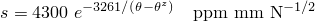

Diffusivity: 

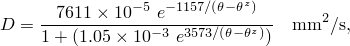

where  is the temperature in degrees Celsius and 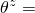 273 is the absolute zero temperature.

Stress-assisted diffusion is specified by defining the pressure stress factor, 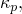 as 

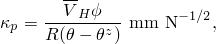

where 8.31432 Jmol1K1 is the universal gas constant, 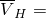2.0  103mm3mol1 is the partial molar volume of hydrogen in iron-based metals, and  is the normalized concentration. The concentration dependence of  is entered in Abaqus in tabulated form as shown in the input listings. It is important to note that although  is defined in terms of normalized concentration, , the tabular data must be entered in terms of concentration, 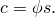

The following properties are also used in the stress analysis: elastic modulus, 2.0  105Nmm2, and Poisson's ratio,  0.3.

The specimen is maintained at a constant temperature of 325 K throughout the analysis. Under the initial steady-state conditions the specimen has a uniform concentration of 50 ppm, which corresponds to a normalized concentration of 265 N1/2mm1. Normalized concentration is used as the primary solution variable (continuous over the discretized domain) and is given as the concentration divided by the solubility. The exterior of the specimen has a constant hydrogen concentration equal to the initial concentration. A 1 MPa distributed pressure is applied to the ends of the specimen, ramped linearly over the length of the step, and the steady-state distribution of hydrogen is obtained.

### Results and discussion

The analytical solution for normalized concentration, presented by Liu (1970), has the form 

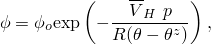

where 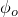 is the normalized concentration obtained in the unstressed state and *p* is the equivalent pressure stress. This solution dictates that for a crack-tip problem, the concentration follows the singularity of the stresses.

[Figure 8.1.2--3](ch08s01aex128.md#sxmh2odifftip-presscont) and [Figure 8.1.2--4](ch08s01aex128.md#sxmh2odifftip-conccont) show the final distribution of equivalent pressure stress and concentration predicted by the Abaqus analysis in the region around the crack tip. The results shown represent the first case described above, using a quadratic, quarter-point mesh for stresses and a linear mesh for mass diffusion. The shapes of the contours show good agreement, since contours of constant pressure stress should be contours of constant concentration, as indicated by the analytical solution above.

[Figure 8.1.2--5](ch08s01aex128.md#sxmh2odifftip-pressdist) and [Figure 8.1.2--6](ch08s01aex128.md#sxmh2odifftip-concdist) show the pressures (in MPa) and concentrations (in ppm) ahead of the crack tip for all four combinations of stress and mass diffusion analyses. Results are presented as functions of the ratio of the distance to the crack tip, *r*, over the crack length, *a*. For the region immediately ahead of the crack, linear elastic fracture mechanics yields the analytical solution for equivalent pressure stress: 

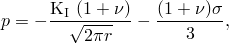

where 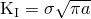 is the stress intensity factor for a Mode I crack of length *a* and  is the externally applied distributed load.

As can be seen from the figures, the finite element results for all four combinations of element types are identical except at the first element, where the results are not expected to be valid. The results show good agreement with the analytically predicted solutions for both equivalent pressure stress and concentration as the distance to the crack tip, *r*, approaches zero. Farther from the crack tip, the deviation between the analytical solution and the finite element solution increases. This deviation is consistent with the fact that the linear elastic crack-tip solution is valid only as *r* approaches zero.

No mesh convergence studies were conducted with respect to the number of elements in the crack-tip region. For comparison with the solutions presented here, an analysis was conducted with equally spaced elements approaching the crack tip. The results (not shown here) indicate that biasing the elements toward the crack tip is necessary to capture the gradients of concentration and equivalent pressure stress adequately. In addition, the equivalent pressure stress results demonstrate that the effect of using quarter-point positioning of the nodes at the crack tip is insignificant in this problem as long as the mesh is refined sufficiently.

Differences between the finite element and analytically predicted concentrations are a direct result of the differences between the finite element and analytically predicted values of pressure stress. If the analytical values of equivalent pressure stress are used to drive the Abaqus concentration solution, the resulting curve is indistinguishable from the analytical concentration shown.

### Input files

[difftocrack_quarterpstress.inp](../eif/difftocrack_quarterpstress.inp)

Quadratic stress analysis with quarter-point spacing at the crack tip. This analysis writes the results file used in difftocrack_linearmassdiff1.inp and difftocrack_quarterpmassdiff.inp.

[difftocrack_linearmassdiff1.inp](../eif/difftocrack_linearmassdiff1.inp)

Linear mass diffusion analysis that reads results file data from difftocrack_quarterpstress.inp.

[difftocrack_stress.inp](../eif/difftocrack_stress.inp)

Stress analysis with quadratic elements (no quarter-point spacing). This analysis writes the results file used in difftocrack_massdiff.inp.

[difftocrack_massdiff.inp](../eif/difftocrack_massdiff.inp)

Mass diffusion analysis with quadratic elements that reads equivalent pressure stresses from the results file written in difftocrack_stress.inp.

[difftocrack_quarterpmassdiff.inp](../eif/difftocrack_quarterpmassdiff.inp)

Mass diffusion analysis with quadratic elements and quarter-point spacing. This analysis reads equivalent pressure stresses from the results file written in difftocrack_quarterpstress.inp.

[difftocrack_linearstress.inp](../eif/difftocrack_linearstress.inp)

Stress analysis with linear elements. This analysis writes the results file used in difftocrack_linearmassdiff2.inp.

[difftocrack_linearmassdiff2.inp](../eif/difftocrack_linearmassdiff2.inp)

Mass diffusion analysis with linear elements that reads equivalent pressure stresses from the results file written in difftocrack_linearstress.inp.

[difftocrack_node.inp](../eif/difftocrack_node.inp)

Node data for all the analyses.

[difftocrack_quad_elements.inp](../eif/difftocrack_quad_elements.inp)

Element data for the analyses using quadratic elements.

[difftocrack_linear_elements.inp](../eif/difftocrack_linear_elements.inp)

Element data for the analyses using linear elements.

### References

Fujii,  T., T. Hazama, H. Nakajima, and R. Horita, “A Safety Analysis on Overlay Disbonding of Pressure Vessels for Hydrogen Service,” Journal of the American Society for Metals, pp. 361–368, 1982.

Liu, H. W., “Stress-Corrosion Cracking and the Interaction Between Crack-Tip Stress Field and Solute Atoms,” Transactions of the ASME: Journal of Basic Engineering, vol. 92, pp. 633–638, 1970.

### Figures

**Figure 8.1.2–1** Center crack specimen geometry.

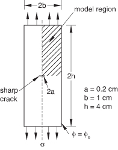

**Figure 8.1.2–2** Finite element model of center crack specimen (with 1/4 symmetry) with detail of crack-tip mesh.

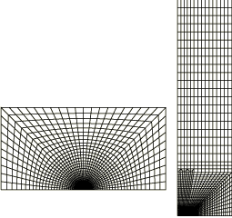

**Figure 8.1.2–3** Contours of equivalent pressure stress at the crack tip.

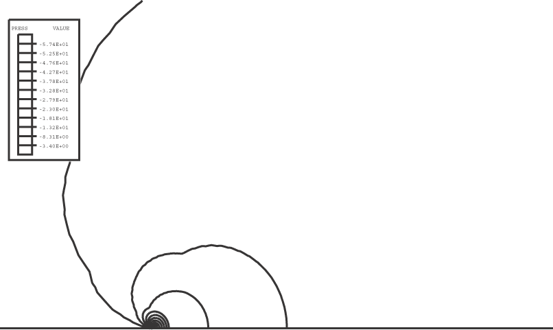

**Figure 8.1.2–4** Contours of normalized hydrogen concentration at the crack tip.

**Figure 8.1.2–5** Distribution of pressure stress ahead of the crack tip.

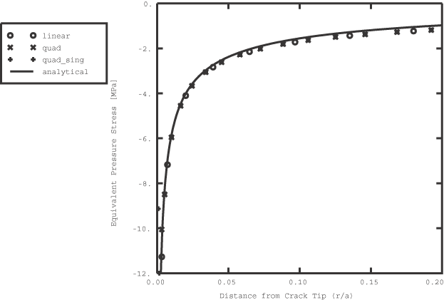

**Figure 8.1.2–6** Hydrogen concentration distribution ahead of the crack tip.

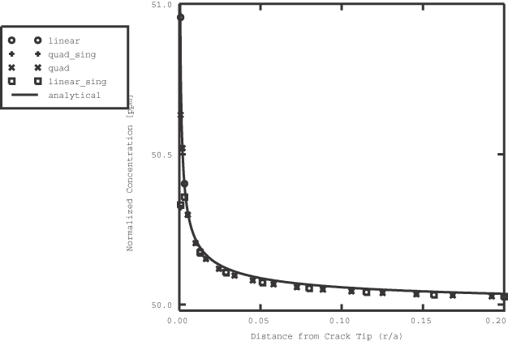

