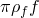
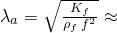
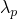
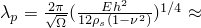

# 9.1.1 Fully and sequentially coupled acoustic-structural analysis of a muffler

**Products: **Abaqus/Standard  Abaqus/Explicit  

This example demonstrates the solution of the acoustic field in the vicinity of a muffler in air caused by the vibrations of the muffler shell. Steady-state and transient dynamic computations are done using both the fully coupled (["Acoustic, shock, and coupled acoustic-structural analysis," Section 6.10.1 of the Abaqus Analysis User's Guide](../usb/usb-link.md#usb-anl-aacoustic)) and sequentially coupled acoustic-solid (["Node-based submodeling," Section 10.2.2 of the Abaqus Analysis User's Guide](../usb/usb-link.md#usb-anl-asubmodeldisp)) interaction procedures in Abaqus. In the fully coupled case the solid medium of the muffler is directly coupled to the enclosed and surrounding air in a single analysis. In the sequentially coupled case the muffler vibrations are considered to be independent of the loading effects of the surrounding air, while the acoustic vibrations of the surrounding air are forced by the motion of the muffler. This allows the muffler vibration and acoustic radiation problems to be solved in sequence, using the submodeling procedure in Abaqus. The results for the sequentially coupled model are verified by comparing them to the results from the fully coupled procedure.

### Full modeling vs. submodeling in Abaqus

The fully coupled model includes the effect of the acoustic pressure in the surrounding air loading the muffler body during vibration of the system. When modeling the acoustics of metal structures in air, such as in this case, such acoustic pressure loading is often negligible in comparison with other forces in the structure. The submodeling capability can be used in this situation. The part of the interacting system that is unaffected by the other is treated as the “global” model, while the part whose solution depends strongly on the solution of the other is treated as the “submodel.” In the case of an acoustic analysis, of course, this nomenclature refers to the hierarchy of the solutions, not the geometric sizes of the models.

When sequential coupling is physically appropriate, its use offers a performance advantage over a fully coupled solution. Two problems, each smaller than the fully coupled problem, are less computationally expensive. If the applicability of the sequentially coupled solution method is uncertain, the user should make characteristic test computations in the frequency range of interest. If these computations show little difference between the fully and sequentially coupled solutions, the less expensive sequentially coupled method can be used.

### Geometry and model

The system considered here consists of a cylindrical muffler and the interacting air. The muffler is a simple tube 180 mm in diameter and 1 m in length, with inlet and outlet pipes 70 mm in diameter and 100 mm in length. The muffler structure is made from stainless steel sheeting, 0.75 mm in thickness. A porous packing material, which dampens the acoustic field, surrounds the inner pipe.

Although this problem is in essence axisymmetric, a narrow three-dimensional wedge (subtending an angle of 10) of the coupled system is modeled because Abaqus has a limitation on the use of submodeling with axisymmetric shells. Appropriate boundary conditions are applied to the three-dimensional model so that the axisymmetric solution is captured. The meshes of the surrounding air, the exterior muffler shell, and the air inside the muffler are shown in [Figure 9.1.1--1](ch09s01aex129.md#sxmmuffler-omesh), [Figure 9.1.1--2](ch09s01aex129.md#sxmmuffler-mmesh), and [Figure 9.1.1--3](ch09s01aex129.md#sxmmuffler-imesh), respectively.

The air inside the muffler is meshed with AC3D10 elements (second-order tetrahedra) in Abaqus/Standard and with AC3D4 elements in Abaqus/Explicit. The innermost column of fluid elements models the undamped air. The adjacent annulus models the air in the region of the packing material. These two regions are highlighted in [Figure 9.1.1--3](ch09s01aex129.md#sxmmuffler-imesh), where the annulus is shown as the darker region. The effect of the packing material is modeled using the volumetric drag coefficient for the acoustic medium. The muffler is meshed with S4R shell elements.

The exterior fluid is shown in [Figure 9.1.1--1](ch09s01aex129.md#sxmmuffler-omesh). Its outer boundary is made up of spherical and cylindrical segments, on which spherical and cylindrical absorbing boundary conditions are imposed. The cylindrical and spherical absorbing boundary conditions can be combined in Abaqus, allowing the external mesh to conform to the geometry of the radiating object more closely. Combinations of different boundary condition types are most effective when the boundaries are continuous in slope as well as displacement. Second-order hexahedral acoustic elements (AC3D20) are used in Abaqus/Standard and reduced-integration acoustic brick elements (AC3D8R) are used in Abaqus/Explicit to fill in the volume of the exterior fluid region. 

In Abaqus/Explicit the possibility of using acoustic infinite elements to model the effect of the exterior fluid is explored. The use of acoustic infinite elements removes the need of impedance-type absorbing boundary conditions on the outer boundary. Acoustic infinite elements are used in two different ways. In the first approach the mesh modeling the exterior fluid is replaced by a single row of AC3D8R elements, and acoustic infinite elements ACIN3D4 are defined on the outer boundary of this row. In the second approach ACIN3D4 elements are defined directly on the outer boundary of the muffler and tied to the muffler surface. 

In the submodeling procedure performed in Abaqus/Standard the interface between the surrounding air and the muffler is meshed with 8-node acoustic interface elements (ASI8); in the Abaqus/Explicit submodeling analysis the tie constraint is used to define this coupling. The choice of mesh density (element size) is discussed in ["Acoustic, shock, and coupled acoustic-structural analysis," Section 6.10.1 of the Abaqus Analysis User's Guide](../usb/usb-link.md#usb-anl-aacoustic). In both cases the inner boundary of the exterior air mesh conforms to the muffler shell and to rigid baffles, which isolate the exterior field from the exhaust and inlet noise. These baffle pipes are the same diameter as the inlet and exhaust pipes but are modeled simply by imposing no boundary condition on the acoustic elements in this region. This is equivalent to imposing the condition that the acceleration on this boundary is zero, which is correct for a rigid baffle.

In Abaqus/Standard we are most interested in performing a frequency sweep about the first resonant frequency of the fully coupled system. For problems involving air and metal structures, the structure usually dominates the behavior of the system. Therefore, an estimate of the first important resonance of the coupled system is found by performing a frequency sweep in the vicinity of the first eigenfrequency of the muffler shell, computed without any interaction with the interior or exterior air. This occurs at *f* = 172 Hz. Although the resonant frequencies of the fully coupled system do not coincide with the resonant frequencies of the muffler shell alone, they are close, especially at lower frequencies.

Using the Abaqus/Standard direct-solution steady-state dynamic procedure to search around 172 Hz, we find that the first resonant frequency for the fully coupled system occurs at approximately 180 Hz. A frequency sweep of both the fully coupled and the sequentially coupled models from 179.0 Hz to 181.0 Hz at 0.2 Hz increments is performed. A pressure wave of unit magnitude is applied to the muffler inlet at each frequency, and a plane wave absorbing boundary condition is applied at the muffler outlet.

A transient dynamic analysis is performed in Abaqus/Explicit over the period of time that corresponds to the first resonant frequency of 180 Hz found in Abaqus/Standard. The pressure boundary conditions applied at the muffler inlet have a sinusoidal variation over time to simulate the steady-state dynamic procedure performed in Abaqus/Standard. The absorbing boundary conditions are imposed in the same way as in the steady-state dynamic procedure.

The material properties for the air are a bulk modulus  of 0.142 MPa and a density  of 1.2 kg/m3, yielding a characteristic sound speed of 344 m/s. The volumetric drag, , specified for the air in the packing material region is 1.2 N s/m. Volumetric drag values are considered “small” if they are small compared to 2, a condition satisfied by  = 1.2 N s/m for the frequency range of interest. The muffler is made of stainless steel with Young's modulus *E* of 190 GPa, Poisson's ratio  of 0.3, and density  of 7920 kg/m3.

Material properties affect the mesh parameters appropriate for wave problems. The characteristic wavelength of air at  180 Hz,  1131 rad/sec, is  1.91 m, which is long compared to the overall system geometry. The internodal spacing of roughly 40 mm used in the surrounding acoustic mesh and 30 mm in the interior acoustic mesh is adequate for this frequency. The acoustic wavelength must also be considered in selecting the overall size of the exterior domain. Accuracy of the solution requires placement of the radiating boundary at least one-quarter wavelength from the acoustic sources; in this problem a standoff distance of approximately 700 mm is selected. The characteristic flexural wavelength  of the steel plating can be computed using the thickness *h* and the formula  203 mm. The discretization requirements of the finite element method in wave problems require at least six nodes per wavelength; here, we use an internodal distance of approximately 30 mm for the shells.

The fully coupled model consists of all three meshes shown in [Figure 9.1.1--1](ch09s01aex129.md#sxmmuffler-omesh), [Figure 9.1.1--2](ch09s01aex129.md#sxmmuffler-mmesh), and [Figure 9.1.1--3](ch09s01aex129.md#sxmmuffler-imesh), constrained at their abutting surfaces using a tie constraint.

The sequentially coupled analysis is performed in two jobs. The “global” model job consists of the meshes shown in [Figure 9.1.1--2](ch09s01aex129.md#sxmmuffler-mmesh) and [Figure 9.1.1--3](ch09s01aex129.md#sxmmuffler-imesh). The shell displacements, and displacement phases in Abaqus/Standard, are saved from this analysis and drive the second “submodel” analysis through the use of a submodel boundary condition. In Abaqus/Standard the second model consists of the exterior air mesh ([Figure 9.1.1--1](ch09s01aex129.md#sxmmuffler-omesh)) used in the fully coupled case, with ASI8 elements placed on the boundary that abuts the shell surface. These elements convert the displacements from the “global” analysis to the appropriate boundary conditions for acoustic elements. In this analysis the ASI8 elements conform to the acoustic submodel mesh but not to the shell mesh of the global model. The nodes of the ASI8 elements are placed in a node set, specified in the model data of the submodel. The global elements used to drive the submodel must be specified to ensure that only the displacements of the ASI8 elements are driven by the shell elements. If this global element set is not specified, Abaqus may attempt to drive the acoustic pressure of the ASI8 elements by the interior acoustic elements, since those elements share the shell nodes in the “global” model. In Abaqus/Explicit the tie constraint is used in both the global and submodel analyses to couple the muffler structure with the surrounding acoustic medium.

### Results and discussion

It is good practice to check the absorbing boundary conditions used on a particular mesh at a desired frequency by analyzing only the exterior fluid mesh with some test forcing on the boundary where acoustic excitations are expected. If the forcing is at a single point, the pressure phase angles should show a pattern of concentric circles, minimally distorted by the radiating boundary. While not a rigorous numerical test, such a result usually coincides with a properly offset radiating boundary. As shown in [Figure 9.1.1--4](ch09s01aex129.md#sxmmuffler-abc), this criterion is met by the mesh used in this analysis.

[Figure 9.1.1--5](ch09s01aex129.md#sxmmuffler-raddisp) is a plot of the radial displacement of the muffler inlet as a function of frequency for both the fully coupled and the global models. The resonant peak for the fully coupled model at 179.9 Hz is clearly illustrated. In contrast, the resonant peak for the “global” model (without the acoustic medium) occurs at approximately 180.0 Hz. The difference in the two peaks can be accounted for by the fact that the exterior air on the fully coupled model adds a small amount of damping due to radiation as well as mass to the system, which results in a lower natural frequency, as well as a slightly lower peak response. It is clear from [Figure 9.1.1--5](ch09s01aex129.md#sxmmuffler-raddisp) that for the frequency range of interest the coupling between the exterior air and the muffler is most important at 179.9 Hz.

[Figure 9.1.1--6](ch09s01aex129.md#sxmmuffler-ipor2) and [Figure 9.1.1--7](ch09s01aex129.md#sxmmuffler-ippor2) contain contour plots of the pressure magnitude and phase for the muffler interior at 181.0 Hz for both the “global” model and the fully coupled model. In both cases the results indicate that the modeling assumptions of the sequentially coupled analysis appear to be valid for the solutions in the muffler interior.

Contour plots of the pressure magnitude and phase for the muffler exterior at 181.0 Hz are shown in [Figure 9.1.1--8](ch09s01aex129.md#sxmmuffler-por2) and [Figure 9.1.1--9](ch09s01aex129.md#sxmmuffler-ppor2). The resulting pressure magnitude in the exterior air is small in both cases. The differences in the pressure amplitudes and phase as computed by the two analyses are not considered to be significant. Two factors that account for the small differences are the different modeling methods (fully coupled vs. sequentially coupled) and the different techniques used to couple the muffler to the exterior air (tie constraints vs. acoustic interface elements).

[Figure 9.1.1--10](ch09s01aex129.md#sxmmuffler-ipor1) and [Figure 9.1.1--11](ch09s01aex129.md#sxmmuffler-ippor1) contain contour plots of the pressure magnitude and phase for the muffler interior at 179.9 Hz for both the “global” model and the fully coupled model. It is clear that at 181.0 Hz, the modeling assumptions of the sequentially coupled analysis are less valid than they are at 179.9 Hz for the solutions in the muffler interior. This result is anticipated by [Figure 9.1.1--5](ch09s01aex129.md#sxmmuffler-raddisp). However, the solutions are still reasonably close to one another, indicating that the sequentially coupled analysis is still a reasonable approximation for this system even at a resonant peak.

Contour plots of the pressure magnitude and phase for the muffler exterior at 179.9 Hz are shown in [Figure 9.1.1--12](ch09s01aex129.md#sxmmuffler-por1) and [Figure 9.1.1--13](ch09s01aex129.md#sxmmuffler-ppor1). Again, the resulting pressure magnitude in the exterior air is small in both cases. The differences in the pressure amplitudes and phase as computed by the two analyses are less evident in the exterior than they were in the interior.

The pressure magnitudes along the muffler centerline at both 179.9 Hz and 181.0 Hz are shown in decibels in [Figure 9.1.1--14](ch09s01aex129.md#sxmmuffler-ctrline). The reference pressure is chosen as one unit for convenience. The plot illustrates the variation of acoustic pressure in the muffler near resonance.

[Table 9.1.1--1](ch09s01aex129.md#exa-aco-muffler-table-timing) shows comparative solution times and memory requirements for the fully and sequentially coupled analyses. The total computational time for the sequentially coupled case is lower, and the peak memory requirements are significantly lower. These differences will be greater for larger models. Optimal speed increases occur when global and submodels have nearly equal numbers of degrees of freedom. Here, solving the fully coupled system does not impose as much of a speed penalty as might be expected, because the sparse solver used by Abaqus exploits the extreme sparsity of the fluid-solid coupling term. When the number of system nodes involving fluid-solid coupling is a large percentage of the total number of nodes, the sparsity of the coupling term decreases, favoring the sequentially coupled procedure. Sequentially coupled analyses are even more advantageous than fully coupled analyses when many different submodels need to be analyzed, driven by a single set of global results.

Abaqus issues a series of warning messages in this example, because the narrow wedge domain results in some three-dimensional acoustic elements with bad aspect ratios. These messages can be ignored in this study, since the solutions are essentially axisymmetric and the gradient of the solution in the circumferential direction is nearly zero. Moreover, elements with scalar degrees of freedom, such as the acoustic elements used in this example, are much less sensitive to geometric distortion than elements with vector degrees of freedom, such as continuum stress/displacement elements.

The results obtained in Abaqus/Explicit agree well with the Abaqus/Standard results. For the fully coupled analysis the pressure variation in time at the muffler outlet centerline is shown in [Figure 9.1.1--15](ch09s01aex129.md#sxmmuffler-xpl2std) (for a clear comparison the Abaqus/Standard analysis is also performed as a transient simulation). The Abaqus/Explicit models using acoustic infinite elements give results that agree well with the results using the impedance-type absorbing boundary. In [Figure 9.1.1--15](ch09s01aex129.md#sxmmuffler-xpl2std) we include the results for the test using acoustic infinite elements, where the mesh modeling the exterior fluid is replaced by a single row of AC3D8R elements and acoustic infinite elements ACIN3D4 are defined on the outer boundary of this row. For the Abaqus/Explicit submodeling analysis the inside air pressure in the global model and the outside air pressure of the submodel compare well with the air pressures obtained in these regions in the fully coupled problem.

### Input files

##### **Abaqus/Standard input files**

[muffler_full.inp](../eif/muffler_full.inp)

Three-dimensional fully coupled model.

[muffler_globl.inp](../eif/muffler_globl.inp)

Muffler and internal air global model.

[muffler_innerair_freq.inp](../eif/muffler_innerair_freq.inp)

Internal air eigenanalysis model, Lanczos.

[muffler_innerair_freq_ams.inp](../eif/muffler_innerair_freq_ams.inp)

Internal air eigenanalysis model, AMS.

[muffler_submo.inp](../eif/muffler_submo.inp)

Exterior air submodel.

[muffler_shell_nodes.inp](../eif/muffler_shell_nodes.inp)

Nodal coordinates for muffler shell mesh.

[muffler_intair_nodes.inp](../eif/muffler_intair_nodes.inp)

Nodal coordinates for interior air mesh.

[muffler_extair_nodes.inp](../eif/muffler_extair_nodes.inp)

Nodal coordinates for surrounding air mesh.

[muffler_shell_elem.inp](../eif/muffler_shell_elem.inp)

Element definitions for muffler shell mesh.

[muffler_intair_elem.inp](../eif/muffler_intair_elem.inp)

Element definitions for interior air mesh.

[muffler_extair_elem.inp](../eif/muffler_extair_elem.inp)

Element definitions for surrounding air mesh.

[muffler_freq.inp](../eif/muffler_freq.inp)

Natural frequency extraction for shell mesh.

[muffler_bctest.inp](../eif/muffler_bctest.inp)

Radiating boundary condition test.

##### **Abaqus/Explicit input files**

[muffler_full_xpl.inp](../eif/muffler_full_xpl.inp)

Three-dimensional fully coupled transient analysis.

[muffler_full_acoinfxpl.inp](../eif/muffler_full_acoinfxpl.inp)

Three-dimensional fully coupled transient analysis using acoustic infinite elements.

[muffler_full_acoinftiexpl.inp](../eif/muffler_full_acoinftiexpl.inp)

Three-dimensional fully coupled transient analysis using acoustic infinite elements tied to the muffler outer surface.

[muffler_global_xpl.inp](../eif/muffler_global_xpl.inp)

Muffler and internal air global model, transient analysis.

[muffler_submodel_xpl.inp](../eif/muffler_submodel_xpl.inp)

Muffler and exterior air submodel, transient analysis.

[muffler_shell_nodes.inp](../eif/muffler_shell_nodes.inp)

Nodal coordinates for muffler shell mesh.

[muffler_shell_elem.inp](../eif/muffler_shell_elem.inp)

Element definitions for muffler shell mesh.

[muffler_intair_nodes_xpl.inp](../eif/muffler_intair_nodes_xpl.inp)

Nodal coordinates for interior air mesh.

[muffler_intair_elem_xpl.inp](../eif/muffler_intair_elem_xpl.inp)

Element definitions for interior air mesh.

[muffler_extair_nodes_xpl.inp](../eif/muffler_extair_nodes_xpl.inp)

Nodal coordinates for surrounding air mesh.

[muffler_extair_elem_xpl.inp](../eif/muffler_extair_elem_xpl.inp)

Element definitions for surrounding air mesh.

[muffler_extair_elem_ainxpl.inp](../eif/muffler_extair_elem_ainxpl.inp)

Element definitions for surrounding air mesh for model using acoustic infinite elements.

### Table

**Table 9.1.1–1** Comparison of relative CPU times (normalized with respect to the CPU time for the sequential analysis) and approximate problem size for the frequency sweep excluding preprocessing.
|  | Memory | DOF | Relative CPU Time |
| --- | --- | --- | --- |
| Global model | 10 Mb | 10030 | 0.325 |
| Submodel | 15 Mb | 19030 | 0.675 |
| Fully coupled model | 29 Mb | 29060 | 1.086 |
| Sequential analysis |  |  | 1.000 |

### Figures

**Figure 9.1.1–1** Mesh of surrounding air.

**Figure 9.1.1–2** Mesh of muffler.

**Figure 9.1.1–3** Mesh of interior air.

**Figure 9.1.1–4** Radiating boundary condition test at 165 Hz.

**Figure 9.1.1–5** Radial displacement of the muffler inlet as a function of frequency.

**Figure 9.1.1–6** Muffler internal pressure magnitudes at 181.0 Hz, muffler inlet at top: fully coupled solution on left, “global” model (without the exterior acoustic medium) on right.

**Figure 9.1.1–7** Muffler internal pressure phase at 181.0 Hz, muffler inlet at top: fully coupled solution on left, “global” model (without the exterior acoustic medium) on right.

**Figure 9.1.1–8** Muffler external pressure magnitudes at 181.0 Hz, muffler inlet at top: fully coupled solution on left, “submodel” on right.

**Figure 9.1.1–9** Muffler external pressure phase at 181.0 Hz, muffler inlet at top: fully coupled solution on left, “submodel” on right.

**Figure 9.1.1–10** Muffler internal pressure magnitudes at 179.9 Hz, muffler inlet at top: fully coupled solution on left, “global” model (without the exterior acoustic medium) on right.

**Figure 9.1.1–11** Muffler internal pressure phase at 179.9 Hz, muffler inlet at top: fully coupled solution on left, “global” model (without the exterior acoustic medium) on right.

**Figure 9.1.1–12** Muffler external pressure magnitudes at 179.9 Hz, muffler inlet at top: fully coupled solution on left, “submodel” on right.

**Figure 9.1.1–13** Muffler external pressure phase at 179.9 Hz, muffler inlet at top: fully coupled solution on left, “submodel” on right.

**Figure 9.1.1–14** Muffler internal pressure magnitude at 179.9 and 181.0 Hz: dB along muffler centerline.

**Figure 9.1.1–15** Internal pressure at the muffler outlet for the transient analysis.

