# 9.1.1 消声器的完全和顺序耦合声-结构分析

**产品：** Abaqus/Standard  Abaqus/Explicit

本示例演示了由消声器壳体振动引起的附近空气中声场的求解。使用Abaqus中的完全耦合（["声学、冲击和耦合声-结构分析，" Abaqus Analysis User's Guide的第6.10.1节](../usb/usb-link.md#usb-anl-aacoustic)）和顺序耦合声-固体（["基于节点的子模型技术，" Abaqus Analysis User's Guide的第10.2.2节](../usb/usb-link.md#usb-anl-asubmodeldisp)）交互程序进行稳态和瞬态动力学计算。在完全耦合情况下，消声器的固体介质通过单一分析直接耦合到内部和周围空气中。在顺序耦合情况下，消声器振动被认为与周围空气的载荷效应无关，而周围空气的声振动由消声器的运动驱动。这允许按顺序使用Abaqus中的子模型技术解决消声器振动和声辐射问题。通过将顺序耦合模型的结果与完全耦合程序的结果进行比较来验证顺序耦合模型的结果。

### Abaqus中的整体建模与子模型技术

完全耦合模型包括周围空气中的声压对壳体振动期间消声器体的载荷效应。在对空气中的金属结构进行声学建模时（如本案例），这种声压载荷通常与结构中的其他力相比可以忽略不计。在这种情况下可以使用子模型技术。不受另一部分影响的那部分交互系统被视为"整体"模型，而其解强烈依赖于另一部分解的那部分被视为"子模型"。在声学分析的情况下，当然，这种命名法指的是解的层次结构，而不是模型的几何大小。

当顺序耦合在物理上适用时，它的使用比完全耦合解具有性能优势。两个每个都小于完全耦合问题的问题，计算成本更低。如果不确定顺序耦合解方法的适用性，用户应在感兴趣的特征频率范围内进行特征测试计算。如果这些计算表明完全耦合和顺序耦合解之间差异不大，则可以使用成本较低的顺序耦合方法。

### 几何和模型

这里考虑的系统包括圆柱形消声器和相互作用的空气。消声器是一个简单的管子，直径180毫米，长度1米，进出口管直径70毫米，长度100毫米。消声器结构由0.75毫米厚的不锈钢板制成。一种能减弱声场的多孔填充材料环绕着内管。

尽这个问题本质上是轴对称的，但由于Abaqus对轴对称壳使用子模型技术的限制，建模了一个耦合系统窄三维楔形（张角10度）。对三维模型施加适当的边界条件以捕获轴对称解。[图9.1.1-1](ch09s01aex129.md#sxmmuffler-omesh)、[图9.1.1-2](ch09s01aex129.md#sxmmuffler-mmesh)和[图9.1.1-3](ch09s01aex129.md#sxmmuffler-imesh)分别显示了周围空气、外部消声器壳体和消声器内部空气的网格。

消声器内部的空气在Abaqus/Standard中使用AC3D10单元（二阶四面体）进行网格划分，在Abaqus/Explicit中使用AC3D4单元。最内侧的流体单元列模拟无阻尼空气。相邻的环形区域模拟填充材料区域中的空气。这两个区域在[图9.1.1-3](ch09s01aex129.md#sxmmuffler-imesh)中突出显示，其中环形区域显示为较暗的区域。填充材料的效果使用声介质的体积拖曳系数进行建模。消声器使用S4R壳单元进行网格划分。

外部流体如图[图9.1.1-1](ch09s01aex129.md#sxmmuffler-omesh)所示。其外边界由球面和圆柱段组成，在这些边界上施加球面和圆柱吸收边界条件。圆柱和球面吸收边界条件可以在Abaqus中组合，使外部网格更紧密地符合辐射物体的几何形状。不同边界条件类型的组合在边界斜率以及位移都连续时最有效。在Abaqus/Standard中使用二阶六面体声学单元（AC3D20）填充外部流体区域的体积，在Abaqus/Explicit中使用减缩积分声学砖单元（AC3D8R）。

在Abaqus/Explicit中，探索了使用声学无限单元来模拟外部流体效果的可能性。声学无限单元的使用消除了在外边界上需要基于阻抗的吸收边界条件。声学无限单元以两种不同的方式使用。在第一种方法中，建模外部流体的网格被一行AC3D8R单元取代，并在该行外边界上定义声学无限单元ACIN3D4。在第二种方法中，ACIN3D4单元直接定义在消声器外表面的外边界上，并连接到消声器表面。

在Abaqus/Standard中执行的子模型技术中，周围空气和消声器之间的界面使用8节点声学界面单元（ASI8）进行网格划分；在Abaqus/Explicit子模型分析中，使用绑定约束来定义此耦合。网格密度（单元尺寸）的选择在["声学、冲击和耦合声-结构分析，" Abaqus Analysis User's Guide的第6.10.1节](../usb/usb-link.md#usb-anl-aacoustic)中讨论。在两种情况下，外部空气网格的内边界都符合消声器壳体和刚性隔板，这些隔板将外部场与排气口和进气口噪声隔离。这些隔板管的直径与进气口和排气口相同，但通过不对声学单元施加边界条件来简单地建模。这相当于施加该边界上的加速度为零，这对于刚性隔板是正确的。

在Abaqus/Standard中，我们最感兴趣的是对完全耦合系统第一谐振频率进行频率扫描。对于涉及空气和金属结构的问题，结构通常主导系统的行为。因此，通过执行消声器壳体（不与内部或外部空气相互作用）第一特征频率附近的频率扫描来找到耦合系统第一重要共振的估计。发生在*f* = 172 Hz。尽管完全耦合系统的谐振频率与单独消声器壳体的谐振频率不一致，但它们很接近，特别是在较低频率下。

使用Abaqus/Standard直接解稳态动态程序在172 Hz附近搜索，我们发现完全耦合系统的第一谐振频率约为180 Hz。对完全耦合和顺序耦合模型从179.0 Hz到181.0 Hz以0.2 Hz增量进行频率扫描。在每个频率下，在消声器入口施加单位幅值的压力波，并在消声器出口施加平面波吸收边界条件。

在Abaqus/Explicit中执行瞬态动力学分析，时间段对应于Abaqus/Standard中发现的180 Hz第一谐振频率。在消声器入口施加的压力边界条件随时间呈正弦变化，以模拟在Abaqus/Standard中执行的稳态动态程序。吸收边界条件以与稳态动态程序相同的方式施加。

空气的材料特性是体积模量为0.142 MPa，密度为1.2 kg/m³，特征声速为344 m/s。填充材料区域空气的体积拖曳为1.2 N·s/m。体积拖曳值如果与2相比较小，则被视为"小"，1.2 N·s/m的值对于感兴趣的频率范围满足此条件。消声器由不锈钢制成，弹性模量为190 GPa，泊松比为0.3，密度为7920 kg/m³。

材料特性影响波问题适当的网格参数。空气在180 Hz、1131 rad/sec时的特征波长为1.91 m，与整体系统几何相比相当长。周围声学网格使用的约40毫米的节点间距和内部声学网格使用的30毫米对于此频率是足够的。在选择外部域的整体尺寸时还必须考虑声波波长。解的准确性要求将辐射边界放置在至少距离声源四分之一波长处；在本问题中选择约700毫米的间距。钢板的特征弯曲波长可使用厚度*h*和公式计算为203毫米。有限元方法在波问题中的离散化要求每个波长至少六个节点；这里，壳体使用的节点间距约为30毫米。

完全耦合模型包括三个网格，用绑定约束在其邻接表面进行约束。

顺序耦合分析分两个作业执行。"整体"模型作业包括网格。壳体位移以及Abaqus/Standard中的位移相位，用于通过子模型边界条件驱动第二个"子模型"分析。在Abaqus/Standard中，第二个模型由完全耦合情况下使用的外部空气网格组成，ASI8单元放置在与壳体表面邻接的边界上。这些单元将来自"整体"分析的位移转换为声学单元的适当边界条件。在此分析中，ASI8单元符合声学子模型网格，但不符合整体模型的壳体网格。ASI8单元的节点放置在子模型的模型数据中指定的节点集中。必须指定用于驱动子模型的"整体"单元集，以确保只有ASI8单元的位移由壳体单元驱动。如果未指定此整体单元集，Abaqus可能会尝试通过内部声学单元驱动ASI8单元的声压，因为那些单元在"整体"模型中共享壳体节点。在Abaqus/Explicit中，绑定约束在全局和子模型分析中都用于将消声器结构与周围声学介质耦合。

### 结果与讨论

检查特定网格上特定频率使用的吸收边界条件的一个好方法是仅分析外部流体网格，并在预期声学激励的边界上使用一些测试力。如果力作用在单点上，压力相位应显示同心圆图案，被辐射边界最小扭曲。虽然这不是严格的数值测试，但这样的结果通常与正确偏移的辐射边界相符。本分析中使用的网格满足此标准。

消声器入口径向位移与频率的关系图分别针对完全耦合和整体模型。完全耦合模型在179.9 Hz处的谐振峰值清晰可见。相比之下，"整体"模型（无声学介质）的谐振峰值发生在约180.0 Hz。两个峰值之间的差异可以归因于完全耦合模型的外部空气增加了由于辐射以及系统质量引起的一点阻尼，这导致较低的固有频率以及略低的峰值响应。可以清楚地看出，在感兴趣的频率范围内，外部空气和消声器之间的耦合在179.9 Hz处最重要。

包含在181.0 Hz时消声器内部压力大小和相位的等值线图，分别针对"整体"模型和完全耦合模型。两种情况下的结果都表明，顺序耦合分析的建模假设对于消声器内部解似乎是有效的。

在181.0 Hz时，消声器外部压力大小和相位的等值线图分别显示。两种情况下外部空气中的压力大小都很小。两种分析计算的压力幅值和相位差异不被认为是显著的。造成微小差异的两个因素是不同的建模方法（完全耦合与顺序耦合）以及用于将消声器耦合到外部空气的不同技术（绑定约束与声学界面单元）。

包含在179.9 Hz时消声器内部压力大小和相位的等值线图，分别针对"整体"模型和完全耦合模型。很明显，在181.0 Hz时，顺序耦合分析的建模假设对于消声器内部解的有效性不如在179.9 Hz时那么高。然而，解仍然相当接近，表明即使在谐振峰值处，顺序耦合分析仍然是该系统的合理近似。

在179.9 Hz时，消声器外部压力大小和相位的等值线图分别显示。同样，外部空气中的压力大小在两种情况下都很小。两种分析计算的压力幅值和相位差异在外部不如内部明显。

在179.9 Hz和181.0 Hz时，消声器中心线上的压力大小以分贝显示。参考压力为方便起见选择为一个单位。该图说明了消声器在共振附近声压的变化。

显示了完全耦合和顺序耦合分析的求解时间和内存需求的比较。顺序耦合情况的计算时间总量较低，峰值内存需求也低得多。对于较大的模型，这些差异将更大。当整体模型和子模型具有几乎相等数量的自由度时，最佳加速发生。这里，由于Abaqus使用的稀疏求解器利用了流体-固体耦合项的极端稀疏性，解决完全耦合系统并不会带来预期的那么多速度惩罚。当涉及流体-固体耦合的系统节点数量占节点总数的很大比例时，耦合项的稀疏性降低，有利于顺序耦合程序。当需要分析由单一整体结果集驱动的多个不同子模型时，顺序耦合分析比完全耦合分析更有优势。

Abaqus在此示例中发出一系列警告消息，因为窄楔形域导致一些具有不良纵横比的三维声学单元。这些消息可以忽略，因为解本质上是轴对称的，且圆周方向上的解梯度接近零。此外，具有标量自由度的单元（如本示例中使用的声学单元）比具有矢量自由度的单元（如连续应力/位移单元）对几何扭曲的敏感度要低得多。

Abaqus/Explicit获得的结果与Abaqus/Standard结果非常吻合。对于完全耦合分析，显示了消声器出口中心线随时间变化的压力（为清晰比较，Abaqus/Standard分析也作为瞬态模拟执行）。使用声学无限单元的Abaqus/Explicit模型与使用基于阻抗的吸收边界的结果非常吻合。我们包括了使用声学无限单元的测试结果，其中建模外部流体的网格被一行AC3D8R单元取代，并在该行外边界上定义声学无限单元ACIN3D4。对于Abaqus/Explicit子模型分析，整体模型中的内部空气压力和子模型的外部空气压力与完全耦合问题中这些区域获得的空气压力相比良好。

### 输入文件

##### **Abaqus/Standard输入文件**

[muffler_full.inp](../eif/muffler_full.inp)

三维完全耦合模型。

[muffler_globl.inp](../eif/muffler_globl.inp)

消声器和内部空气整体模型。

[muffler_innerair_freq.inp](../eif/muffler_innerair_freq.inp)

内部空气特征分析模型，Lanczos。

[muffler_innerair_freq_ams.inp](../eif/muffler_innerair_freq_ams.inp)

内部空气特征分析模型，AMS。

[muffler_submo.inp](../eif/muffler_submo.inp)

外部空气子模型。

[muffler_shell_nodes.inp](../eif/muffler_shell_nodes.inp)

消声器壳体网格的节点坐标。

[muffler_intair_nodes.inp](../eif/muffler_intair_nodes.inp)

内部空气网格的节点坐标。

[muffler_extair_nodes.inp](../eif/muffler_extair_nodes.inp)

周围空气网格的节点坐标。

[muffler_shell_elem.inp](../eif/muffler_shell_elem.inp)

消声器壳体网格的单元定义。

[muffler_intair_elem.inp](../eif/muffler_intair_elem.inp)

内部空气网格的单元定义。

[muffler_extair_elem.inp](../eif/muffler_extair_elem.inp)

周围空气网格的单元定义。

[muffler_freq.inp](../eif/muffler_freq.inp)

壳体网格的固有频率提取。

[muffler_bctest.inp](../eif/muffler_bctest.inp)

辐射边界条件测试。

##### **Abaqus/Explicit输入文件**

[muffler_full_xpl.inp](../eif/muffler_full_xpl.inp)

三维完全耦合瞬态分析。

[muffler_full_acoinfxpl.inp](../eif/muffler_full_acoinfxpl.inp)

使用声学无限单元的三维完全耦合瞬态分析。

[muffler_full_acoinftiexpl.inp](../eif/muffler_full_acoinftiexpl.inp)

使用绑定到消声器外表面的声学无限单元的三维完全耦合瞬态分析。

[muffler_global_xpl.inp](../eif/muffler_global_xpl.inp)

消声器和内部空气整体模型，瞬态分析。

[muffler_submodel_xpl.inp](../eif/muffler_submodel_xpl.inp)

消声器和外部空气子模型，瞬态分析。

[muffler_shell_nodes.inp](../eif/muffler_shell_nodes.inp)

消声器壳体网格的节点坐标。

[muffler_shell_elem.inp](../eif/muffler_shell_elem.inp)

消声器壳体网格的单元定义。

[muffler_intair_nodes_xpl.inp](../eif/muffler_intair_nodes_xpl.inp)

内部空气网格的节点坐标。

[muffler_intair_elem_xpl.inp](../eif/muffler_intair_elem_xpl.inp)

内部空气网格的单元定义。

[muffler_extair_nodes_xpl.inp](../eif/muffler_extair_nodes_xpl.inp)

周围空气网格的节点坐标。

[muffler_extair_elem_xpl.inp](../eif/muffler_extair_elem_xpl.inp)

周围空气网格的单元定义。

[muffler_extair_elem_ainxpl.inp](../eif/muffler_extair_elem_ainxpl.inp)

使用声学无限单元的模型周围空气网格的单元定义。

### 表格

**表9.1.1-1** 频率扫描（不包括预处理）的相对CPU时间（相对于顺序分析的CPU时间标准化）和近似问题规模比较。
|  | 内存 | DOF | 相对CPU时间 |
| --- | --- | --- | --- |
| 整体模型 | 10 Mb | 10030 | 0.325 |
| 子模型 | 15 Mb | 19030 | 0.675 |
| 完全耦合模型 | 29 Mb | 29060 | 1.086 |
| 顺序分析 |  |  | 1.000 |

### 图表

**图9.1.1-1** 周围空气网格。

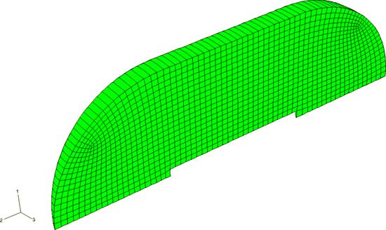

**图9.1.1-2** 消声器网格。

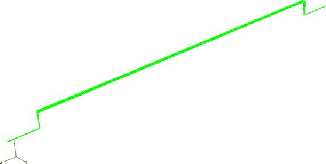

**图9.1.1-3** 内部空气网格。

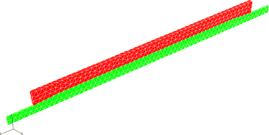

**图9.1.1-4** 165 Hz时的辐射边界条件测试。

**图9.1.1-5** 消声器入口径向位移与频率的关系。

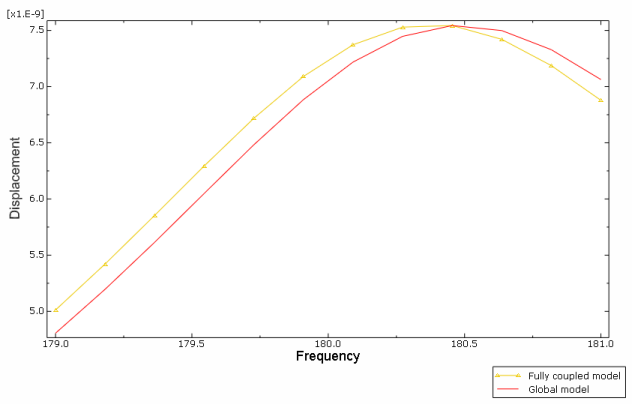

**图9.1.1-6** 181.0 Hz时消声器内部压力大小，入口在顶部：左侧为完全耦合解，右侧为"整体"模型（无外部声学介质）。

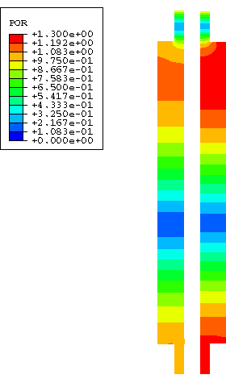

**图9.1.1-7** 181.0 Hz时消声器内部压力相位，入口在顶部：左侧为完全耦合解，右侧为"整体"模型（无外部声学介质）。

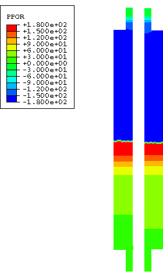

**图9.1.1-8** 181.0 Hz时消声器外部压力大小，入口在顶部：左侧为完全耦合解，右侧为"子模型"。

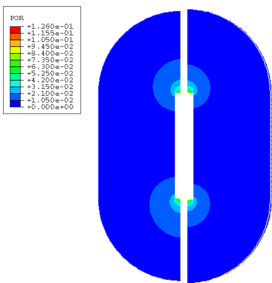

**图9.1.1-9** 181.0 Hz时消声器外部压力相位，入口在顶部：左侧为完全耦合解，右侧为"子模型"。

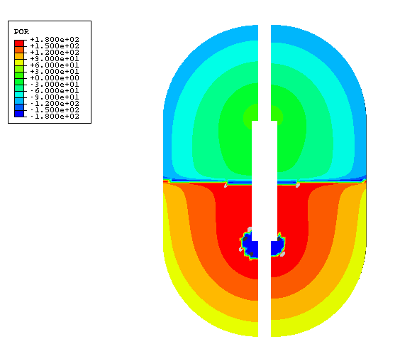

**图9.1.1-10** 179.9 Hz时消声器内部压力大小，入口在顶部：左侧为完全耦合解，右侧为"整体"模型（无外部声学介质）。

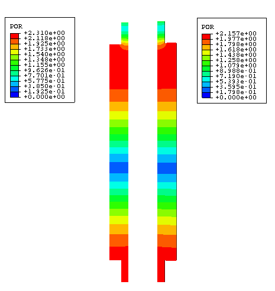

**图9.1.1-11** 179.9 Hz时消声器内部压力相位，入口在顶部：左侧为完全耦合解，右侧为"整体"模型（无外部声学介质）。

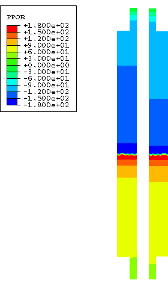

**图9.1.1-12** 179.9 Hz时消声器外部压力大小，入口在顶部：左侧为完全耦合解，右侧为"子模型"。

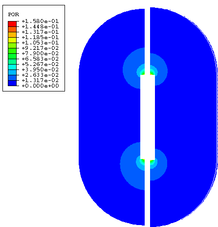

**图9.1.1-13** 179.9 Hz时消声器外部压力相位，入口在顶部：左侧为完全耦合解，右侧为"子模型"。

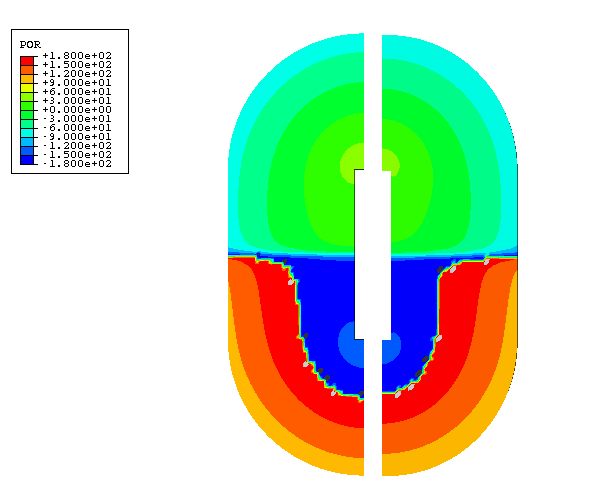

**图9.1.1-14** 179.9和181.0 Hz时消声器内部压力大小：沿消声器中心线的分贝。

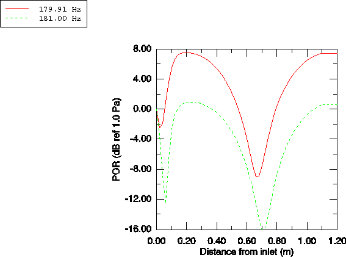

**图9.1.1-15** 瞬态分析时消声器出口的内部压力。

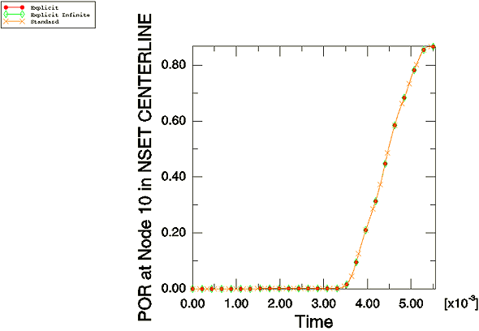

