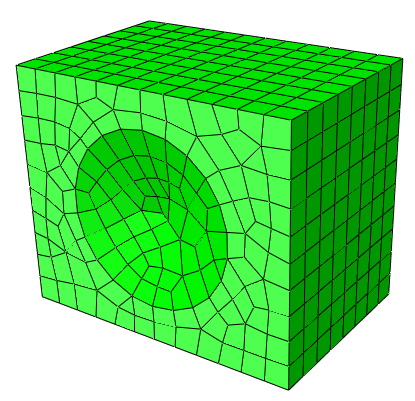
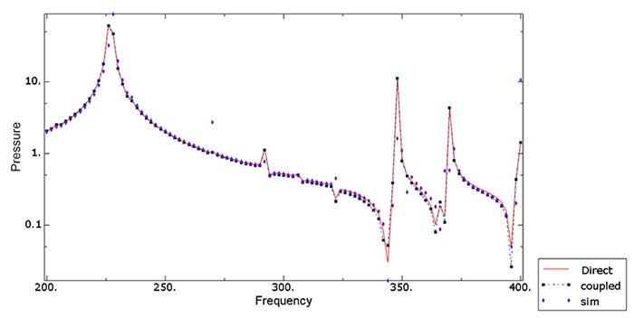

# 9.1.2 扬声器耦合声-结构分析

**产品：** Abaqus/Standard

本示例说明了结构与声学介质之间耦合的影响。当固体-流体相互作用对身体或声学流体的整体振动行为至关重要时，就会出现这种耦合问题。这种问题的典型例子包括扬声器外壳、充液罐、消声器系统和车辆驾驶室封闭空间。Abaqus中耦合声学/结构振动能力的基础在["耦合声学-结构介质分析，" Abaqus Theory Guide的第2.9.1节](../stm/stm-link.md#stm-anl-acouststruct)中描述。

### 几何和模型

模型如图[图9.1.2-1](ch09s01aex130.md#speaker-model)所示。这里考虑的系统包括扬声器箱、扬声器锥体和相互作用的内部空气。为简化问题，忽略扬声器箱外部相互作用的空气的影响。扬声器箱的宽度、深度和高度分别为0.5米、0.4米和0.6米。厚度为0.005米。扬声器箱由木材制成，弹性模量*E*为11.6 GPa；泊松比0.3；密度为562 kg/m³。在前扬声器箱的中心，有一个锥形扬声器，直径0.345米，高度0.04米，厚度0.001米。不考虑扬声器的质量和阻抗。扬声器由聚乙烯制成，弹性模量*E*为3.4 GPa；泊松比0.3；密度为450 kg/m³。空气的密度为1.11 kg/m³，体积模量为0.134 MPa。假设空气的体积拖曳在本问题中影响可以忽略不计，因此在分析中忽略。

使用一阶六面体声学单元（AC3D8）和一阶声学三角棱柱单元（AC3D6）填充内部空气区域的体积。扬声器箱和扬声器分别使用S4R和S3R单元进行网格划分。由于该示例仅作为说明，没有进行网格收敛研究。网格密度（单元尺寸）的选择在["声学、冲击和耦合声-结构分析，" Abaqus Analysis User's Guide的第6.10.1节](../usb/usb-link.md#usb-anl-aacoustic)中讨论。

使用基于表面的绑定约束将结构与内部空气耦合。在扬声器箱内部和扬声器锥体上定义表面，在空气的自由表面上定义表面。为约束结构，底板四个角点简支。

还执行了子结构分析。整个扬声器模型使用高达800 Hz的所有特征模态转换为动态耦合结构-声学子结构。生成子结构载荷情况以用于强迫响应分析。

### 结果与讨论

下面讨论每个分析的结果。

#### 固有频率分析

如果单独结构或单独声学介质的特征值不在感兴趣范围内，则不必同时考虑整个系统。因此，建议在分析整个系统之前分别理解每个部分的模态特征。特征频率提取程序默认考虑声学-结构耦合效应（如果使用绑定约束连接了声学介质和结构）。要忽略此效应，可以使用特征频率提取程序或使用SIM架构的特征值提取分析来计算声学和结构/固体区域的非耦合模式集。

在基于SIM的分析中，提取非耦合模式，并在后续模态稳态动态程序中施加结构-声学耦合。为了补偿使用非耦合模式引入的近似值，通过将声学范围因子设置为大于1.0的值来增加声学模式的感兴趣最大频率。此外，请求残余模态以减少模态截断误差。要在Lanczos特征求解器中请求残余模态，必须首先通过在紧接频率提取步之前的静态扰动步中指定将在后续基于模态的分析中施加的载荷来计算静态扰动响应。残余模态在耦合和非耦合特征值提取分析中计算。

[表9.1.2-1](ch09s01aex130.md#table-speaker-uncoupled)总结了非耦合系统固有频率分析的结果。结构和空气的固有频率都跨越本示例中的相同范围，这表明两部分可以相互影响。因此，在本示例中应采用耦合方法来理解整个扬声器系统的特征。

[表9.1.2-2](ch09s01aex130.md#table-speaker-coupled)显示了耦合系统固有频率分析的结果。由于耦合效应，特征频率逐模式移动。每个模态形状也比非耦合情况更复杂，因此每个模态在结构和声学部分都有非零分量。基于耦合模式的子结构分析产生的特征频率与无子结构分析的特征频率相同。

#### 耦合强迫响应分析

系统的响应通过基于模态和直接解稳态动态分析获得。必须先执行特征值提取分析，然后才能执行模态分析。执行两种类型的基于模态稳态动态分析：一种基于耦合模式，另一种使用利用非耦合模式的基于SIM的分析。分析从200到400 Hz进行频率扫描。系统在扬声器锥体中心点以1.0 N的集中力激励。三种方法的耦合频率响应结果如图[图9.1.2-2](ch09s01aex130.md#speaker-center-por)所示。该图说明了扬声器锥体中心点附近的声压，随频率变化的函数。基于耦合和非耦合模式的模态稳态动态分析的结果与直接解稳态动态结果显示出良好的一致性。由于扬声器结构和内部空气之间的耦合相对较强，因此为基于非耦合模式的模态分析提取了额外的声学特征模态以提高准确性。子结构分析产生的结果与等效无子结构分析的结果几乎相同。

### 输入文件

[speaker_direct.inp](../eif/speaker_direct.inp)

直接解稳态动态分析。

[speaker_coupled.inp](../eif/speaker_coupled.inp)

耦合特征模态的固有频率提取和使用耦合模式的基于模态稳态动态分析。

[speaker_sim.inp](../eif/speaker_sim.inp)

非耦合特征模态的固有频率提取和使用非耦合模式的基于模态稳态动态分析。

[speaker_gen.inp](../eif/speaker_gen.inp)

耦合结构-声学模型的子结构生成和无子结构的稳态动态解。

[speaker_use.inp](../eif/speaker_use.inp)

使用子结构进行直接解和基于模态稳态动态分析。

[speaker_ams.inp](../eif/speaker_ams.inp)

使用AMS特征求解器提取的非耦合特征模态的基于模态稳态动态分析。

[speaker_model.inp](../eif/speaker_model.inp)

模型定义。

### 表格

**表9.1.2-1** 非耦合频率分析。模式按从201 Hz开始的频率递增顺序排列。
| 模式 | 频率（Hz） | 描述 |
| --- | --- | --- |
| 1 | 201 | 结构 |
| 2 | 211 | 结构 |
| 3 | 212 | 结构 |
| 4 | 232 | 结构 |
| 5 | 247 | 结构 |
| 6 | 263 | 结构 |
| 7 | 283 | 空气 |
| 8 | 283 | 结构 |
| 9 | 313 | 结构 |
| 10 | 314 | 结构 |
| 11 | 339 | 空气 |
| 12 | 352 | 结构 |
| 13 | 361 | 结构 |
| 14 | 382 | 结构 |

**表9.1.2-2** 耦合频率分析。模式按从204 Hz开始的频率递增顺序排列。
| 模式 | 频率（Hz） | 描述 |
| --- | --- | --- |
| 1 | 204 | 耦合模式 |
| 2 | 227 | 耦合模式 |
| 3 | 228 | 耦合模式 |
| 4 | 235 | 耦合模式 |
| 5 | 245 | 耦合模式 |
| 6 | 269 | 耦合模式 |
| 7 | 292 | 耦合模式 |
| 8 | 307 | 耦合模式 |
| 9 | 322 | 耦合模式 |
| 10 | 348 | 耦合模式 |
| 11 | 352 | 耦合模式 |
| 12 | 367 | 耦合模式 |
| 13 | 370 | 耦合模式 |
| 14 | 399 | 耦合模式 |

### 图表

**图9.1.2-1** 扬声器系统的三维模型。

**图9.1.2-2** 扬声器锥体中心附近的声压。

