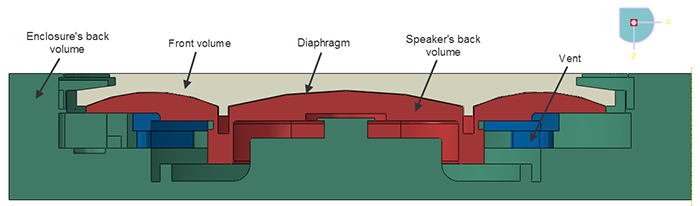
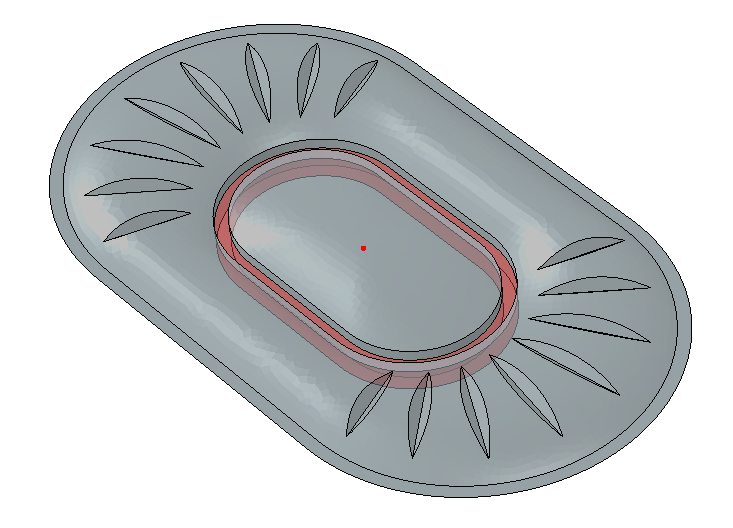
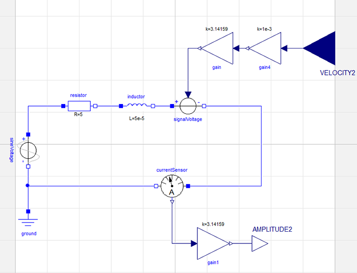
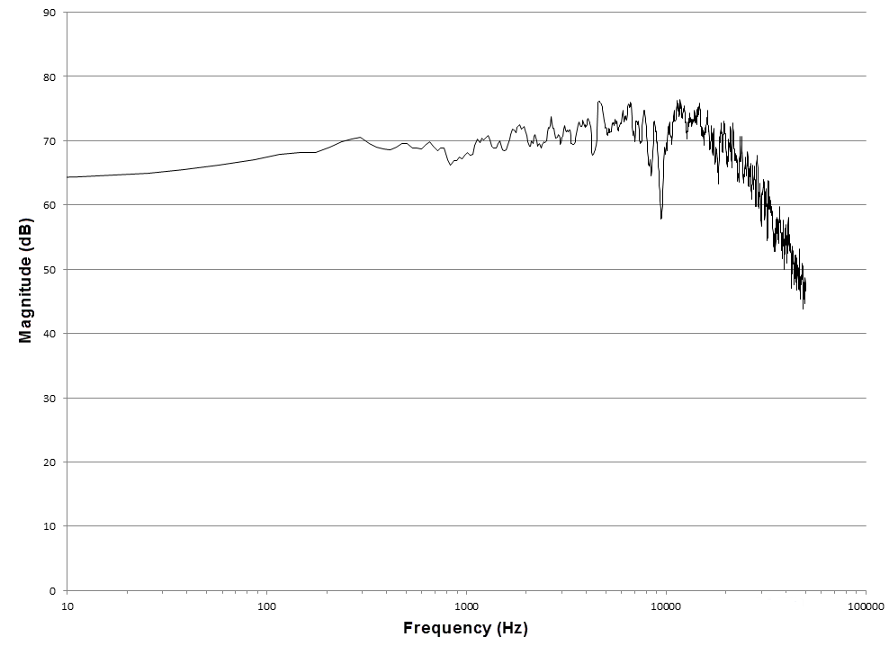
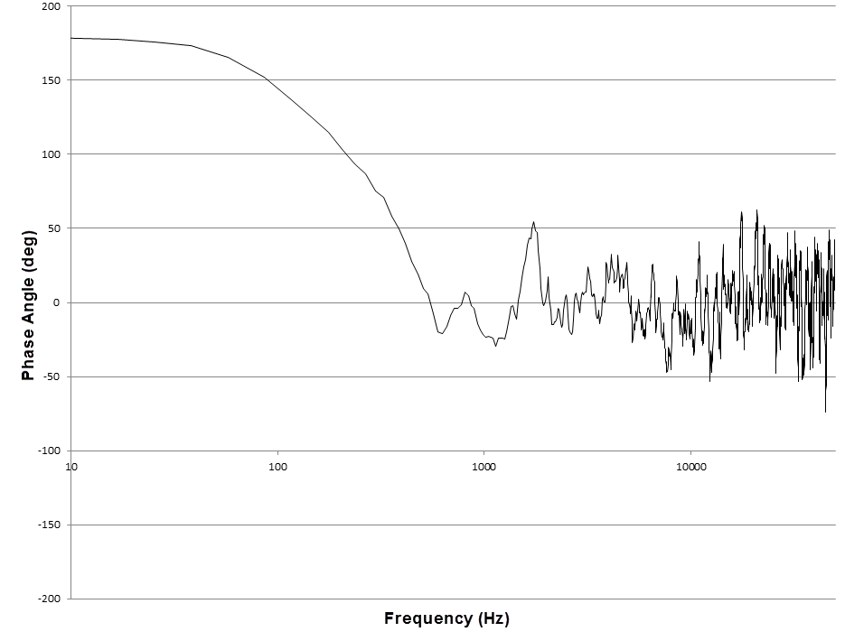
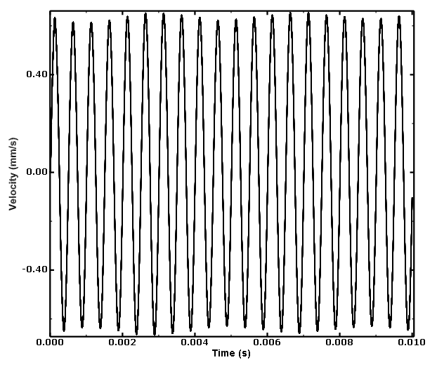
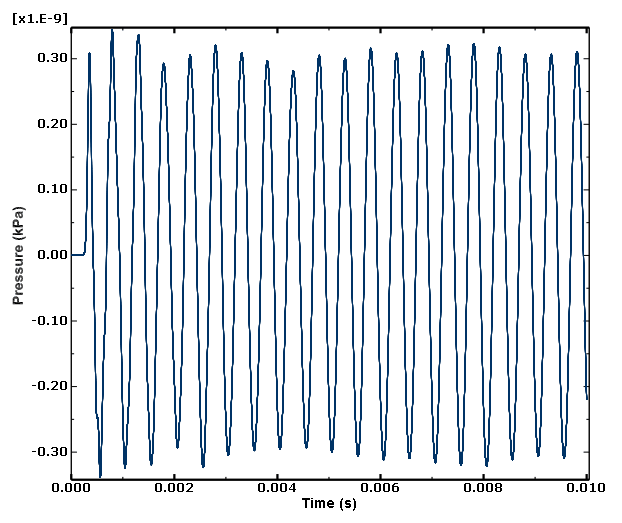

# 9.1.3 Analysis of a speaker using Abaqus-Dymola co-simulation

**Product: **Abaqus/Explicit  

### Objectives

This example illustrates the use of the co-simulation technique to couple system-level logical models and functional-level models in Dymola with a physical model in Abaqus/Explicit.

### Application description

Mobile devices like tablets and smart phones are increasingly becoming an important part of our lifestyle. One of the critical features that determines the overall quality of such a device is the audio quality of the speaker. The most commonly used speaker in mobile devices is based on the principle of moving coil transduction, as described by Jackman et al. (2009). An electromagnetic field applied on the voice coil generates a mechanical driving force (known as the Lorentz force) that generates the sound by imparting motion to the diaphragm. There are several key design challenges in the selection of the transducer and its placement. Some of the important issues to be addressed in the audio system design are discussed below.

#### Audio system design

The mobility and lightness of the device are major considerations, and space is at a premium. Providing many features in a mobile device requires numerous components, and packaging plays a critical role as these components compete for the limited available space. The smaller the audio speaker, the poorer its bass response. The enclosure behind the diaphragm in the speaker (referred to as the “back volume”) has a major influence on the speaker performance; it affects the audio quality by introducing cavity resonances at high frequencies and by reducing the compliance at low frequencies. In other words, the smaller the back volume, the lower the quality of the low frequency (bass) sound output. The designer must take measures to maximize the back volume, conforming to the packaging needs of the device in addition to providing an excellent bass audio quality.

The audio quality is reduced due to the inherent nonlinearities such as the total harmonic distortion. Even for microspeakers with very low diaphragm motions or excursions, the nonlinearities due to the mechanical resistance at the restraints (in addition to acoustic losses in ports) tend to be dominant. The nonlinearities are guided not so much by the displacement but by the velocity of the diaphragm excursion (Klippel and Knobloch, 2013). Hence, there is a need to model the nonlinearities that can be appropriately modeled in the time domain to reproduce the physically accurate solution. Simulating the audio response as a harmonic analysis in the frequency domain may provide inaccurate results, especially at higher levels of nonlinearity.

For transducer design it is important to have a flat frequency response while making sure that the sound output is as large as possible without distortions. The first resonant mode (along with the damping) sets the maximum for the sound output. The flat frequency response (at least in the mid-frequency range; e.g., 1000–6000 Hz) is ensured by shifting the second resonance peak as far away as possible from the first resonance peak.

#### Interaction through the co-simulation technique

This example discusses a methodology that simulates the diaphragm excursion (and the subsequent acoustic response) due to electromagnetic excitation as a transient problem. The electromagnetic circuit of the speaker is assumed to have no direct contribution to the structural response of the system and, hence, is modeled independently as a reduced-order logical system in Dymola. The structural-acoustic response of the diaphragm in the speaker assembly is modeled with its full three-dimensional finite element representation in Abaqus/Explicit. The Abaqus model and the Dymola model interact with each other through the co-simulation technique in the time domain.

##### Abaqus model

The Abaqus model of the speaker is shown in [Figure 9.1.3--1](ch09s01aex131.md#exa-aco-speaker-geometry). Features such as very short edges or small faces, although important for machining and packaging of a component, have almost no bearing on the mechanics of the problem. Including such features in the numerical analysis could result in a very fine mesh density, leading to increased computation time. Such minor geometric details are excluded by combining the feature with an adjacent larger feature.  Nodes and elements are created to conform to the original geometry. The diaphragm occupies the region in between the front volume and the speaker’s back volumes, as shown in [Figure 9.1.3--1](ch09s01aex131.md#exa-aco-speaker-geometry). Symmetric notches and the racetrack-like separation between the center and the annulus region in the diaphragm (shown in [Figure 9.1.3--2](ch09s01aex131.md#exa-aco-diaphragm)) are designed to achieve the flat frequency response and the first resonant peak, respectively. The other speaker components that hold the diaphragm in place are considered rigid and are not modeled. The radius of the hemispherical acoustic domain corresponds to one-third of the largest acoustic wavelength. Additional details on the modeling of the speaker are described in Jackman et al. (2009).

##### Dymola model

The electromagnetic component of the speaker, which functions primarily in the low frequency range, can be idealized with a lumped-parameter model in Dymola, as shown in [Figure 9.1.3--3](ch09s01aex131.md#exa-aco-speaker-frequency-dymola). The advantage of using a lumped-parameter model is twofold; it simplifies the modeling and improves the performance dramatically. The electromagnetic part of the model is assumed to have a linear response to the electromagnetic excitation; hence, it is modeled with a resistor and an inductor. The current sensor output from Dymola is used as an actuator in Abaqus, and the velocity output of the sensor from Abaqus is used as an actuator in calculating the back electromotive force (EMF) in the system-level functional model.

### Abaqus modeling approaches and simulation techniques

Two cases are studied. The first case analyzes loading with a white noise signal to check the drop in the signal amplitude over the audible frequency range. The second case analyzes loading with a fixed frequency signal to check the fidelity of the response of the speaker. 

### Summary of analysis cases

| Case 1 | White noise analysis. |
| --- | --- |
| Case 2 | Response fidelity analysis. |

The sections that follow discuss the analysis considerations that are applicable for both cases.

### Analysis techniques

Abaqus-Dymola co-simulation provides a convenient way to couple system-level logical and functional-level models in Dymola with a physical model in Abaqus. The Abaqus user subroutines [`UAMP`](../sub/sub-link.md#sub-xsl-uamp) and [`VUAMP`](../sub/sub-link.md#sub-xsl-vuamp) can be used to design such system-level models interacting with physical models, but the user is required to manually code the user subroutine. Dymola provides a host of libraries that have components belonging to different engineering domains (such as fluid, thermal, and electromagnetic) as well as mathematical operators (such as controllers and Boolean operators) that can be easily dragged and dropped as icons into a user interface to build the system-level model. Co-simulation with Abaqus involves passing the state of the physical system in Abaqus as sensor data to Real Input interfaces in Dymola while reading the Real Output interfaces from Dymola into Abaqus as actuators. For more details about co-simulation, refer to ["Structural-to-logical co-simulation," Section 17.4.1 of the Abaqus Analysis User's Guide](../usb/usb-link.md#usb-anl-acosimabqtodym).

### Mesh design

The diaphragm is modeled with reduced-integration conventional shell elements (S3R and S4R), and its rim is meshed with first-order reduced-integration hexahedral continuum elements (C3D8R). Modeling the diaphragm with solid elements instead of shell elements allows the acoustic domain to be cut away more easily. The acoustic domain, both in the back volume and the volume exterior to the diaphragm, is modeled with three-dimensional continuum acoustic linear tetrahedral elements (AC3D4). The mesh of the acoustic domain is nonuniform, with the largest element size being less than one-eighth of the shortest acoustic wavelength.

### Material model

The units used in the Abaqus model are mm-tonnes-sec, and SI units are used in Dymola. The diaphragm material in Abaqus is polyimide (Young's modulus=3677; density=1.4  109; structural damping=1.5); the voice coil is made of steel (Young's modulus=110,000; Poisson's ratio=0.3; density=3.3  109); while the air is modeled as the acoustic medium (bulk modulus= 0.142; density=1.2  1012). The electromagnetic circuit in Dymola has a resistor of 5 ohms, an inductor of 5  105 H, and a coupling factor of 3.14159 N/A. 

### Boundary conditions

Boundary conditions are not applied to the acoustic regions that are in contact with the surfaces of the speaker components to enforce the rigid assumption that an Abaqus acoustic domain without any boundary condition is assumed to be a rigid termination. The surface impedance for the nonreflecting spherical boundary of the acoustic medium is defined as 550.

### Constraints

The structural and acoustic media are coupled through tie constraints. The diaphragm's rim is rendered rigid with its reference point at the center of the rim.

### Output requests

The component of the translational velocity of the reference node of the rigid rim of the diaphragm along the direction perpendicular to the hemispherical flat surface of the acoustic medium is declared as a sensor. This sensor output from the diaphragm is passed into Dymola as an input signal. The pressure at a certain location in the front volume acoustic medium is also stored as history output. 

### Run procedure

The Abaqus model can be run on any supported platform (Windows/Linux), whereas the Dymola portion of the co-simulation can be run only on Windows 64-bit platforms. For more details on how to submit an Abaqus-Dymola co-simulation job, please refer to["Structural-to-logical co-simulation," Section 17.4.1 of the Abaqus Analysis User's Guide](../usb/usb-link.md#usb-anl-acosimabqtodym).

### Case 1: White noise analysis

This case analyzes loading with a white noise signal to check the drop in the signal amplitude over the audible frequency range.

### Analysis techniques

A concentrated force with amplitude as white noise is applied on a rigidly fixed dummy node, and a sensor of this concentrated force at this node is passed from Abaqus into Dymola as an input value.

### Loads

A white noise signal voltage of unit magnitude is applied through a sensor on a dummy node in Abaqus, as mentioned above.

### Solution controls

This analysis is run for a duration of 0.03 s, thereby setting a threshold frequency of 33 Hz as the lower limit for the frequency range of the audio signal to obtain an accurate response from the speaker. The models's stable time increment of ~108 determines the Nyquist frequency of 1  106 Hz as the higher limit for the frequency range of the audio signal to obtain an accurate response.

### Output requests

An additional sensor for a concentrated force on a dummy node along the direction of loading is defined for transferring the white noise to Dymola from Abaqus, as mentioned above.

### Case 2: Response fidelity analysis

This case analyzes loading with a fixed frequency signal to check the fidelity of the response of the speaker. 

### Loads

A signal voltage of 2 mV with a frequency of 2000 Hz is applied. In Abaqus the reference node of the rigid rim of the diaphragm is actuated by the Lorentz force that was computed in Dymola.

### Solution controls

This analysis with a signal frequency of 2000 Hz must be run for at least 0.005 s to obtain a steady response of the speaker for a few wavelengths of the signal.

### Discussion of results and comparison of cases

For the white noise analysis, the Fast Fourier Transform (FFT) of the magnitude and the phase angle of the velocity of reference node on the diaphragm rim are plotted against the frequency in [Figure 9.1.3--4](ch09s01aex131.md#exa-aco-speaker-velocity-magnitude) and [Figure 9.1.3--5](ch09s01aex131.md#exa-aco-speaker-velocity-phase-angle), respectively. The signal loss in the audible frequency range is minimal. The behavior is qualitatively similar to that obtained by Radcliffe and Gogate (1996).

For the response fidelity analysis, the acoustic signal is reciprocated in the diaphragm and in the air at almost 2000Hz, as shown in the velocity and pressure plots in [Figure 9.1.3--6](ch09s01aex131.md#exa-aco-speaker-velocity) and [Figure 9.1.3--7](ch09s01aex131.md#exa-aco-speaker-pressure), respectively. 

This analysis of a speaker using the co-simulation technique between Abaqus and Dymola successfully demonstrates that the signal loss in the audible frequency range is negligible while maintaining the fidelity of original signal.

### Files

##### **Case 1: White noise analysis**

[speaker_white_noise.inp](../eif/speaker_white_noise.inp)

Abaqus input file.

[speaker_white_noise.mo](../eif/speaker_white_noise.mo)

Dymola modelica file.

[speaker_white_noise.sgn](../eif/speaker_white_noise.sgn)

File needed for co-simulation.

[white_noise.inp](../eif/white_noise.inp)

Include file containing white noise signal data.

##### **Case 2: Response fidelity analysis**

[speaker_frequency.inp](../eif/speaker_frequency.inp)

Abaqus input file.

[speaker_frequency.mo](../eif/speaker_frequency.mo)

Dymola modelica file.

[speaker_frequency.sgn](../eif/speaker_frequency.sgn)

File needed for co-simulation.

### References

**Abaqus Analysis User's Guide**
- ["Structural-to-logical co-simulation," Section 17.4.1 of the Abaqus Analysis User's Guide](../usb/usb-link.md#usb-anl-acosimabqtodym)

**Other**

- Jackman, C., M. Zampino, D. Cadge, R. Dravida, V. Katiyar, and J. Lewis, "Estimating Acoustic Performance of a Cell Phone Speaker Using Abaqus," SIMULIA Customer Conference, 2009.
- Klippel, W., and D. Knobloch, "Nonlinear Losses in Electro-Acoustical Transducers," The Association of Loudspeaker Manufacturers & Acoustics International (ALMA), Winter Symposium, 2013.
- Radcliffe, C., and S. Gogate, "Velocity Feedback Compensation of Electromechanical Speakers for Acoustic Applications," International Federation of Automatic Control, Triennial World Congress, 1996.

### Figures

**Figure 9.1.3–1** Abaqus model of the speaker.

**Figure 9.1.3–2** Diaphragm of the speaker in the Abaqus model. The highlighted red region is rendered rigid with its reference node at the center highlighted in red.

**Figure 9.1.3–3** Dymola model showing the electromagnetic circuit of the speaker.

**Figure 9.1.3–4** White noise analysis: magnitude of the velocity of the speaker in the frequency domain.

**Figure 9.1.3–5** White noise analysis: phase angle of the velocity of the speaker in the frequency domain.

**Figure 9.1.3–6** Response fidelity analysis: velocity of the reference node of the rigid part of the diaphragm.

**Figure 9.1.3–7** Response fidelity analysis: pressure at a point in air in front of the diaphragm.

