# 9.1.4 Response of a submerged cylinder to an underwater explosion shock wave

**Product: **Abaqus/Explicit  

This example demonstrates how Abaqus/Explicit can be used to predict the transient response of submerged structures that experience loading by an acoustic pressure shock wave resulting from an underwater explosion (UNDEX). This class of problem is characterized by a strong coupling between the structural motions and acoustic pressures on the wetted interface between the external fluid and the structure. The structural response in a strongly coupled acoustic-structural system can be described as a combination of the following:
- Low-frequency response characterized by structural wavelengths that are significantly shorter than the associated acoustic wavelengths. The external fluid on the structure adds an effective mass to the structure on the wetted interface.
- High-frequency response characterized by structural wavelengths that are significantly longer than the associated acoustic wavelengths. The external fluid on the structure acts as a simple damping mechanism, where energy is transported away from the structure via acoustic radiation.
- Intermediate-frequency response characterized by structural wavelengths that are similar in length to the associated acoustic wavelengths. In this frequency regime the external fluid has both an added mass and a radiation damping influence on the structure.

The spherical pressure wave associated with an UNDEX shock loading is characterized by a very steep front where the maximum pressure is attained over an extremely short time duration (rise time). The pressure then drops off exponentially over a significantly longer period of time. Therefore, UNDEX shock loads can be expected to excite submerged structures over a large frequency range that will include low, high, and intermediate response frequencies. The boundaries of the external fluid must be located a sufficient distance from the structure to ensure proper low-frequency response, while the size of the acoustic elements must be small enough to accurately represent the propagation of high-frequency acoustic waves away from the submerged structure.

### Problem and geometry description

This example problem is based upon an UNDEX experiment in which a submerged test cylinder is exposed to a pressure shock wave produced by a 60 lb HBX-1 explosive charge. Kwon and Fox originally described the experiment along with a set of selected experimental results. The objective of this class of analysis is to evaluate the behavior and integrity of a structure under UNDEX loading conditions.

The test cylinder is made of T6061-T6 aluminum. It has an overall length of 1.067, an outside diameter of 0.305, a wall thickness of 6.35 mm, and 24.5 mm thick welded endcaps. The cylinder is suspended horizontally in a 40 m deep fresh water test quarry. The 60 lb HBX-1 explosive charge and the cylinder are both placed at a depth of 3.66 m. The charge is centered off the side of the cylinder and located 7.62 m from the cylinder surface. The suspension depths, charge offset, and duration of the test are selected such that cavitation of the fluid is not significant and no bubble pulse occurs. Strain gauges are placed at several locations on the outer surface of the test cylinder, as shown in [Figure 9.1.4--1](ch09s01aex132.md#sxmundex-straingage). The strain gauge experimental data are filtered at 2000 Hz. The experimental data presented here are obtained by digitizing the Kwon and Fox strain history curves.

When the acoustic fluid behavior is linear (i.e., no cavitation), the total acoustic pressure within the fluid consists of an incident wave and a scattered wave component. For this example the incident wave is the shock wave produced by the UNDEX charge. The scattered wave is the acoustic field generated by the interaction of the incident wave and the submerged structure. The nature of the incident wave can be determined from either empirical formulas or experimental data. Therefore, the spherical incident shock wave is applied as a transient load active on both the acoustic and structural meshes at their common surfaces (the wetted interface), and the external fluid pressure degrees of freedom represent only the unknown scattered component of the total acoustic pressure. The type of incident wave loading is either a scattered wave or a total wave formulation. The scattered wave formulation described above is the default condition for Abaqus/Explicit analyses. The total wave formulation is used for cases where nonlinear fluid response is expected or where the total acoustic pressure history is prescribed at an acoustic fluid boundary.

During the UNDEX test two pressure transducers are positioned 7.62 m from the charge, away from the cylinder but at the same depth as the cylinder. These transducers provide an experimental determination for the pressure vs. time history of the spherical incident shock wave as it travels by the point on the cylinder closest to the charge (strain gauge location B1). [Figure 9.1.4--2](ch09s01aex132.md#sxmundex-shockpulse) shows a time history curve of the incident pressure wave recorded by the transducers. The input file shock-pulse.inp contains this time history curve as an amplitude table used to define the incident wave loading.

### Abaqus/Explicit model

[Figure 9.1.4--3](ch09s01aex132.md#sxmundex-testcylmod) shows the S4R finite element shell mesh used to represent the test cylinder. The mesh consists of 2402 nodes (14412 DOF) and 2400 elements with 40 circumferential divisions and 53 axial divisions. The element connectivity is such that each shell normal is directed into the external fluid. The nodes are positioned on the outside surface of the test cylinder. The S4R elements adjacent to the endcaps are dummy elements with reduced mass and stiffness used only to provide surfaces that correspond to the thickness of the endcaps. BEAM type MPCs are used to tie the endcaps to the main cylinder body. The local coordinate system is used to define the shell element material axes for postprocessing, such that the local 1-direction is aligned with the cylinder's axis for the main body and is radially directed for the endcaps. The local 2-direction is in the circumferential (hoop) direction for both the cylinder main body and the endcaps.

The external fluid is meshed with 4-node AC3D4 acoustic tetrahedral elements. The outer boundary of the external fluid is represented by a cylindrical surface with spherical ends. The characteristic radius of the outer boundary is 0.915 m. The outer boundary must be placed a sufficient distance from the cylinder so that the added mass associated with the low-frequency beam bending modes of the cylinder is represented adequately. The beam bending modes correspond to an  sinusoidal translation of the cylinder's cross-section through the fluid. For evaluating added mass effects when using a simple plane wave radiation impedance boundary for the external fluid, the outer boundary of the fluid can be considered rigid (nonradiating). Therefore, an analytical solution for the added mass associated with the translation of an infinite cylinder of radius  located within a fluid-filled infinite cylinder of radius  can be used to determine an appropriate characteristic radius for the external fluid. Results for the analytical solution presented by Blevins are listed in [Table 9.1.4--1](ch09s01aex132.md#exa-aco-undex-added-mass). The characteristic radius is based upon an outer boundary () to cylinder radius () ratio of 6.0, which corresponds to an added mass error of about 6% for infinite cylinders. When using enhanced surface impedance models, the outer fluid boundary location can be placed at about half of the distance required when using the plane wave radiation impedance model. However, for this example the 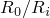 ratio was maintained at 6.0 even when using the source-based surface impedance models for the external fluid. Comparable results for the structural response can be obtained when the source-based boundaries were located half as far from the structure. For the low-frequency beam bending modes, system losses (damping) caused by hydrodynamic drag and/or fluid viscosity are not accounted for by acoustic radiation. Therefore, mass-proportional damping applied to the test cylinder mesh is used to approximate these types of losses.

[Figure 9.1.4--4](ch09s01aex132.md#sxmundex-exfluidmesh) shows the combined external fluid and test cylinder meshes. One quarter of the fluid mesh is omitted from this figure to allow an inspection of the acoustic element mesh inside the external fluid domain. The mesh is generated with Abaqus/CAE. The nodal seeding on the fluid outer boundary is set at 0.10 m, corresponding to 9.7 element divisions per acoustic wavelength at a response frequency of 1500 Hz. The nodal seeding on the fluid wetted interface with the test cylinder is set at 0.04 m, corresponding to 24.4 element divisions per acoustic wavelength at 1500 Hz. The radiation boundary condition is applied on the fluid outer-boundary surfaces.

### Fluid-structure coupling and shock wave loading

The acoustic structural coupling between the fluid mesh acoustic pressures and the test cylinder structural displacements at their common surfaces (the wetted interface) is accomplished with a surface-based tie constraint. [Figure 9.1.4--5](ch09s01aex132.md#sxmundex-sourcepoint) shows the surface mesh at the acoustic-structure wetted interface associated with the external fluid ([Figure 9.1.4--3](ch09s01aex132.md#sxmundex-testcylmod) shows the test cylinder surface). Since the acoustic mesh is coarser than the structural mesh, the surface of the external fluid at the wetted interface is designated as the master surface. This pairing creates an internal coupling of the acoustic pressure and structural displacements at the test cylinder (slave) surface nodes and ties the cylinder's acoustic pressures to the fluid mesh acoustic pressures at the wetted interface.

[Figure 9.1.4--5](ch09s01aex132.md#sxmundex-sourcepoint) also illustrates the concept of a source point and a standoff point as they relate to an incident acoustic wave loading. For this example the source point represents the actual physical location of the explosive charge relative to the structure. The standoff point represents the location of the incident wave (shock front) at the start of the analysis (total time = 0.0) and is the point at which the pressure history of the incident wave is provided. For solution efficiency the standoff point should be placed at the location on the fluid-structure interface that is closest to the source point. The standoff point can be placed away from the structure closer to the source point, but this will only delay the onset of the transient response. Under no circumstances should the standoff point be located within or behind the structure being analyzed.

The incident wave can either be planar or spherical and requires the location of the standoff point and the source point. For a spherical shock wave, as in this example, the relative positions of the standoff point and source point determine how the wave's pressure will decay with distance from the source point. For a planar wave, which does not decay, the relative positions of the standoff point and source point are used to define the direction of incident wave travel. The fluid properties associated with the incident wave includes wave speed. Defining the incident wave properties independent of the acoustic mesh allows incident wave loading to be used in the analysis of weakly coupled or uncoupled acoustic-structural systems (i.e., air blast analyses). For these cases the incident wave loading can be applied to a structure when no acoustic medium is directly modeled.

The pressure history at the standoff point is used to drive the incident wave. The amplitude definition specifies the surface name to which the incident wave loading is applied and a reference magnitude for the pressure curve. For acoustic-structural systems where the fluid and structure are both modeled and coupled, the incident wave loading must be defined to act upon both the fluid and structural surfaces at the wetted interface. Acoustic volumetric acceleration loads corresponding to the incident wave are then applied to the fluid surface, while the incident wave pressures are applied to the structural surface.

### Results and discussion

The Abaqus/Explicit model for this UNDEX example has a total of 23337 active degrees of freedom and requires approximately 160 MB of memory. The transient analysis is run for 0.008 seconds with a 1.69  10-6 critical time increment (~4733 solution increments). [Figure 9.1.4--6](ch09s01aex132.md#sxmundex-endcapu3) shows the time history of axial displacement (U3) for the center nodes of the endcaps. These curves clearly show the periodic response associated with a dominant axially directed mode of the cylinder–endcap structure. [Figure 9.1.4--7](ch09s01aex132.md#sxmundex-endcapu1) shows the 1-direction translation (U1) of the endcap center nodes. The 1-direction is also the primary direction of shock wave propagation. The response curves clearly illustrate that there is a rigid body translation of the cylinder, and the oscillations are representative of the fundamental beam bending mode of the cylinder. [Figure 9.1.4--8](ch09s01aex132.md#sxmundex-verticalu2) shows the time history of vertical (U2) displacement for nodes located at the top and bottom midplane of the test cylinder. These curves suggest that a dominant *N*=2 ovalization mode of vibration occurs at about 170 Hz (based on an estimated period of 0.0059 seconds). The frequency for the first ovalization mode of the test cylinder in a vacuum is 330 Hz, based upon an Abaqus/Standard eigenvalue extraction analysis. This shift in the *N*=2 response mode frequency illustrates the added mass effect of the external fluid on the response of the submerged cylinder.

[Figure 9.1.4--9](ch09s01aex132.md#sxmundex-axialb1) through [Figure 9.1.4--11](ch09s01aex132.md#sxmundex-hoopa2) contain time history plots of the test cylinder strains obtained from the Abaqus/Explicit analysis with experimental data for locations B1, C1, and A2. The experimental curves are obtained by digitizing the response plots published by Kwon and Fox. The digitized curves are shifted to the left by 0.0002 seconds on the time axis to account for an apparent time differential between the experiment and the Abaqus/Explicit solution. [Figure 9.1.4--9](ch09s01aex132.md#sxmundex-axialb1) contains history plots of the axially directed strains at location B1. The analytical-experimental correlation at an early time (peak strain prediction) is very good, as is the prediction for the dominant response frequency of the test cylinder. The predicted strain oscillations at longer times suggest that the modeling of hydrodynamic drag damping and viscous losses by applying mass damping to the cylinder mesh could be improved. [Figure 9.1.4--10](ch09s01aex132.md#sxmundex-axialc1) contains the history plots for the axially directed strains at location C1. The initial peak response (high frequency) contained in the Abaqus/Explicit solution is not present in the experimental data. This may be due to the sampling rate and filtering techniques used to obtain the data or to high strain gradients being averaged over the effective length of the strain gauge. Otherwise, the Abaqus/Explicit solution closely tracks the experimental data and provides a conservative estimate for the peak response. [Figure 9.1.4--11](ch09s01aex132.md#sxmundex-hoopa2) contains the history plots for the hoop-directed strains at location A2. As in [Figure 9.1.4--10](ch09s01aex132.md#sxmundex-axialc1), the initial peak response (high frequency) contained in the Abaqus/Explicit solution is not present in the experimental data. Otherwise, the Abaqus/Explicit solution closely tracks the experimental data. [Figure 9.1.4--9](ch09s01aex132.md#sxmundex-axialb1) through [Figure 9.1.4--11](ch09s01aex132.md#sxmundex-hoopa2) indicate that the overall UNDEX analysis model provides a conservative estimate of the cylinder's peak response and is, therefore, appropriate for meeting the analysis objective.

[Figure 9.1.4--12](ch09s01aex132.md#sxmundex-peeq) shows a contour plot of accumulated equivalent plastic strain (PEEQ) on the outer surface of the test cylinder. To obtain the plot, an averaging threshold of 100% is used and the maximum contour value is specified as 9.16E3. The plot corresponds to the end of the transient analysis, which is well after the last increment of plastic strain is detected from a plot of the cylinder's total plastic strain energy vs. solution time. The slight degree of solution nonsymmetry exhibited about the cylinder's midplane is due to the nonsymmetric nature of the free tetrahedron acoustic element mesh of the external fluid.

### Input files

[submerged_cyl_driver.inp](../eif/submerged_cyl_driver.inp)

Abaqus/Explicit analysis of a submerged cylinder subjected to an UNDEX shock wave.

[submerged_cyl_cylinder.inp](../eif/submerged_cyl_cylinder.inp)

The finite element mesh data for the test cylinder, including element and node set definitions for output requests.

[submerged_cyl_water.inp](../eif/submerged_cyl_water.inp)

 The finite element mesh data for the external water, including element and node set definitions for surface creation and output requests.

[submerged_cyl_pulse.inp](../eif/submerged_cyl_pulse.inp)

The time history of the shock wave pressure at the standoff point defined by the [*AMPLITUDE](../key/key-link.md#usb-kws-mamplitude) option.

### References

Kwon,  Y. W., and P. K. Fox, “Underwater Shock Response of a Cylinder Subjected to a Side-On Explosion,” Computers and Structures, Vol. 48, No. 4, 1993.

Blevins,  R. D., *Formulas for Natural Frequencies and Mode Shapes, *Robert E. Fruger Publishing Co., 1979.

### Table

**Table 9.1.4–1** Added mass for *N*=1 translation mode of an infinite cylinder (fluid between concentric cylinders).
| Cylinder Radius Ratio () | Added Mass Ratio (External Boundary/Infinite Domain) |
| --- | --- |
| 1.5 | 2.600 |
| 2.0 | 1.667 |
| 4.0 | 1.133 |
| 6.0 | 1.057 |
| 8.0 | 1.032 |
| 16.0 | 1.008 |
| 24.0 | 1.004 |

### Figures

**Figure 9.1.4–1** Strain gauge locations (A1, A2, B1, B2, B3, C1, C2) with B1 closest to the charge.

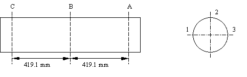

**Figure 9.1.4–2** Incident pressure wave transient (shock pulse).

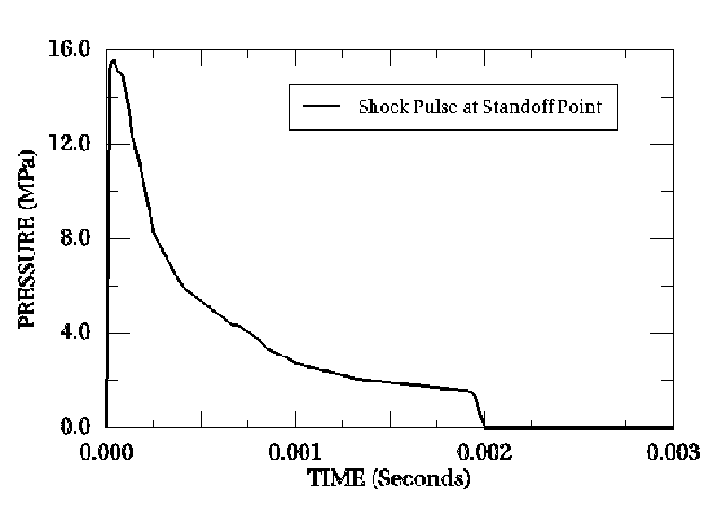

**Figure 9.1.4–3** Test cylinder model.

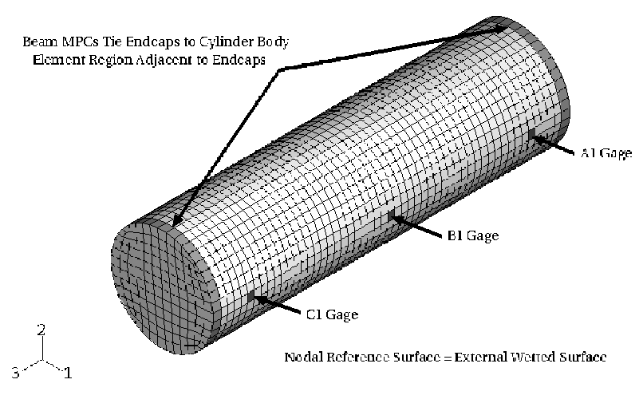

**Figure 9.1.4–4** Test cylinder and external fluid acoustic mesh.

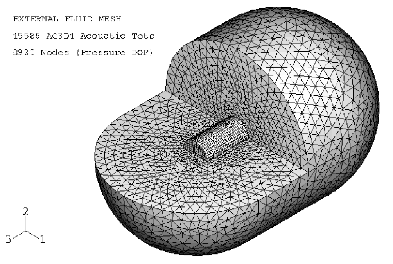

**Figure 9.1.4–5** External fluid surface mesh at the acoustic-structure wetted interface.

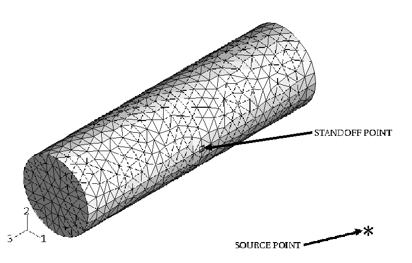

**Figure 9.1.4–6** Axially directed displacements (U3) at the center of the endcaps.

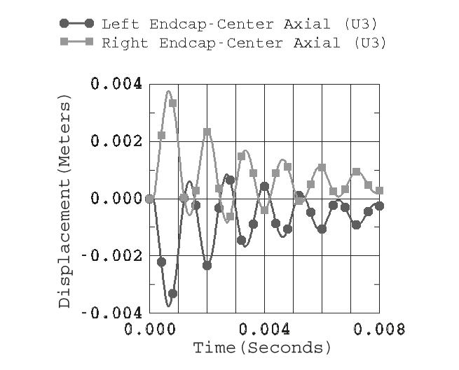

**Figure 9.1.4–7**  Displacements at the center of the endcaps.

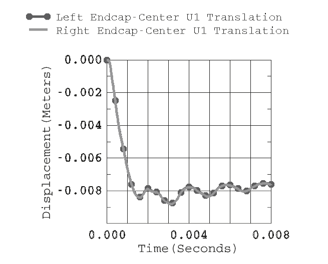

**Figure 9.1.4–8** Vertical (U2) displacements at the cylinder midplane (top and bottom).

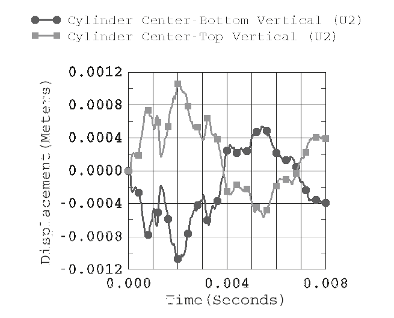

**Figure 9.1.4–9** Axially directed strains at location B1.

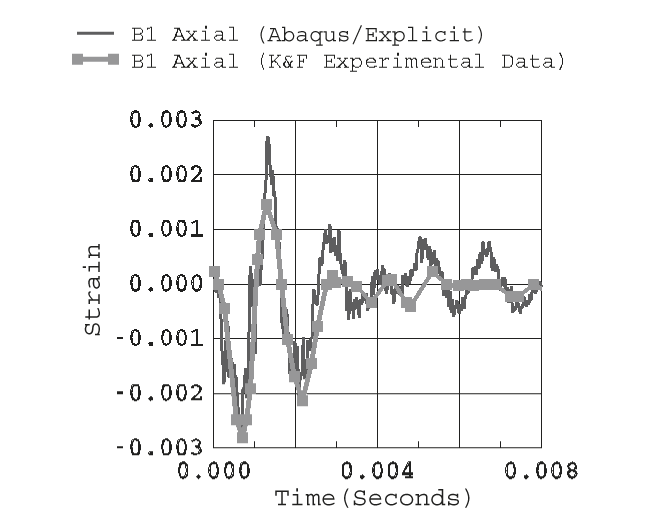

**Figure 9.1.4–10** Axially directed strains at location C1.

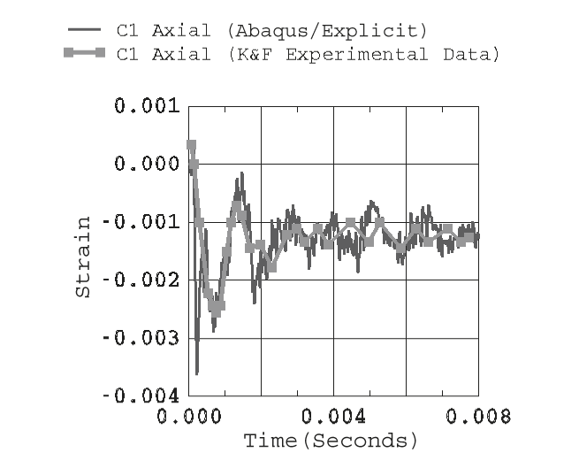

**Figure 9.1.4–11** Hoop-directed strains at location A2.

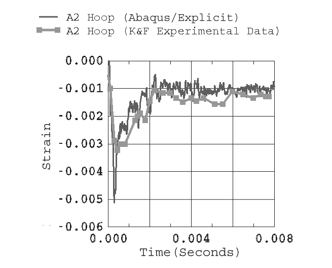

**Figure 9.1.4–12** Accumulated equivalent plastic strains (PEEQ).

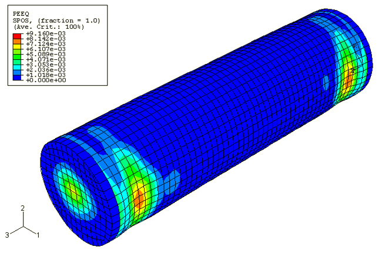

