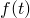
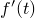
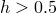
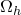
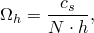
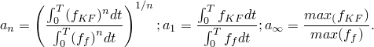
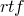
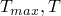
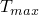
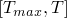

# 9.1.5 Convergence studies for shock analyses using shell elements

**Product: **Abaqus/Explicit  

Structures subject to shock loads require careful design because of the high-frequency content of the loading signal and the low-pass filtering property of a finite element mesh. To address these issues, a simplified model is useful to estimate optimal parameters for an accurate, efficient, and realistic model. 

The goal of the present study is to propose a methodology for designing a computationally efficient structural model, by answering the following questions:
- Given a load signal , what is the maximum element size for a given structure to obtain a reasonably accurate response?
- Given a minimum possible element size, what is the best signal  to emulate the structural response to  with reasonable accuracy?

### Model description

For the purpose of this study, consider a cylinder made of a linear elastic material with *E*=2.11  1011 N/m2 and =0.3. It has an overall length of 10 m, a diameter of 3.5 m, and a wall thickness of 0.04 m. Quarter symmetry is employed by applying the appropriate boundary conditions on the corresponding geometry edges. The model is shown in [Figure 9.1.5--1](ch09s01aex133.md#figure1). Incident wave loading is applied on the outer surface of the cylinder, using the Kwon & Fox (KF) signal described in ["Response of a submerged cylinder to an underwater explosion shock wave," Section 9.1.4](ch09s01aex132.md). Abaqus/Explicit is used with a fixed time increment of 1  106 s, chosen to provide a suitable integration scheme for the load. The transient response (U, V, A) is analyzed at a standoff point over a period of 6 ms. Uniform meshes of S4R elements with various sizes are employed.

### Results and discussion

First, convergence of the structural response at the standoff point is examined, applying the original KF loading signal. Errors are reported in a -norm over the entire 6 ms duration of the response. The converged solution is formed by successively applying finer meshes until a desired relative accuracy is obtained. From [Figure 9.1.5--2](ch09s01aex133.md#figure2) and [Table 9.1.5--1](ch09s01aex133.md#table1) we conclude that a mesh with *h*=0.025 m is a reference solution. The solution with *h*=0.05 m can also be considered converged; therefore, it can become the reference solution for subsequent studies (the acceleration response differs by only 1.1% with respect to the solution with *h*=0.025 m).

[Figure 9.1.5--3](ch09s01aex133.md#figure3) and [Figure 9.1.5--4](ch09s01aex133.md#figure4) depict the relative accuracy of the displacement and velocity responses with respect to the solution with *h*=0.05 m. For example, [Figure 9.1.5--3](ch09s01aex133.md#figure3) shows that if an accurate velocity response is of interest, element size restrictions can be relaxed to *h*=0.25 m (6.3% relative error versus the reference configuration); if the displacement response is of interest, the element size restrictions can be relaxed further to  m ([Figure 9.1.5--4](ch09s01aex133.md#figure4)).

[Figure 9.1.5--5](ch09s01aex133.md#figure5) is constructed by defining a mesh characteristic frequency, , used as *x*-data for the error curve. For a given number of elements, *N*, per excitation wavelength, the mesh characteristic frequency is

where  is the characteristic wave speed (here the shell flexural wave speed) and *h* is the element diameter. The structural wave speed is dispersive; i.e., it varies with the excitation frequency. In [Figure 9.1.5--5](ch09s01aex133.md#figure5), however, a constant reference value of =1200 m/s is used. The previously defined mesh characteristic frequency also depends on the user's choice of the number of elements per wavelength, *N*. To preserve accuracy and to address the pollution effect (Ihlenburg and Babuska, 1995), *N* should increase with the excitation frequency. The choice of *h*, *N*, and the wavespeed in the medium, , determines the value of the mesh characteristic frequency, , which can be interpreted as a cutoff frequency for designing the filtered signal. 

[Figure 9.1.5--5](ch09s01aex133.md#figure5) shows that by considering a mesh with *h*=0.05 m and *N*=15, the mesh characteristic frequency becomes =1600 Hz. If the number of elements per wavelength is relaxed to *N*=5,  will increase to 4800 Hz.  If the latter value is applied as the cutoff frequency, the filtered signal will capture the true signal more accurately; however, it is likely to produce more noise if the waves are not resolved properly.

The study presented above may lead to meshes that are impractical for realistic models, especially if the acceleration response is of primary interest. For this model of 10 m length, an element of 0.05 m provides sufficient accuracy at the standoff point. Since this may lead to prohibitive computational costs for realistic models, the next studies address ways to relax the element size restraints by modifying the shock signal applied to the structure. These following studies examine the impact of filtering and modified rise time upon the element size restrictions, in an attempt to minimize the noise at coarse meshes.

Filtered signals are applied successively to the structure, in an attempt to quantify the dependence of the optimal cutoff frequency on the element size. The sine-Butterworth second-order filter is used. Although filter performance is very important for optimal results, a comparison of various filtering techniques is beyond the purpose of this study. 

The filtered signals are postprocessed via linear scaling with the parameter *a* such that the final and original signals are equivalent in a *n*-norm:

The norm can be varied to design a final signal suitable for various responses: since initially the KF is applied as a load signal, the infinity norm is suitable for obtaining a more accurate acceleration response, while the 1-norm (impulse conservation) is suitable for obtaining a more accurate velocity response.

For this study, filtered signals are designed with scaling parameters suitable for acceleration response. Sample postprocessed filtered signals are presented in [Figure 9.1.5--6](ch09s01aex133.md#figure6). By applying these as incident wave loads on the mesh with *h*=0.05 m,  the results shown in [Figure 9.1.5--7](ch09s01aex133.md#figure7), [Figure 9.1.5--8](ch09s01aex133.md#figure8), and [Figure 9.1.5--9](ch09s01aex133.md#figure9) are obtained for the acceleration, velocity, and displacement, respectively. There is a clear distinction between [Figure 9.1.5--7](ch09s01aex133.md#figure7), a well-captured acceleration response, and [Figure 9.1.5--8](ch09s01aex133.md#figure8) and [Figure 9.1.5--9](ch09s01aex133.md#figure9), which are poor estimates of the velocity and displacement responses, since the applied filtered load has a significantly higher impulse than the unfiltered signal.

The results presented in [Figure 9.1.5--10](ch09s01aex133.md#figure10) and [Figure 9.1.5--11](ch09s01aex133.md#figure11) are obtained by applying the same load signals to coarser meshes. A summary is presented in [Table 9.1.5--1](ch09s01aex133.md#table1) and [Figure 9.1.5--14](ch09s01aex133.md#figure14). The expected trend is visible: as the mesh coarsens, the acceleration response when applying filtered signals is considerably less noisy than the response for unfiltered signals. As the mesh is refined, the response converges to the “wrong” solution given by the filter of choice. Thus, when computational resources are scarce, there is an obvious benefit to applying prefiltered signals, which attenuate the noise due to insufficient spatial discretization.

As an alternative to the sine-Butterworth filter, the signal can be idealized in a heuristic manner by using a linear rise, followed by an exponential decay. By keeping the decay constant, you can study the sensitivity of the structural element size to the rise time of the shock signal.

The original rise time, , of the KF signal is multiplied by a rise time factor (= 2, 5, 10, 15, 20) to obtain new signals, which are then applied to the structure. To account for noise contributions only, the error of the acceleration response is reported on the decay portion [], where  is the time stamp of the peak amplitude of the load signal.

The results using this technique are presented in [Figure 9.1.5--12](ch09s01aex133.md#figure12) and [Figure 9.1.5--13](ch09s01aex133.md#figure13) and summarized in [Table 9.1.5--2](ch09s01aex133.md#table2) and [Figure 9.1.5--15](ch09s01aex133.md#figure15). By comparison with [Figure 9.1.5--14](ch09s01aex133.md#figure14), the smoothing strategy appears considerably more effective for the acceleration response than using a sine-Butterworth filter. For example, the case with *h*=0.125 m and =20 (scaling the upper bound of the spectrum at ~2250 Hz) yields an error of 9%; for the same element size with *h*=0.125 m, the sine-Butterworth filter with a cutoff frequency of 3000 Hz yields a 32% error.

### Input files

[step_data.inp](../eif/step_data.inp)

Step data for all models.

[cyl_h0025.inp](../eif/cyl_h0025.inp)

Model data for submerged cylinder with an element size of 0.025 m.

[cyl_h005.inp](../eif/cyl_h005.inp)

Model data for submerged cylinder with an element size of 0.05 m.

[cyl_h0125.inp](../eif/cyl_h0125.inp)

Model data for submerged cylinder with an element size of 0.125 m.

[cyl_h025.inp](../eif/cyl_h025.inp)

Model data for submerged cylinder with an element size of 0.25 m.

[cyl_h05.inp](../eif/cyl_h05.inp)

Model data for submerged cylinder with an element size of 0.5 m.

[sf_unfilt.inp](../eif/sf_unfilt.inp)

Amplitude data for unfiltered KF signal.

[sf_300.inp](../eif/sf_300.inp)

Amplitude data for KF signal filtered at 300 Hz.

[sf_600.inp](../eif/sf_600.inp)

Amplitude data for KF signal filtered at 600 Hz.

[sf_900.inp](../eif/sf_900.inp)

Amplitude data for KF signal filtered at 900 Hz.

[sf_1200.inp](../eif/sf_1200.inp)

Amplitude data for KF signal filtered at 1200 Hz.

[sf_1500.inp](../eif/sf_1500.inp)

Amplitude data for KF signal filtered at 1500 Hz.

[sf_2000.inp](../eif/sf_2000.inp)

Amplitude data for KF signal filtered at 2000 Hz.

[sf_3000.inp](../eif/sf_3000.inp)

Amplitude data for KF signal filtered at 3000 Hz.

[sf_5000.inp](../eif/sf_5000.inp)

Amplitude data for KF signal filtered at 5000 Hz.

[sr_2.inp](../eif/sr_2.inp)

Amplitude data for KF signal with a rise time factor of 2.

[sr_5.inp](../eif/sr_5.inp)

Amplitude data for KF signal with a rise time factor of 5.

[sr_10.inp](../eif/sr_10.inp)

Amplitude data for KF signal with a rise time factor of 10.

[sr_15.inp](../eif/sr_15.inp)

Amplitude data for KF signal with a rise time factor of 15.

[sr_20.inp](../eif/sr_20.inp)

Amplitude data for KF signal with a rise time factor of 20.

[driver_h0025.inp](../eif/driver_h0025.inp)

Driver file for the mesh with *h*=0.025 m and all signals.

[driver_h005.inp](../eif/driver_h005.inp)

Driver file for the mesh with *h*=0.05 m and all signals.

[driver_h0125.inp](../eif/driver_h0125.inp)

Driver file for the mesh with *h*=0.125 m and all signals.

[driver_h025.inp](../eif/driver_h025.inp)

Driver file for the mesh with *h*=0.25 m and all signals.

[driver_h05.inp](../eif/driver_h05.inp)

Driver file for the mesh with *h*=0.5 m and all signals.

### References

Ihlenburg,  F., and I. Babuska, “Finite Element Solution of the Helmholtz Equation with High Wave Numbers. Part 1: The h-version of the FEM,” Computers & Mathematics with Applications, no.30(9), pp. 9–37, 1995.

Kwon,  K. W., and P. K. Fox, “Underwater Shock Response of a Cylinder Subjected to a Side-On Explosion,” Computers and Structures, vol. 48, no.4, 1993.

### Tables

**Table 9.1.5–1** Percent relative error in acceleration response for pre-filtered signals using sine-Butterworth filter. Reference solution is the unfiltered load signal applied to a mesh with *h*=0.025 m.
| Cutoff (Hz) | *h*=0.05 m | *h*=0.125 m | *h*=0.25 m | *h*=0.5 m |
| --- | --- | --- | --- | --- |
| 300 | 142 | 105 | 105 | 104 |
| 600 | 116 | 102 | 102 | 102 |
| 900 | 91 | 90 | 95 | 90 |
| 1200 | 72 | 75 | 88 | 90 |
| 1500 | 64 | 64 | 85 | 101 |
| 2000 | 49 | 49 | 47 | 110 |
| 3000 | 33 | 32 | 43 | 129 |
| 5000 | 16 | 16 | 32 | 116 |
| Unfiltered | 1.2 | 18 | 91 | 103 |

**Table 9.1.5–2** Percent relative error in acceleration response for smoothed rise time signals. Reference solution is the unfiltered load signal applied to a mesh with *h*=0.025 m. Errors are measured in -norm over , where  is the time stamp of the peak amplitude.
| Rise time factor | *h*=0.05 m | *h*=0.125 m | *h*=0.25 m | *h*=0.5 m |
| --- | --- | --- | --- | --- |
| 2 | 0.7 | 12 | 67 | 93 |
| 5 | 2.1 | 4.0 | 55 | 93 |
| 10 | 4.2 | 4.4 | 20 | 85 |
| 15 | 7 | 7 | 14 | 70 |
| 20 | 9 | 9 | 20 | 44 |

### Figures

**Figure 9.1.5–1** Test problem geometry.

**Figure 9.1.5–2** Convergence of athwartship acceleration at standoff point. Element size *h* [m].

**Figure 9.1.5–3** Convergence of athwartship velocity at standoff point. Element size *h* [m].

**Figure 9.1.5–4** Convergence of athwartship displacement at standoff point. Element size *h* [m].

**Figure 9.1.5–5** Shock cutoff frequency based on structure response. Wave speed *c* [m/s].

**Figure 9.1.5–6** Sample signals obtained after applying sine-Butterworth filter to the original KF signal.

**Figure 9.1.5–7** Acceleration response at standoff point for filtered load signals and mesh with *h*=0.05 m.

**Figure 9.1.5–8** Velocity response at standoff point for filtered load signals and mesh with *h*=0.05 m.

**Figure 9.1.5–9** Displacement response at standoff point for filtered load signals and mesh with *h*=0.05 m.

**Figure 9.1.5–10** Acceleration response at standoff point for filtered load signals and mesh with *h*=0.125 m.

**Figure 9.1.5–11** Acceleration response at standoff point for filtered load signals and mesh with *h*=0.25 m.

**Figure 9.1.5–12** Acceleration response at standoff point for smoothed load signals and mesh with *h*=0.125 m.

**Figure 9.1.5–13** Acceleration response at standoff point for smoothed load signals and mesh with *h*=0.25 m.

**Figure 9.1.5–14** Error in acceleration response for sine-Butterworth filter with various cutoff frequencies. Element size *h* [m].

**Figure 9.1.5–15** Error in acceleration response for various rise time factors. Element size *h* [m].

