# 9.1.5 使用壳单元进行冲击分析的收敛研究

**产品：** Abaqus/Explicit

承受冲击载荷的结构需要仔细设计，因为加载信号的高频内容和有限元网格的低通滤波特性。为了解决这些问题，一个简化的模型有助于估计准确、高效和现实模型的最佳参数。

本研究的目的是提出一种设计计算高效结构模型的方法，通过回答以下问题：
- 给定负载信号，对于对于给定结构获得相当准确响应的最大单元尺寸是多少？
- 给定最小可能的单元尺寸，为了以合理精度模拟结构对的响应，最好的信号是什么？

### 模型描述

出于本研究的目的，考虑由线性弹性材料制成的圆柱体，*E*=2.11×10¹¹ N/m²和泊松比=0.3。它具有10米的整体长度，3.5米的直径，和0.04米的壁厚。通过在相应几何边缘施加适当的边界条件来采用四分之一对称性。模型如图所示。入射波载荷施加在圆柱体外表面，使用Kwon & Fox（KF）信号。Abaqus/Explicit使用1×10⁻⁶秒的固定时间增量选择，以提供适合载荷积分的方案。在6毫秒期间内分析standoff点的瞬态响应（U、V、A）。使用具有各种尺寸的S4R单元的均匀网格。

### 结果与讨论

首先，检查standoff点处结构响应的收敛性，施加原始KF加载信号。在整个6毫秒响应持续时间内以范数报告误差。通过依次应用更细的网格直到获得所需的相对精度来形成收敛解。我们得出结论，*h*=0.025米的网格是参考解。*h*=0.05米的解也可以认为是收敛的；因此，它可以成为后续研究的参考解（加速度响应仅与*h*=0.025米的解相差1.1%）。

描述了相对于*h*=0.05米解的位移和速度响应的相对精度。例如，如果对准确的速度响应感兴趣，单元尺寸限制可以放宽到*h*=0.25米（相对于参考配置6.3%的相对误差）；如果对位移响应感兴趣，单元尺寸限制可以进一步放宽到米。

通过定义网格特征频率来构建，用作误差曲线的*x*数据。对于给定数量的每激励波长的单元*N*，网格特征频率为

其中是特征波速（这里是壳弯曲波速），*h*是单元直径。结构波速是频散的；即，它随激励频率而变化。然而，使用了恒定的参考值。网格特征频率也取决于用户选择的每波长单元数*N*的选择。为了保持准确性并解决污染效应，*N*应随激励频率增加。*h*、*N*和介质中的波速的选择决定了网格特征频率的值，可以解释为设计滤波信号截止频率。

表明，通过考虑的网格，网格特征频率变为。如果每波长的单元数放宽到，将增加到。如果将后者用作截止频率，滤波信号将更准确地捕获真实信号；但是，如果波没有被正确解析，可能会产生更多噪声。

上面提出的研究可能导致对于现实模型来说不实际的网格，特别是当加速度响应是主要兴趣时。对于这个10米长度的模型，0.05米的单元在standoff点提供足够的精度。由于这可能导致现实模型的禁止性计算成本，因此以下研究涉及通过修改施加到结构的冲击信号来放宽单元尺寸限制的方法。以下研究检查了滤波和改进上升时间对单元尺寸限制的影响，以尽量减少粗网格上的噪声。

将滤波信号依次施加到结构上，以量化最佳截止频率对单元尺寸的依赖性。使用正弦-巴特沃斯二阶滤波器。虽然滤波器性能对最佳结果非常重要，但各种滤波技术的比较超出了本研究的范围。

通过参数的线性缩放对滤波信号进行后处理，使得最终信号和原始信号在范数中等效：

范数可以改变以设计适合各种响应的最终信号：由于最初将KF作为负载信号施加，无穷范数适用于获得更准确的加速度响应，而1范数（脉冲守恒）适用于获得更准确的速度响应。

对于本研究，滤波信号设计有适合加速度响应的缩放参数。样本后处理滤波信号显示。通过将这些作为具有*h*=0.05米的网格上的入射波载荷施加，获得分别用于加速度、速度和位移的结果。与之间有明显的区别，前者是良好捕获的加速度响应，后者是速度和位移响应的较差估计，因为施加的滤波负载的脉冲明显高于未滤波信号。

显示通过将相同的负载信号施加到更粗网格而获得的结果。总结显示在和。预期的趋势是可见的：随着网格变粗，施加滤波信号时的加速度响应比施加未滤波信号时的噪声要小得多。随着网格细化，响应收敛到滤波选择的"错误"解。因此，当计算资源稀缺时，应用预滤波信号有明显的好处，这会衰减由于空间离散化不足而产生的噪声。

作为正弦-巴特沃斯滤波器的替代方案，可以通过使用线性上升后跟指数衰减来启发式地理想化信号。通过保持衰减常数，您可以研究结构单元尺寸对冲击信号上升时间的敏感性。

KF信号的原始上升时间，乘以上升时间因子（= 2, 5, 10, 15, 20）以获得新信号，然后施加到结构。为了仅说明噪声贡献，加速度响应的误差报告在衰减部分，其中是负载信号峰值幅度的时间戳。

使用此技术的结果显示在和中，并总结在和。通过与的对比，平滑策略对于加速度响应似乎比使用正弦-巴特沃斯滤波器更有效。例如，*h*=0.125米且=20的情况产生9%的误差；对于具有相同单元尺寸*h*=0.125米的正弦-巴特沃斯滤波器，截止频率为3000 Hz，产生32%的误差。

### 输入文件

[step_data.inp](../eif/step_data.inp)

所有模型的步数据。

[cyl_h0025.inp](../eif/cyl_h0025.inp)

单元尺寸为0.025米的浸没圆柱体的模型数据。

[cyl_h005.inp](../eif/cyl_h005.inp)

单元尺寸为0.05米的浸没圆柱体的模型数据。

[cyl_h0125.inp](../eif/cyl_h0125.inp)

单元尺寸为0.125米的浸没圆柱体的模型数据。

[cyl_h025.inp](../eif/cyl_h025.inp)

单元尺寸为0.25米的浸没圆柱体的模型数据。

[cyl_h05.inp](../eif/cyl_h05.inp)

单元尺寸为0.5米的浸没圆柱体的模型数据。

[sf_unfilt.inp](../eif/sf_unfilt.inp)

未滤波KF信号的振幅数据。

[sf_300.inp](../eif/sf_300.inp)

在300 Hz滤波的KF信号的振幅数据。

[sf_600.inp](../eif/sf_600.inp)

在600 Hz滤波的KF信号的振幅数据。

[sf_900.inp](../eif/sf_900.inp)

在900 Hz滤波的KF信号的振幅数据。

[sf_1200.inp](../eif/sf_1200.inp)

在1200 Hz滤波的KF信号的振幅数据。

[sf_1500.inp](../eif/sf_1500.inp)

在1500 Hz滤波的KF信号的振幅数据。

[sf_2000.inp](../eif/sf_2000.inp)

在2000 Hz滤波的KF信号的振幅数据。

[sf_3000.inp](../eif/sf_3000.inp)

在3000 Hz滤波的KF信号的振幅数据。

[sf_5000.inp](../eif/sf_5000.inp)

在5000 Hz滤波的KF信号的振幅数据。

[sr_2.inp](../eif/sr_2.inp)

上升时间因子为2的KF信号的振幅数据。

[sr_5.inp](../eif/sr_5.inp)

上升时间因子为5的KF信号的振幅数据。

[sr_10.inp](../eif/sr_10.inp)

上升时间因子为10的KF信号的振幅数据。

[sr_15.inp](../eif/sr_15.inp)

上升时间因子为15的KF信号的振幅数据。

[sr_20.inp](../eif/sr_20.inp)

上升时间因子为20的KF信号的振幅数据。

[driver_h0025.inp](../eif/driver_h0025.inp)

*h*=0.025米网格和所有信号的驱动文件。

[driver_h005.inp](../eif/driver_h005.inp)

*h*=0.05米网格和所有信号的驱动文件。

[driver_h0125.inp](../eif/driver_h0125.inp)

*h*=0.125米网格和所有信号的驱动文件。

[driver_h025.inp](../eif/driver_h025.inp)

*h*=0.25米网格和所有信号的驱动文件。

[driver_h05.inp](../eif/driver_h05.inp)

*h*=0.5米网格和所有信号的驱动文件。

### 参考

Ihlenburg, F., and I. Babuska, "Finite Element Solution of the Helmholtz Equation with High Wave Numbers. Part 1: The h-version of the FEM," Computers & Mathematics with Applications, no.30(9), pp. 9–37, 1995.

Kwon, K. W., and P. K. Fox, "Underwater Shock Response of a Cylinder Subjected to a Side-On Explosion," Computers and Structures, vol. 48, no.4, 1993.

### 表格

**表9.1.5-1** 使用正弦-巴特沃斯滤波器的预滤波信号加速度响应的百分比相对误差。参考解是施加到*h*=0.025米网格的未滤波负载信号。
| 截止频率（Hz） | *h*=0.05 m | *h*=0.125 m | *h*=0.25 m | *h*=0.5 m |
| --- | --- | --- | --- | --- |
| 300 | 142 | 105 | 105 | 104 |
| 600 | 116 | 102 | 102 | 102 |
| 900 | 91 | 90 | 95 | 90 |
| 1200 | 72 | 75 | 88 | 90 |
| 1500 | 64 | 64 | 85 | 101 |
| 2000 | 49 | 49 | 47 | 110 |
| 3000 | 33 | 32 | 43 | 129 |
| 5000 | 16 | 16 | 32 | 116 |
| 未滤波 | 1.2 | 18 | 91 | 103 |

**表9.1.5-2** 平滑上升时间信号加速度响应的百分比相对误差。参考解是施加到*h*=0.025米网格的未滤波负载信号。误差在范数下测量在范围内，其中是峰值幅度的时间戳。
| 上升时间因子 | *h*=0.05 m | *h*=0.125 m | *h*=0.25 m | *h*=0.5 m |
| --- | --- | --- | --- | --- |
| 2 | 0.7 | 12 | 67 | 93 |
| 5 | 2.1 | 4.0 | 55 | 93 |
| 10 | 4.2 | 4.4 | 20 | 85 |
| 15 | 7 | 7 | 14 | 70 |
| 20 | 9 | 9 | 20 | 44 |

### 图表

**图9.1.5-1** 测试问题几何。

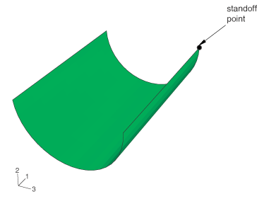

**图9.1.5-2** standoff点横船加速度的收敛。单元尺寸*h* [m]。

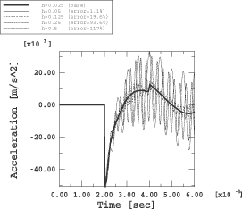

**图9.1.5-3** standoff点横船速度的收敛。单元尺寸*h* [m]。

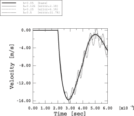

**图9.1.5-4** standoff点横船位移的收敛。单元尺寸*h* [m]。

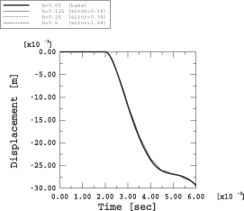

**图9.1.5-5** 基于结构响应的冲击截止频率。波速*c* [m/s]。

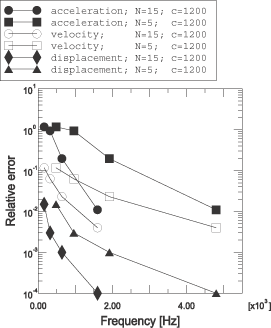

**图9.1.5-6** 对原始KF信号应用正弦-巴特沃斯滤波器后获得的样本信号。

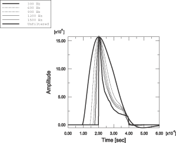

**图9.1.5-7** 对于滤波负载信号和*h*=0.05米网格，standoff点的加速度响应。

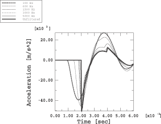

**图9.1.5-8** 对于滤波负载信号和*h*=0.05米网格，standoff点的速度响应。

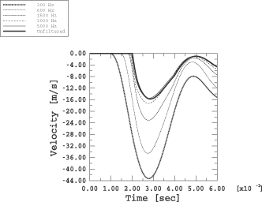

**图9.1.5-9** 对于滤波负载信号和*h*=0.05米网格，standoff点的位移响应。

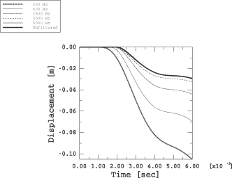

**图9.1.5-10** 对于滤波负载信号和*h*=0.125米网格，standoff点的加速度响应。

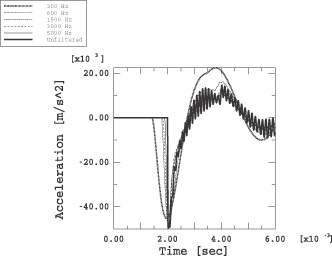

**图9.1.5-11** 对于滤波负载信号和*h*=0.25米网格，standoff点的加速度响应。

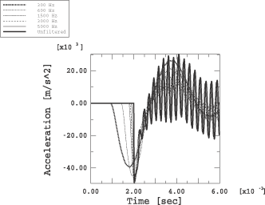

**图9.1.5-12** 对于平滑负载信号和*h*=0.125米网格，standoff点的加速度响应。

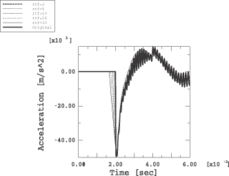

**图9.1.5-13** 对于平滑负载信号和*h*=0.25米网格，standoff点的加速度响应。

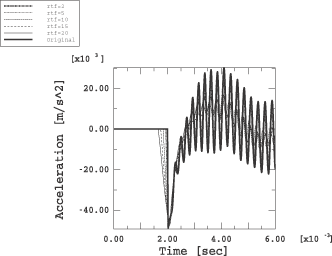

**图9.1.5-14** 各种截止频率正弦-巴特沃斯滤波器的加速度响应误差。单元尺寸*h* [m]。

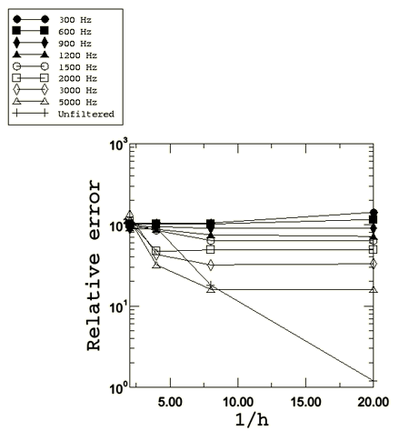

**图9.1.5-15** 各种上升时间因子的加速度响应误差。单元尺寸*h* [m]。

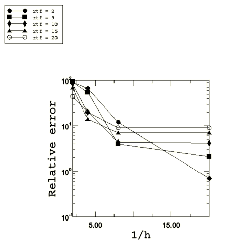

