# 9.1.6 精细潜艇模型的UNDEX分析

**产品：** Abaqus/Explicit

对承受冲击载荷的大型水下结构进行建模通常会产生计算密集型的数值模型，需要大量计算资源。本示例说明了如何使用Abaqus/Explicit来预测承受水下爆炸（UNDEX）冲击波载荷的大型复杂结构的瞬态响应。通过建模方法对公开可用的完整潜艇模型进行修改，以最小化计算成本并获得特定感兴趣区域的准确响应。因此，在相应感兴趣区域给予结构细节特别关注，而在其他地方采用简化以降低分析成本。

结构承受具有冲击剖面振幅的入射波载荷。如果分析结构完整性，一个合理的假设是受影响最严重的区域将在standoff点周围；因此，应更多地关注潜艇的前部（[图9.1.6-1](ch09s01aex134.md#whole-model)和[图9.1.6-5](ch09s01aex134.md#reduced-model)）。

### 问题和几何形状描述

本示例中的模型是根据德国基尔联邦国防军水声与地球物理研究所（FWG）提供的规格创建的（Fiedler和Schneider，2002）。该模型被称为基准目标强度模拟（BeTSSi）模型，是苏联Kilo级潜艇的相当精密的复制品。结构的复杂性被认为适合用于测试更现实问题的目标强度模拟代码（Schneider等，2003）。在本示例问题中，BeTSSi模型被改编用于测试Abaqus/Explicit进行现实UNDEX模拟。

结构细节包括进水艏部舱室、声纳阵列、鱼雷管、进水围壳舱、围壳通道和后舱（[图9.1.6-1](ch09s01aex134.md#whole-model)到[图9.1.6-4](ch09s01aex134.md#bowcompar-details)）。压力壳仅沿上侧被外壳包围，下侧直接与流体接触。舱内空间也沿潜艇长度方向进水。

整个结构受到球形冲击波的冲击，这是由距潜艇16.5 m处的炸药爆炸引起的（[图9.1.6-1](ch09s01aex134.md#whole-model)）。压力-时间信号对应于60 lb HBX-1炸药，与["浸没圆柱体对水下爆炸冲击波的响应，"第9.1.4节](ch09s01aex132.md)相同，取自Kwon & Fox（1993）。

### 简化模型

由于Kwon & Fox（KF）载荷信号携带大的激励谱，外部水必须延伸到对应于谱低端的大距离，并且潜艇结构和外部水都必须用对应于谱高端波长的细小单元大小进行离散化。这产生了相当大的计算模型，这也由于潜艇模型长度（62 m）与谱高端低波长之间的显著差异。因此，在本示例问题中采用了一种建模方法，其中在冲击波standoff点周围定义了一个"感兴趣区域"。简化模型仍然包括诸如进水艏部舱室、鱼雷管、声纳罩以及压力壳和外壳的一部分等细节，流体域定义在舱内空间中。此外，为压力壳的详细区域添加了加强筋。潜艇模型的其余部分使用梁单元简化，通过运动学耦合约束与感兴趣区域耦合。梁的截面行为使用网格化截面定义，以近似真实结构的截面惯性（[图9.1.6-6](ch09s01aex134.md#beam-front)、[图9.1.6-7](ch09s01aex134.md#beam-sail)和[图9.1.6-8](ch09s01aex134.md#beam-back)）。潜艇后部的锥形区域通过13个逐步恒定的圆形截面近似。最后，包含了外部水的惯性效应。

外部声学域（水）仅包围感兴趣区域，延伸到距潜艇结构约1.5 m的距离，对应于500 Hz频率下水中半波长。在截断表面施加阻抗边界条件以减少虚假反射。

### 结果与讨论

应用上述简化和单元大小（结构为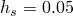，内外水域均为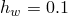），聚合模型大小为120万个节点和510万个单元，包括AC3D4、S4R、S3R和B31单元。分析在6 ms后停止，这足以让通过声学介质传播的波前扫过感兴趣区域。

[图9.1.6-9](ch09s01aex134.md#por-contours)描绘了在6 ms响应结束时的内外声学域压力。观察隔板内声压的高频含量，这是由于墙壁的激发。隔板壁中波浪的高频含量可以从[图9.1.6-13](ch09s01aex134.md#deformed-cfg-cut)和[图9.1.6-14](ch09s01aex134.md#deformed-cfg-whole)中看到。

[图9.1.6-10](ch09s01aex134.md#acceleration)、[图9.1.6-11](ch09s01aex134.md#velocity)和[图9.1.6-12](ch09s01aex134.md#displacement)分别说明了standoff点加速度、速度和位移响应的时间历史。由于初始冲击达到了近8 km/s²的初始加速度，随后快速衰减。到冲击持续时间结束（4 ms）时，几乎稳定在零附近。初始速度达到近8 m/s，而横向位移显示最大漂移约10 mm。

结构完整性是此类分析的主要关注点之一。几乎整个结构被认为由具有位置相关厚度的完美弹塑性钢板制成。唯一的例外是加强筋，定义为具有T截面的梁。材料与潜艇模型其余部分相同，为完美弹塑性钢。通过绘制Mises应力（[图9.1.6-15](ch09s01aex134.md#mises)）分析高应力集中区域；通过等效塑性应变（[图9.1.6-16](ch09s01aex134.md#peeq)）监测永久变形。在连接处周围的区域观察到高应力集中区域以及永久变形。最大应力出现在声纳罩的上面板，而最大的永久变形发生在压力壳、外壳和水平艏部舱室之间的连接处。

### 输入文件

[undex_driver_xpl.inp](../eif/undex_driver_xpl.inp)

驱动程序输入文件。

[undex_parts.inp](../eif/undex_parts.inp)

部件定义输入文件。

[undex_assembly.inp](../eif/undex_assembly.inp)

装配输入文件。

[undex_outwater_h01.inp](../eif/undex_outwater_h01.inp)

外部水网格数据。

[undex_innerwater_h01.inp](../eif/undex_innerwater_h01.inp)

内部水网格数据。

[undex_subbody_h005.inp](../eif/undex_subbody_h005.inp)

潜艇结构网格数据。

[undex_tapered_beam_elsets.inp](../eif/undex_tapered_beam_elsets.inp)

潜艇体锥形区域的单元集定义。

[undex_tapered_beam_sections.inp](../eif/undex_tapered_beam_sections.inp)

潜艇体锥形区域定义的单元集的截面数据。

[undex_ampl.inp](../eif/undex_ampl.inp)

振幅数据。

[undex_acoustics_s.inp](../eif/undex_acoustics_s.inp)

阻抗和入射波模型数据。

[undex_materials_s.inp](../eif/undex_materials_s.inp)

材料数据。

[undex_ties.inp](../eif/undex_ties.inp)

绑定定义。

[undex_step.inp](../eif/undex_step.inp)

步骤数据。

[undex_boundary_conditions.inp](../eif/undex_boundary_conditions.inp)

边界条件数据。

[undex_output_requests.inp](../eif/undex_output_requests.inp)

输出请求数据。

[undex_beam_section_front.inp](../eif/undex_beam_section_front.inp)

用于生成潜艇前部截面梁属性的截面网格数据。

[undex_beam_section_sail.inp](../eif/undex_beam_section_sail.inp)

用于生成潜艇围壳区域截面梁属性的截面网格数据。

[undex_beam_section_back1.inp](../eif/undex_beam_section_back1.inp)

用于生成第1后部区域截面梁属性的截面网格数据。

[undex_beam_section_back2.inp](../eif/undex_beam_section_back2.inp)

用于生成第2后部区域截面梁属性的截面网格数据。

[undex_beam_section_back3.inp](../eif/undex_beam_section_back3.inp)

用于生成第3后部区域截面梁属性的截面网格数据。

[undex_beam_section_back4.inp](../eif/undex_beam_section_back4.inp)

用于生成第4后部区域截面梁属性的截面网格数据。

[undex_beam_section_back5.inp](../eif/undex_beam_section_back5.inp)

用于生成第5后部区域截面梁属性的截面网格数据。

[undex_beam_section_back6.inp](../eif/undex_beam_section_back6.inp)

用于生成第6后部区域截面梁属性的截面网格数据。

[undex_beam_section_back7.inp](../eif/undex_beam_section_back7.inp)

用于生成第7后部区域截面梁属性的截面网格数据。

[undex_beam_section_back8.inp](../eif/undex_beam_section_back8.inp)

用于生成第8后部区域截面梁属性的截面网格数据。

[undex_beam_section_back9.inp](../eif/undex_beam_section_back9.inp)

用于生成第9后部区域截面梁属性的截面网格数据。

[undex_beam_section_back10.inp](../eif/undex_beam_section_back10.inp)

用于生成第10后部区域截面梁属性的截面网格数据。

[undex_beam_section_back11.inp](../eif/undex_beam_section_back11.inp)

用于生成第11后部区域截面梁属性的截面网格数据。

[undex_beam_section_back12.inp](../eif/undex_beam_section_back12.inp)

用于生成第12后部区域截面梁属性的截面网格数据。

[undex_beam_section_back13.inp](../eif/undex_beam_section_back13.inp)

用于生成第13后部区域截面梁属性的截面网格数据。

### 参考

Fiedler, Ch.,和H. G. Schneider, "BeTSSi-Sub—Benchmark Target Strength Simulation Submarine," Technical Report, Forschungsanstalt der Bundeswehr für Wasserschall und Geophysik, Kiel, 2002.

Kwon, K. W.,和P. K. Fox, "Underwater Shock Response of a Cylinder Subjected to a Side-On Explosion," Computers and Structures, vol. 48, no.4, 1993.

Schneider, H. G.等, "Acoustic Scattering by a Submarine: Results from a Benchmark Target Strength Simulation Workshop," Proceedings of Tenth International Congress on Sound and Vibration, Stockholm, Sweden, 2003.

### 图表

**图9.1.6-1** BeTSSi完整潜艇模型。

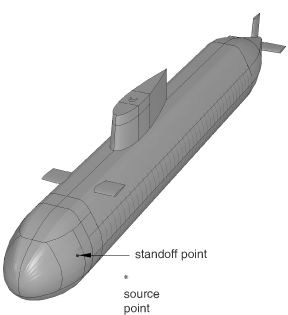

**图9.1.6-2** 通过模型前部的切割视图，包括隔板、鱼雷管和声纳罩等细节。

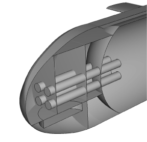

**图9.1.6-3** 通过围壳的切割视图；可见围壳舱和通道管。

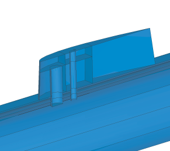

**图9.1.6-4** 进水艏部舱室。

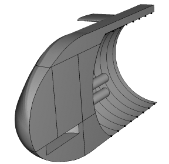

**图9.1.6-5** 简化模型的切割视图，包括外部流体域。

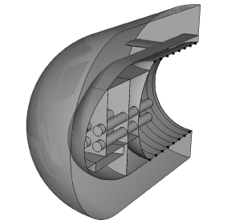

**图9.1.6-6** 前部梁的网格化截面。

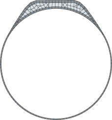

**图9.1.6-7** 围壳梁的网格化截面。

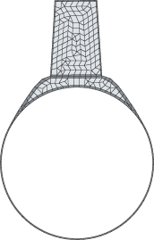

**图9.1.6-8** 后部梁的网格化截面。

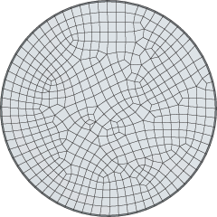

**图9.1.6-9** 内部和外部水的孔隙压力等值线。

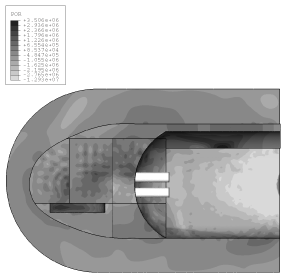

**图9.1.6-10** standoff点的横向加速度。

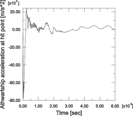

**图9.1.6-11** standoff点的横向速度。

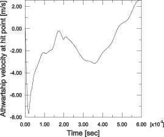

**图9.1.6-12** standoff点的横向位移。

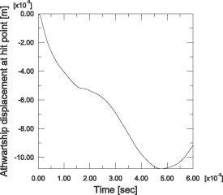

**图9.1.6-13** 变形构型的切割视图。

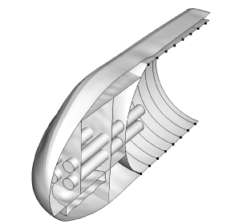

**图9.1.6-14** 压力壳、隔板、鱼雷管和声纳罩的变形构型：整体视图。

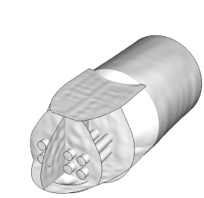

**图9.1.6-15** 艏部舱室、压力壳、鱼雷管和声纳阵列的Mises应力。

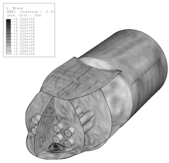

**图9.1.6-16** 艏部舱室、压力壳、鱼雷管和声纳阵列的等效塑性应变。

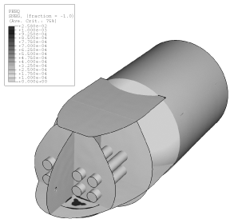

