# 9.1.7 Coupled acoustic-structural analysis of a pick-up truck

**Products: **Abaqus/Standard  Abaqus/CAE  

This example illustrates the capability in Abaqus to perform fully coupled acoustic-structural analyses of a pick-up truck model. This type of analysis has become critically important in the automotive industry and it provides essential benefits toward designing vehicles for ride comfort and quietness. This example uses the pick-up truck model geometry described in ["Inertia relief in a pick-up truck," Section 3.2.1](ch03s02aex99.md). Only a portion of the pick-up truck is modeled, including the chassis, the cabin, and the air inside the cabin. Structural elements are used to model the cabin and the chassis, and acoustic elements are used to model the air interior. Connector elements are used to connect the various structural parts together. The coupling between the structure and acoustic medium is modeled by applying a tie constraint. Frequency domain analyses are performed for both regular models (without substructures) and for models using coupled structural-acoustic substructures.

### Geometry and materials

The pick-up truck model (1994 Chevrolet C1500) discussed here is depicted in [Figure 9.1.7--1](ch09s01aex135.md#sxm-cabin) through [Figure 9.1.7--3](ch09s01aex135.md#sxm-cabin-chassis).

The air is modeled only inside the cabin, and the process of constructing the air mesh in this particular case is worth a brief discussion. Normally, if the solid geometry of the structural part (the cabin) were available, a Boolean subtraction could be performed in Abaqus/CAE to obtain the solid geometry of the included space (in this case the air inside the cabin). Unfortunately, the solid geometry of the cabin is not available since the structural model is based on a public-domain mesh, as discussed in ["Inertia relief in a pick-up truck," Section 3.2.1](ch03s02aex99.md). To overcome this issue, the following strategy is adopted. An approximate air geometry is created in Abaqus/CAE to follow roughly the contour of the cabin interior, including the dashboard, the doors, the cabin floor, the cabin top, the back wall, and the seat. The mesh created from this geometry does not conform exactly to the geometry of the cabin interior. However, on the tie constraint that connects the air mesh to the structural parts, you can adjust the nodes so that the nodes belonging to the air surface will be pushed onto the inside cabin surface or onto the seat surface to conform to the structural mesh (see [Figure 9.1.7--2](ch09s01aex135.md#sxm-air)).

The materials used for the cabin and chassis are described in ["Inertia relief in a pick-up truck," Section 3.2.1](ch03s02aex99.md). The air properties used inside the cabin are: air density of 1.2 kg/m3 and air bulk modulus of 1.39  105 Pa, which produce a sound speed of 340 m/s.

Models both with and without damping are constructed. In the models where damping is considered, two forms of damping are modeled, as follows. Rayleigh stiffness proportional damping, governed by the parameter , is used in the structural materials in the model. For a given value of  applied to all materials in the structure (mostly steel), the damping fraction  for a mode  with natural circular frequency  is given by the formula 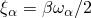. The value of  in the model is chosen to give approximately 1% critical damping for the modes whose natural frequencies are in the middle of the range of excitation (at about 80 Hz). Surface impedance is also specified on the cabin floor to model the acoustic damping effect of a carpet by using an impedance boundary condition. The impedance properties on this surface are chosen such that about 67% of a planar wave incident to this surface in the normal direction would be reflected.

### Models

 Four different models are considered.

#### Model 1

In the first model only the cabin and the interior air are considered. The structural part of the finite element model is shown in [Figure 9.1.7--1](ch09s01aex135.md#sxm-cabin) with the doors removed for illustration purposes. The cabin has six connection points with the chassis: two in the front and four under the seat. The outermost four of these connection points are fixed with boundary conditions, and a natural frequency extraction is performed. Several steady-state dynamic analyses (mode-based, direct-solution, and subspace-based) follow the eigenfrequency extraction step. Separate analyses with and without damping are conducted. There are 43,663 structural elements (mostly shells) and 12,171 acoustic elements in this model for a total of 207,994 degrees of freedom. The average structural element size is about 90 mm, and the average acoustic element size is approximately 325 mm. Considering that at least 5–6 elements are needed per wavelength for accurate representation of the dynamics, the highest excitation frequency for which results can be computed accurately is about 175 Hz. Two excitation cases are considered: harmonic point loading (at the two hook-up points that have not been constrained) and incident wave loading on the bulkhead below the dashboard. The latter case models engine compartment noise propagating through an air path. This airborne load is modeled both as an incident plane wave and as a diffuse field.

#### Model 2

In the second model the cabin-air model is reduced to a fully coupled structural-acoustic substructure. The four connection points where boundary conditions are applied in the first model are retained using the retained degrees of freedom. In addition, 200 coupled structural-acoustic eigenmodes are extracted. The eigenmodes are then retained using eigenmode selection to better represent the dynamics of the substructure in the frequency range of interest. Consequently, the substructure is represented by a total of 224 degrees of freedom to represent the 207,994 degrees of freedom in the first model. The substructure is then used in a separate, one-element natural frequency extraction analysis. The results are recovered from the substructure and compared to the results obtained from the first model.

#### Model 3

In the third model both the cabin and the chassis are considered on the structural side ([Figure 9.1.7--3](ch09s01aex135.md#sxm-cabin-chassis)), while the air is modeled inside the cabin only. Since no air mesh is used to model the ambient air, this type of model can be used to study the structural path contributions to the noise inside the cabin. In the steady-state dynamic analyses of this model the excitation is provided by point loads applied to the engine mounts, while the chassis is supported with fixed boundary conditions at its ends. There are 53,897 structural elements in this model, while the number of acoustic elements is the same as in the first model.

#### Model 4

Finally, the cabin-chassis model is reduced to two substructures: a fully coupled structural acoustic cabin-air substructure and a structural-only chassis substructure. As in the previous substructure model both the retained degrees of freedom and the eigenmode selection are used to generate the two substructures. The two substructures are represented by 236 and 284 degrees of freedom, respectively. The substructures are then used in a separate, two-element natural frequency extraction analysis; and the results are compared to the results from the third model.

### Results and discussion

Some of the steady-state dynamic results for the undamped cabin-air model analyses are shown in [Figure 9.1.7--4](ch09s01aex135.md#sxm-spl-dbl) and [Figure 9.1.7--5](ch09s01aex135.md#sxm-disp-u3). In all analyses 200 sampling points are selected in the frequency range of interest (35–120 Hz). This frequency range corresponds to engine-induced vibrations in the range of 2100–7200 RPM. Of particular interest in these analyses is the sound pressure level at a location in the vicinity of the driver's ear. The response is shown in [Figure 9.1.7--4](ch09s01aex135.md#sxm-spl-dbl) and is calculated from the acoustic pressure using the following equation 

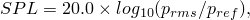

where 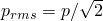 and 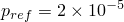 Pa. [Figure 9.1.7--5](ch09s01aex135.md#sxm-disp-u3) shows the displacement response of one of the nodes on the cabin floor where the harmonic load is applied. The results from the subspace-based and the mode-based steady-state dynamic analyses are virtually identical (as expected), and they compare quite well with the results from the direct steady-state dynamics analysis ([Figure 9.1.7--4](ch09s01aex135.md#sxm-spl-dbl) and [Figure 9.1.7--5](ch09s01aex135.md#sxm-disp-u3)). The sound pressure level as computed in these analyses is very high since no damping is considered (neither structural nor impedance-like at the structural-acoustic interface).

[Figure 9.1.7--6](ch09s01aex135.md#sxm-spl-damping) shows the noise level for the cabin-air model when damping is considered. Since the mode-based steady-state dynamics analysis would not take into account the forms of damping considered here, only results from the subspace projection and direct analyses are computed. The results compare quite well. Notably, the subspace projection analysis is approximately 20 times faster than the direct analysis. While the sound pressure level is significantly lower in this analysis when compared to the analysis with no damping, the level is still very high. This suggests that the damping considered in this model is still quite low. Impedance-type damping is considered only on the cabin floor; thus, 100% of the acoustic waves would be reflected from the cabin walls, roof, doors, and windows to produce a higher sound pressure level.

[Figure 9.1.7--7](ch09s01aex135.md#sxm-tracousbulkhead) shows the real part of the acoustic pressure in the cabin volume at 120 Hz for both the plane wave (left) and diffuse field (right) excitations. The same damping is used as in the previous case—an impedance defined on the cabin floor. The same source location, a point on the radiator, and the same standoff, a point on the bulkhead, are used for both excitations. These figures illustrate the typical effect of the diffuse excitation option—it produces a more even distribution of pressure in the cabin. This occurs because the incident pressure is divided into many waves, striking the bulkhead from different directions and resulting in a degree of cancellation and averaging of the pressure load on the surface. The results shown are obtained using the direct steady-state dynamics procedure; using the subspace projection steady-state dynamics procedure, the results appear nearly identical.

 The frequency analysis performed on the cabin-air substructure generates eigenvalues identical to those from the model without substructures. Moreover, the eigenmodes obtained from the regular non-substructure model ([Figure 9.1.7--8](ch09s01aex135.md#sxm-mode25)) and those recovered from the substructure model ([Figure 9.1.7--9](ch09s01aex135.md#sxm-mode25-sub)) compare very well (shown here for the air pressure for the 25th eigenmode).

The frequency response obtained for the cabin-air-chassis model is shown in [Figure 9.1.7--10](ch09s01aex135.md#sxm-spl-cabin-chassis) and [Figure 9.1.7--11](ch09s01aex135.md#sxm-disp-cabin-chassis). Given the size of the model, the direct steady-state dynamics analysis is computationally less efficient and, thus, is not performed. In addition to the natural frequency extraction procedure for the whole structure, a frequency analysis is performed on the equivalent cabin-air-chassis model using two substructures. While the eigenfrequencies are not identical to those obtained from the regular non-substructure model, the differences are quite small for the range of interest, as shown in [Figure 9.1.7--12](ch09s01aex135.md#sxm-freq-difference). Once the substructures are generated, the analysis to extract eigenfrequencies from the two-element substructure model is hundreds of times faster than the analysis to extract them from the regular non-substructure model.

The mode-based and the subspace projection steady-state dynamics procedures in Abaqus demonstrate significant improvements in computational efficiency when compared to the direct steady-state dynamics approach. When damping is small or if it can be well approximated using modal damping coefficients, the mode-based procedures are extremely efficient. When damping is more complex, the subspace projection method also demonstrates significant computational advantage in comparison with the direct-integration approach.

The use of substructures is also demonstrated to produce significant gains in computational efficiency. The reduction of the acoustic volume and of its bounding structure to a substructure has clear advantages. The low-dimensional coupled acoustic-structural substructures are very computationally efficient, and the data for the acoustic response inside the substructure can be recovered when the global analysis is completed.

### Input files

[tr_acous_cabin_mode.inp](../eif/tr_acous_cabin_mode.inp)

Mode-based and subspace projection steady-state dynamic analysis of the cabin-air model without damping.

[tr_acous_cabin_mode_ams.inp](../eif/tr_acous_cabin_mode_ams.inp)

Mode-based steady-state dynamic analysis of the cabin-air model without damping and using Abaqus/AMS.

[tr_acous_cabin_direct.inp](../eif/tr_acous_cabin_direct.inp)

Direct steady-state dynamic analysis of the cabin-air model without damping.

[tr_acous_cabin_sp_impedance.inp](../eif/tr_acous_cabin_sp_impedance.inp)

Subspace projection steady-state dynamic analysis of the cabin-air model with damping.

[tr_acous_cabin_direct_impedance.inp](../eif/tr_acous_cabin_direct_impedance.inp)

Direct steady-state dynamic analysis of the cabin-air model with damping.

[tr_acous_cabin_subspace_bulkhead.inp](../eif/tr_acous_cabin_subspace_bulkhead.inp)

Subspace projection steady-state dynamic analysis of the cabin-air model with damping and incident wave excitation on the bulkhead.

[tr_acous_cabin_direct_bulkhead.inp](../eif/tr_acous_cabin_direct_bulkhead.inp)

Direct steady-state dynamic analysis of the cabin-air model with damping and incident wave excitation on the bulkhead.

[tr_acous_cabin_gen.inp](../eif/tr_acous_cabin_gen.inp)

Cabin-air coupled substructure generation for the second model.

[tr_acous_cabin_sub_freq.inp](../eif/tr_acous_cabin_sub_freq.inp)

Frequency analysis of the cabin-air model using one substructure.

[tr_acous_cabin_chassis_gen.inp](../eif/tr_acous_cabin_chassis_gen.inp)

Cabin-air substructure generation analysis for the fourth model.

[tr_acous_chassis_gen.inp](../eif/tr_acous_chassis_gen.inp)

Chassis substructure generation analysis for the fourth model.

[tr_acous_cabin_chassis_sub.inp](../eif/tr_acous_cabin_chassis_sub.inp)

Frequency analysis of the cabin-air-chassis model using two substructures.

[tr_materials_acous.inp](../eif/tr_materials_acous.inp)

All material definitions.

[tr_cabin_air_w.inp](../eif/tr_cabin_air_w.inp)

Interior air model.

[tr_acous_chassis_coup.inp](../eif/tr_acous_chassis_coup.inp)

Coupling definitions for the chassis.

[tr_cabin_elements.inp](../eif/tr_cabin_elements.inp)

Element definitions for the cabin.

[tr_cabin_elsets.inp](../eif/tr_cabin_elsets.inp)

Element set definitions for the cabin.

[tr_cabin_nodes.inp](../eif/tr_cabin_nodes.inp)

Node definitions for the cabin.

[tr_cabin_nsets.inp](../eif/tr_cabin_nsets.inp)

Node set definitions for the cabin.

[tr_cabin_sections.inp](../eif/tr_cabin_sections.inp)

Section definitions for the cabin.

[tr_parameters_inphase.inp](../eif/tr_parameters_inphase.inp)

Parameter definitions.

[tr_parameters.inp](../eif/tr_parameters.inp)

Parameter definitions.

[tr_all_nodes.inp](../eif/tr_all_nodes.inp)

All node definitions.

[tr_cabin_elts.inp](../eif/tr_cabin_elts.inp)

Element definitions for the cabin.

[tr_cabin_coup_steer_col.inp](../eif/tr_cabin_coup_steer_col.inp)

Coupling definitions.

[tr_cabin_mpc.inp](../eif/tr_cabin_mpc.inp)

[*MPC](../key/key-link.md#usb-kws-mmpc) definitions for the cabin.

[tr_seat_elts.inp](../eif/tr_seat_elts.inp)

Element definitions for the seat.

[tr_seat_coup.inp](../eif/tr_seat_coup.inp)

Coupling definitions for the seat.

[tr_conn_seat.inp](../eif/tr_conn_seat.inp)

Connector definitions for the seat.

[tr_door_left_elts.inp](../eif/tr_door_left_elts.inp)

Element definitions for the left door.

[tr_door_left_coup.inp](../eif/tr_door_left_coup.inp)

Coupling definitions for the left door.

[tr_door_left_mpc.inp](../eif/tr_door_left_mpc.inp)

[*MPC](../key/key-link.md#usb-kws-mmpc) definitions for the left door.

[tr_conn_door_left_nobehav.inp](../eif/tr_conn_door_left_nobehav.inp)

Connector definitions for the left door.

[tr_door_right_elts.inp](../eif/tr_door_right_elts.inp)

Element definitions for the right door.

[tr_door_right_coup.inp](../eif/tr_door_right_coup.inp)

Coupling definitions for the right door.

[tr_door_right_mpc.inp](../eif/tr_door_right_mpc.inp)

[*MPC](../key/key-link.md#usb-kws-mmpc) definitions for the right door.

[tr_chassis_elts.inp](../eif/tr_chassis_elts.inp)

Element definitions for the chassis.

### Figures

**Figure 9.1.7–1**   The cabin model (doors removed for clearer illustration).

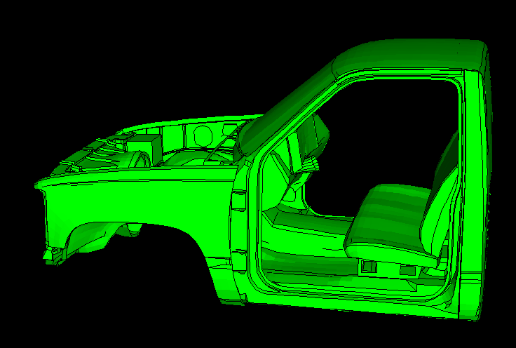

**Figure 9.1.7–2** The air mesh inside the cabin.

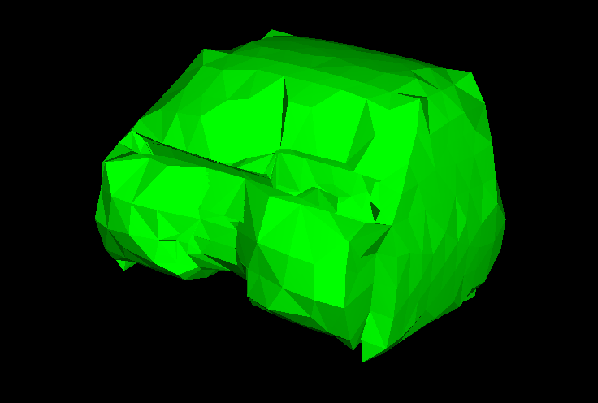

**Figure 9.1.7–3** The cabin-air-chassis model.

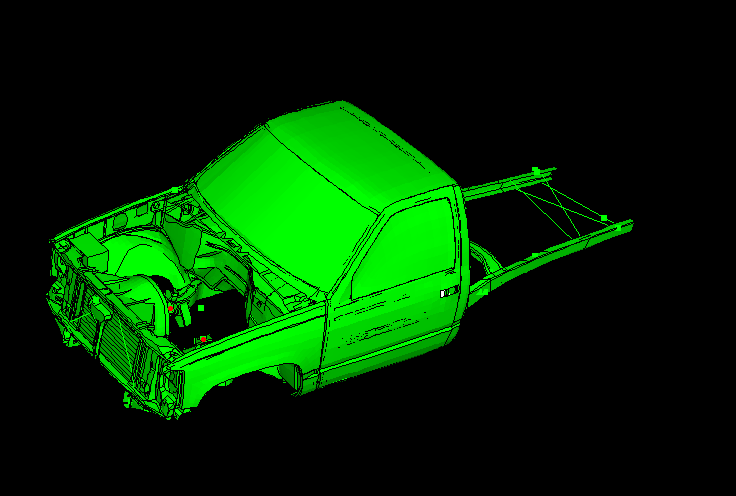

**Figure 9.1.7–4** Sound pressure level at the ear position for the cabin-air model (no damping).

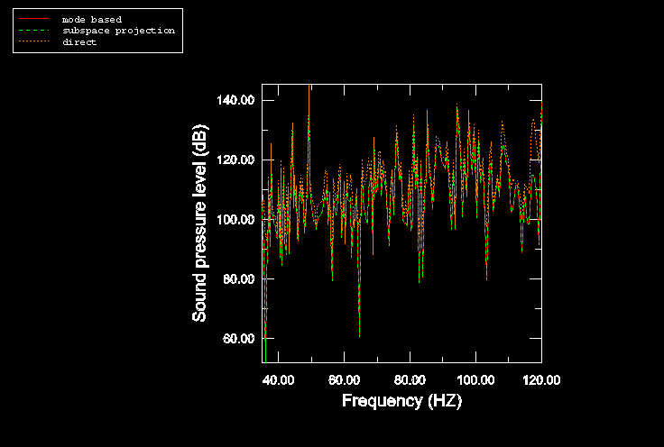

**Figure 9.1.7–5** Displacement at one of the harmonically excited cabin floor points (no damping).

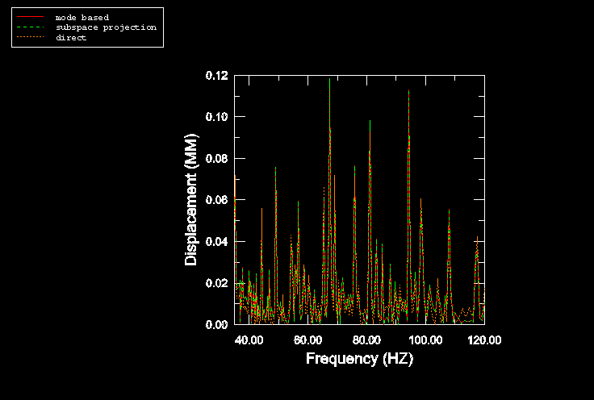

**Figure 9.1.7–6** Sound pressure level at the ear position for the cabin-air model when damping is considered.

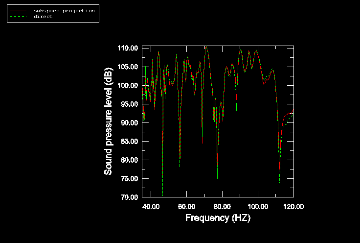

**Figure 9.1.7–7** Real part of the acoustic pressure in the cabin-air model when damping is considered and when the lower bulkhead is excited with an incident pressure field (planar wave case, left; diffuse field case, right).

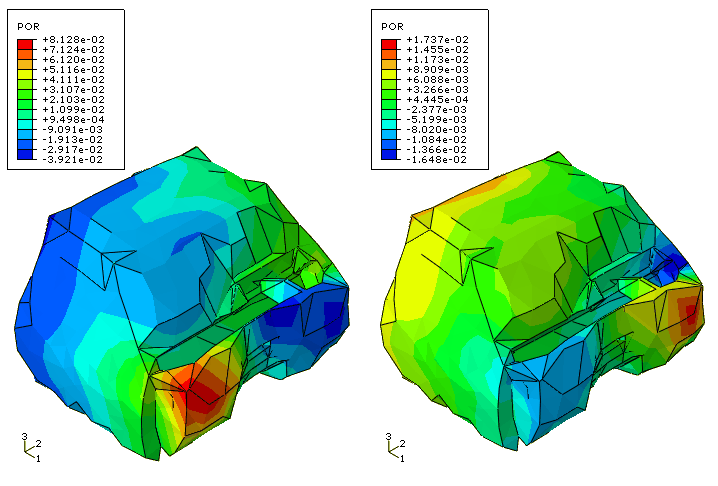

**Figure 9.1.7–8** Air pressure for the 25th eigenmode (35.131 Hz) from the cabin-air model.

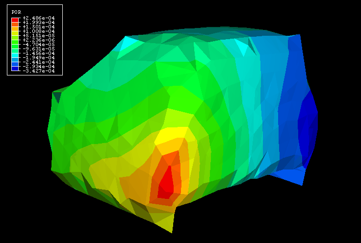

**Figure 9.1.7–9** Air pressure for the 25th eigenmode (35.131 Hz) from the cabin-air substructure model.

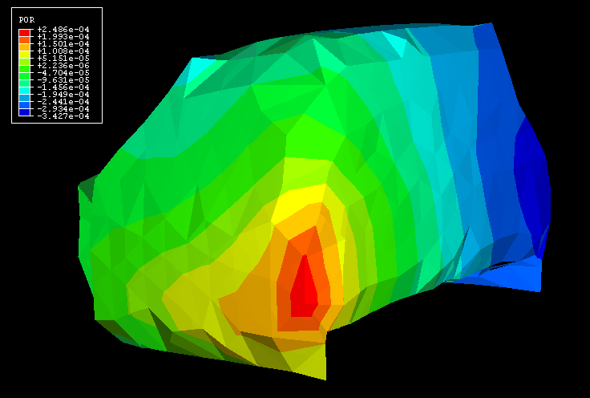

**Figure 9.1.7–10** Sound pressure level at ear level from the cabin-air-chassis model (no damping).

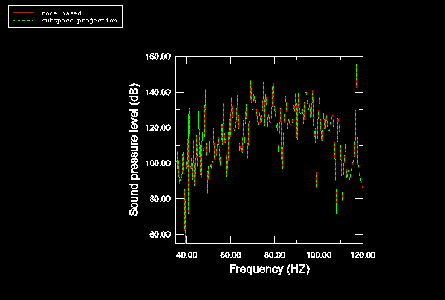

**Figure 9.1.7–11** Displacement at one of the cabin floor points for the cabin-air-chassis model (no damping).

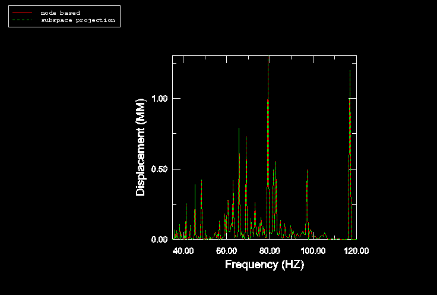

**Figure 9.1.7–12** Eigenfrequency differences between the cabin-air-chassis model and the equivalent model with substructures for the range of interest (35–120 Hz).

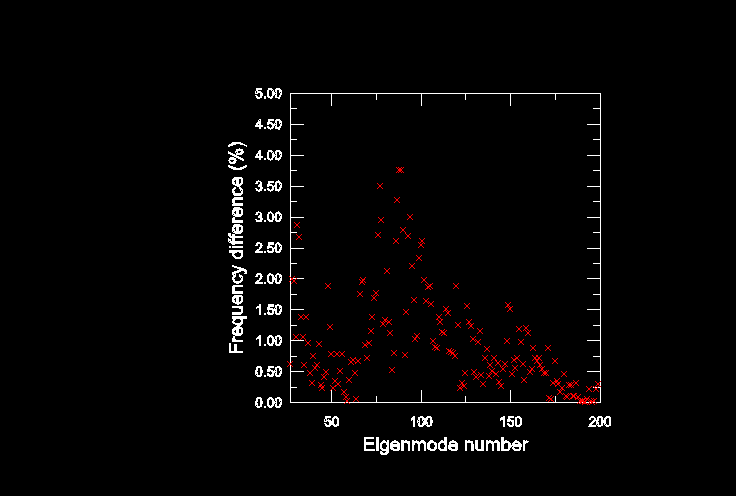

