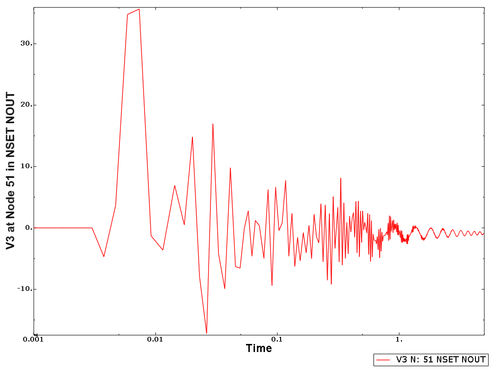
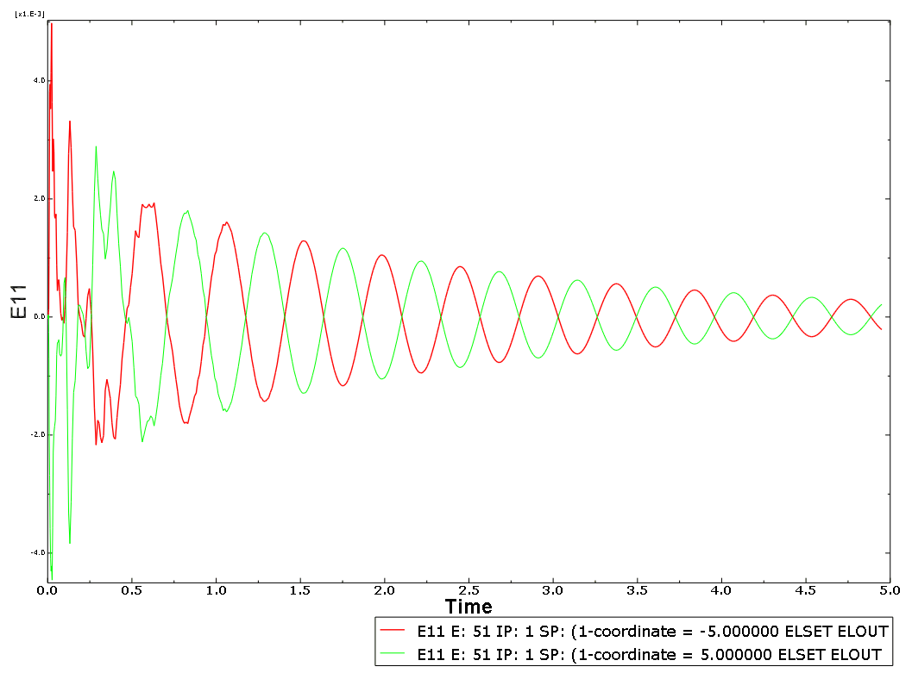
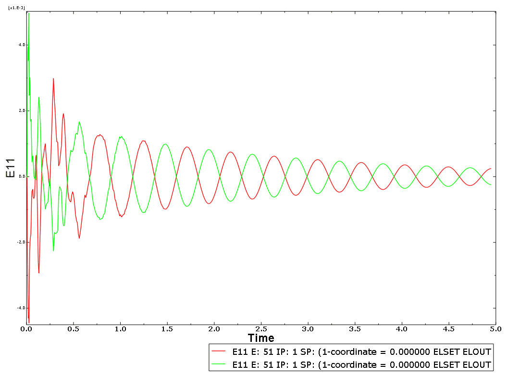

# 9.1.8 浸没圆柱体对水下爆炸的长时长响应

**产品：** Abaqus/Standard Abaqus/Explicit

本示例演示了Abaqus如何用于预测经历由水下爆炸（UNDEX）产生的波载荷的浸没结构的长时长响应。

对结构动力学运动的强调自然导致使用梁来建模结构，而不是实体或壳单元。这类问题的特征是结构动力学运动速度远慢于流体中的声波速度，因此流体可以建模为不可压缩介质。以这种方式建模流体的含义是将其对结构的影响简化为梁上的"附加质量"。

与UNDEX事件相关的球形压力波有两个不同的阶段。第一个非常短的阶段是由引爆产生的初始波。它涉及上升到特征压力值的非常陡峭的上升，随后是更缓慢的衰减。在加载的第二阶段，炸药产生的气体膨胀到最大体积，此时周围流体的压力使其反弹。在某个最小体积下，气体和流体系统发出另一个压力脉冲，气体气泡再次膨胀。这个过程可能重复多次，产生几个压力脉冲。当气体气泡振荡时，它也受浮力作用，产生与重力方向相反的不稳定运动。

### 问题和几何形状描述

本问题涉及水下爆炸攻击下浸没潜艇的结构动力学模型。船长100 m，位于水面以下50 m；炸药引爆点沿船长居中，偏置一侧15 m并在船下方15 m。关注的是船对初始直接和反射冲击波以及前几个气泡脉冲的响应，因此动态模拟进行到5秒。

### 模型

模型由100个B31梁单元组成，沿一条线排列。它们的（均匀）截面属性使用通用梁截面定义。结构总长度50 m。在每个节点处定义10000 kg的点质量单元，以模拟内部设备对梁结构动力学的影响。夹带流体的效应使用具有附加惯性的梁来模拟，其中指定流体质量密度1025 kg/m³，外半径5 m，流体拖曳系数1.0。使用材料阻尼定义指定结构阻尼。不需要额外的声学流体单元或吸收边界条件。

### 流固耦合和冲击波载荷

本问题的载荷规范包括炸药、波动传播到结构的流体介质以及炸药相对于结构的几何形状的描述。

在Abaqus中，压力及其导数的时间历史以及炸药气体气泡的运动使用Geers-Hunter模型定义。此模型使用气泡型振幅调用。在此选项下指定炸药的材料属性、其质量、其距自由表面的距离以及其他一些控制参数。此选项上的数据用于控制作为预处理一部分执行的单独气泡动力学时间积分操作。在此选项上定义的参数不影响分析的其余部分。这里使用100 kg炸药，模型参数设置为抑制气泡模拟内的波损失效应。指定初始深度65 m：这影响气体气泡的振荡和气泡动力学的持续时间，因为当气泡到达自由表面时解自然终止。然而，在本分析中，气泡模拟时间在0.6秒处被截止。气泡迁移被定义为沿*z*轴。使用气泡动力学时间积分参数的默认值。

作用在结构上的实际载荷使用入射波和相关的入射波反射来定义。入射波定义了在分析步骤中由于指定参数在结构表面上的分布式时变载荷。只需要指示为梁单元定义的表面和参考载荷幅值，就像Abaqus中大多数分布式载荷的情况一样。入射波反射定义计算域外的任何平面，以计算由于反射产生的额外入射波载荷。这里定义了一个"软"（总压力为零）反射平面，位于距源点原始位置65 m处并垂直于*z*轴。源点的原始位置定义为（50, 15, 15），standoff点定义为（50, 3.536, 3.536）。用于波在结构上传播的流体属性给出为质量密度 = 1025 kg/m³和体积模量 = 2.30635 GPa。

### 结果与讨论

本UNDEX示例的模型共有606个活动自由度，需要约15 MB内存和267 KB磁盘空间。

[图9.1.8-1](ch09s01aex136.md#exasubwhipping-v3)使用对数时间轴显示结构中心节点的垂直位移（V3）时间历史。该曲线清晰显示了初始冲击引起的速度峰值、反射路径引起的速度峰值以及载荷在*t* = 0.6停止后与结构运动相关的衰减周期响应。响应曲线清楚说明由于初始冲击引起的速度，圆柱体存在刚体平移。直接和反射冲击引起的峰值符号相同，因为具有负号的反射波沿与直接波相反的垂直方向传播。

[图9.1.8-2](ch09s01aex136.md#exasubwhipping-e1)显示了沿梁轴线的应变，针对沿截面1方向定向的截面点。1方向也是全局系统中的*y*方向。曲线表明在约2.1 Hz（基于估计的0.48秒周期）发生主导振动模态。[图9.1.8-3](ch09s01aex136.md#exasubwhipping-e2)显示了沿截面2方向（即全局*z*方向）定向的截面点的轴向应变。同样，对应于入射冲击的两个峰值是明显的，随后是在约2.1 Hz的衰减振荡。

### 输入文件

[iw_exa_whip_std.inp](../eif/iw_exa_whip_std.inp)

承受UNDEX冲击波的浸没圆柱体的Abaqus/Standard分析。

[iw_exa_whip_xpl.inp](../eif/iw_exa_whip_xpl.inp)

承受UNDEX冲击波的浸没圆柱体的Abaqus/Explicit分析。

### 参考

Hicks, A. N., "The Theory of Explosion Induced Hull Whipping," Naval Construction Research Establishment, Dunfermline, Fife, Scotland, Report NCRE/R579, March 1972.

### 图表

**图9.1.8-1** 船中点的垂直速度。

**图9.1.8-2** 船中点水平极值处的应变。

**图9.1.8-3** 船中点垂直极值处的应变。

