# 9.1.9 夹层板在CONWEP爆炸载荷下的变形

**产品：** Abaqus/Explicit

### 目标

本示例演示以下Abaqus/Explicit特性和技术：
- 应用CONWEP爆炸载荷，
- 比较使用Abaqus/Explicit的计算结果与夹层结构在爆炸载荷下变形的实验测量，以及
- 演示夹层结构非线性分析的通用示例。

### 应用描述

现代结构设计可用于保护容易受到大型爆炸载荷影响的各种系统。夹层结构是现代结构的一个特殊类别，可以为此类应用进行探索。使用Abaqus/Explicit进行爆炸载荷动态分析提供了一个重要的分析工具，可以帮助工程师和设计师建造更好地抵抗爆炸载荷的结构。

### 几何形状

本示例使用两个模型。第一个模型是Dharmasena等人（2008）描述的夹层板结构，如图[9.1.9-1](ch09s01aex137.md#exa-aco-conwepsandwich-ref)所示。夹层结构由方形蜂窝芯组成，垂直腹板焊接在顶板和底板上。整体夹层板结构的尺寸为610×610×61 mm。夹层结构位于*X–Y*平面，而爆炸源位于夹层结构顶板中心上方100 mm处（沿*z*方向）。顶板和底板厚度为5 mm，方形蜂窝芯腹板厚度为0.76 mm。蜂窝腹板的间距为30.5 mm（从中间平面测量）。

第二个模型是实心板，选择它与Dharmasena等人的结果进行比较。

### 材料

夹层结构的顶板和底板以及蜂窝芯和实心板均由高延性不锈钢合金（Al-6XN）制成，按重量计包含49% Fe、24% Ni、21% Cr和6% Mo，如Nahshon等人（2007）所述。

### 初始条件

所有结构在273 K温度下最初处于未变形状态。

### 边界条件和载荷

夹层结构和实心板的所有边缘都是固定的。假设解的对称性，对完整板的四分之一进行建模。

### 相互作用

在夹层结构中，蜂窝腹板焊接在板的内外表面上。

### Abaqus建模方法和仿真技术

本示例演示了使用Abaqus/Explicit的CONWEP爆炸载荷用法。本示例基于Dharmasena等人（2008）报告的实验选择，讨论了特定夹层结构和等效实心板在1、2和3 kg TNT的CONWEP爆炸载荷下的变形。具有等效材料的实心板作为简单示例呈现。实心板使用壳单元和三维连续单元建模。最后，分析了Dharmasena等人描述的主要感兴趣问题——夹层结构。所有模拟均选择吨-毫米-秒-开尔文单位制。

### 分析案例摘要

| 案例1 | 使用S4R壳单元在1 kg TNT爆炸载荷下的实心板。 |
| --- | --- |
| 案例2 | 使用S4R壳单元在2 kg TNT爆炸载荷下的实心板。 |
| 案例3 | 使用S4R壳单元在3 kg TNT爆炸载荷下的实心板。 |
| 案例4 | 使用C3D8R连续单元在1 kg TNT爆炸载荷下的实心板。 |
| 案例5 | 使用C3D8R连续单元在2 kg TNT爆炸载荷下的实心板。 |
| 案例6 | 使用C3D8R连续单元在3 kg TNT爆炸载荷下的实心板。 |
| 案例7 | 夹层结构在1 kg TNT爆炸载荷下。 |
| 案例8 | 夹层结构在2 kg TNT爆炸载荷下。 |
| 案例9 | 夹层结构在3 kg TNT爆炸载荷下。 |

### 分析类型

对所有案例执行使用Abaqus/Explicit的动态分析。计算解至1.5毫秒，在所有载荷值下不再观察到进一步的永久变形。

### 材料模型

Nahshon等人（2007）描述的钢合金的机械属性规定如下：弹性模量1.61×10⁵ MPa，泊松比0.35，密度7.85×10⁻⁹吨/mm³，膨胀系数4.52×10⁻⁵ Nmm/吨·K。

使用Johnson-Cook模型来模拟弹塑性行为，其系数和常数如下： = 400 MPa， = 1500 MPa， = 0.045， = 0.4， = 1.2，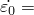 = 0.001 s⁻¹。转变温度为293 K，熔化温度为1800 K。

### 初始条件

在每个模型的所有节点上，温度初始化为273 K。

### 边界条件

假设对称行为。对于所有案例，仅对结构的四分之一进行建模，板的中心位于*X–Y*平面的原点。在 mm和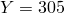 mm处的边界固定所有运动自由度（ENCASTRE）。关于*x*轴的对称条件（XSYMM）施加在平面上。类似地，关于*y*轴的对称条件（YSYMM）施加在平面上。

### 载荷

CONWEP爆炸载荷施加在板的顶面上。爆炸源位于板顶面中心上方100 mm的standoff距离处。爆炸载荷的属性使用模型级别的入射波相互作用属性和CONWEP炸药属性以及步骤级别的入射波相互作用来指定。

### 分析步骤

每个分析由单个动力学显式步骤组成。

### 输出请求

在板中心请求平动自由度（UT）。

### 结果与讨论

监测1.5毫秒后的中心位移，以将每个案例与实验结果进行比较。单精度和双精度作业执行对所有案例给出了相似的结果。

在整个1.5毫秒时间段内变形板的动画显示中心处有大变形。板在几次振荡后稳定。总做功历史（ALLWK）和总塑性耗散历史（ALLPD）的比较表明，爆炸载荷做功的大部分被塑性变形耗散。

### 案例1-3：带壳单元的实心板

实心板模型使用壳单元建模，承受使用不同炸药质量的CONWEP爆炸载荷。

### 网格设计

板表面使用31×31个S4R单元进行离散化，每个单元厚度方向有九个积分点。

### 边界条件

所有自由度，包括旋转自由度，在和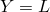边缘边界处固定，其中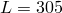 mm。对称边界条件（XSYMM）施加在边缘，对称边界条件（YSYMM）施加在边缘。

### 载荷

1、2和3 kg TNT载荷分别用于案例1、2和3。爆炸源保持在距壳单元中间截面100 mm的standoff距离处。

### 结果与讨论

人工能量历史（ALLAE）显著低于总内能（ALLIE），表明解是可信的，人工效应最小。

### 案例4-6：带3D连续单元的实心板

实心板使用三维连续单元建模，承受使用不同炸药质量的CONWEP爆炸载荷。

### 网格设计

板表面使用31×31个C3D8R单元进行离散化，板厚度方向有五层单元。

### 边界条件

所有自由度，包括旋转自由度，在和面边界处固定，其中 mm。*X*对称边界条件施加在面上，*Y*对称边界条件施加在面上。

### 载荷

1、2和3 kg TNT载荷分别用于案例4、5和6。爆炸源保持在距板顶面100 mm的standoff距离处。

### 输出请求

请求在每个增量处板顶面和底面中心挠度的历史输出。

### 结果与讨论

使用C3D8R单元观察到与使用S4R单元相似的行为。顶面中心挠度和底面中心挠度彼此非常接近。使用两个值的平均值来比较实心板的中间截面挠度。

### 案例7-9：夹层板结构

夹层板结构使用三维连续单元建模顶板和底板，使用壳单元建模方形蜂窝芯，承受使用不同炸药质量的CONWEP爆炸载荷。

### 网格设计

板表面使用31×31个C3D8R单元进行离散化，板厚度方向有五层单元。蜂窝芯使用30层S4R壳单元沿芯高度进行网格化，厚度方向有五个积分点。

### 边界条件

所有自由度，包括旋转自由度，在和面边界处固定，其中 mm。*X*对称边界条件施加在面上，*Y*对称边界条件施加在面上。

### 载荷

1、2和3 kg TNT载荷分别用于案例7、8和9。爆炸源保持在距板顶面100 mm的standoff距离处。

### 约束

芯顶部和底部的壳单元边缘使用绑定约束分别连接到顶板和底板的内表面。壳单元边缘形成相对于主板面的基于节点的从表面。绑定约束定义不允许任何调整，并使用边缘的节点集来识别将从表面绑定到主表面的从表面上的节点。

### 相互作用

在步骤级别指定一般接触，包括所有外部表面接触相互作用。

### 输出请求

请求在每个增量处板顶面和底面中心挠度的历史输出。

### 结果与讨论

分析显示蜂窝腹板在板中心附近有涉及自接触的显著屈曲，如图[9.1.9-2](ch09s01aex137.md#exa-aco-conwepsandwich-all3)对三种载荷情况所示。[图9.1.9-3](ch09s01aex137.md#exa-aco-conwepsandwich-1kgint)显示了1 kg TNT爆炸载荷情况的内视图，揭示了蜂窝芯的变形。它还确认使用基于节点表面的绑定约束适当地捕获了腹板与板内表面之间的焊接。

### 附加案例

使用不同参数的类似结构的研究已在文献中记录。此处提及替代材料模型和载荷案例，以提供附加分析的示例。不同的材料模型已被用于模拟此类载荷下的材料行为。用于以下非典型应变率硬化的材料模型（Dharmasena等人，2008）可用于使用用户子程序[`VUHARD`](../sub/sub-link.md#sub-xsl-vuhard)对上述案例进行模拟：

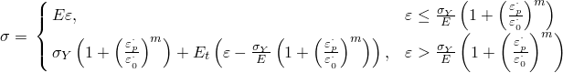

Dharmasena等人和Rathbun等人（2006）使用的材料属性如下：弹性模量 = 2.00×10⁵ MPa，泊松比 = 0.30，密度 = 7.85×10⁻⁹吨/mm³，屈服应力 = 300.0 MPa，切线模量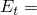 = 2.00×10³ MPa， = 4916 s⁻¹， = 0.154。

此外，可以使用用户子程序[`VDLOAD`](../sub/sub-link.md#sub-xsl-vdload)实现施加在Dharmasena等人描述的夹层结构上的以下近似载荷：

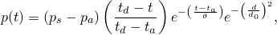

其中是冲击波压力（360 MPa），是环境压力（0），是冲击衰减到接近零的时间，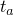是冲击到达时间，是距板中心的距离（在本例中，也是原点），是参考距离120 mm。所有变量值均基于Dharmasena等人选择。

### 结果讨论和案例比较

使用Johnson-Cook模型的钢合金（案例1-6）的Abaqus/Explicit结果如表[9.1.9-1](ch09s01aex137.md#case-deflection)所示。这些结果与Dharmasena等人（2008）报告的实验结果（见表[9.1.9-2](ch09s01aex137.md#exp-deflection)）相当好，对于壳单元和连续单元以及CONWEP爆炸载荷都是如此。夹层结构的Abaqus/Explicit结果与实验结果在合理误差范围内吻合。模拟和实验结果以图形方式呈现在[图9.1.9-4](ch09s01aex137.md#exa-aco-conwepsandwich-u3b)中。对于较高载荷，解有显著差异，Dharmasena等人将其归因于边界条件。在较高载荷下，测试装置中使用的夹层板边缘可能比Abaqs模型中使用的夹紧条件更灵活，导致数值和实验结果之间存在差异。结果的差异也可能由于实验设置中蜂窝芯腹板与顶板和底板的脱粘。

使用不同的材料模型对相同的CONWEP载荷对夹层结构进行了建模。具有非典型应变率硬化的各向同性双线性模型使用用户子程序[`VUHARD`](../sub/sub-link.md#sub-xsl-vuhard)，材料属性如上"附加案例"所述。位移如表[9.1.9-3](ch09s01aex137.md#vuhard-deflection)所示，发现比Johnson-Cook模型和实验结果高得多，可能由于较低的屈服应力值。

此外，使用Johnson-Cook材料模型和近似载荷（如上"附加案例"中所述）使用用户子程序[`VDLOAD`](../sub/sub-link.md#sub-xsl-vdload)对实心板和夹层结构进行了建模。位移如表[9.1.9-4](ch09s01aex137.md#vdload-deflection)所示，发现低于CONWEP爆炸载荷和实验结果，可能因为近似载荷在总时间内对模型做的功较少。

### 输入文件

##### **案例1-3 带壳单元的实心板**

[exa_aco_conwep_sol_1kg.inp](../eif/exa_aco_conwep_sol_1kg.inp)

带S4R单元和1 kg TNT爆炸载荷的实心板模型。

[exa_aco_conwep_sol_2kg.inp](../eif/exa_aco_conwep_sol_2kg.inp)

带S4R单元和2 kg TNT爆炸载荷的实心板模型。

[exa_aco_conwep_sol_3kg.inp](../eif/exa_aco_conwep_sol_3kg.inp)

带S4R单元和3 kg TNT爆炸载荷的实心板模型。

##### **案例4-6 带连续单元的实心板**

[exa_aco_conwep_spl_1kg.inp](../eif/exa_aco_conwep_spl_1kg.inp)

带C3D8R单元和1 kg TNT爆炸载荷的实心板模型。

[exa_aco_conwep_spl_2kg.inp](../eif/exa_aco_conwep_spl_2kg.inp)

带C3D8R单元和2 kg TNT爆炸载荷的实心板模型。

[exa_aco_conwep_spl_3kg.inp](../eif/exa_aco_conwep_spl_3kg.inp)

带C3D8R单元和3 kg TNT爆炸载荷的实心板模型。

##### **案例7-9 夹层结构**

[exa_aco_conwep_snd_1kg.inp](../eif/exa_aco_conwep_snd_1kg.inp)

带1 kg TNT爆炸载荷的夹层结构模型。

[exa_aco_conwep_snd_2kg.inp](../eif/exa_aco_conwep_snd_2kg.inp)

带2 kg TNT爆炸载荷的夹层结构模型。

[exa_aco_conwep_snd_3kg.inp](../eif/exa_aco_conwep_snd_3kg.inp)

带3 kg TNT爆炸载荷的夹层结构模型。

##### **附加案例**

[exa_aco_conwep_snd_vuhard_1kg.inp](../eif/exa_aco_conwep_snd_vuhard_1kg.inp)

带用户定义材料模型和1 kg TNT爆炸载荷的夹层结构模型。

[exa_blast_vuhard.f](../eif/exa_blast_vuhard.f)

带用户定义应变率硬化模型的用户子程序[`VUHARD`](../sub/sub-link.md#sub-xsl-vuhard)。

[exa_aco_conwep_sol_vdload_1kg.inp](../eif/exa_aco_conwep_sol_vdload_1kg.inp)

带用户定义近似载荷（等效于1 kg TNT爆炸）的实心板模型。

[exa_aco_conwep_snd_vdload_1kg.inp](../eif/exa_aco_conwep_snd_vdload_1kg.inp)

带用户定义近似载荷（等效于1 kg TNT爆炸）的夹层结构模型。

[exa_blast_vdload.f](../eif/exa_blast_vdload.f)

带等效于1 kg TNT CONWEP爆炸载荷的近似载荷的用户子程序[`VDLOAD`](../sub/sub-link.md#sub-xsl-vdload)。

### 参考

**Abaqus Analysis User's Guide**
- ["Acoustic, shock, and coupled acoustic-structural analysis," Section 6.10.1 of the Abaqus Analysis User's Guide](../usb/usb-link.md#usb-anl-aacoustic)
- ["Acoustic and shock loads," Section 34.4.6 of the Abaqus Analysis User's Guide](../usb/usb-link.md#usb-prc-pacoustic)

**Abaqus Keywords Reference Guide**
- [*CONWEP CHARGE PROPERTY](../key/key-link.md#usb-kws-mconwepchargeproperty)
- [*INCIDENT WAVE INTERACTION](../key/key-link.md#usb-kws-hincidentwaveinteraction)
- [*INCIDENT WAVE INTERACTION PROPERTY](../key/key-link.md#usb-kws-mincidentwaveinteractionproperty)

**Abaqus Verification Guide**
- ["CONWEP blast loading pressures," Section 3.9.5 of the Abaqus Verification Guide](../ver/ver-link.md#ver-prc-conweppressures)
- ["Blast loading of a circular plate using the CONWEP model," Section 3.9.6 of the Abaqus Verification Guide](../ver/ver-link.md#ver-prc-blastcircularplate)

**其他**

- Dharmasena, K. P., H. N. G. Wadley, Z. Xue, and J. W. Hutchinson, "Mechanical Response of Metallic Honeycomb Sandwich Panel Structures to High-Intensity Dynamic Loading," Journal of Impact Engineering, vol. 35, pp. 1063-1074, 2008.
- Nahshon, K., M. G. Pontin, A. G. Evans, J. W. Hutchinson, and F. W. Zok, "Dynamic Shear Rupture of Steel Plates," Journal of Mechanics of Materials and Structures, vol. 2-10, pp. 2049-2066, December 2007.
- Rathbun, H. J., D. D. Radford, Z. Xue, M. Y. Hu, J. Yang, V. Deshpande, N. A. Fleck, J. W. Hutchinson, F. W. Zok, and A. G. Evans, "Dynamic Shear Rupture of Steel Plates," International Journal of Solids and Structures, vol. 43, pp. 1746-1763, 2006.

### 表格

**表9.1.9-1** Abaqus/Explicit为案例1-9计算的中心挠度。
| 模型 | 炸药质量 | 中心挠度（mm） |
| --- | --- | --- |
| 顶面 | 中间截面 | 底面 |
| 实心板（S4R） | 1 kg TNT | -- | 48.54 | -- |
| 2 kg TNT | -- | 88.38 | -- |
| 3 kg TNT | -- | 109.75 | -- |
| 实心板（C3D8R） | 1 kg TNT | -- | 47.09 | -- |
| 2 kg TNT | -- | 85.72 | -- |
| 3 kg TNT | -- | 108.38 | -- |
| 夹层结构 | 1 kg TNT | 69.15 | -- | 26.15 |
| 2 kg TNT | 110.68 | -- | 66.14 |
| 3 kg TNT | 141.37 | -- | 96.63 |

**表9.1.9-2** 实验测量的中心挠度。
| 模型 | 炸药质量 | 中心挠度（mm） |
| --- | --- | --- |
| 顶面 | 中间截面 | 底面 |
| 实心板 | 1 kg TNT | -- | 37.65 | -- |
| 2 kg TNT | -- | 71.37 | -- |
| 3 kg TNT | -- | 132.94 | -- |
| 夹层结构 | 1 kg TNT | 47.06 | -- | 15.29 |
| 2 kg TNT | 98.82 | -- | 53.73 |
| 3 kg TNT | 158.04 | -- | 127.45 |

**表9.1.9-3** 使用用户子程序[`VUHARD`](../sub/sub-link.md#sub-xsl-vuhard)的Abaqus/Explicit计算的夹层结构中心挠度。
| 模型 | 炸药质量 | 顶面中心挠度（mm） | 底面中心挠度（mm） |
| --- | --- | --- | --- |
| 带[`VUHARD`](../sub/sub-link.md#sub-xsl-vuhard)的夹层结构 | 1 kg TNT | 96.18 | 50.74 |
| 2 kg TNT | 156.76 | 114.79 |
| 3 kg TNT | 200.03 | 155.08 |

**表9.1.9-4** 使用用户子程序[`VDLOAD`](../sub/sub-link.md#sub-xsl-vdload)的Abaqus/Explicit计算的中心挠度。
| 模型 | 炸药质量 | 中心挠度（mm） |
| --- | --- | --- |
| 顶面 | 中间截面 | 底面 |
| 带[`VDLOAD`](../sub/sub-link.md#sub-xsl-vdload)的实心板（S4R） | 1 kg TNT | -- | 32.10 | -- |
| 带[`VDLOAD`](../sub/sub-link.md#sub-xsl-vdload)的夹层结构 | 1 kg TNT | 36.31 | -- | 18.89 |

### 图表

**图9.1.9-1** 夹层结构模型。

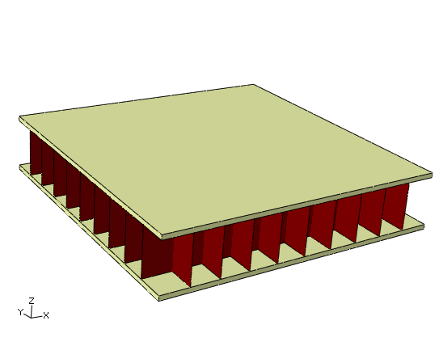

**图9.1.9-2** 在（从上到下）1、2和3 kg TNT的CONWEP爆炸载荷下变形的夹层结构。

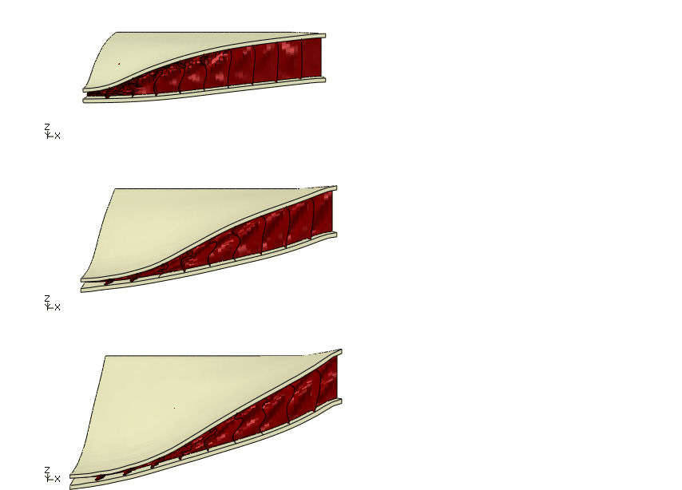

**图9.1.9-3** 1 kg TNT CONWEP炸药载荷下蜂窝芯的变形。

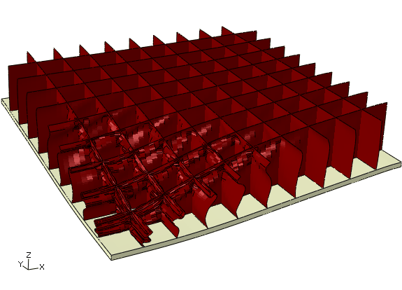

**图9.1.9-4** 不同爆炸载荷的Abaqus/Explicit与实验结果的中心挠度比较。

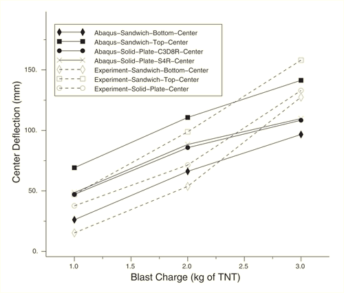

