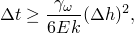
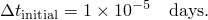
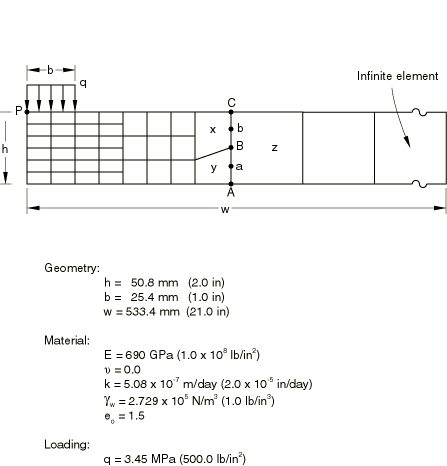
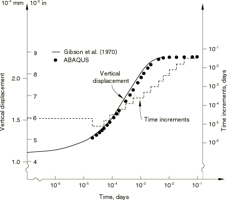

# 10.1.1 平面应变固结

**产品：** Abaqus/Standard

大多数实际工程中的固结问题都是二维或三维的，因此Terzaghi固结理论给出的一维解（见["Terzaghi固结问题," Abaqus基准指南第1.15.1节](../bmk/bmk-link.md#bmk-anl-terzaghi)）仅能作为沉降量和沉降速率的参考。本问题考察一个线性的二维固结案例：土条带的部分加载沉降历史。选择这个案例来说明二维固结是因为可以获得精确解（Gibson等，1970），从而可以验证Abaqus的这一功能。

### 几何形状和模型

半无限、部分加载土条带的离散化如图10.1.1-1所示。加载区域的宽度为样本深度的一半。本分析采用带孔隙压力的减缩积分平面应变单元CPE8RP。减缩积分几乎总是推荐用于二阶单元，因为它通常能提供更精确的结果，且比全积分更经济。虽然尚未进行网格收敛性研究，但本模型数值结果与Gibson等人（1970）的解之间的合理一致性表明所使用的模型是足够的——至少对于所考察的总体位移响应是如此。为了在保持精度的同时降低分析成本，网格从荷载下方高度的六个单元逐渐过渡到模型外边界处的一个单元高度，在外边界处使用单个无限单元（类型CINPE5R）来模拟无限域。这需要使用Abaqus提供的两个运动约束功能。首先考虑图10.1.1-1中沿线的位移自由度。用于分析的8节点等参单元允许其边上位移的二次变化，因此单元x和y中节点a和b的位移可能与单元z的边的位移变化不兼容。为了避免这种情况，节点a和b必须被约束在由节点A、B和定义的抛物线上。二次MPC（"多点约束"）用于强制执行此运动约束：它必须在需要此约束的每个节点处使用（见[planestrainconsolidation.inp](../eif/planestrainconsolidation.inp)）。孔隙压力值通过单元角节点处值的线性插值获得。当使用网格渐变时（如本例中沿线），孔隙压力值可能因与上述位移不兼容相同的原因而不兼容。为了避免这种情况，节点B处的孔隙压力必须被约束为从A和的孔隙压力值进行线性插值。这是通过使用P LINEAR MPC完成的。

本分析假设的材料属性如下：杨氏模量取为690 GPa（10^8 lb/in^2）；泊松比为0；材料渗透系数为5.08×10^-7 m/day（2.0×10^-5 in/day）；孔隙流体的比重取为272.9 kN/m^3（1.0 lb/in^3）。

施加荷载的大小为3.45 MPa（500 lb/in^2）。土条带假设位于光滑、不透水的基础上，因此该表面垂直位移分量被指定为零。网格左侧为对称线（无水平位移）。无限单元模拟其他边界。

### 时间步长

与一维Terzaghi固结解一样（见["Terzaghi固结问题," Abaqus基准指南第1.15.1节](../bmk/bmk-link.md#bmk-anl-terzaghi)），本问题分两步运行。在第一个瞬态土体固结步中，施加荷载，网格顶面不允许跨过任何排水。一步建立孔隙压力初始分布，这些孔隙压力将在第二个瞬态土体固结步中消散。

在第二步中，排水可以沿整个条带表面发生。这是通过在该表面上的所有节点（节点集`TOP`）上指定孔隙压力（自由度8）为零来实现的。默认情况下，在瞬态土体固结步中，此类边界条件在步开始时立即应用，然后保持固定。因此，在第二步开始时，表面孔隙压力突然从第一步定义的零排水值变为0.0。

固结是一个典型的扩散过程：最初解变量随时间快速变化，而在后期，应力和孔隙压力变化更为缓慢。因此，任何实际分析都需要自动时间步长方案，因为固结的总体感兴趣时间通常比在瞬态早期获得合理解所需的时间增量大小大几个数量级。Abaqus使用对增量中允许的最大孔隙压力变化量的容差来控制时间步长。当土壤中孔隙压力的最大变化持续小于此容差时，允许增加时间增量。如果孔隙压力变化超过此容差，则减少时间增量并重复增量。通过这种方式，可以精确捕获固结的早期部分，而后期阶段以更大的时间步长进行分析，从而能够有效地解决问题。对于此情况，容差选择为0.344 MPa（50 lb/in^2），这是施加荷载的10%。这是一个相当粗的容差，但会产生经济合理的解。

初始时间步长的选择在固结分析中很重要。正如在["Terzaghi固结问题," Abaqus基准指南第1.15.1节](../bmk/bmk-link.md#bmk-anl-terzaghi)中所讨论的，初始解（边界条件变化后立即）是局部的、"表皮效应"解。由于空间和时间尺度的耦合，生成的时间步长小于网格和材料相关特征时间的解不会提供有用的信息。比该特征时间小很多的时间步长会产生虚假的振荡结果（见图3.1.5-2）。Vermeer和Verruijt（1981）讨论了这个问题，他们提出了以下准则

其中是有限元网格中边界条件变化附近节点之间的距离，E是土体骨架的弹性模量，k是土体渗透系数，是孔隙流体的比重。在本问题中为8.5 mm（0.33 in）。使用图10.1.1-1所示的材料属性，

我们实际上使用2×10^-5天的初始时间步长，因为排水开始后的瞬态早期不被认为在解中重要。

### 结果与讨论

荷载中心点下方（如图10.1.1-1中的P点）垂直挠度的时间历史预测如图10.1.1-2所示，并将其与Gibson等人（1970）的精确解进行了比较。理论和有限元解之间总体上具有良好的一致性，即使本分析使用的网格相当粗糙。

图10.1.1-2还显示了基于上述容差的自动方案选择的时间增量。该图显示了方案的有效性：时间增量在分析过程中变化了两个数量级。

### 输入文件

[planestrainconsolidation.inp](../eif/planestrainconsolidation.inp)

本例的输入数据。

### 参考文献

Gibson, R. E., R. L. Schiffman, and S. L. Pu, "Plane Strain and Axially Symmetric Consolidation of a Clay Layer on a Smooth Impervious Base," Quarterly Journal of Mechanics and Applied Mathematics, vol. 23, pt. 4, pp. 505–520, 1970.

Vermeer, P. A., and A. Verruijt, "An Accuracy Condition for Consolidation by Finite Elements," International Journal for Numerical and Analytical Methods in Geomechanics, vol. 5, pp. 1–14, 1981.

### 图

**图10.1.1-1** 平面应变固结示例：几何形状和属性。

**图10.1.1-2** 固结历史和时间步长变化历史。

