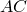
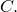

# 10.1.1 Plane strain consolidation

**Product: **Abaqus/Standard  

Most consolidation problems of practical interest are two- or three-dimensional, so that the one-dimensional solutions provided by Terzaghi consolidation theory (see ["The Terzaghi consolidation problem," Section 1.15.1 of the Abaqus Benchmarks Guide](../bmk/bmk-link.md#bmk-anl-terzaghi)) are useful only as indicators of settlement magnitudes and rates. This problem examines a linear, two-dimensional consolidation case: the settlement history of a partially loaded strip of soil. This particular case is chosen to illustrate two-dimensional consolidation because an exact solution is available (Gibson et al., 1970), thus providing verification of this capability in Abaqus.

### Geometry and model

The discretization of the semi-infinite, partially loaded strip of soil is shown in [Figure 10.1.1--1](ch10s01aex138.md#sxmplstraincon-geom). The loaded region is half as wide as the depth of the sample. The reduced-integration plane strain element with pore pressure, CPE8RP, is used in this analysis. Reduced integration is almost always recommended when second-order elements are used because it usually gives more accurate results and is less expensive than full integration. No mesh convergence studies have been done, although the reasonable agreement between the numerical results provided by this model and the solution of Gibson et al. (1970) suggests that the model used is adequate—at least for the overall displacement response examined. In an effort to reduce analysis cost while at the same time preserve accuracy, the mesh is graded from six elements through the height, under the load, to one element through the height at the outer boundary of the model, where a single infinite element (type CINPE5R) is used to model the infinite domain. This requires the use of two kinematic constraint features provided by Abaqus. Consider first the displacement degrees of freedom along line  in [Figure 10.1.1--1](ch10s01aex138.md#sxmplstraincon-geom). The 8-node isoparametric elements used for the analysis allow quadratic variation of displacement along their sides, so the displacements of nodes *a* and *b* in elements *x* and *y* may be incompatible with the displacement variation along side  of element *z*. To avoid this, nodes *a* and *b* must be constrained to lie on the parabola defined by the displacements of nodes *A*, *B*, and  The QUADRATIC MPC (“multi-point constraint”) is used to enforce this kinematic constraint: it must be used at each node where this constraint is required (see [planestrainconsolidation.inp](../eif/planestrainconsolidation.inp)). Pore pressure values are obtained by linear interpolation of values at the corner nodes of an element. When mesh gradation is used, as along line  in this example, an incompatibility in pore pressure values may result for the same reason given for the displacement incompatibility discussed above. To avoid this, the pore pressure at node *B* must be constrained to be interpolated linearly from the pore pressure values at *A* and  This is done by using the P LINEAR MPC.

The material properties assumed for this analysis are as follows: the Young's modulus is chosen as 690 GPa (108 lb/in2); the Poisson's ratio is 0; the material's permeability is 5.08  107 m/day (2.0  105 in/day); and the specific weight of pore fluid is chosen as 272.9 kN/m3 (1.0 lb/in3).

The applied load has a magnitude of 3.45 MPa (500 lb/in2). The strip of soil is assumed to lie on a smooth, impervious base, so the vertical component of displacement is prescribed to be zero on that surface. The left-hand side of the mesh is a symmetry line (no horizontal displacement). The infinite element models the other boundary.

### Time stepping

As in the one-dimensional Terzaghi consolidation solution (see ["The Terzaghi consolidation problem," Section 1.15.1 of the Abaqus Benchmarks Guide](../bmk/bmk-link.md#bmk-anl-terzaghi)), the problem is run in two steps. In the first transient soils consolidation step, the load is applied and no drainage is allowed across the top surface of the mesh. This one increment step establishes the initial distribution of pore pressures which will be dissipated during the second transient soils consolidation step.

During the second step drainage is allowed to occur through the entire surface of the strip. This is specified by prescribing the pore pressure (degree of freedom 8) at all nodes on this surface (node set `TOP`) to be zero. By default, in a transient soils consolidation step such boundary conditions are applied immediately at the start of the step and then held fixed. Thus, the pore pressures at the surface change suddenly at the start of the second step from their values with no drainage (defined by the first step) to 0.0.

Consolidation is a typical diffusion process: initially the solution variables change rapidly with time, while at the later times more gradual changes in stress and pore pressure are seen. Therefore, an automatic time stepping scheme is needed for any practical analysis, since the total time of interest in consolidation is typically orders of magnitude larger than the time increments that must be used to obtain reasonable solutions during the early part of the transient. Abaqus uses a tolerance on the maximum change in pore pressure allowed in an increment to control the time stepping. When the maximum change of pore pressure in the soil is consistently less than this tolerance, the time increment is allowed to increase. If the pore pressure changes exceed this tolerance, the time increment is reduced and the increment is repeated. In this way the early part of the consolidation can be captured accurately and the later stages are analyzed with much larger time steps, thereby permitting efficient solution of the problem. For this case the tolerance is chosen as 0.344 MPa (50 lb/in2), which is 10% of the applied load. This is a fairly coarse tolerance but results in an economical and reasonable solution.

The choice of initial time step is important in consolidation analysis. As discussed in ["The Terzaghi consolidation problem," Section 1.15.1 of the Abaqus Benchmarks Guide](../bmk/bmk-link.md#bmk-anl-terzaghi), the initial solution (immediately following a change in boundary conditions) is a local, “skin effect” solution. Due to the coupling of spatial and temporal scales, it follows that no useful information is provided by solutions generated with time steps smaller than the mesh and material-dependent characteristic time. Time steps very much smaller than this characteristic time provide spurious oscillatory results (see Figure 3.1.5–2). This issue is discussed by Vermeer and Verruijt (1981), who propose the criterion

where  is the distance between nodes of the finite element mesh near the boundary condition change, *E* is the elastic modulus of the soil skeleton, *k* is the soil permeability, and  is the specific weight of the pore fluid. In this problem  is 8.5 mm (0.33 in). Using the material properties shown in [Figure 10.1.1--1](ch10s01aex138.md#sxmplstraincon-geom), 

We actually use an initial time step of 2  105 days, since the immediate transient just after drainage begins is not considered important in the solution.

### Results and discussion

The prediction of the time history of the vertical deflection of the central point under the load (point *P* in [Figure 10.1.1--1](ch10s01aex138.md#sxmplstraincon-geom)) is plotted in [Figure 10.1.1--2](ch10s01aex138.md#sxmplstraincon-histories), where it is compared with the exact solution of Gibson et al. (1970). There is generally good agreement between the theoretical and finite element solutions, even though the mesh used in this analysis is rather coarse.

[Figure 10.1.1--2](ch10s01aex138.md#sxmplstraincon-histories) also shows the time increments selected by the automatic scheme, based on the tolerance discussed above. The figure shows the effectiveness of the scheme: the time increment changes by two orders of magnitude over the analysis.

### Input file

[planestrainconsolidation.inp](../eif/planestrainconsolidation.inp)

Input data for this example.

### References

Gibson, R. E., R. L. Schiffman, and S. L. Pu, “Plane Strain and Axially Symmetric Consolidation of a Clay Layer on a Smooth Impervious Base,” Quarterly Journal of Mechanics and Applied Mathematics, vol. 23, pt. 4, pp. 505–520, 1970.

Vermeer, P. A., and A. Verruijt, “An Accuracy Condition for Consolidation by Finite Elements,” International Journal for Numerical and Analytical Methods in Geomechanics, vol. 5, pp. 1–14, 1981.

### Figures

**Figure 10.1.1–1** Plane strain consolidation example: geometry and properties.

**Figure 10.1.1–2** Consolidation history and time step variation history.

