# 10.1.2 土坝中浸润面的计算

**产品：** Abaqus/Standard

本例说明了使用Abaqus求解多孔介质中流体在重力场中流动的问题，其中只有部分区域完全饱和，因此浸润面位置是解的一部分。这类问题在水文学中很常见（例如井降深问题，需要根据特定井位置的抽水速率确定含水层的浸润面），在某些大坝设计中也会遇到，如本例所示。基本方法利用了Abaqus执行部分和完全饱和分析的能力：浸润面位于模型完全饱和部分的边界上。这种方法的优点是浸润面正上方的毛细管区也能被识别出来。

### 边界条件

典型大坝如图10.1.2-1所示。我们只考虑流体流动：忽略大坝的变形。因此，虽然我们使用完全耦合的孔隙流体流-变形单元，但所有位移自由度都被指定为零。更一般的分析将包括大坝的应力和变形。

大坝的上游面（图中表面）暴露在坝后水库的水中。由于Abaqus使用总孔隙压力公式，因此必须在该面上指定孔隙压力为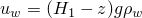，其中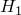是水面高程，z是高程，g是重力加速度，是水的质量密度。（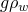，水的容重，必须作为润湿流体比重的值给出，作为材料渗透率定义的一部分。）同样，在大坝的下游面（图中表面），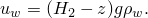

大坝底部（表面）假设位于不透水基础上。由于孔隙流体流公式中的自然边界条件不提供跨模型表面的流体流动，因此该表面不需要进一步说明。

大坝中的浸润面，，被找到为孔隙流体压力为零的点的轨迹。在这个面以上，孔隙流体压力为负，表示毛细管张力导致流体克服重力上升，形成毛细管区。与吸水和脱水过程中特定毛细管压力值相关的饱和度是多孔介质材料的物理特性，在部分饱和流动条件下的吸水/脱水行为中定义。

如果浸润面到达开放的自由排水表面，则需要特殊的边界条件，如图10.1.2-1中表面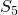所示。在这种情况下，孔隙流体可以自由沿坝面排出，因此在浸润面交叉点以下该表面上的所有点处 = 0。在这个点以上，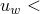 0，其特定值取决于解。本例特意选择包含这种效果来说明Abaqus排水专用流动边界条件的使用。

这种排水专用流动条件包括在自由排水表面上规定流动速度的方式，以近似满足该表面完全饱和部分上的零孔隙压力要求（Pagano，1997）。流动速度被定义为孔隙压力的函数，如图10.1.2-2所示。对于负孔隙压力（浸润面上方的那些），流动速度为零——这是正确的自然边界条件。对于正孔隙压力（浸润面下方的那些），流动速度与孔隙压力值成正比。当这个比例系数相对于较大时——其中k是介质的渗透率，是流体的比重，c是特征长度尺度——浸润面下方自由排水表面上零孔隙压力的要求将近似满足。本模型中指定的排水专用渗流系数为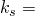 101 m^3/Nsec。该值大约是基于下面列出的材料特性和单元长度尺度 101 m的特征值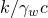的10^5倍。该条件使用带有排水专用流动类型标签（Q*n*D）的孔隙流体流定义来规定，如图[phreaticsurf_cpe8rp.inp](../eif/phreaticsurf_cpe8rp.inp)所示。

### 几何形状和模型

所考虑的具体土坝的几何形状如图10.1.2-3所示。选择这个案例是因为有可用的解析解进行比较（Harr，1962）。大坝蓄水至其高度的三分之二。只有一部分基础是不透水的。由于假设大坝很长，我们使用CPE8RP耦合孔隙压力/位移平面应变单元（网格如图10.1.2-4所示）。此外，还包含了包含单元类型CPE4P和CPE6MP的输入文件用于验证。还包含额外的输入文件来演示在耦合孔隙压力-位移分析中使用接触对、绑定约束和解传递功能。

### 材料

建造大坝的完全饱和土的渗透率为0.2117×10^-3 m/sec。部分饱和渗透率使用默认假设：它随饱和度呈立方函数变化，从完全饱和值下降到零饱和时的零值。水的比重为10 kN/m^3。大坝中的毛细管作用由单一吸水/脱水曲线定义，该曲线在饱和度0.05时负孔隙压力为10 kN/m^2到完全饱和时零孔隙压力之间线性变化。这不是对物理吸水/脱水行为的非常现实的模型，但这不会显著影响稳态分析的结果，就浸润面位置而言。如果需要定义以给定速率填充和清空大坝所产生的毛细管区，则需要准确定义此行为。

土体材料的初始孔隙比为1.0。孔隙压力和饱和度的初始条件假设对应于大坝完全饱和至上游水位：因此初始饱和度为1.0；初始孔隙压力从水位处的零到大坝底部的最大值12.19 kN/m^2变化。

### 加载和控制

水的重量通过GRAV加载施加，上游和下游孔隙压力如上所述规定。执行五个增量的稳态耦合孔隙流体扩散/应力分析，以允许Abaqus解析问题的高度非线性。

### 结果与讨论

孔隙压力的稳态等值线如图10.1.2-5所示。大坝右上部分显示负孔隙压力，表明它部分饱和或干燥。浸润面最好显示在图10.1.2-6中，我们选择在零孔隙压力附近绘制等值线。这个浸润面与Harr（1962）计算的解析浸润面比较良好，如图10.1.2-2所示。图10.1.2-7显示了饱和度等值线，表明浸润区下方是完全饱和材料的区域，浸润区及其上方饱和度下降。

### 输入文件

[phreaticsurf_cpe8rp.inp](../eif/phreaticsurf_cpe8rp.inp)

浸润面计算（单元类型CPE8RP）。

[phreaticsurf_cpe4p.inp](../eif/phreaticsurf_cpe4p.inp)

单元类型CPE4P。

[phreaticsurf_cpe6mp.inp](../eif/phreaticsurf_cpe6mp.inp)

单元类型CPE6MP。

[phreaticsurf_cpe4p_contactpair.inp](../eif/phreaticsurf_cpe4p_contactpair.inp)

使用[*CONTACT PAIR](../key/key-link.md#usb-kws-hcontactpair)选项的单元类型CPE4P。

[phreaticsurf_cpe4p_mapsolution.inp](../eif/phreaticsurf_cpe4p_mapsolution.inp)

[*MAP SOLUTION](../key/key-link.md#usb-kws-mmapsolution)继续phreaticsurf_cpe4p_contactpair.inp分析。

[phreaticsurf_cpe4p_tie.inp](../eif/phreaticsurf_cpe4p_tie.inp)

使用[*TIE](../key/key-link.md#usb-kws-mtie)选项的单元类型CPE4P。

### 参考文献

Harr, M. E., *Groundwater and Seepage, *McGraw-Hill, New York, 1962.

Pagano, L., "Steady State and Transient Unconfined Seepage Analyses for Earthfill Dams," ABAQUS Users' Conference, Milan, pp. 557–585, 1997.

### 图

**图10.1.2-1** 浸润面问题。

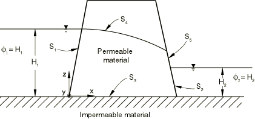

**图10.1.2-2** 排水专用表面上定义的孔隙压力-流动速度关系。

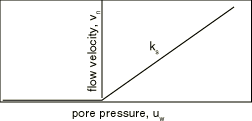

**图10.1.2-3** 土坝配置和解析浸润面。

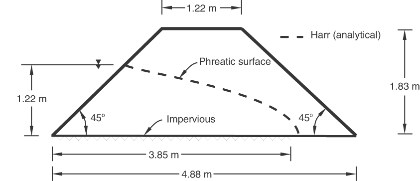

**图10.1.2-4** 有限元网格。

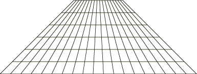

**图10.1.2-5** 稳态孔隙压力等值线。

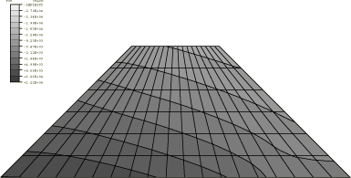

**图10.1.2-6** 显示浸润面的孔隙压力等值线。

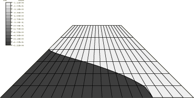

**图10.1.2-7** 稳态饱和度等值线。

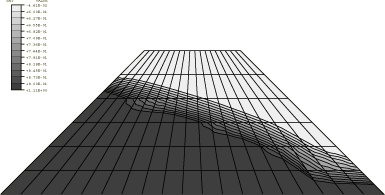

