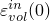
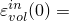
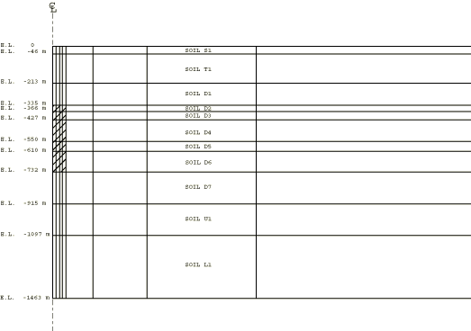
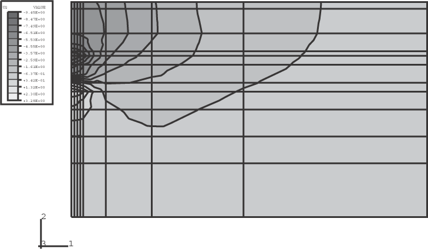
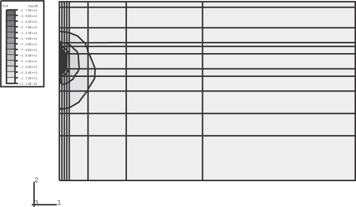
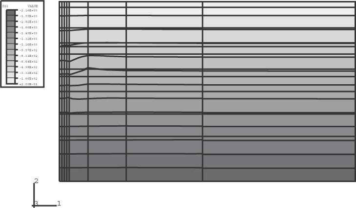
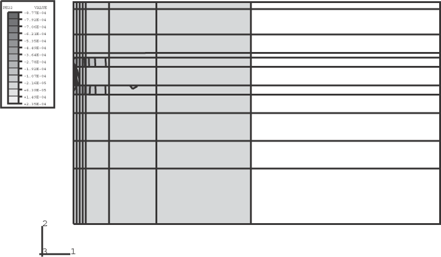
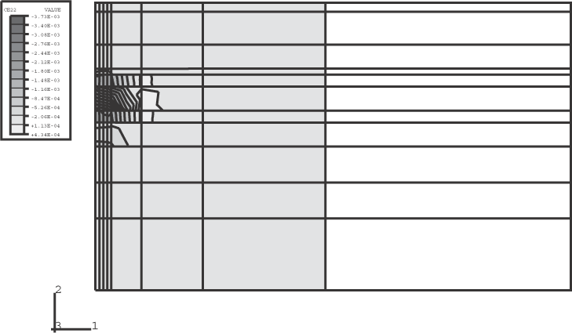

# 10.1.3 油井轴对称模拟

**产品：** Abaqus/Standard

本例模拟油井附近土壤的沉降。假设所讨论的石油太稠密，无法正常泵送。因此，将蒸汽注入井附近的土壤中以提高温度并降低石油的粘度。因此，蠕变成为土壤非弹性变形和石油泵送效果预测的重要组成部分。模拟了五年的石油泵送。这个耦合位移/扩散分析说明了Abaqus在解决涉及饱和多孔介质中的流体流动、具有时间相关蠕变行为的非弹性材料特性和热加载问题中的应用。没有可用的实验数据来比较本例的数值结果。

### 几何形状和模型

本例考虑油井及周围土壤的轴对称模型，如图10.1.3-1所示。井的半径为81 m（265 ft），井深从335 m（1100 ft）到732 m（2500 ft）。用11个不同的土层模拟1463 m（4800 ft）的深度。采用带孔隙压力的减缩积分轴对称单元CAX8RP来模拟井附近的土壤。远场区域用轴对称无限单元CINAX5R建模，以提供侧向刚度。减缩积分几乎总是推荐用于二阶单元，因为它通常能提供更精确的结果，且比全积分更经济。为说明目的选择了粗网格。未进行网格收敛性研究。

指定为S1、T1、U1和L1的土层使用Drucker-Prager塑性模型建模。弹性和非弹性材料特性见表10.1.3-1。使用Drucker-Prager模型的线性形式，不考虑中间主应力效应（ = 1.0）。模型假设非关联流动；因此，材料刚度矩阵不是对称的。使用非对称矩阵存储和非对称求解可显著改善非线性求解的收敛性。硬化/软化行为被指定为Drucker-Prager塑性材料定义的扩展，数据见表10.1.3-1。这些层没有提供蠕变数据，因为它们远离加载位置。这些层假设被水饱和。顶层土层S1和T1假设高渗透率，而U1和L1层分配低渗透率。

D1至D7层使用修正Drucker-Prager帽塑性模型建模。材料特性数据见表10.1.3-2。按照蠕变模型的要求，不包括中间主应力效应（即 = 1.0），并且不在屈服面上定义过渡区域（即 = 0.0）。材料的体积应变驱动的硬化/软化行为用帽硬化曲线定义指定，数据见表10.1.3-2。初始帽屈服面位置设置为0.02。如果应力位于帽面之外，Abaqus自动调整帽屈服面的位置。固结蠕变用Singh-Mitchell型蠕变模型建模。蠕变材料数据使用帽蠕变模型指定，并依赖于温度。指定了以下蠕变数据：
- A=2.2E7 1/day，=3.05 1/MPa (0.021 1/psi)，=1.0 day，n=1.0，在10°C（50°F）时
- A=3.5E4 1/day，=3.05 1/MPa (0.021 1/psi)，=1.0 day，n=1.0，在100°C（212°F）时

这些层由富含有机物组成，被石油饱和。渗透率数据被指定为温度依赖的。

所有层假设统一的热膨胀系数5.76E-6 1/°C（3.2E-6 1/°F）和恒定重量密度1.0 metric ton/m^3（64.6 lbs/ft^3）。

对于耦合扩散/位移分析，在选择问题单位时必须小心。如果两个不同场的方程产生的数值相差多个数量级，则耦合方程可能在数值上病态。本例选择的单位是英寸、磅和天。

### 初始条件

为分析定义了基于土壤重量密度积分深度的初始地应力场。假设侧应力系数为0.85。所有土层使用初始孔隙比1.5，初始均匀温度场为10°C（50°F）。

### 加载

问题分五步运行。分析的第一步是建立有限元模型地应力加载平衡的地应力步。这一步也建立了孔隙压力的初始分布。由于重力加载用分布荷载类型BZ定义，而不是用重力荷载类型GRAV定义，Abaqus报告的孔隙流体压力被定义为超过在材料点高程上方支撑孔隙流体重量所需的静水压力的孔隙压力。

第二步是瞬态土体固结分析步，以平衡由初始地应力加载步引起的任何蠕变效应。在固结分析中初始时间步长的选择很重要。由于空间和时间尺度的耦合，生成的时间步长小于网格和材料相关特征时间的解不会提供有用的信息。比该特征时间小很多的时间步长会产生虚假的振荡结果。关于最小时间步长计算的进一步讨论，请参阅["耦合孔隙流体扩散和应力分析，" Abaqus分析用户指南第6.8.1节](../usb/usb-link.md#usb-anl-acoupdiffstress)。对于本例，选择一天的最小初始时间步长。

分析的第三步模拟在366 m至732 m（1200 ft至2400 ft）深度之间向井区域注入蒸汽。该区域如图10.1.3-1中的阴影区域所示。在瞬态土体固结分析期间，该区域中的节点被加热到100°C（212°F）。不考虑蠕变效应。蒸汽的注入增加了石油的渗透率并增加了土壤蠕变行为。

第四步通过在表面以下427 m至550 m（1400 ft至1800 ft）深度处的节点上指定过量孔隙压力1.2 MPa（170 psi）来模拟石油泵送。该压力在第五年末产生约172.5千桶/天的泵送速率。

最后一步包括在五年期间执行的固结分析，以研究井附近泵送和蠕变效应导致的沉降。

### 结果与讨论

两个初始步显示可忽略的变形，表明模型处于地应力平衡。图10.1.3-2显示了五年期间固结后土壤沉降的等值线图。表面预计沉降0.13 m（0.4 ft）。泵入口上方最大土壤位移为0.24 m（0.78 ft）。图10.1.3-3显示了过量孔隙压力的等值线图。负孔隙压力表示泵的吸力。在五年期间，总共抽出了3.135亿桶石油（由节点输出变量RVT确定）。图10.1.3-4至图10.1.3-6分别显示了垂直应力分量、塑性应变和蠕变应变的等值线图。塑性化发生在D3至D5土层中。蒸汽注入区域发生显著蠕变。

### 输入文件

[axisymoilwell.inp](../eif/axisymoilwell.inp)

有限元分析。

[axisymoilwell_thermalexp.inp](../eif/axisymoilwell_thermalexp.inp)

除了孔隙流体的热膨胀也被包括之外，与axisymoilwell.inp相同。

### 表

**表10.1.3-1** 使用Drucker-Prager模型的土体数据。
| 土层 | 弹性特性 | 非弹性特性 | 硬化行为 |
| --- | --- | --- | --- |
| S1 |  124 MPa |  42.0 | 0.075 MPa, 0.0 |
|  0.3 | K  1.0 | 0.083 MPa, 0.058 |
|  0.0 | 0.075 MPa, 0.116 |
| T1 |  2068 MPa |  36.0 | 0.48 MPa, 0.0 |
|  0.25 | K  1.0 | 0.62 MPa, 0.058 |
|  0.0 | 0.48 MPa, 0.116 |
| U1 |  468.8 MPa |  38.0 | 1.97 MPa, 0.0 |
|  0.22 | K  1.0 | 3.17 MPa, 0.0037 |
|  0.0 | 2.47 MPa, 0.04 |
| L1 |  2482 MPa |  38.0 | 1.97 MPa, 0.0 |
|  0.29 | K  1.0 | 3.17 MPa, 0.0037 |
|  0.0 | 2.47 MPa, 0.04 |

**表10.1.3-2** 使用修正Drucker-Prager帽模型的土体数据。
| 土层 | 弹性特性 | 非弹性特性 | 硬化行为 |
| --- | --- | --- | --- |
| D1 |  328 MPa | d  1.38 MPa |  0.0 | 2.75 MPa, 0.0 |
|  0.17 |  36.9 | K  1.0 | 4.14 MPa, 0.02 |
| R  0.33 |  0.02 | 5.51 MPa, 0.05 |
| 6.20 MPa, 0.09 |
| D2 |  434 MPa | d  1.38 MPa |  0.0 | 1.38 MPa, 0.0 |
|  0.17 |  39.4 | K  1.0 | 4.14 MPa, 0.02 |
| R  0.33 |  0.02 | 6.89 MPa, 0.04 |
| 55.1 MPa, 0.1 |
| D3 |  546 MPa | d  1.38 MPa |  0.0 | 1.38 MPa, 0.0 |
|  0.19 |  42.0 | K  1.0 | 3.45 MPa, 0.02 |
| R  0.34 |  0.02 | 13.8 MPa, 0.04 |
| 62.0 MPa, 0.06 |
| D4 |  411 MPa | d  1.2 MPa |  0.0 | 1.38 MPa, 0.0 |
|  0.2 |  40.1 | K  1.0 | 5.03 MPa, 0.02 |
| R  0.3 |  0.02 | 6.90 MPa, 0.10 |
| 62.0 MPa, 0.3 |
| D5 |  494 MPa | d  1.38 MPa |  0.0 | 2.75 MPa, 0.0 |
|  0.17 |  40.4 | K  1.0 | 4.83 MPa, 0.02 |
| R  0.3 |  0.02 | 5.15 MPa, 0.04 |
| 62.0 MPa, 0.08 |
| D6 |  775 MPa | d  17 MPa |  0.0 | 2.76 MPa, 0.0 |
|  0.17 |  50.2 | K  1.0 | 4.14 MPa, 0.005 |
| R  0.23 |  0.02 | 7.58 MPa, 0.02 |
| 62.0 MPa, 0.05 |
| D7 |  1,121 MPa | d  1.7 MPa |  0.0 | 3.44 MPa, 0.0 |
|  0.17 |  58.5 | K  1.0 | 4.14 MPa, 0.006 |
| R  0.23 |  0.02 | 7.58 MPa, 0.012 |
| 67.6 MPa, 0.03 |

### 图

**图10.1.3-1** 油井及周围土壤的轴对称模型。

**图10.1.3-2** 五年期间的土壤沉降。

**图10.1.3-3** 孔隙压力等值线图。

**图10.1.3-4** 垂直应力分量等值线图。

**图10.1.3-5** 垂直塑性应变分量等值线图。

**图10.1.3-6** 垂直蠕变应变分量等值线图。

