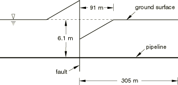
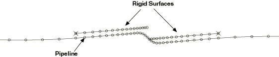
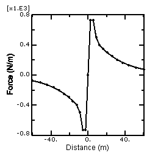
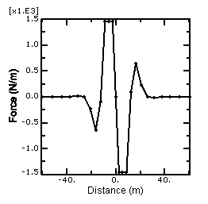
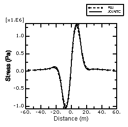

# 10.1.4 Analysis of a pipeline buried in soil

**Product: **Abaqus/Standard  

Oil and gas pipelines are usually buried in the ground to provide protection and support. Buried pipelines may experience significant loading as a result of relative displacements of the ground along their length. Such large ground movement can be caused by faulting, landslides, slope failures, and seismic activity.

Abaqus provides a library of pipe-soil interaction (PSI) elements to model the interaction between a buried pipeline and the surrounding soil. The pipeline itself is modeled with any of the beam, pipe, or elbow elements in the Abaqus/Standard element library. The ground behavior and soil-pipe interaction are modeled with the pipe-soil interaction elements. These elements have only displacement degrees of freedom at their nodes. One side or edge of the element shares nodes with the underlying beam, pipe, or elbow element that models the pipeline. The nodes on the other edge represent a far-field surface, such as the ground surface, and are used to prescribe the far-field ground motion. The elements are described in detail in ["Pipe-soil interaction elements," Section 32.12.1 of the Abaqus Analysis User's Guide](../usb/usb-link.md#usb-elm-epipesoil).

The purpose of this example is to determine the stress state along the length of a infinitely long buried pipeline subjected to large fault movement of 1.52 m (5.0 ft), as shown in [Figure 10.1.4--1](ch10s01aex141.md#sxmburiedpipeline-model). The pipeline intersects the fault at 90.0. The results are compared with results from an independent analysis, as described below.

### Problem description

The problem consists of an infinitely long pipeline buried at a depth of 6.1 m (20.0 ft.) below the ground surface. Only a 610.0 m (2000.0 ft.) long section of the pipeline is modeled. The outside radius of the pipe is 0.61 m (24.0 in), and the wall thickness is 0.0254 m (1.0 in). The pipeline is modeled with 50 first-order PIPE21 elements. A nonuniform mesh, with smaller elements focused near the fault, is used.

The pipe-soil interaction behavior is model with PSI24 elements. The PSI elements are defined so that one edge of the element shares nodes with the underlying pipe element, and the nodes on the other edge represent a far-field surface where ground motion is prescribed. The far-field side and the side that shares nodes with the pipeline are defined by the element connectivity.

A three-dimensional model that uses PIPE31 and PSI34 elements is also included for verification purposes.

### Material

The pipeline is made of an elastic–perfectly plastic metal, with a Young's modulus of 206.8 GPa (30  106 lb/in2), a Poisson's ratio of 0.3, and a yield stress of 413.7 MPa (60000 lb/in2).

The pipe-soil interaction behavior is elastic–perfectly plastic. The nonlinear constitutive model is used to define the interaction model. The behavior in the vertical direction is assumed to be different from the behavior along the axial direction. It is further assumed that the pipeline is buried deep below the ground surface so that the response is symmetric about the origin. Abaqus also allows a nonsymmetric behavior to be defined in any of the directions (this is usually the case in the vertical direction when the pipeline is not buried too deeply). The ultimate force per unit length in the axial direction is 730.0 N/m (50.0 lb/ft), and in the vertical direction it is 1460.0 N/m (100.0 lb/ft). The ultimate force is reached at 0.0304 m (0.1 ft) in both the horizontal and vertical directions.

The loading occurs in a plane (axial-vertical), so the properties for the pipe-soil interaction behavior in the transverse horizontal direction are not important. 

### Loading

The loading on the pipeline is caused by a relative vertical displacement 1.52 m (5.0 ft) along the fault line. It is assumed that the effect of the vertical ground motion decreases linearly over a distance of 91.4 m (300.0 ft.) from the origin of fault, as shown in [Figure 10.1.4--1](ch10s01aex141.md#sxmburiedpipeline-model). 

This linear distribution of ground motion is prescribed as follows. Rigid (R2D2) elements are connected to the far-field edges of the PSI to create two rigid surfaces, one on each side of the fault line. These surfaces extend a distance of 91.4 m (300.0 ft.) from the origin of the fault. The rigid body reference nodes are also placed a distance of 91.4 m (300.0 ft.) from the fault on the ground surface. The fault movement is modeled by prescribing a rotation to each of the rigid body reference nodes so that a positive vertical displacement of 0.76 m (2.5 ft) is obtained on one side of the fault and a negative vertical displacement of 0.76 m (2.5 ft) is obtained on the other side of the fault, as shown in [Figure 10.1.4--2](ch10s01aex141.md#sxmburiedpipe-disp). All degrees of freedom on the remaining far-field nodes are fully fixed. In addition, the two end points of pipeline are fully fixed. [Figure 10.1.4--2](ch10s01aex141.md#sxmburiedpipe-disp) does not show the PSI elements or any of the remaining nodes on the ground surface.

### Reference solution

The reference solution is obtained by using JOINTC elements between the pipeline and ground nodes to model the pipe-soil interaction. These elements provide an internal stiffness, which is modeled with linear or nonlinear springs; nonlinear springs are used in this example. The behavior of the nonlinear spring is elastic in the sense that reversed loading does not result in permanent deformation. This behavior is different from the behavior provided by the nonlinear PSI elements. However, this is not a limitation in this example since the loading is monotonic. 

Another distinct difference between JOINTC elements and PSI elements is that the spring behavior associated with JOINTC elements is defined in terms of total force, whereas the constitutive behavior for PSI elements is defined as a force/unit length. This difference requires us to define a separate stiffness for each JOINTC element or to use a uniform mesh with JOINTC elements spaced at unit length intervals along the pipeline. A unit length mesh is used in this example. 

### Results and discussion

[Figure 10.1.4--3](ch10s01aex141.md#sxmburiedpipe-psis1) and [Figure 10.1.4--4](ch10s01aex141.md#sxmburiedpipe-psis2) show the axial and vertical forces per unit length applied to the pipeline due to relative ground motion. The figures show that permanent deformation occurs in the pipe-soil interaction model near the fault along the axial and horizontal directions, with purely elastic behavior further from the fault. 

[Figure 10.1.4--5](ch10s01aex141.md#sxmburiedpipe-pipes1) compares the axial stress in the bottom wall of the pipeline with the reference solution. The figure shows that the pipeline behavior is purely elastic. The figure also shows close agreement with the reference solution. The small differences between the solutions can be accounted for by the different mesh densities. The reaction forces at the pipeline edges and the maximum pipeline displacements are also in close agreement with the reference solution.

### Input files

[buriedpipeline_2d.inp](../eif/buriedpipeline_2d.inp)

Two-dimensional model using PSI24 elements.

[buriedpipeline_3d.inp](../eif/buriedpipeline_3d.inp)

Three-dimensional model using PSI34 elements.

[buriedpipeline_ref.inp](../eif/buriedpipeline_ref.inp)

Reference solution using JOINTC elements.

### Reference

Audibert,  J. M. E., D. J. Nyman, and T. D. O'Rourke, “Differential Ground Movement Effects on Buried Pipelines,” Guidelines for the Seismic Design of Oil and Gas Pipeline Systems, ASCE publication, pp. 151–180, 1984.

### Figures

**Figure 10.1.4–1** Pipe with fault motion.

**Figure 10.1.4–2** Displaced shape (magnification factor=10.0).

**Figure 10.1.4–3** Axial force/unit length applied along the pipeline.

**Figure 10.1.4–4** Vertical force/unit length applied along the pipeline.

**Figure 10.1.4–5** Axial stress along the bottom of the pipeline.

