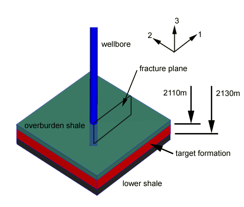
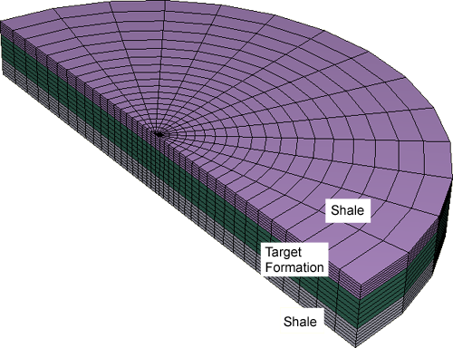
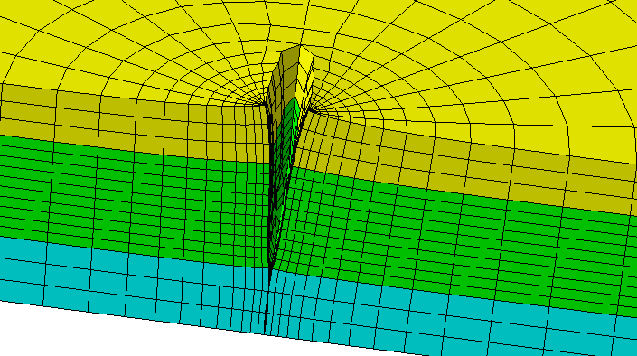
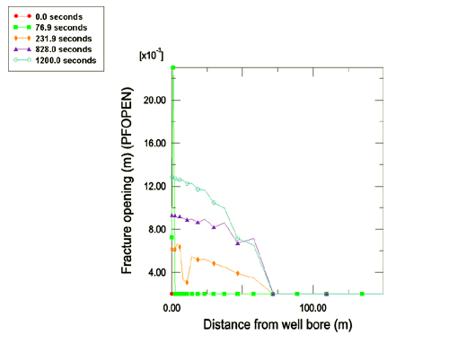
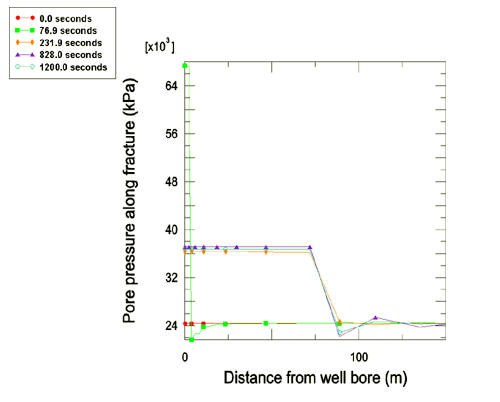
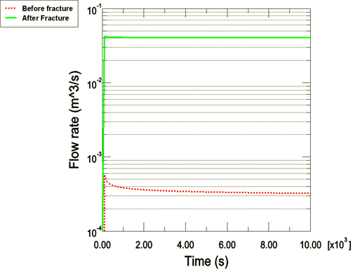

# 10.1.5 井筒中水力压裂

**产品：** Abaqus/Standard

本例演示了使用孔隙压力内聚单元来模拟油井井筒附近水力致裂裂缝的萌生和张开。通过本节说明的技术，您可以评估水力压裂过程对井筒生产率的定量影响。

### 问题描述

水力压裂工艺常用于油藏和气藏的生产，以增加井的生产率并延长储层的生产寿命。水力压裂处理的目标是：

1. 创造更多暴露于含烃岩石的表面积，以及
2. 提供高度导流的通道，使烃类容易流向井筒。

水力压裂油井或气井的生产率与裂缝的范围以及井筒与裂缝的连接程度直接相关。一些岩层含有天然裂缝系统，如果产生的水力裂缝能够增长使其与这些天然裂缝相交，则可以进一步提高井的生产率。

水力压裂作业包括以非常高的压力将流体泵入井中，使得井筒面产生的牵引力大大降低岩石中的原位（压缩）应力，从而导致岩石压裂。一旦裂缝在岩层中萌生，如果有足够的水力流体，就有可能将裂缝传播相当远的距离，有时可达一百米或更远。

压裂作业的执行是复杂的操作。在大多数情况下，压裂作业期间将泵送几种不同类型的流体（阶段）。

#### 泵送阶段

初始阶段通常涉及泵送少量聚合物负载流体，通常为1-20桶（0.15至3.2立方米），以便收集压裂岩层所需的压力数据和流体从裂缝"漏失"到岩石孔隙中的速率数据。收集的数据用于计划后续作业阶段。作业的主要阶段可能包含一百到几千桶不等的水力流体。该阶段的规模由目标裂缝大小、漏失速率和泵的容量（速率）决定。

在压裂作业的下一阶段，将称为支撑剂的固体材料加入到注入流体中，并被携带进入裂缝体积。通常添加化学品（通常是聚合物）到每个压裂阶段的流体中，以产生流体所需的特性（粘度、漏失、密度）。在作业的最后阶段，将化学品泵入裂缝，以帮助分解前几个阶段使用的聚合物，使流体更容易在不断裂支撑剂材料的情况下流回裂缝。

### 几何形状和模型

本例考虑的问题域是一块50 m（1969 in）厚的含油岩石圆形切片，建模井筒。域的直径为400 m（15,748 in）。考虑了三个岩石区域：目标开采油回收的区域，以及两个周围的页岩区域。域如图10.1.5-1所示。

由于对称，只对域的一半进行建模。有限元模型如图10.1.5-2所示。岩石用C3D8RP单元建模，井筒套管用M3D4单元建模。

未张开裂缝沿模型域的整个高度建模。内聚单元（COH3D8P）用于建模垂直裂缝表面。

#### 岩石本构模型

岩石选用带硬化的线性Drucker-Prager模型，套管为线性弹性。

#### 裂缝本构模型

裂缝模型由裂缝本身的力学行为和进入并通过裂缝表面泄漏的流体的行为组成。

##### 裂缝力学行为

结合界面的弹性特性用牵引-分离描述定义，刚度值为=== 8.5×10^4 MPa。为内聚单元中的损伤萌生选择二次牵引-相互作用失效准则；为损伤扩展选择基于混合模式、能量的损伤演化律。相关材料数据如下： =  = 0.32 KPa，= == 28 N/mm，以及= 2.284。

##### 流体模型

在裂缝区内聚单元中同时建模切向和法向流动。指定以下参数：
- 间隙流动指定为牛顿型，粘度为1×10^6 kPa·s（1厘泊），大约为水的粘度。
- 流体漏失在早期阶段指定为5.879×10^-10 m/(kPa·s)。在最后阶段，当聚合物溶解时，流体漏失系数增加到1×10^-3 m/(kPa·s)。此步依赖的流体漏失系数在用户子程序[`UFLUIDLEAKOFF`](../sub/sub-link.md#sub-xsl-ufluidleakoff)中设置。

### 初始条件

使用用户子程序[`SIGINI`](../sub/sub-link.md#sub-xsl-sigini)和[`UPOREP`](../sub/sub-link.md#sub-xsl-uporep)定义初始地应力场。使用用户子程序[`VOIDRI`](../sub/sub-link.md#sub-xsl-voidri)指定随深度变化的初始孔隙比。规定重力加载；并施加各向异性的上覆岩层应力状态，最大主应力在岩层中与内聚单元裂缝平面正交对齐。

### 加载和边界条件

分析由四个步组成：

1. 执行地应力步，在对岩层施加初始孔隙压力和初始原位应力后达到平衡。井底关井压力作为牵引力施加到井筒面。
2.下一步代表水力压裂阶段，主要体积的流体正在注入井中。以每分钟2.4 m^3（15桶）的速率沿模型中目标岩层8 m范围注入，靠近井筒沿此长度的内聚单元定义为初始张开以允许流体进入。此阶段持续20分钟。
3. 水力压裂后，进行另一次瞬态土体固结分析。停止向井中注入，允许裂缝中累积的孔隙压力释放到岩层中。在此阶段施加额外的边界条件，将裂缝表面固定为张开，以模拟注入裂缝的支撑剂材料的行为。
4. 最后一步，在裂缝内聚单元的井筒节点上施加20 kPa的降压压力。此步在生产100天或达到稳态条件时结束，定义为模型中孔隙压力瞬态低于0.05 kPa/sec。

### 结果与讨论

第2步泵送阶段注入的流动萌生并扩展了从井筒向外延伸的裂缝。图10.1.5-3显示了20分钟泵送期结束时裂缝的结果几何形状。这些结果表明，在目标岩层区域内萌生的裂缝倾向于避开压缩应力较高的下方页岩区，但会渗入上方页岩区，在那里可能降低井的产量。

图10.1.5-4显示了泵送阶段不同时间裂缝张开轮廓；显示在1200 s时的最终轮廓，然后在后续步中固定，用支撑剂材料保持裂缝张开。图10.1.5-5显示了裂缝面孔隙压力类似的历史，并表明孔隙流动已稳定。

图10.1.5-6显示了水力压裂过程后的井筒产量。与没有发生水力压裂的等效模型进行了比较。在这个简单示例中，水力压裂井筒显示出显著改善，流量超过未压裂配置的100倍。

### 输入文件

[exa_hydfracture.inp](../eif/exa_hydfracture.inp)

水力压裂分析。

[exa_hydfracture.f](../eif/exa_hydfracture.f)

用户子程序[`DISP`](../sub/sub-link.md#sub-xsl-disp)、[`DLOAD`](../sub/sub-link.md#sub-xsl-dload)、[`SIGINI`](../sub/sub-link.md#sub-xsl-sigini)、[`UPOREP`](../sub/sub-link.md#sub-xsl-uporep)、[`UFLUIDLEAKOFF`](../sub/sub-link.md#sub-xsl-ufluidleakoff)和[`VOIDRI`](../sub/sub-link.md#sub-xsl-voidri)。

### 图

**图10.1.5-1** 目标岩层和周围页岩的位置。

**图10.1.5-2** 井筒附近网格。

**图10.1.5-3** 注入阶段后的裂缝几何形状，变形放大50倍。

**图10.1.5-4** 裂缝张开轮廓历史。

**图10.1.5-5** 裂缝孔隙压力轮廓历史。

**图10.1.5-6** 水力压裂过程前后的井筒产量。

