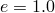
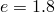
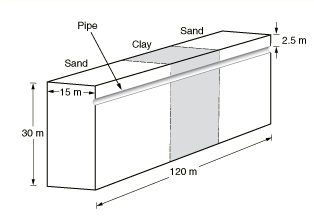
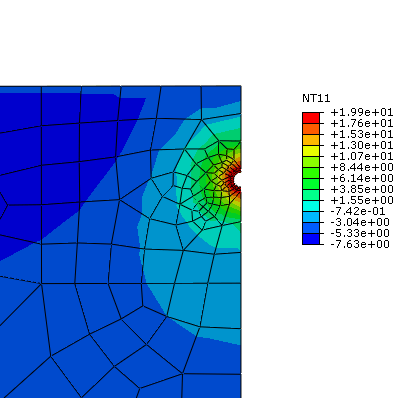
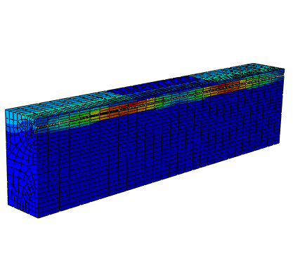
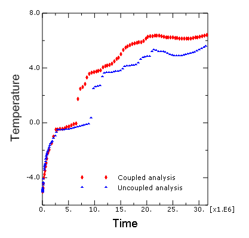
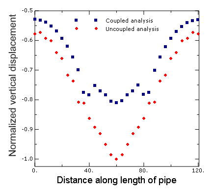

# 10.1.6 Permafrost thawing–pipeline interaction

### 10.1.6 Permafrost thawing--pipeline interaction

**Product: **Abaqus/Standard  

### Objectives

This example illustrates the use of the coupled temperature–pore pressure displacement modeling capability in Abaqus/Standard to model the effects of thaw settlement that commonly occurs in relatively warm pipelines buried in permafrost.

### Application description

Thaw settlement generally occurs in shallow waters and at shore crossings where soil ice-bonded permafrost underlies the pipeline (Xu et al., 2009). Due to the heat released from the relatively warm pipeline, the surrounding permafrost may gradually thaw over years of operation and create a permafrost thaw bulb. The load carrying capacity of the soil is generally believed to be reduced as a result of the thaw formation, which could in turn (as a result of the weight of the soil above it) lead to excessive deformation and stress in the pipeline leading to its eventual damage.

Two primary mechanisms control the behavior of the problem: heat transfer from the warm pipeline to the surrounding permafrost leading to thawing of the permafrost and diffusion of the pore fluid and associated consolidation of the thawed soil mass surrounding the pipeline. The analysis is carried out utilizing two approaches. The first approach is a sequential one, in which the permafrost melting process is modeled as a pure heat transfer analysis in Abaqus, and the resulting temperature is used to drive a soils consolidation analysis. The second approach is fully coupled, in which the heat transfer and soils consolidation problems are solved in a fully coupled manner in a single analysis. This approach uses the coupled temperature–pore pressure elements that solve for the temperature field as a nodal degree of freedom in addition to the displacement and the pore pressure fields. The results obtained using these two approaches are compared, and the advantages of using a fully coupled approach are discussed. The model presented here has been adapted from Xu et al. (2009), where the first approach alone was used to investigate this problem.

### Geometry

[Figure 10.1.6--1](ch10s01aex143.md#sxmburiedpipepermafrost-geom-nls) shows the geometry of the model consisting of two outer sections of sand separated by an inner section of clay, which approximates the nonuniform soil properties that are often encountered in practice along a pipeline. The geometry assumes symmetry about the right vertical plane in the figure, and the dimensions of the soil mass are as shown. The pipe diameter and thickness are assumed to be 0.4 m (15.76 in) and 0.096 m (3.8 in), respectively, and it is assumed to be buried 2.5 m below the soil surface.

### Materials

The material properties assumed for this analysis are shown in [Table 10.1.6--1](ch10s01aex143.md#buriedpipepermafrost-matdata-clay), [Table 10.1.6--2](ch10s01aex143.md#buriedpipepermafrost-matdata-sand), [Table 10.1.6--3](ch10s01aex143.md#buriedpipepermafrost-matdata-steel), and [Table 10.1.6--4](ch10s01aex143.md#buriedpipepermafrost-matdata-water) for clay, sand, steel, and water (pore fluid), respectively. The symbols , , , , , , , , and  represent the Young's modulus, Poison's ratio, thermal conductivity, density, specific heat, latent heat, thermal expansion coefficient, permeability, and void ratio, respectively. The elastic and the pore fluid flow properties of the soil are assumed to depend on whether the soil is frozen (more precisely, whether the water in the soil is frozen) or thawed. The soil is assumed to be significantly stiff and impermeable when frozen compared to the corresponding properties when thawed. The properties in the frozen state and the thawed state are distinguished from each other using the symbols F and T, respectively, next to a property symbol. This approach approximately captures the effects of phase change of the pore fluid on the mechanical properties of the soil and can be improved upon with a more detailed modeling of the physics of the phase change process. In the heat transfer part of the sequential approach, the thermal properties are assumed to be weighted averages of the properties of the individual constituents (clay or sand, and water). The latent heat of fusion from ice to water is utilized to define the phase change of the soil. The pipe is assumed to be made out of steel, with the mechanical behavior defined using a linear elastic model along with thermal expansion. Inelastic response of the pipe material, such as plasticity and creep, can be easily included in the model if needed. Both the soil and the pore fluid are also assumed to undergo thermal expansion associated with the temperature variation. Thermal expansion is an important part of the overall physics of the problem, with the differential expansion of the pore fluid relative to pores in the soil often determining the initial rise in the pore pressure. 

### Initial conditions

The initial temperature is assumed to be 5C everywhere in the model. The initial void ratio, pore pressure, and saturation are assumed to be 1.8, 0.0, and 1.0, respectively, everywhere in the model. Thus, the pore fluid flow is assumed to occur under fully saturated conditions. Initial effective geostatic stress in the vertical direction is defined as a function of the depth below the soil surface. The stress in the horizontal direction is assumed to be a fraction of the stress in the vertical direction.

### Boundary conditions and loading

All the outer surfaces of the model (except the top surface) are assumed to be restrained from moving in a perpendicular direction. Following Xu et al. (2009), the model assumes the flow of heat and fluid across all the outer surfaces (except the top surface) to be zero. The top surface allows free drainage (zero pore pressure). The axial displacement at both ends of the pipe is restrained.

### Abaqus modeling approaches and simulation techniques

In the consolidation part of the analysis in the sequential approach, the soil is modeled using pore pressure elements with displacement and pore pressure degrees of freedom, while the pipe is modeled using solid continuum elements using displacement degrees of freedom only. In the coupled analysis, the soil is modeled using the coupled elements with displacement, pore pressure, and temperature degrees of freedom, while the pipe is modeled using coupled elements with displacement and temperature degrees of freedom only. The soil and the pipe share nodes at the interface. An alternate approach would model this interface utilizing contact constraints; however, this approach has not been used because contact is not supported with the coupled temperature–pore pressure elements.

### Analysis types

The sequential approach utilizes a heat-transfer analysis first to determine the temperature profile. This temperature profile is subsequently used to drive the mechanical part of the simulation that does not model heat transfer. The latter consists of two steps: a geostatic analysis, followed by a soils consolidation analysis. On the other hand, the coupled approach solves the thermal and mechanical problem in a fully coupled manner and consists of two steps: a geostatic analysis, followed by a soils consolidation analysis.

### Mesh design

 The heat transfer part of the sequential approach uses first-order brick (DC3D8) elements, while the consolidation part of the sequential approach uses first-order reduced-integration (C3D8RP and C3D8R) elements for the soil and pipe regions, respectively. The coupled analysis uses first-order reduced-integration fully coupled (C3D8RPT and C3D8RT) elements for the soil and pipe regions, respectively.

### Loads

 Inside the pipe the fluid is assumed to be flowing at 20C. A constant convection coefficient on the inner pipe wall is assumed. The top surface of the soil is subjected to a sinusoidal temperature variation ranging between 5C and 5C. The above boundary condition approximately represents the season variation of temperature at the soil surface. The weight of the pipe is considered as a load and is modeled as a body force in the vertical direction.

While the physics of this problem will likely span two or more decades, the present analysis is carried out for a period of one year in order to present the basic framework for an analysis of this type. 

### Solution controls

The simulations use solution controls to specify a nondefault initial value of the time average pore fluid flux. The default choice may not be appropriate in situations such as those encountered in the present problem where the fluid velocities are, in relative terms, lower compared to typical flux values encountered for other fields (such as displacements or rotations). Without the above specification, the increments would be treated as linear from the viewpoint of the continuity equation. In other words, without using solution controls to specify a nondefault initial value of the time average pore fluid flux, the pore fluid part of the incrementation will be treated as linear. Consequently, the continuity equation would be assumed to have been satisfied at the first iteration itself, without performing any further iterations to compute corrections to pore pressure.

### Results and discussion

[Figure 10.1.6--2](ch10s01aex143.md#sxmburiedpipepermafrost-thawbulb) shows a contour of the temperature field around the buried pipe after a period of one year. The temperature profile can be used to determine the thaw bulb around the pipe. The results are obtained from the heat transfer part of the sequential approach; the coupled analysis produces similar results. The thaw bulb represents the region where the permafrost has thawed and the temperature is above freezing. [Figure 10.1.6--2](ch10s01aex143.md#sxmburiedpipepermafrost-thawbulb) shows the mesh for the whole model along with the contour plot of the fluid velocities. The zero pore pressure boundary condition on the top surface allows the seepage of pore fluid across this surface. Clay is significantly less permeable compared to sand; and the effect can be observed in [Figure 10.1.6--3](ch10s01aex143.md#sxmburiedpipepermafrost-flvel), the flow across the top surface in the clay section is less compared to the flow in the sand section.

[Figure 10.1.6--4](ch10s01aex143.md#sxmburiedpipepermafrost-temp) shows the temperature history at a point (node number 1591) in the soil in the vicinity of the pipe. The two curves were obtained from the uncoupled (sequential) and coupled analysis. The temperature results are, in relative terms, close to each other before thawing. However, upon thawing the results from the coupled analysis predict a higher temperature. The latter may be explained by recalling that unlike the coupled analysis, the heat transfer part of the uncoupled (sequential) analysis does not account for heat transfer associated with pore fluid flow. The results from both the sequential and coupled analyses predict that the temperature does not increase significantly for a certain period of time after it reaches 0C. This behavior is due to phase change of the pore fluid as a result of thawing; all the available heat is used up as the latent heat of fusion.

[Figure 10.1.6--5](ch10s01aex143.md#sxmburiedpipepermafrost-disp) shows the normalized (by the maximum vertical displacement from the uncoupled analysis) vertical displacement as a function of length along the span of the pipe for both the uncoupled (sequential) and coupled analyses. The uncoupled analysis predicts a higher peak displacement compared to the coupled analysis. This can be attributed to the difference in temperatures at points in the vicinity of the pipe as predicted by the two analyses and the associated effects on the elastic stiffness of the surrounding soil mass. It is particularly interesting to note that a fully coupled analysis can be used as a basis for a less conservative design as the predicted displacements and associated stresses are lower.

### Input files

[buried_pipe_permafrost_ht.inp](../eif/buried_pipe_permafrost_ht.inp)

Heat transfer part of the sequential analysis.

[buried_pipe_permafrost_consol.inp](../eif/buried_pipe_permafrost_consol.inp)

Consolidation part of the sequential analysis.

[buried_pipe_permafrost_ctup.inp](../eif/buried_pipe_permafrost_ctup.inp)

Fully coupled analysis.

### References

**Abaqus Analysis User's Guide**
- ["Coupled pore fluid diffusion and stress analysis," Section 6.8.1 of the Abaqus Analysis User's Guide](../usb/usb-link.md#usb-anl-acoupdiffstress)
- ["Geostatic stress state," Section 6.8.2 of the Abaqus Analysis User's Guide](../usb/usb-link.md#usb-anl-ageostatstress)

**Abaqus Keywords Reference Guide**
- [*GEOSTATIC](../key/key-link.md#usb-kws-hgeostatic)
- [*SOILS](../key/key-link.md#usb-kws-hsoils)

**Other**

- Xu, J., B. Abdalla, A. Eltaher, and P. Jukes, "Permafrost Thawing-Pipeline Interaction Advanced Finite Element Model," Proceedings of the ASME 2009 28th International Conference on Ocean, Offshore, and Arctic Engineering, OMAE2009--79554, 2009.

### Tables

**Table 10.1.6–1** Properties for clay (F-frozen state, T-thawed state).
| Property | Value |
| --- | --- |
|  (F) | 1.03421 1011 Pa |
|  (T) | 6.89476 105 Pa |
|  | 0.30 |
|  | 2.0 J/sec mC |
|  | 1602.0 kg/m3 |
|  | 1381.0 J/kg C |
|  | 9.67 106 /C |
|  (F) | 1.0 10--14 m/sec |
|  at  (T) | 1.0 108 m/sec |
|  at  (T) | 2.0 108 m/sec |

**Table 10.1.6–2** Properties for sand (F-frozen state, T-thawed state).
| Property | Value |
| --- | --- |
|  (F) | 1.03421 1011 Pa |
|  (T) | 1.03421 107 Pa |
|  | 0.30 |
|  | 2.0 J/sec mC |
|  | 1602.0 kg/m3 |
|  | 1381.0 J/kg C |
|  | 5.60 106 /C |
|  (F) | 1.0 10--13 m/sec |
|  at  (T) | 1.0 107 m/sec |
|  at  (T) | 2.0 107 m/sec |

**Table 10.1.6–3** Properties for steel.
| Property | Value |
| --- | --- |
|  | 2.0 1011 Pa |
|  | 0.30 |
|  | 52.0 J/sec mC |
|  | 7832.0 kg/m3 |
|  | 434.0 J/kg C |
|  | 12.0 106 /C |

**Table 10.1.6–4** Properties for water (pore fluid).
| Property | Value |
| --- | --- |
|  | 0.58 J/sec mC |
|  | 1000.0 kg/m3 |
|  | 4186.0 J/kg C |
|  (at 5C) | 51.0 106 /C |
|  (at 0C) | 51.0 106 /C |
|  (at 1C) | --16.67 106 /C |
|  (at 4C) | 0.0 |
|  (at 10C) | 29.33 106 /C |

### Figures

**Figure 10.1.6–1** Pipeline buried in permafrost (half-symmetry model).

**Figure 10.1.6–2** Thaw bulb around the relatively warm pipe after one year.

**Figure 10.1.6–3** The meshed buried pipeline model showing the contour of fluid velocities. The relatively impermeable clay region exhibits low fluid velocities (blue-colored contour in top center section).

**Figure 10.1.6–4** Temperature history in the soil near the pipe.

**Figure 10.1.6–5** Normalized vertical displacement along the length of the pipe.

