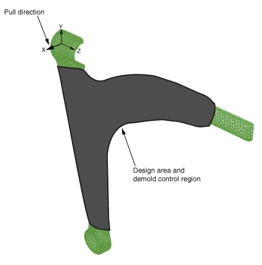
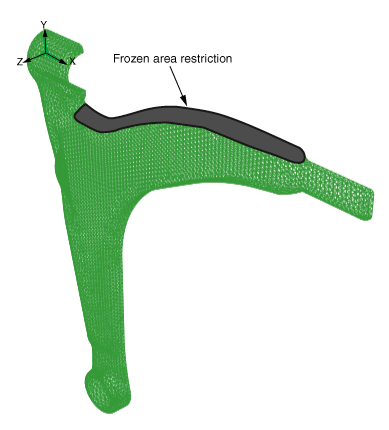
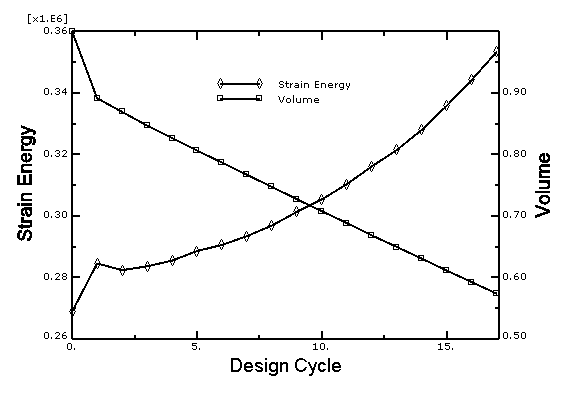

# 11.1.1 Topology optimization of an automotive control arm

**Products: **Abaqus/Standard  Abaqus/CAE  

### Objectives

 This example uses the Optimization Module to optimize the design of an automotive control arm by reducing the volume of the control arm while maximizing its stiffness.

### Application description

This example illustrates topology optimization of an automotive control arm. During a topology optimization, the material properties of the elements in the design area are modified (effectively removing elements from or adding elements to the Abaqus analysis) until the optimal solution is achieved. For more information, see ["Topology optimization" in "Structural optimization: overview," Section 13.1.1 of the Abaqus Analysis User's Guide](../usb/usb-link.md#usb-anl-aoptover-topo).

### Geometry

The control arm model is a single orphan mesh part that was meshed with quadratic tetrahedral (C3D10) elements. The control arm is symmetric about the *X–Y* plane, and only one half of the model is studied.

### Materials

The control arm is made of an elastic material with a Young's modulus of 210 GPa and a Poisson’s ratio of 0.3.  

### Boundary conditions and loading

The center of the model is constrained to be symmetric about the *Y–Z* plane. The upper left and upper right ends of the control arm are outside the design area and are fixed in all three translation degrees of freedom. The lower bearing center is also outside the design area, and its translation is constrained along the *z*-direction. 

The center node of the lower bearing is loaded with a concentrated force of 70000 N in the *x*-direction and 70000 N in the *y*-direction. 

#### Optimization features

The topology optimization is configured as described in the following sections.

##### Optimization task

This example creates a topology optimization task that is governed by the condition-based optimization algorithm. 

##### Design area

The design area of the model is the region that will be modified during the optimization, as shown in [Figure 11.1.1--1](ch11s01aex144.md#aoptimization-topo-designarea). Some regions are excluded from the design area because they are required for fixtures and for applying loads. The material properties of the elements excluded from the design area remain unchanged. 

##### Design responses

A design response is created that calculates the sum of the strain energy over all the elements in the design area. A second design response calculates the volume of the design area.

##### Objective function

Objective functions define the objective of the optimization. In this example a single objective function attempts to minimize the sum of the strain energy of the design area. Since compliance is defined as the sum of the strain energy, and stiffness is the reciprocal of compliance, the objective function is equivalent to maximizing the stiffness of the design area. 

##### Constraint

Optimization constraints constrain the optimization process from making changes to the topology of the model.  Constraints must allow the optimization to arrive at a solution that is both feasible and acceptable. In this example a single constraint is created that specifies that the optimized model should contain 57% of the initial volume of the original control arm. 

##### Geometry restrictions

You can apply geometric restrictions to further constrain the topology optimization process to consider only designs that can be manufactured using standard techniques, such as casting or forging. The control arm is manufactured by forging. The demold control geometric restriction shown in [Figure 11.1.1--1](ch11s01aex144.md#aoptimization-topo-designarea) ensures that the structure formed by the topology optimization can be removed from the forging die and does not contain undercuts. This example also introduces a frozen area geometric restriction to limit the material that is removed from the upper arm of the structure, as shown in [Figure 11.1.1--2](ch11s01aex144.md#aoptimization-topo-frozen).

### Abaqus modeling approaches and simulation techniques

This example imports the model in the form of an orphan mesh from an input file. The input file contains the element sets that define the regions of the model that are used by the optimization, such as the design area and the frozen area. The example creates an optimization process with a global stop criterion of 17 design cycles.

### Analysis types

A static stress analysis is performed.

### Constraints

The center node is connected to the bearing surface through a kinematic coupling.

### Run procedure

A Python script is included that reproduces the model using the Abaqus Scripting Interface in Abaqus/CAE. The Python script ([control_arm_topology_optimization.py](../eif/control_arm_topology_optimization.py)) imports the input file ([control_arm.inp](../eif/control_arm.inp)) and builds the optimization model. The Python script can be run interactively or from the command line. Both the script and the input file must be available from your working directory.

When the script completes, you can use the Optimization Module to review the topology optimization model that was created in Abaqus/CAE. To run the optimization, you can submit the optimization process from the **Optimization Process Manager** in the Job module. You can use the **Optimization Process Manager** to monitor the progression of the optimization and to view the results of the topology optimization in the Visualization module.

### Results and discussion

The results are available in the output database file created by the optimization process. The step contains 17 optimization iterations that correspond with the 17 design cycles of the optimization process. [Figure 11.1.1--3](ch11s01aex144.md#aoptimization-topo-designresponses) shows a history output plot of the strain energy and volume design responses over the 17 design cycles. The control arm is optimized such that the maximum stiffness is achieved while satisfying the specified target volume. Although the strain energy design response increases (the overall stiffness decreases) as the volume of the control arm is reduced, the optimized design achieves a topology with only 57% of the initial volume. [Figure 11.1.1--4](ch11s01aex144.md#aoptimization-topo-progression) shows how the topology optimization progressively removes material from the control arm while it seeks an optimized solution. 

### Files

[control_arm_topology_optimization.py](../eif/control_arm_topology_optimization.py)

Python script to import the orphan mesh from the input file and create the topology optimization.

[control_arm.inp](../eif/control_arm.inp)

Input file to create the orphan mesh control arm and the element sets that are used by the optimization.

### References

**Abaqus Analysis User's Guide**
- [Chapter 13, "Optimization Techniques," of the Abaqus Analysis User's Guide](../usb/usb-link.md#usbopttech)
- ["Topology optimization" in "Structural optimization: overview," Section 13.1.1 of the Abaqus Analysis User's Guide](../usb/usb-link.md#usb-anl-aoptover-topo)

**Abaqus/CAE User's Guide**
- [Chapter 18, "The Optimization module," of the Abaqus/CAE User's Guide](../usi/usi-link.md#usi-opz)
- ["Understanding optimization processes," Section 19.5 of the Abaqus/CAE User's Guide](../usi/usi-link.md#usi-ana-optimizationconcepts)

**Other**

- Bendse, M. P., E. Lund, N. Ohloff, and O. Sigmund, "Topology Optimization - Broadening the Areas of Application," Control and Cybernetics, vol. 34, pp. 7--35, 2005.

### Figures

**Figure 11.1.1–1** Design area and demold control region.

**Figure 11.1.1–2** Frozen area geometric restriction.

**Figure 11.1.1–3**  Design responses (strain energy and volume).

**Figure 11.1.1–4** Progression of the topology optimization.

