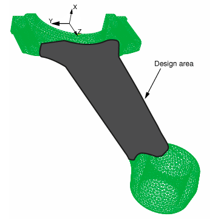
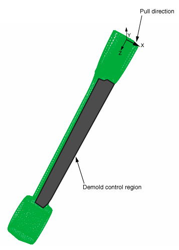
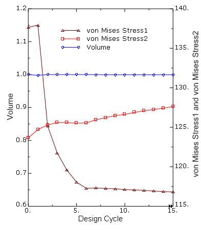
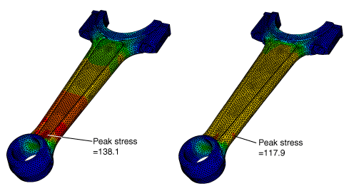
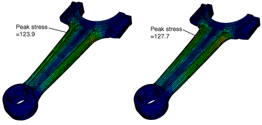

# 11.2.1 连杆的形状优化

**产品：** Abaqus/Standard  Abaqus/CAE

### 目标

本例使用优化模块在不改变连杆体积的情况下最小化应力集中。

### 应用描述

本例说明了连杆的形状优化。形状优化对设计区域中表面节点的位置进行轻微修改以达到优化解。形状优化通常在设计过程结束时应用，当组件的一般轮廓已固定且只允许微小更改时。更多信息，请参阅["形状优化"中的"结构优化：概述," Abaqus分析用户指南第13.1.1节](../usb/usb-link.md#usb-anl-aoptover-shape)。

### 几何形状

连杆模型是使用线性四面体（C3D4）单元网格化的单个孤立网格部件。连杆关于X-Z平面对称。

### 材料

连杆由杨氏模量为210 GPa、泊松比为0.3、密度为7800 kg/m^3的弹性材料制成。

### 边界条件和加载

小端中心节点的位移在x和y方向上被约束，中心节点的旋转在y和z方向上被约束。对于大端的中心节点，x和z方向的位移以及y和z方向的旋转被约束。

在第一步中，25000 N的荷载沿z方向施加到连杆小端的中心节点。

在第二步中，沿z方向向连杆小端中心节点施加2000 N的荷载，沿y方向向连杆大端中心节点施加1750 N的荷载。此外，沿x轴0.004弧度的旋转被施加到连杆大端的中心节点。

#### 优化特性

形状优化配置如下节所述。

##### 优化任务

本例创建了一个形状优化任务。为确保最终设计中单元的质量，对设计区域中的单元应用网格平滑。

##### 设计区域

模型的设计区域是将在优化期间被修改的区域，如图11.2.1-1所示。区域被排除在设计区域之外，因为它们需要用于夹具和施加加载。

##### 设计响应

为每个步创建设计响应，确定设计区域中的最大von Mises应力。第三个设计响应计算设计区域的体积。

##### 目标函数

目标函数确定两个设计响应中哪个在设计节点产生最大的von Mises应力。然后目标函数试图最小化该设计响应的最大von Mises应力。

##### 约束

体积设计响应被配置为单个优化约束，使得设计区域总体积在优化过程期间保持不变。

##### 几何限制

本例通过定义脱模控制几何限制来引入铸造限制，这些限制被施加到设计区域每一半中正x和负x方向的节点上。图11.2.1-2说明了施加到设计区域正x方向一半的脱模控制几何限制。

### Abaqus建模方法和模拟技术

本例从输入文件导入孤网格形式的模型。输入文件包含用于定义模型中优化所使用区域的单元集，如设计区域和脱模控制区域。本例创建了全局停止准则为15个设计循环的优化过程。为保持表面单元的质量，对设计区域应用网格平滑，这根据表面节点移动调整内部节点的位置。更多信息，请参阅["对形状优化应用网格平滑"中的"结构优化：概述," Abaqus分析用户指南第13.1.1节](../usb/usb-link.md#usb-anl-aoptover-shape-smoothing)。

### 分析类型

分析包括两个静态、一般步。

### 约束

连杆两端的中心节点通过运动耦合连接到连杆的轴承表面。

### 运行过程

包含一个Python脚本，使用Abaqus/CAE中的Abaqus脚本接口重现模型。Python脚本（[conrod_shape_optimization.py](../eif/conrod_shape_optimization.py)）导入输入文件（[connecting_rod.inp](../eif/connecting_rod.inp)）并构建优化模型。脚本可以交互运行或从命令行运行。Python脚本和输入文件必须从您的工作目录中可用。

脚本完成后，您可以使用优化模块查看在Abaqus/CAE中创建的形状优化模型。要运行优化，您可以从Job模块中的**优化过程管理器**提交优化过程。您可以使用**优化过程管理器**来监控优化的进程，并在可视化模块中查看形状优化的结果。

### 结果与讨论

结果在优化过程创建的输出数据库文件中可用。该步包含15个优化迭代，对应于优化过程的15个设计循环。图11.2.1-3显示了15个设计循环中两个荷载情况各自的von Mises应力设计响应的历史输出图。历史输出图也显示了体积设计响应，该响应在优化期间保持不变。

设计区域中表面节点的位置被优化，使得对于指定的体积约束和几何限制，von Mises应力在产生最大应力的荷载情况期间被最小化。在本例中，第一步施加到小端的25000 N荷载在连杆中产生最高的von Mises应力。因此，目标函数调整表面节点以在第一步期间降低最大von Mises应力，尽管结果优化形状允许von Mises应力在第二步荷载条件下略微增加。

图11.2.1-4显示了第一个荷载情况期间初始von Mises应力分布以及15个设计循环后应力分布的变化。图11.2.1-5显示了第二个荷载情况期间优化前后类似的von Mises应力分布图。

### 文件

[conrod_shape_optimization.py](../eif/conrod_shape_optimization.py)

使用connecting_rod.inp创建模型和优化属性的脚本。

[connecting_rod.inp](../eif/connecting_rod.inp)

用于创建孤网格连杆和优化所使用单元集的输入文件。

### 参考文献

**Abaqus Analysis User's Guide**
- [第13章，"优化技术,"](../usb/usb-link.md#usbopttech)
- ["形状优化"中的"结构优化：概述," 第13.1.1节](../usb/usb-link.md#usb-anl-aoptover-shape)

**Abaqus/CAE User's Guide**
- [第18章，"优化模块,"](../usi/usi-link.md#usi-opz)
- ["理解优化过程," 第19.5节](../usi/usi-link.md#usi-ana-optimizationconcepts)

**其他**

- Bakhtiary, N., and P. Allinger, "A New Approach for Size, Shape and Topology Optimization," SAE International Congress and Exposition, Detroit, Michigan, USA, February 26--29, 1996.

### 图

**图11.2.1-1** 设计区域。

**图11.2.1-2** 脱模控制几何限制。

**图11.2.1-3** 设计响应（von Mises应力和体积）。

**图11.2.1-4** 第一个荷载情况期间优化前（左）和优化后（右）的von Mises应力分布。

**图11.2.1-5** 第二个荷载情况期间优化前（左）和优化后（右）的von Mises应力分布。

