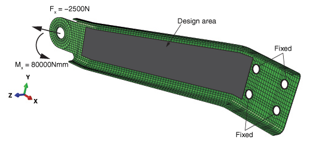
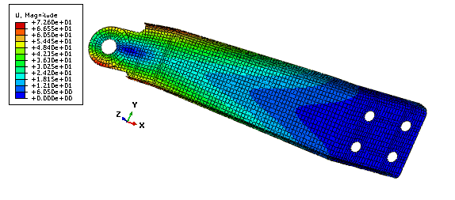
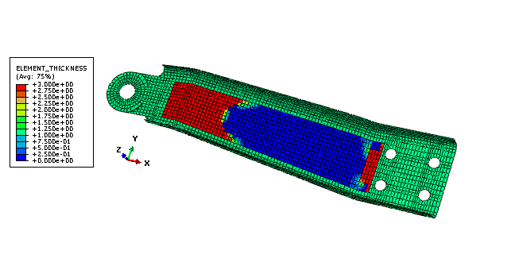
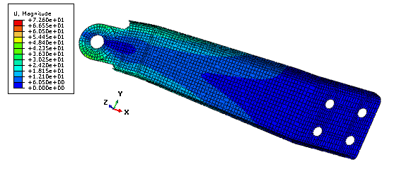
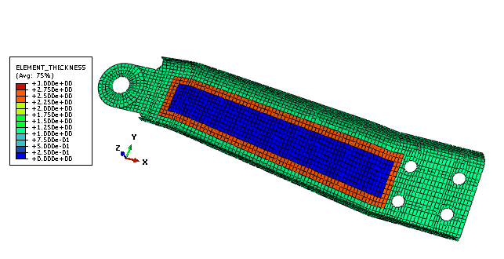
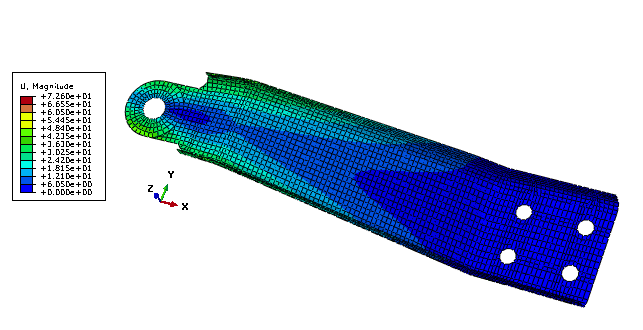

# 11.3.1 Sizing optimization of a gear shift control holder

**Products: **Abaqus/Standard  Abaqus/CAE  

### Objectives

This example uses the Optimization Module to minimize the sum of the strain energy (maximize the stiffness) in a pressed sheet metal holder by changing the shell thickness while maintaining the original weight.

### Application description

This example illustrates sizing optimization of a pressed sheet metal holder that is used in an automotive gearbox linkage. Sizing optimization modifies the thickness of the shell elements in the design area to achieve the optimized solution. The example illustrates “free”optimization of the shell thickness, with no regard for the thickness of adjacent elements, and “clustered” optimization of the shell thickness, that forces elements in selected regions to have the same shell thickness. For more information, see ["Sizing optimization" in "Structural optimization: overview," Section 13.1.1 of the Abaqus Analysis User's Guide](../usb/usb-link.md#usb-anl-aoptover-sizing).

### Geometry

The pressed sheet metal holder is a single orphan mesh part. The part is meshed with general-purpose conventional shell (predominately S4) elements. The initial shell thickness is 1.0 mm.

### Materials

The holder is made of an elastic material with a Young's modulus of 206 GPa, a Poisson’s ratio of 0.3, and a density of 7840 kg/m3.

### Boundary conditions and loading

The boundary conditions and loads are shown in [Figure 11.3.1--1](ch11s03aex146.md#aoptimization-sizing-designarea). The four mounting holes are constrained in all directions in the initial step. During the first linear perturbation step a 2500 N load is applied to the hole in the *x*-direction. During the second linear perturbation step a torsional moment of 80,000 Nmm about the *x*-axis is applied to the hole. 

#### Optimization features

The sizing optimization is configured as described in the following sections.

##### Optimization task

This example creates a sizing optimization task. 

##### Design area

The design area of the model is the region that will be modified during the optimization, as shown in [Figure 11.3.1--1](ch11s03aex146.md#aoptimization-sizing-designarea). 

##### Design responses

A design response is created for each step that determines the compliance or strain energy in the design area. A second design response calculates the volume of the entire model.

##### Objective function

The objective function tries to minimize the maximum compliance from the two linear perturbation steps. Compliance is the reciprocal of stiffness, and minimizing the compliance is equivalent to maximizing the global stiffness. 

##### Constraint

The shell thickness is constrained between absolute values of 0.1 and 3.0. In addition, the volume is constrained such that the total volume of the holder is less than or equal to the original volume. 

##### Geometry restrictions

The example introduces clustered rings of shell elements of the same thickness in the design area. In effect, clusters generate strengthening ribs or rings in the sheet metal structure you are optimizing; clustered regions can be reproduced in manufacturing by layering sheets of constant thickness.

### Abaqus modeling approaches and simulation techniques

This example imports the model in the form of an orphan mesh from an input file. The input file contains the element sets that are used to define the regions of the model that are used by the optimization, such as the design area. The example creates an optimization process that you can submit for analysis.

### Analysis types

The analysis includes two static, perturbation steps.

### Constraints

Kinematic couplings connect the node at the center of the holes with the nodes at the edges of the hole.

### Run procedure

A Python script is included that reproduces the model using the Abaqus Scripting Interface in Abaqus/CAE. The Python script  (`[holder_sizing_optimization.py](../eif/holder_sizing_optimization.py)`) imports the input file (`[holder.inp](../eif/holder.inp)`) and builds the optimization model. A second Python script (`[holder_sizing_optimization_w_clustering.py](../eif/holder_sizing_optimization_w_clustering.py)`) performs the same optimization but introduces shell thickness clustering in the design area. The scripts can be run interactively or from the command line. The Python scripts and the input file must be available from your working directory.

To run the optimization, you can submit the optimization process from the **Optimization Process Manager** in the Job module. You can use the **Optimization Process Manager** to monitor the progression of the optimization. In addition, when the optimization process is complete, you can use the **Optimization Process Manager** to combine the output from the optimization into a single output database file that can be viewed in the Visualization module.

### Results and discussion

The optimization process is run over 15 design cycles for the free optimization and over 13 design cycles for the optimization with clustering. During each design cycle, the optimization results are saved in optimization files. In addition, the Abaqus analysis results are saved in output database files during the initial design cycle and during the last design cycle. To view the results of the optimization in the Visualization module, the optimization data in the optimization files and the analysis results in the output database files must be combined. The output database file created during the initial design cycle is selected as the base results output database file. During the combine operation, the optimization data from each design cycle and the analysis results from the last design cycle are appended to the base results output database file. Each frame of the combined output database file corresponds to a design cycle of the optimization. For more information about the files generated by an optimization process and how they are combined, see ["Understanding the files generated by an optimization process," Section 19.5.2 of the Abaqus/CAE User's Guide](../usi/usi-link.md#usi-ana-opt-files), and ["Postprocessing an optimization," Section 19.5.3 of the Abaqus/CAE User's Guide](../usi/usi-link.md#usi-ana-opt-postproc).

[Figure 11.3.1--2](ch11s03aex146.md#aoptimization-sizing-beforeopt) shows the initial displacement magnitude at the end of the second step prior to any optimization. [Figure 11.3.1--3](ch11s03aex146.md#aoptimization-sizing-thickness) and [Figure 11.3.1--4](ch11s03aex146.md#aoptimization-sizing-afteropt) show the value of the shell thickness and the displacement magnitude, respectively, after free sizing optimization. [Figure 11.3.1--5](ch11s03aex146.md#aoptimization-sizing-clusterthickness) and [Figure 11.3.1--6](ch11s03aex146.md#aoptimization-sizing-aftercluster) show the value of the shell thickness and the displacement magnitude, respectively, after sizing optimization with clustering in the design area.

After the optimization, the shell thickness is increased at the end of the design area where the load and moment are applied. The shell thickness is also increased close to the mounting holes. To maintain the volume of the arm, the shell thickness is reduced in the rest of the design area. As expected, the free sizing optimization produces the best results with a 45% reduction of the maximum displacement. The optimization with circular clustering in the design area, which could be manufactured by welding sheets of metal together, still leads to a 30% reduction of the maximum displacement.

### Python scripts

[holder_sizing_optimization.py](../eif/holder_sizing_optimization.py)

Script to create the model and the optimization attributes using holder.inp.

[holder_sizing_optimization_w_clustering.py](../eif/holder_sizing_optimization_w_clustering.py)

Script to create the model and the optimization attributes, including shell thickness clustering, using holder.inp.

### Input file

[holder.inp](../eif/holder.inp)

Orphan mesh gear shift control holder and the node and element sets that are used by the optimization.

### References

**Abaqus Analysis User's Guide**
- [Chapter 13, "Optimization Techniques," of the Abaqus Analysis User's Guide](../usb/usb-link.md#usbopttech)
- ["Sizing optimization" in "Structural optimization: overview," Section 13.1.1 of the Abaqus Analysis User's Guide](../usb/usb-link.md#usb-anl-aoptover-sizing)

**Abaqus/CAE User's Guide**
- [Chapter 18, "The Optimization module," of the Abaqus/CAE User's Guide](../usi/usi-link.md#usi-opz)
- ["Understanding optimization processes," Section 19.5 of the Abaqus/CAE User's Guide](../usi/usi-link.md#usi-ana-optimizationconcepts)

**Other**

- Svanberg, K., The Method of Moving Asymptotes---A New Method for Structural Optimization International Journal for Numerical Methods in Engineering, vol. 24, pp. 359--373, 1987.

### Figures

**Figure 11.3.1–1** Design area, loads, and boundary conditions.

**Figure 11.3.1–2** Displacement magnitude prior to the optimization.

**Figure 11.3.1–3** Absolute value of shell thickness after free optimization.

**Figure 11.3.1–4** Displacement magnitude after free optimization.

**Figure 11.3.1–5** Absolute value of shell thickness after optimization with clustering.

**Figure 11.3.1–6** Displacement magnitude after optimization with clustering.

