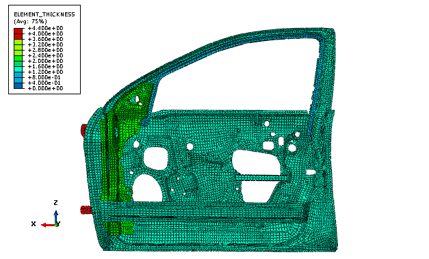
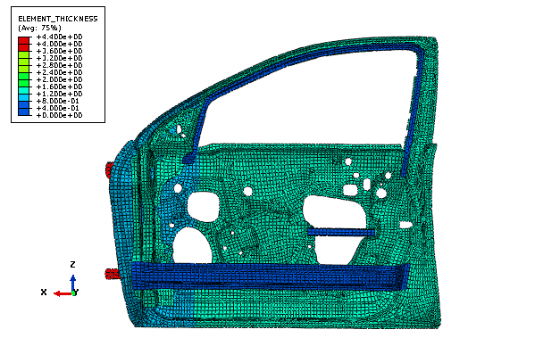
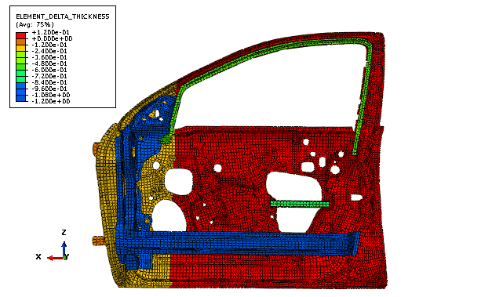

# 11.3.2 汽车车门的尺寸优化

**产品：** Abaqus/Standard  Abaqus/CAE

### 目标

本例使用优化模块通过改变板金属组件的厚度同时限制车门相对于其固定铰链的垂直位移（下垂）来最小化汽车车门的重量。本例还约束车门的第一频率模态高于指定值，以避免由发动机振动触发的共振，同时保持其抵抗垂直荷载的强度。优化考虑了制造过程约束和设计美学约束施加的几何限制。该模型由乔治华盛顿大学国家碰撞分析中心（NCAC）在美国交通部联邦公路管理局（FHWA）和国家公路交通安全管理局（NHTSA）合同下开发。

### 应用描述

本例说明了形成车门的板金属组件的尺寸优化。尺寸优化修改设计区域中壳单元的厚度以达到优化解。在尺寸优化期间应用分簇，强制所选区域中的单元具有相同的壳厚度，并再现通过叠加均匀厚度零件的真实板金属组件组装。"自由"尺寸优化产生比聚集尺寸优化更轻的车门；但是，结果的逐单元壳厚度分布在生产线上无法再现。更多信息，请参阅["尺寸优化"中的"结构优化：概述," Abaqus分析用户指南第13.1.1节](../usb/usb-link.md#usb-anl-aoptover-sizing)。

### 几何形状

车门总成由从NCAC提供的数据导出的单个孤网格部件组成。连接、接触定义和步定义已按照Abaqus最佳实践进行转换。例如，模型中的区域（单元集）通过点焊（网格独立紧固件）连接。两个铰链用铰链连接器和运动耦合建模。车门锁用运动耦合建模。

### 材料

车门使用了三种材料——玻璃、塑料和钢。玻璃材料特性分配给表示车窗的单元集。塑料材料特性分配给表示门饰插入件（如衬垫）的单元集。钢材料特性分配给表示板金属车门及其铰链和支架的单元集。本分析假设的材料特性分别见表11.3.2-1、表11.3.2-2和表11.3.2-3。符号、和分别代表杨氏模量、泊松比和密度。

弹性材料特性已足够，因为为模拟车门垂直下垂而施加的小荷载不足以引起塑性或永久变形。

### 边界条件和加载

两个荷载情况施加到模型上：
- Lanczos求解器频率步，确定前五个特征值，以及
- 静态荷载步，确定车门响应车门锁垂直荷载而下垂的量。

在频率步期间，铰链和锁在所有六个自由度上被约束。在静态荷载步期间，沿z轴500 N的荷载施加到车门锁上。此外，铰链继续在所有六个自由度上被约束。为防止车门打开，位移边界条件约束锁在y方向的运动。

#### 优化特性

尺寸优化配置如下节所述。

##### 优化任务

本例创建了一个尺寸优化任务。

##### 设计区域

除塑料装饰外，整个车门被选为模型的设计区域。

##### 设计响应

本例包含三个设计响应：
- 施加到整个总成的重量设计响应，
- 使用默认模态分析公式（Lanczos）的特征频率设计响应，以及
- 仅施加到车门锁的位移设计响应。

##### 目标函数

目标函数试图最小化重量设计响应。

##### 约束

频率步中的约束限制第一特征频率不低于会触发怠速时发动机振动共振的值（35 Hz）。静态荷载步中的约束限制车门锁在z方向位移的绝对值小于或等于合理值（1.42 mm）。

##### 几何限制

表示板金属零件的单元集厚度被限制在合理范围内（0.5 < 厚度 < 2.5）。冻结区域几何限制强制表示车窗及其铰链和支架的单元集在优化期间保持不变。此外，外露面车门面板的设计已由造型部门完成，冻结区域几何限制防止形成车门外面的单元厚度变化。

##### 分簇限制

为表示板金属零件的每个单元集定义了分簇，强制每个区域具有均匀厚度。

### Abaqus建模方法和模拟技术

本例从输入文件导入孤网格形式的模型。输入文件包含用于定义模型中优化所使用区域的单元集，如车窗及其铰链和支架。本例创建了您可以提交分析的优化过程。

### 分析类型

分析包括频率步和静态荷载步。

### 网格设计

车门大部分用分配S4R三维壳单元的四边形区域网格化，少量三角形区域分配S3R单元。此外，表示扶手的三维实体区域分配C3D4、C3D6和C3D8R三维实体单元。尺寸优化仅对壳单元操作。

### 运行过程

输入文件（[door.inp](../eif/door.inp)）定义构成车门的节点和单元以及表示车门区域的单元集。输入文件还定义优化所使用的运动耦合、多点约束和点焊连接。包括Python脚本（[door_sizing_optimization_w_clustering.py](../eif/door_sizing_optimization_w_clustering.py)）导入输入文件并构建优化模型。脚本可以交互运行或从命令行运行。Python脚本和输入文件必须从您的工作目录中可用。

要运行优化，您可以从Job模块中的**优化过程管理器**提交优化过程。您可以使用**优化过程管理器**来监控优化的进程。此外，当优化过程完成时，您可以使用**优化过程管理器**将优化输出合并到可以在可视化模块中查看的单个输出数据库文件中。

### 结果与讨论

指定最多15个设计循环；但优化过程在九个设计循环上收敛。尺寸优化的收敛准则基于单元厚度变化和目标函数值变化的组合。最小化重量是目标函数，总重量在满足特征频率和车门下垂约束的同时减少了14%（从30.6 kg到26.3 kg）。

图11.3.2-1显示了优化前第二个步结束时初始单元厚度。图11.3.2-2和图11.3.2-3显示了尺寸优化的结果——绝对壳厚度值和壳厚度变化。未参与优化的模型区域（如塑料衬垫）已从图中移除，以使输出更容易理解。

### Python脚本

[door_sizing_optimization_w_clustering.py](../eif/door_sizing_optimization_w_clustering.py)

用于导入输入文件（door.inp）并构建优化模型的脚本。

### 输入文件

[door.inp](../eif/door.inp)

车门总成的孤网格表示；以及优化所使用的节点和单元集、材料、荷载、边界条件和连接器定义。

### 参考文献

**Abaqus Analysis User's Guide**
- [第13章，"优化技术,"](../usb/usb-link.md#usbopttech)
- ["尺寸优化"中的"结构优化：概述," 第13.1.1节](../usb/usb-link.md#usb-anl-aoptover-sizing)

**Abaqus/CAE User's Guide**
- [第18章，"优化模块,"](../usi/usi-link.md#usi-opz)
- ["理解优化过程," 第19.5节](../usi/usi-link.md#usi-ana-optimizationconcepts)

**其他**

- Svanberg, K., The Method of Moving Asymptotes---A New Method for Structural Optimization International Journal for Numerical Methods in Engineering, Vol. 24, pp. 359--373, 1987.
- 该模型由乔治华盛顿大学国家碰撞分析中心（NCAC）在美国交通部联邦公路管理局（FHWA）和国家公路交通安全管理局（NHTSA）合同下开发。

### 表

**表11.3.2-1** 玻璃车窗特性。
| 特性 | 值 |
| --- | --- |
|  | 76.0×10^9 Pa |
|  | 0.30 |
|  | 2.5×10^9 t/mm^3 |

**表11.3.2-2** 塑料组件特性。
| 特性 | 值 |
| --- | --- |
|  | 2.8×10^9 Pa |
|  | 0.30 |
|  | 1.20×10^9 t/mm^3 |

**表11.3.2-3** 钢组件特性。
| 特性 | 值 |
| --- | --- |
|  | 210×10^9 Pa |
|  | 0.30 |
|  | 7.89×10^9 t/mm^3 |

### 图

**图11.3.2-1** 优化前的单元厚度。

**图11.3.2-2** 优化后的单元厚度。

**图11.3.2-3** 优化期间单元厚度的变化。

