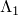
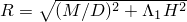
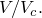
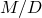
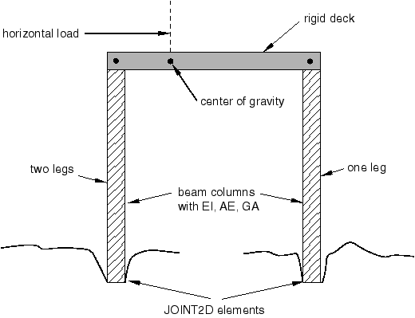
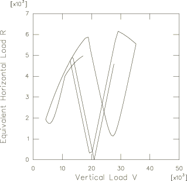
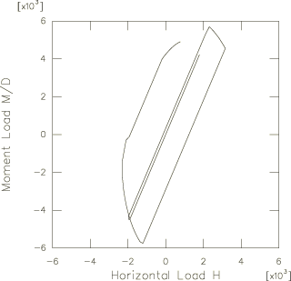

# 12.1.1 自升式基础分析

**产品：** Abaqus/Standard  Abaqus/Aqua

本例模拟承受交替风荷载的沙基上自升式钻机。

### 几何形状和模型

该模型——用于分析多腿、门式框架结构类型的三腿自升式钻机浅层基础支撑分析的统一平面模型——意图用于具有浅基础支撑的三腿自升式钻机分析。图12.1.1-1是三腿自升式钻机作为模型表示的示意图。自升式船体假设为刚性且三角形，船体与腿的连接也被认为是刚性的。自升式有两个迎风腿和一个背风腿；模型投影到穿过背风腿并在迎风腿之间的垂直对称平面上。弹性梁柱用于对每条腿的上下段建模。土壤模型选择为宏观屈服沙土。在每条腿底部的每个桩靴上假设三个自由度——垂直、水平和旋转。质量假设集中在船体中心。分析中，中心点的水平自由度假设代表钻机的运动。作用于钻机的风荷载施加为船体重心上方的水平力。

腿段用B21单元建模，通用梁截面用于定义梁的结构特性。桩靴与土壤之间的相互作用通过JOINT2D单元以及关节弹性和关节塑性定义建模。刚性梁单元RB2D2用于建模刚性船体。

钻机的尺寸以及沙土和桩靴的材料特性如下（力的单位为kN，长度单位为米）：

| 腿上段长度 | 49.4 |
| --- | --- |
| 腿下段长度 | 13.5 |
| 腿上段EI | 2.7×10^8 |
| 腿下段EI | 2.7×10^9 |
| 腿上段AE | 2.2×10^8 |
| 腿下段AE | 2.2×10^9 |
| 腿上段GA | 8.1×10^7 |
| 腿下段GA | 8.1×10^8 |
| 从平台重心到背风腿的水平距离 | 23.4 |
| 从平台重心到迎风腿的水平距离 | 11.7 |
| 桩靴直径 | 10.9 |
| 桩靴锥角 | 18° |
| 每个桩靴的基础预压 | 50600 |
| 基础抗拉能力 | 0 |
| 操作垂直荷载（重量） | 62700 |
| 从重心到荷载施加点的垂直距离 | 7.1 |
| 土壤水下容重 | 10.0 |
| 土壤摩擦角 | 33° |
| 土壤泊松比 | 0.2 |
| 基础弹性剪切模量， | 5.14×10^4 |
|  | 3.87×10^3 |
|  | 2.04×10^3 |
| 常数系数， | 1.0 |
| 常数系数， | 0.5 |

### 边界条件和加载

JOINT2D单元的底部节点始终固定。使用初始条件将所需的预压施加到每个桩靴上。在第一步中，重量荷载施加到船体重心。然后钻机承受施加在船体重心上方指定位置的交替水平风荷载。

钻机从零加载到5370 kN，卸载到零然后在相反方向加载到6440 kN，在初始方向重新加载到9130 kN，在相反方向卸载并重新加载到9770 kN，然后再次卸载到零。每个荷载都在单独一步中完成，并在步结束时从零斜坡到指定大小。

### 结果与讨论

背风桩靴基础的估计荷载路径绘制在等效水平荷载与的关系图中。图表如图12.1.1-2所示，与独立分析预测的荷载路径良好一致，如下面参考文献中详述。背风桩靴基础的弯矩-水平荷载响应（即与H）如图12.1.1-3所示，与独立分析良好比较。

### 输入文件

[jackup.inp](../eif/jackup.inp)

本例的输入数据。

### 参考文献

Wong, P. C. and J. D. Murff, "Dynamic Analysis of Jack-Up Rigs Using Advanced Foundation Models," Proceedings, 13th International Conference on Offshore Mechanics and Arctic Engineering (OMAE), vol. 2 - Safety and Reliability, Houston, pp. 93–109, February 1994.

### 图

**图12.1.1-1** 自升式钻机示意图。

**图12.1.1-2** 背风桩靴的荷载路径。

**图12.1.1-3** 背风桩靴的弯矩与水平荷载。

