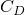
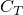
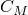
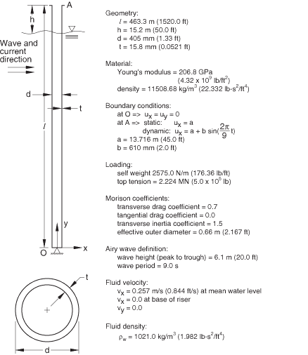
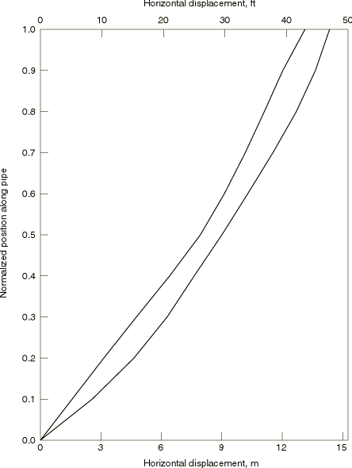
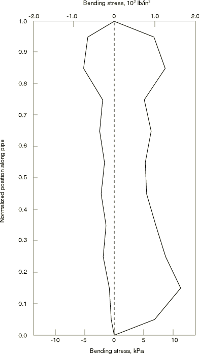

# 12.1.2 立管动力学

**产品：** Abaqus/Standard  Abaqus/Aqua

从海底延伸到海面的管道（立管）承受多种类型的荷载：自重、浮力、内外压力、由系泊产生的拉力、水流拖曳力以及由波浪运动引起的振荡荷载。立管对这些荷载的响应是复杂的，此类分析的难度因这些管道的相对长度（深水立管）而增加。在本例中，立管按照美国石油学会规定的条件进行分析，以比较钻井立管分析（API BULLETIN 2J，1977），并将结果与该出版物中显示的结果进行比较。

### 几何形状和模型

立管如图12.1.2-1所示。其长度为463.3 m（1520 ft），站立于448.1 m（1470 ft）的水中。立管外径为405 mm（1.33 ft），壁厚为15.88 mm（0.0521 ft）。管道由钢制成，杨氏模量为206.8 GPa（4.32×10^9 lb/ft^2），密度为11508.685 kg/m^3（22.332 lb·s^2/ft^4）。立管用10个B21型梁单元建模。未进行网格收敛性研究；因此，可能需要更多单元来准确预测立管中的应力。

### 加载

立管重量为2575 N/m（176.36 lb/ft），并加载2.224 MN（5×10^5 lb）的顶部张力。拖曳荷载由稳定水流施加，水流以从平均水位0.257 m/s（0.844 ft/s）到立管底部为零的线性变化速度分布流过立管。Morison方程中的系数为横向拖曳系数（）0.7，切向拖曳系数（）0.0，以及横向惯性系数（）1.5。

拖曳计算的有效外径为0.66 m（2.167 ft）。波峰到波谷高度6.1 m（20 ft）的波浪以9秒的周期穿越水面；这些用Abaqus/Aqua提供的Airy波理论建模（["Abaqus/Aqua分析," Abaqus分析用户指南第6.11.1节](../usb/usb-link.md#usb-anl-aaqua)）。流体密度取为1021 kg/m^3（1.982 lb·s^2/ft^4）。在Abaqus/Aqua中，用户子程序[`UWAVE`](../sub/sub-link.md#sub-xsl-uwave)可用于指定用户定义的波浪运动学。我们通过使用与Abaqus/Aqua中内置Airy波选项相同的用户指定Airy波理论重复此分析来说明此功能。

### 边界条件

立管底部是"万向节"，不支撑弯矩。立管顶部规定两个运动：距立管垂直位置13.716 m（45 ft）的初始偏移，以及关于此静态配置的 sinusoidal运动，代表附接到立管的船舶的涌振，峰峰值幅度为1.22 m（4 ft），周期为9秒。船舶涌振角与表面波相差15°。对于Airy波定义，相位角为流体粒子垂直位移提供了任意的时间原点选择。基于初始偏移和船舶涌振角，该角设置为54.026°，负号表示波落后于船舶涌振。

### 分析

分析分两步完成。第一步是静态步，其中施加顶部张力，并通过在管道顶部规定必要的水平位移将立管从垂直位置移动到其偏移位置。顶部张力为2.224 MN（5×10^5 lb）。

在第二步（动态步）中，时间增量选择为固定值0.125秒。立管顶部的规定位移具有9秒周期，因此一旦高阶模态被流体拖曳阻尼，此时间步应该提供合理准确的时间积分。Abaqus计算的"半增量残差"值提供了求解精度的度量，这些值通常为4.4 kN（1000 lb）量级。由于这些值小于典型的实际力，它们表明时间积分是相当准确的。

### 结果与讨论

初始静态步将立管移动到其偏移位置并施加静态荷载，以四个增量完成。第一增量需要比后续增量更多的迭代，这是此类问题的典型特征：立管最初无应力，因此高度灵活。施加一些荷载后，轴向张力稳定了系统，收敛更快。

在静态步结束时，立管顶部与垂直方向成1.17°角。该值与API BULLETIN 2J（1977）中给出的1.20°良好一致。立管底部预测的角度为2.48°，与API公报中报告的2.55°相当。轻微差异归因于模型的相对粗糙度。

动态求解针对18秒的响应进行。在每个时间增量中通常需要一次平衡迭代。前几个增量的半增量残差值为178 MN（4.0×10^7 lb）量级，在运行结束时为4.4 kN（1000 lb）量级。这是典型的结果：最初解中有大量高频内容，这反映在较大的半增量残差值中。随着分析进行，流体拖曳消散了这种"噪声"，解变得更平滑，半增量残差值相应下降。

动态激励第二周期中立管偏移包络绘制在图12.1.2-2中，弯曲应力包络如图12.1.2-3所示。这些结果与API公报中给出的结果基本一致。

如预期的那样，通过用户子程序[`UWAVE`](../sub/sub-link.md#sub-xsl-uwave)中实现的Airy波理论的模型获得的结果与内置Airy波选项的结果相同。

### 输入文件

[riserdynamics_airy_disp.inp](../eif/riserdynamics_airy_disp.inp)

使用Airy波理论的分析。用户子程序[`DISP`](../sub/sub-link.md#sub-xsl-disp)用于规定正弦涌振运动。该运动也可以使用[*AMPLITUDE](../key/key-link.md#usb-kws-mamplitude)选项来规定。用户子程序[`DISP`](../sub/sub-link.md#sub-xsl-disp)用于说明使用此例程规定非零边界条件值。

[riserdynamics_airy_disp.f](../eif/riserdynamics_airy_disp.f)

用于riserdynamics_airy_disp.inp的用户子程序[`DISP`](../sub/sub-link.md#sub-xsl-disp)。

[riserdynamics_wavedata.inp](../eif/riserdynamics_wavedata.inp)

用于riserdynamics_airy_disp.inp的波浪数据。

[riserdynamics_stokes_disp.inp](../eif/riserdynamics_stokes_disp.inp)

使用Stokes波理论的分析。

[riserdynamics_stokes_disp.f](../eif/riserdynamics_stokes_disp.f)

用于riserdynamics_stokes_disp.inp的用户子程序[`DISP`](../sub/sub-link.md#sub-xsl-disp)。

[riserdynamics_airy_disp_uwave.inp](../eif/riserdynamics_airy_disp_uwave.inp)

使用在用户子程序[`UWAVE`](../sub/sub-link.md#sub-xsl-uwave)中实现的Airy波理论的分析。

[riserdynamics_airy_disp_uwave.f](../eif/riserdynamics_airy_disp_uwave.f)

用于riserdynamics_airy_disp_uwave.inp的用户子程序[`UWAVE`](../sub/sub-link.md#sub-xsl-uwave)和[`DISP`](../sub/sub-link.md#sub-xsl-disp)。

[exa_riserdynamics_stokes_disp_uwave.inp](../eif/exa_riserdynamics_stokes_disp_uwave.inp)

使用在用户子程序[`UWAVE`](../sub/sub-link.md#sub-xsl-uwave)中实现的Stokes波理论的分析。

[exa_riserdynamics_stokes_disp_uwave.f](../eif/exa_riserdynamics_stokes_disp_uwave.f)

用于exa_riserdynamics_stokes_disp_uwave.inp的用户子程序[`UWAVE`](../sub/sub-link.md#sub-xsl-uwave)和[`DISP`](../sub/sub-link.md#sub-xsl-disp)。

### 参考文献

American Petroleum Institute, "Comparison of Marine Drilling Riser Analyses," API Bulletin 2J, Washington, DC, January 1977.

### 图

**图12.1.2-1** 立管问题定义。

**图12.1.2-2** 动态激励第二周期期间的水平位移包络。

**图12.1.2-3** 动态激励第二周期期间的弯曲应力包络。

