# 13.1.1 滚筒混合器中颗粒介质的混合

**产品：** Abaqus/Explicit

### 目标

本例问题演示了在Abaqus中使用离散单元方法（DEM）分析滚筒研磨机中不同颗粒介质的混合。

### 应用描述

旋转滚筒混合器和滚筒研磨机用于矿石和颗粒材料的研磨、混合和干燥。此类应用可在采矿等广泛工业领域找到。几个因素（包括颗粒的形状、尺寸、密度和接触刚度；摩擦；旋转速度；以及滚筒轴的倾斜）影响在给定时间内实现的混合程度。这些因素也影响操作混合器所需的能量。离散单元方法是理解这些因素对混合过程影响的有用工具。

### 几何形状

滚筒几何形状如图13.1.1-1所示。滚筒长度L为760 mm，滚筒外径为620 mm，滚筒口直径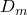为315 mm。滚筒内部有五个等间距的挡板以协助混合过程。挡板从前到后逐渐变细。滚筒壁是中空的，滚筒内半径R为300 mm。滚筒轴线以3°倾斜。虽然这个实验室规模的滚筒混合器不是工业混合器的规模，但它足够大以演示混合过程。

颗粒介质由两批球形石灰石颗粒组成。第一批质量为16.3 kg，每个颗粒半径为5 mm。第二批质量为19.3 kg，每个颗粒半径为6 mm。

### 材料

滚筒由钢制成，杨氏模量为2.08×10^5 N/mm^2，密度为7850×10^-9 kg/mm^3，泊松比为0.3。

石灰石杨氏模量为2.0×10^4 N/mm^2，密度为2500×10^-9 kg/mm^3，泊松比为0.25。

### 边界条件和加载

旋转滚筒中颗粒的混合受滚筒半径、旋转速度和滚筒填充程度的影响。在慢旋转速度下，颗粒倾向于沿滚筒壁滑动和塌落；而在非常高的速度下，发生离心，将颗粒推起沿滚筒壁。颗粒在旋转滚筒中的滚动和级联产生良好的混合。Froude数指定了旋转滚筒混合过程中颗粒滚动和级联的趋势。Froude数定义为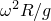，其中是滚筒的角速度，R是滚筒半径，g是重力加速度。建议混合操作的Froude数范围为0.001–0.1。在本例中，滚筒的参考节点给予略小于0.25转/秒的旋转速度，这导致Froude数为0.068。两批颗粒一起占据滚筒内部体积不到一半（即填充度小于0.5）。本例中的整个模型承受重力加载。

### 相互作用

本例分析了以下接触相互作用：
- 颗粒之间的接触
- 颗粒与滚筒之间的接触

颗粒之间接触的摩擦系数为0.35。颗粒与滚筒壁之间接触的摩擦系数为0.3。

### Abaqus建模方法和模拟技术

对于此分析，滚筒假设为刚体。它用壳单元网格化，并通过将其分配给刚体使其成为刚体。卡登连接类型连接器单元与滚筒轴线对齐，连接到滚筒的参考节点。连接器单元用于施加扭矩旋转滚筒。石灰石颗粒用PD3D单元建模。颗粒为球形。本例中使用的模型有8556个半径为6 mm的PD3D单元和12478个半径为5 mm的PD3D单元。

### 网格设计

很难开始这样的模拟，使颗粒精确定位在平衡配置中。本分析使用了一种常见的DEM建模技术，其中颗粒阵列被初始定位在模型中，并允许在第一个分析步中在重力下沉降，无需其他加载。在后续步中研究所需的加载响应。

在这种情况下，两种尺寸的非重叠颗粒层被引入滚筒内部。两批颗粒初始彼此相邻定位，并距滚筒内壁一定初始高度。接下来，这两批颗粒被投入到滚筒中并允许在重力下沉降。这是通过0.5秒持续时间的虚拟步完成的，只有重力荷载作用。滚筒在此步期间保持固定在其初始位置。在重力沉降步结束时，两批颗粒在滚筒下部的压实稳定配置中。重立沉降是大多数DEM分析中的额外开销。

### 边界条件

连接器自由端的边界条件施加为encastre约束，并且刚性体参考点的所有平移自由度在分析持续期间保持固定。

### 载荷

重力载荷施加到模型上。沿z方向施加9800 mm/s^2的加速度。速度类型连接器运动与幅度一起施加关于与滚筒轴线对齐的连接器分量施加。其他两个连接器分量保持固定。分析中使用质量比例阻尼以减少分析噪声。分析的总步长时间为5.5秒。

### 相互作用

如["离散单元方法," Abaqus分析用户指南第15.1.1节](../usb/usb-link.md#usb-anl-ademanalysis)中所讨论的，PD3D单元是刚性的，DEM颗粒之间相互作用的接触刚度可以调整以反映两个弹性球之间接触的Hertz接触解（见Timoshenko和Goodier，1951；以及["Hertz接触问题," Abaqus基准指南第1.1.11节](../bmk/bmk-link.md#bmk-anl-hertzcontact)）。将接触力F与两个接触球远点之间接近距离关联的Hertz解为

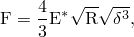

其中

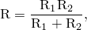

和

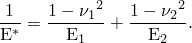

、和、分别是两个颗粒的杨氏模量和泊松比。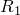和分别是两个颗粒的半径。

F和之间的方程用于为DEM颗粒之间的接触生成表格化的力与闭合关系。不同颗粒半径组合使用不同的关系。在Abaqus中，由于颗粒接触面积为单位1，因此压力-闭合接触表面行为下指定表格类型力-闭合关系。

一个更简单的替代方案是在感兴趣的范围内指定近似线性接触刚度。Hertz接触刚度不是线性的，因为F不线性依赖于。对于颗粒之间压痕的给定值，法向接触刚度（或F vs 曲线的斜率）为

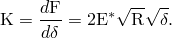

在Abaqus中，可以使用线性类型压力-闭合接触表面行为指定接触刚度。最大压痕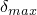可以假设为颗粒半径的某个百分比（介于0.05和1.0%之间）。将诸如的值代入K的表达式可以提供足够代表性的线性接触刚度。对于给定的颗粒质量，较大的接触刚度需要较小的时间增量。对于慢速混合过程（即Froude数在混合操作范围的下端），可能以较低的接触刚度和使用较大的时间增量获得相当准确的结果。

### 结果讨论和案例比较

图13.1.1-2显示了分析期间不同时间获得的变形图序列。最初生成的网格可以在0.0秒的图中看到。重力沉降步结束时的配置可以在0.5秒的图中看到。剩余四个图显示了混合过程的进展以及颗粒介质的滚动和级联。图13.1.1-3显示了作为时间函数的输入到混合过程的总能量。

### 输入文件

[rotating_drum_mixer.inp](../eif/rotating_drum_mixer.inp)

DEM滚筒混合分析的完整输入文件。

### 参考文献

**Abaqus Analysis User's Guide**
- ["离散单元方法," 第15.1.1节](../usb/usb-link.md#usb-anl-ademanalysis)
- ["离散颗粒单元," 第33.1.1节](../usb/usb-link.md#usb-elm-ediscreteparticleelem)

**其他**

Timoshenko, S., and J. N. Goodier, *Theory of Elasticity, *Second edition, McGraw-Hill, New York, 1951.

### 图

**图13.1.1-1** 混合器尺寸。

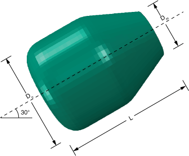

**图13.1.1-2** 混合过程快照。

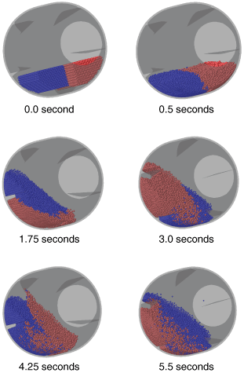

**图13.1.1-3** 输入到滚筒混合器的能量。

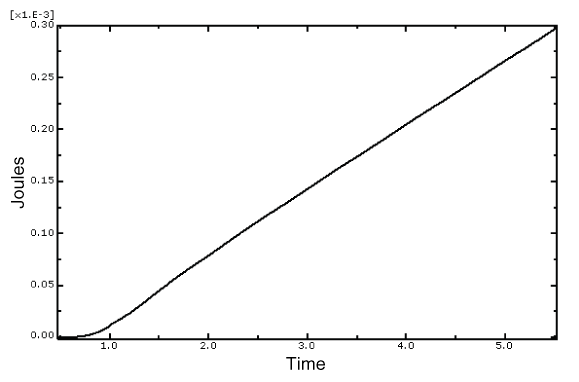

