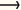

# 14.1.1 设计敏感性分析：概述


本章包含专门为演示Abaqus/Design中设计敏感性分析（DSA）能力而创建的例子问题。此外，以下示例问题也包含设计敏感性分析：
- ["用半球形冲头压痕弹性体泡沫试样," 第1.1.4节](ch01s01aex04.md)

其中一些示例使用Abaqus/CAE中的脚本命令来帮助创建形状变化。该命令的用法如下所述。

### 使用Abaqus/CAE计算形状变化

通过内部Abaqus脚本接口命令`_computeShapeVariations()`提供了计算形状变化的过渡能力。使用该命令需要熟悉Abaqus脚本接口；具体来说，用户必须理解Abaus对象模型（见["Abaqus对象模型," Abaqus脚本用户指南第6.1节](../cmd/cmd-link.md#cmd-int-pythonacl-datamodel)），并且知道如何访问rootAssembly和partInstance对象。

定义形状变化所需的命令过程需要以下操作序列：

1. 在Abaqus/CAE中创建和网格化模型。通过从Job模块主菜单栏选择****Job****Create****和****Job****Write Input****输出相应的输入文件。（在下面的讨论中，假设模型名为`Model-1`，部件名为`Part-1`，部件实例名为`Part-1-1`）。
2. 从主菜单栏选择****Model****Copy Model****，例如将`Model-1`复制到`Model-2`。从上下文栏中的**Model**列表选择`Model-2`。此模型将用于后续步骤计算形状变化。
3. 在Part模块中，从上下文栏下的**Part**列表中选择要计算形状变化的部件。从主菜单栏选择****Feature****Edit****编辑相关草图。选择****Add****Dimension****和****Edit****Dimension****更改设计参数。结束草图编辑，并指示几何应该自动重新生成。编辑草图将导致`Model-2`的网格被删除。
4. 使用Abaqus/CAE命令行或选择****File****Run Script****执行下面列出的命令。`_computeShapeVariations()`命令从任一模型的rootAssembly访问，需要原始部件实例、修改的部件实例以及将写入形状变化选项数据行的文件名作为输入。`.inp`扩展名将自动附加到指定的文件名。以下命令序列适用于创建与参数h关联的形状变量：``` ra1 = mdb.models['Model-1'].rootAssembly ra2 = mdb.models['Model-2'].rootAssembly i1 = ra1.instances['Part-1-1'] i2 = ra2.instances['Part-1-1'] ra1._computeShapeVariations(originalInstance=i1, modifiedInstance=i2, fileName='shape_h') ```
5. 要计算形状变化，将`Model-1`的网格映射到`Model-2`更改的几何上，然后平滑。检查`Model-2`的映射网格以验证网格是否按预期映射。（一般来说，几何的任何更改应该很小——大约1%——以避免网格映射的困难。）形状变化简单地通过从映射和平滑网格到更改几何后计算的节点位置减去初始节点位置来计算。
6. 要使用形状变化数据，请将从`_computeShapeVariations()`命令写入`shape_h.inp`文件的数据复制到分析输入文件中。
7. 通过运行分析并使用Abaqus/CAE中的可视化模块查看形状变化来验证数据的正确性。


