# 14.2.1 复合材料离心机的设计敏感性分析

**产品：** Abaqus/Standard  Abaqus/Design

许多工业使用离心机在净化过程中分离污染物。净化过程的效率与旋转速度直接相关。因此，离心机室被设计为刚硬以保持其形状，并且轻质以减少由于离心载荷产生的自应力。本例使用Abaqus/Design中的设计敏感性分析能力来检查关键结构响应如何依赖于设计参数，如复合层压板的厚度、铺层角度、离心机端板的密度和几何缺陷。

### 几何形状和模型

如图14.2.1-1所示的离心机由复合材料离心机室和铝合金端板组成。离心机室是长970 mm、直径175 mm的圆柱体。它以10000 rpm围绕其轴线旋转。圆筒是具有平衡铺层的纤维缠绕复合（混合）层压板。层压板铺层为（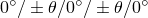），其中0表示沿圆柱长度方向的纤维铺层， = 45°是螺旋层的角度。轴向（0）和螺旋层的厚度分别为0.15 mm和0.5 mm。铝合金端板粘合在圆筒的两端。下板提供磁性轴承的附件点，而上板支撑感应驱动器磁铁。在圆筒与端板相遇的区域，在层压板上添加了额外的周向（90°）外层，厚度为1 mm。离心机使用减缩积分4节点壳（S4R）单元建模。网格如图14.2.1-2所示。在圆筒一端的端板唇部周边所有位移被约束，在另一端只有径向位移被约束；因此，离心机允许在载荷下在轴向自由改变长度。执行带离心载荷的静态分析。

### 材料

0°和90°层使用T800碳纤维材料，螺旋层使用HM400材料。两种材料的密度均为1600 kg/m^3。复合材料的材料特性见表14.2.1-1。铝合金杨氏模量E = 70 GPa，泊松比 = 0.33，密度 = 2800 kg/m^3。

### 设计参数和归一化

设计参数是螺旋层厚度（THM400）、轴向层厚度（TT800）和螺旋层角度（THETA）。由于离心机的高速旋转，几何缺陷可能对应力和位移产生显著影响。为了研究这种影响，使用离心机第一弯曲模态形式的缺陷；缺陷幅度ALPHA被选为形状设计参数。选择弯曲模态形式的缺陷是因为已知最大可达到的旋转速度可以很好地由离心机第一弯曲模态的固有频率预测。进行敏感性分析所需的关于ALPHA的节点坐标梯度从特征频率提取分析中获得。图14.2.1-3显示了离心机的第一弯曲主导模态。虽然此模态中弯曲占主导，但也存在小的扭转分量。

所有绘制的敏感性结果都被归一化以便于参数之间的比较。归一化通过将响应敏感性乘以参数值并除以响应的最大值来进行。例如，应力分量S11关于设计参数THM400的敏感性通过首先将敏感性乘以THM400参数值，然后除以模型中找到的最大S11值来归一化。对于形状设计参数ALPHA，在计算归一化敏感性时，使用圆柱总长度0.1%估计缺陷（ALPHA = 1 mm）。

### 结果与讨论

图14.2.1-4显示了10000 rpm时离心机的变形形状。离心机在轴向收缩并径向膨胀。由于复合圆筒与端板相遇处的搭接接头，在两端看到一些弯曲。

图14.2.1-5绘制了复合圆筒沿长度方向（两个端板之间）径向位移关于除形状设计参数外所有设计参数的归一化敏感性。图显示径向位移对THETA和TT800为负敏感性。增加螺旋层的铺层角度或增加轴向层厚度将增加圆筒刚度并减少径向位移。径向位移对THM400的正敏感性表明，由于螺旋层质量增加而导致的附加自诱导离心载荷将超过在刚度方面获得的任何优势。

图14.2.1-6绘制了径向位移关于形状设计参数ALPHA的敏感性。由于此设计参数的敏感性不是轴对称的，因此以45°增量围绕圆周从1-2平面逆时针开始绘制每个经线的敏感性。径向位移敏感性通过在每个经向位置的二维向量变换从Abaqus输出的全局笛卡尔位移敏感性获得。图14.2.1-6中最大的敏感性比图14.2.1-5中观察到的几乎高两个数量级。这意味着几何缺陷对径向位移有相对较大的影响，并且离心机制造过程必须对轴向形状缺陷有严格的容差。

结构中的主导截面力在圆筒的周向。图14.2.1-7显示了周向截面力的等值线图，图14.2.1-8显示了周向截面力归一化敏感性绘制为沿圆筒长度位置函数。如预期的那样，只有影响质量的设计参数（TT800和THM400）具有非零敏感性，THM400由于其较大厚度而更敏感。由于离心机允许在轴向自由收缩，轴向净截面力为零。然而，轴向应力不为零。图14.2.1-9显示了螺旋层中纤维应力（S11）关于形状设计参数的敏感性的等值线图。为了详细了解层压板中的应力如何受设计参数影响，在圆筒中部一点处沿圆筒壁厚度的纤维应力（S11）归一化敏感性绘制在图14.2.1-10中。壁厚度S11也通过除以模型中S11最大值后绘制。图显示轴向层处于压缩，螺旋层处于拉伸。S11对TT800具有正敏感性：增加轴向层厚度将减少轴向层中的压缩应力并增加螺旋层中的拉伸应力。S11对THM400具有负敏感性：增加螺旋层厚度将减少螺旋层中的应力并增加轴向层中的应力。增加螺旋层角度将减少轴向层中的应力，因为轴向层中的S11对THETA具有小的正敏感性。S11对ALPHA的敏感性与沿圆筒圆周ALPHA对径向位移的敏感性类似。

敏感性可用于计算实现特定响应变化所需的设计参数变化，或者评估由设计参数变化导致的响应变化。例如，考虑以下目标：（a）将轴向层中的压缩应力减少10%，和（b）确定由指定形状缺陷幅度（ALPHA = 0.6）引起的轴向层中的最大压缩应力。

1. 轴向层中的压缩纤维应力为26.38 MPa。图14.2.1-10表明实现所需减少的最有效方法是增加轴向层厚度。所需的增加由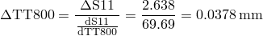给出。使用TT800 = 0.15 + 0.0378 = 0.1878 mm对离心机进行分析，显示轴向层中的压缩应力为24.05 MPa，接近所需值23.74 MPa。
2. 由指定形状缺陷引起的轴向层中最大压缩应力可从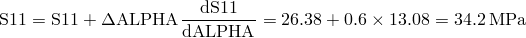获得。使用缺陷几何的分析显示轴向层中的最大压缩应力为34.3 MPa，接近预测值34.2 MPa。

### 输入文件

[dsacentrifuge_freq.inp](../eif/dsacentrifuge_freq.inp)

离心机的频率分析。

[dsacentrifuge.inp](../eif/dsacentrifuge.inp)

承受离心载荷的离心机的敏感性分析。

[dsacentrifuge_node_elem.inp](../eif/dsacentrifuge_node_elem.inp)

节点和单元定义。

### 表

**表14.2.1-1** 复合材料特性。
| 材料 | E1 (MPa) | E2 (MPa) |  | G13 (MPa) | G12 (MPa) | G32 (MPa) |
| --- | --- | --- | --- | --- | --- | --- |
| T800 | 177000. | 14920. | .21 | 5700. | 5700. | 5630. |
| HM400 | 233967. | 14778. | .032 | 5777. | 10191. | 5634. |

### 图

**图14.2.1-1** 离心机室。

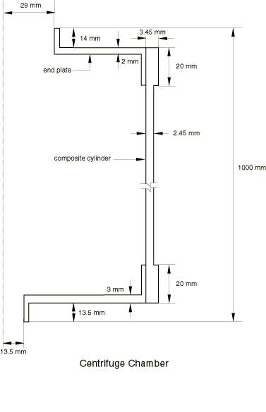

**图14.2.1-2** 使用S4R单元的离心机模型。

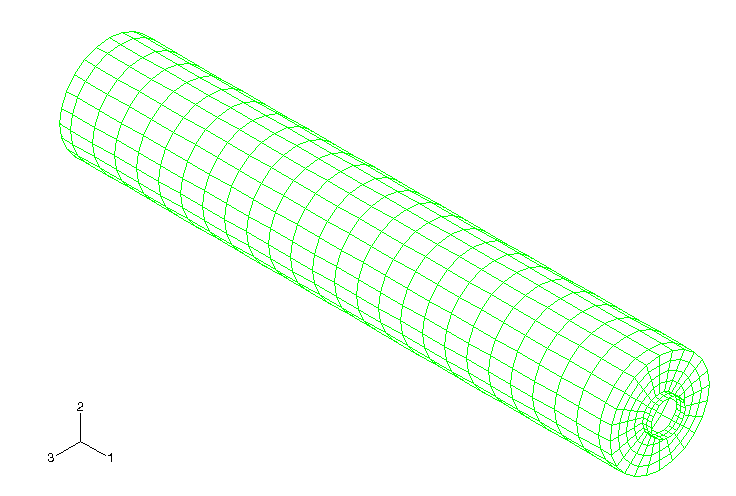

**图14.2.1-3** 离心机的第一弯曲主导模态。

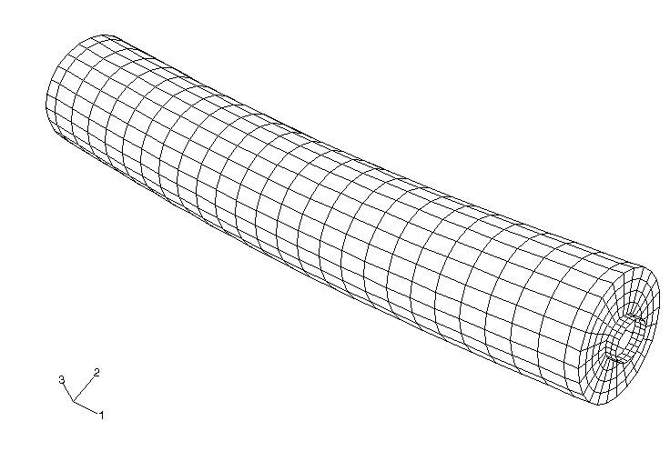

**图14.2.1-4** 离心机变形形状；变形放大400倍。

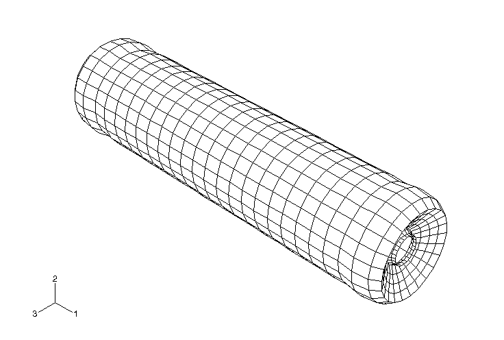

**图14.2.1-5** 沿圆筒长度方向径向位移的归一化敏感性。

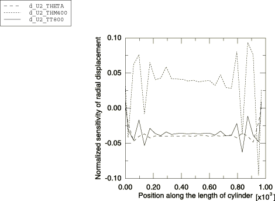

**图14.2.1-6** 径向位移关于形状设计参数ALPHA的归一化敏感性。以45°增量围绕圆周绘制敏感性。

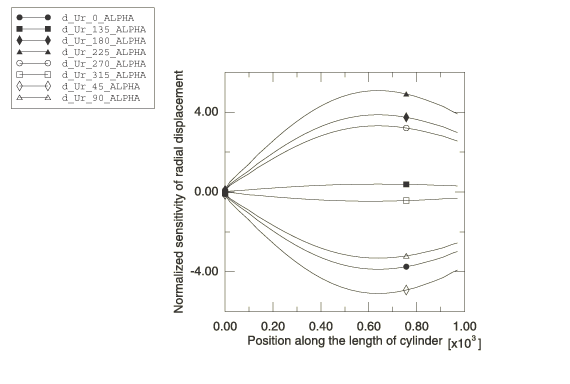

**图14.2.1-7** 周向截面力。

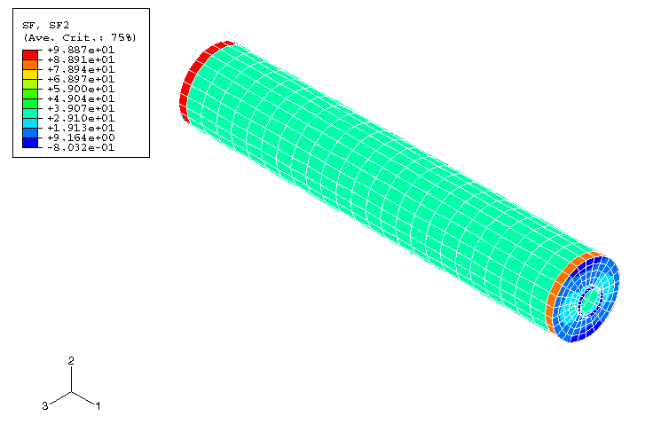

**图14.2.1-8** 周向截面力的归一化敏感性。

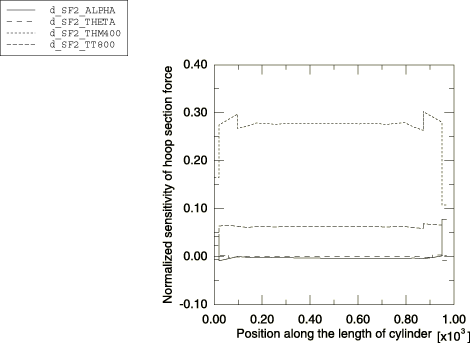

**图14.2.1-9** 螺旋层中纤维应力S11关于形状设计参数ALPHA的敏感性。

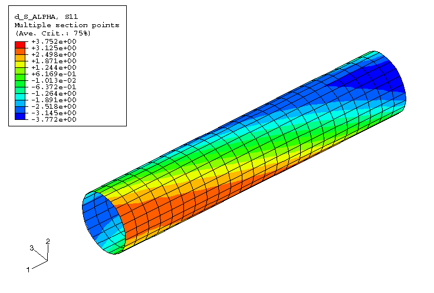

**图14.2.1-10** 对于单元590，沿圆筒壁厚度的纤维应力归一化敏感性。

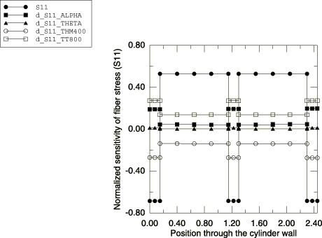

