# 14.2.2 Design sensitivities for tire inflation, footprint, and natural frequency analysis

**Products: **Abaqus/Standard  Abaqus/Design  

The purpose of this example is to demonstrate the application of design sensitivity analysis (DSA) to tire problems. The base tire model and analysis is the same as that described in ["Symmetric results transfer for a static tire analysis," Section 3.1.1](ch03s01aex89.md). The design sensitivity analysis shows the effects on responses such as contact pressure and natural frequencies of three important design parameters: the thickness of the side wall, the elastic modulus of the belt rebar material, and the elastic modulus of the carcass rebar material. This example demonstrates that the DSA technique in Abaqus/Design can be used effectively for highly nonlinear analyses including features such as viscoelasticity, contact, and rebar.

### Geometry and model

The geometry and model information for this example is identical to that for ["Symmetric results transfer for a static tire analysis," Section 3.1.1](ch03s01aex89.md). However, because symmetric model generation and symmetric results transfer are not available in a design sensitivity analysis, the full three-dimensional model is constructed and analyzed in one model. In addition, the convergence tolerance on the residual is tightened to improve the accuracy of the tangent stiffness, thereby providing more accurate sensitivities (see ["Design sensitivity analysis," Section 19.1.1 of the Abaqus Analysis User's Guide](../usb/usb-link.md#usb-anl-adsa)). In addition to the inflation step and the two footprint analysis steps (displacement control and load control), a frequency extraction is appended as the last step. A sensitivity analysis is performed in each step with contact pressure as the design response in the static steps and frequency as the design response in the final frequency extraction step.

Three primary design parameters are chosen for this problem. The first is the “nominal” thickness, , of the tire in the region of the sidewall. The specific region affected by  is shown in the symmetric portion of the tire cross-sectional view in [Figure 14.2.2--1](ch14s02aex152.md#sxmdsatire-shape). This region consists of one layer of elements, and the thickness  in the discretized model is taken as the distance between an outer node and the corresponding inner node. The thickness between each of the pairs of nodes in this region is related to the nominal thickness by 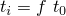, where *f* is defined as the ratio 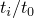. Thus, a change in the design parameter  causes the thicknesses  to change proportionally (the actual value of  is not important; however, for the purposes of normalization of the results, as discussed below, a value of 1 is used). A constraint on the change in the nodal coordinates due to a change in the design parameter is specified such that the outer nodes stay fixed and the inner nodes move inward along the original vectors connecting the outer nodes to the inner nodes. [Figure 14.2.2--1](ch14s02aex152.md#sxmdsatire-shape) depicts the shape of the tire cross-section that would result from a 50% change in nominal thickness. The other two design parameters chosen are the elastic modulus of the belt rebar material, *E*belt, and the elastic modulus of the carcass rebar material, *E*carc. The density of the rubber material, rubber, is also included as a design parameter for demonstration and verification purposes.

### Perturbation sizes for the finite differencing operations

As documented in ["Design sensitivity analysis," Section 19.1.1 of the Abaqus Analysis User's Guide](../usb/usb-link.md#usb-anl-adsa), Abaqus uses the semi-analytic approach to compute sensitivities, and this approach involves finite differencing computations at the element level. By default, Abaqus automatically determines for each element the perturbation sizes of the design parameters to be used in the finite differencing computations through a heuristic perturbation sizing algorithm. The perturbation sizes for the elements with the most contribution to the sensitivities are written to the message file. Since this algorithm can be expensive, DSA controls are provided to allow the user to directly supply perturbation sizes. If appropriate perturbation sizes are not known in advance, a smaller problem can be run with the default perturbation sizing algorithm, and the perturbation sizes determined by Abaqus can then be inserted into the larger problem.

This technique for obtaining perturbation sizes is adopted in this example. A smaller axisymmetric problem ([dsatire_axi_half.inp](../eif/dsatire_axi_half.inp)) with one inflation (static) step and one frequency step is run. The perturbation sizes reported in the message file for each step of the smaller problem are subsequently specified in the full model ([dsatire.inp](../eif/dsatire.inp)) using the DSA controls.

### Normalization of sensitivity results

In the subsequent plots of results, the sensitivities are normalized so that they can be compared side-by-side. Except as noted, the contour plots of contact pressures (CPRESS) and corresponding sensitivities are normalized by dividing by the maximum contact pressure at the end of the last static step, *C*max. In addition, the sensitivities of CPRESS are multiplied by the value of the design parameter. For example, the sensitivity of CPRESS with respect to , d_CPRESS_tNominal, is normalized as   d_CPRESS_tNominal/*C*max. The eigenfrequency (EIGFREQ) sensitivities are divided by the first eigenfrequency value and, as for CPRESS, multiplied by the value of the appropriate design parameter.

### Results and discussion

The contact pressure on the tire footprint can be considered an important factor in tire handling and wear properties. As such, the results of the sensitivity analysis are discussed in terms of the contact pressure distribution on the tire footprint. [Figure 14.2.2--2](ch14s02aex152.md#sxmdsatire-cpressfull) shows the actual values of the contact pressure on the full tire model looking from below at the end of the static footprint analysis. [Figure 14.2.2--3](ch14s02aex152.md#sxmdsatire-cpress) shows the normalized contact pressure distribution on a blown-up region of the full tire. As can be seen from these plots, the contact pressure is less in the center of the footprint than in the surrounding region. The maximum contact pressure occurs at node 2645, and the center of the footprint is at node 3055. These nodes are indicated on the plots, and [Figure 14.2.2--4](ch14s02aex152.md#sxmdsatire-cpresshist) shows the time history of CPRESS for these nodes.

The objective is to use the sensitivity results to determine how the design parameters can be modified to distribute the contact pressure more evenly so that the center of the tire picks up more of the load. [Figure 14.2.2--5](ch14s02aex152.md#sxmdsatire-dcpressecarc) to [Figure 14.2.2--7](ch14s02aex152.md#sxmdsatire-dcpresstnominal) show the distributions of the normalized contact pressure sensitivity for each of the design parameters. Large variations in the sensitivities away from the center of the footprint are observed in the sensitivity contour plots. These variations can be attributed to the high gradients in contact pressure in the region surrounding the center of the footprint (see [Figure 14.2.2--3](ch14s02aex152.md#sxmdsatire-cpress)), because even small changes in the footprint size (due to small changes in the design parameters) can lead to relatively large changes in the contact pressure. These sensitivity plots show that to increase the contact pressure at node 3055 (footprint center), the value of *E*carc should be increased, the value of *E*belt should be increased, and the value of  should be decreased. However, based on the magnitudes of the normalized sensitivities, *E*belt has the most influence on the contact pressure at the center node. Accordingly, a new design is investigated in which the design parameter *E*belt is increased by 5%. [Figure 14.2.2--8](ch14s02aex152.md#sxmdsatire-cpressnew) shows the distribution of contact pressure for the new design, and [Figure 14.2.2--9](ch14s02aex152.md#sxmdsatire-cpresshistnew) shows the time history of CPRESS at nodes 2645 and 3055 for the new design. These figures indicate that the contact pressure has increased in the center of the tire without appreciably affecting the surrounding contact pressure distribution; the actual increase is 3.20%. The predicted increase based on the (first-order) sensitivities is 2.32%, which is reasonably close to the actual increase considering the high degree of nonlinearity in this problem. 

 [Figure 14.2.2--10](ch14s02aex152.md#sxmdsatire-m1-color) to [Figure 14.2.2--14](ch14s02aex152.md#sxmdsatire-m5-color) show the first five modes of the tire. The study of the frequency sensitivities provides insight into the dynamic behavior of the design. For example, we can conclude from [Figure 14.2.2--15](ch14s02aex152.md#sxmdsatire-m2-wire-color) and [Figure 14.2.2--17](ch14s02aex152.md#sxmdsatire-dfreq) that the frequency of mode 2 is most sensitive to the sidewall shape, , and less sensitive to the Young's modulus of the sidewall reinforcement, *E*belt. In retrospect, this makes good physical sense because mode 2 is primarily shear of the sidewall (see [Figure 14.2.2--15](ch14s02aex152.md#sxmdsatire-m2-wire-color)), but this conclusion may have been much more difficult to formulate without the sensitivity information.. [Figure 14.2.2--16](ch14s02aex152.md#sxmdsatire-freq), [Figure 14.2.2--17](ch14s02aex152.md#sxmdsatire-dfreq), and [Table 14.2.2--1](ch14s02aex152.md#table-eigfreq) show the values of the eigenfrequency and corresponding normalized sensitivities for the first five modes of the tire. The eigenfrequencies for the new design (5% change in *E*belt as discussed above) are the same (to five significant figures) as for the original model. This behavior is accurately predicted in [Figure 14.2.2--17](ch14s02aex152.md#sxmdsatire-dfreq), where it can be seen that the eigenfrequencies are essentially independent of this design parameter.

Given the highly nonlinear nature of this problem, the user is cautioned against using the sensitivities beyond their useful limit. The sensitivities are first-order derivatives; therefore, using them to predict large changes in the design parameters is not valid, since higher-order terms are not considered. In addition, using sensitivity results to predict the outcome of simultaneous changes to the design parameters assumes that superposition is valid, which again is true only for small changes in the design parameters. For example, if the design parameters *E*carc and *E*belt are increased by 5% and  is decreased by 5%, the contact pressure at the center of the footprint increases by 4.35%, which is nearly twice the predicted change of 2.42%. This implies that a simultaneous change of 5% is too large for predicting the net effect on the contact pressure based on the sensitivities.

### Input files

[dsatire_axi_half.inp](../eif/dsatire_axi_half.inp)

Axisymmetric model with inflation and frequency analysis for obtaining perturbation sizes.

[dsatire_axi_half_node.inp](../eif/dsatire_axi_half_node.inp)

Nodal coordinates for axisymmetric model.

[dsatire_axi_half_psv.inp](../eif/dsatire_axi_half_psv.inp)

Parameter shape variation data for axisymmetric model.

[dsatire.inp](../eif/dsatire.inp)

Full model including inflation, footprint, and frequency analysis.

[dsatire_model.inp](../eif/dsatire_model.inp)

Model data for full model.

[dsatire_psv.inp](../eif/dsatire_psv.inp)

Parameter shape variation data for full model.

### Table

**Table 14.2.2–1** Eigenfrequency sensitivities for the first five modes.
| Mode | Eigenfrequency | Normalized eigenfrequency sensitivity with respect to: |
| --- | --- | --- |
|  | rubber | *E*belt | *E*carc |
| 1 | 51.6 | 1.56E1 | 5.00E1 | 1.84E3 | 1.39E2 |
| 2 | 52.9 | 2.18E1 | 5.13E1 | 1.81E5 | 4.97E3 |
| 3 | 58.7 | 1.45E1 | 5.69E1 | 2.27E3 | 1.53E2 |
| 4 | 60.6 | 1.34E1 | 5.88E1 | 1.75E3 | 1.54E2 |
| 5 | 84.1 | 1.69E1 | 8.15E1 | 3.48E3 | 1.86E2 |

### Figures

**Figure 14.2.2–1** Effect of 50% change in design parameter  on tire cross-section geometry (dashed line represents original geometry).

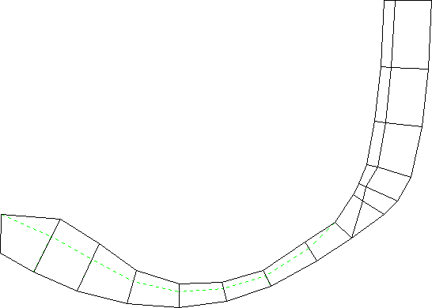

**Figure 14.2.2–2** Contact pressure distribution on full tire at end of footprint (static) analysis.

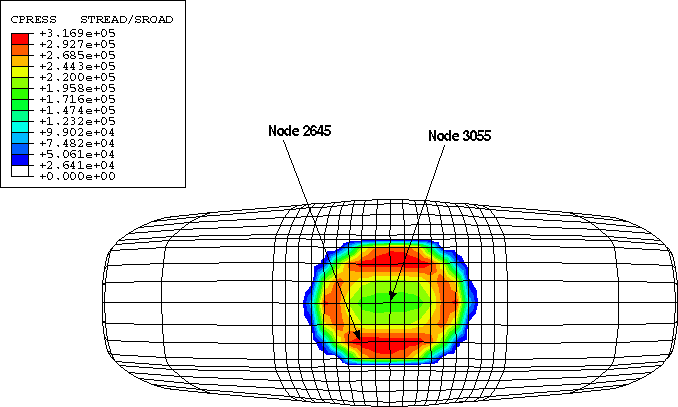

**Figure 14.2.2–3** Normalized contact pressure distribution on blown-up view of tire footprint at end of footprint analysis.

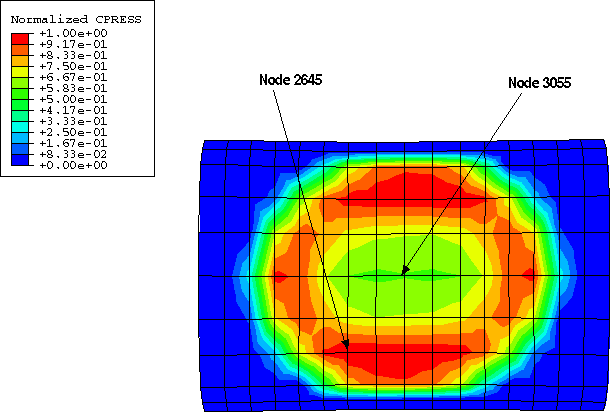

**Figure 14.2.2–4** Normalized contact pressure history for center node (3055) and node with maximum contact pressure at end of footprint analysis (2645).

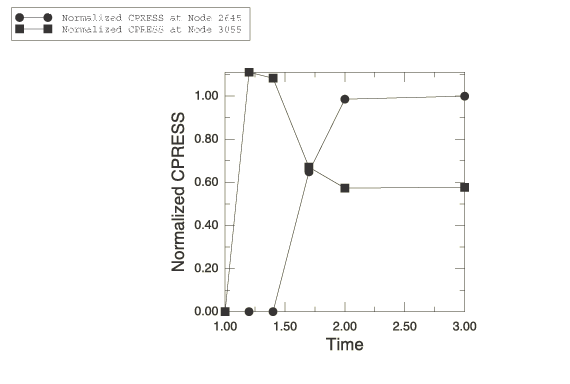

**Figure 14.2.2–5** Distribution of normalized contact pressure sensitivity with respect to *E*carc at end of footprint analysis.

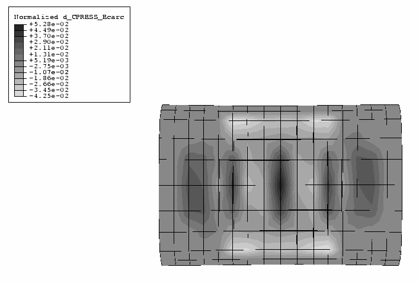

**Figure 14.2.2–6** Distribution of normalized contact pressure sensitivity with respect to *E*belt at end of footprint analysis.

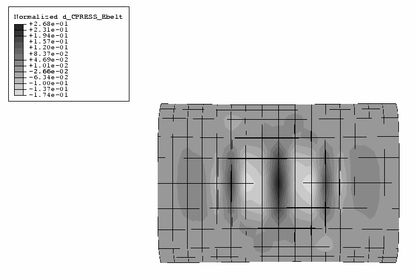

**Figure 14.2.2–7** Distribution of normalized contact pressure sensitivity with respect to  at end of footprint analysis.

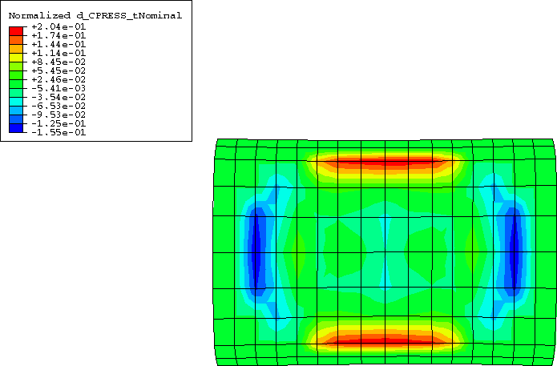

**Figure 14.2.2–8** Normalized contact pressure distribution for new design (5% increase in *E*belt).

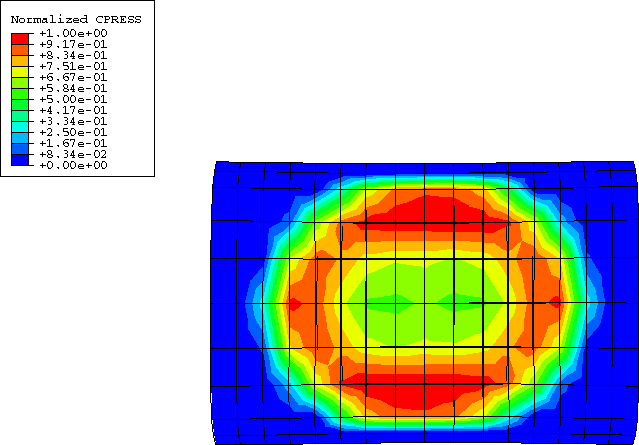

**Figure 14.2.2–9** Normalized contact pressure history at nodes 3055 and 2645 for new design.

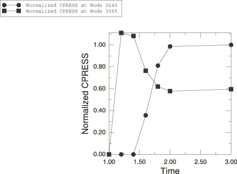

**Figure 14.2.2–10** Mode 1.

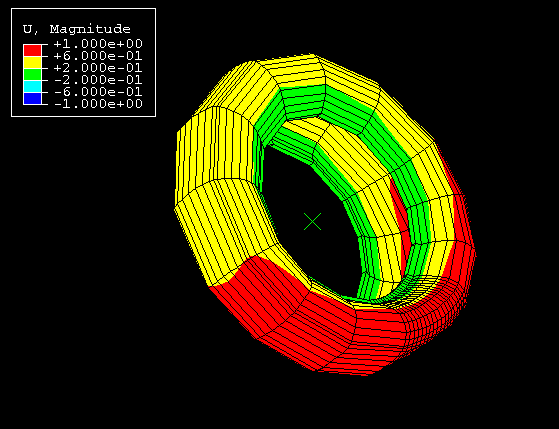

**Figure 14.2.2–11** Mode 2.

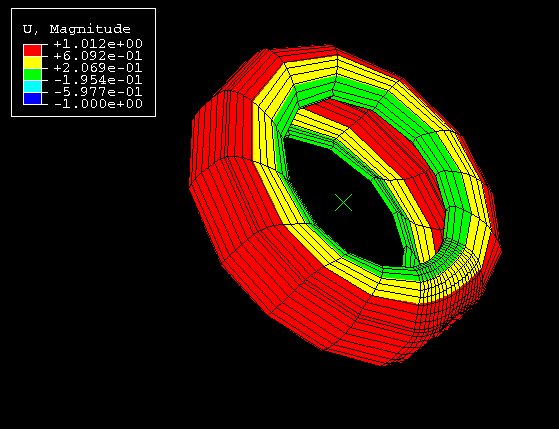

**Figure 14.2.2–12** Mode 3.

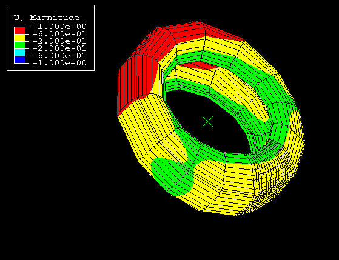

**Figure 14.2.2–13** Mode 4.

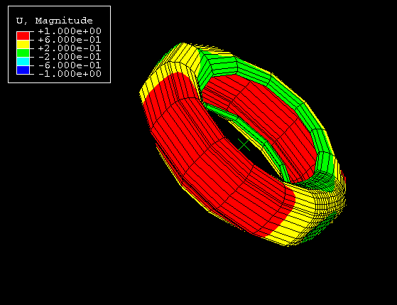

**Figure 14.2.2–14** Mode 5.

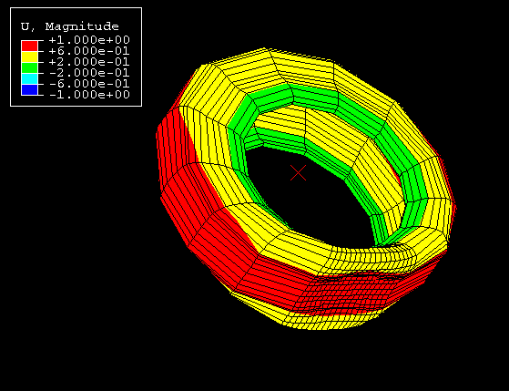

**Figure 14.2.2–15** Mode 2 (wire frame).

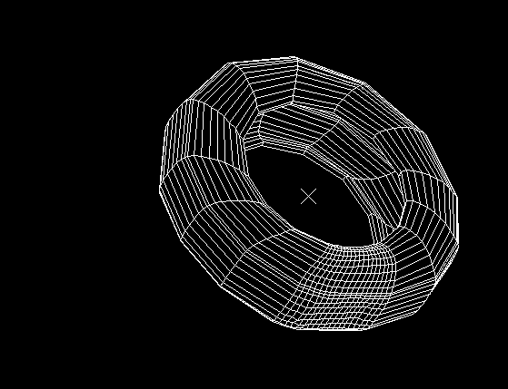

**Figure 14.2.2–16** Eigenfrequencies for first five modes.

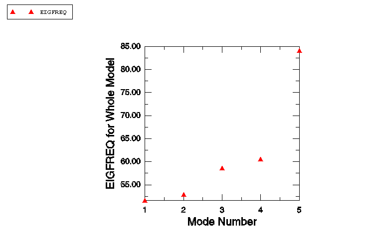

**Figure 14.2.2–17** Normalized eigenfrequency sensitivities for first five modes.

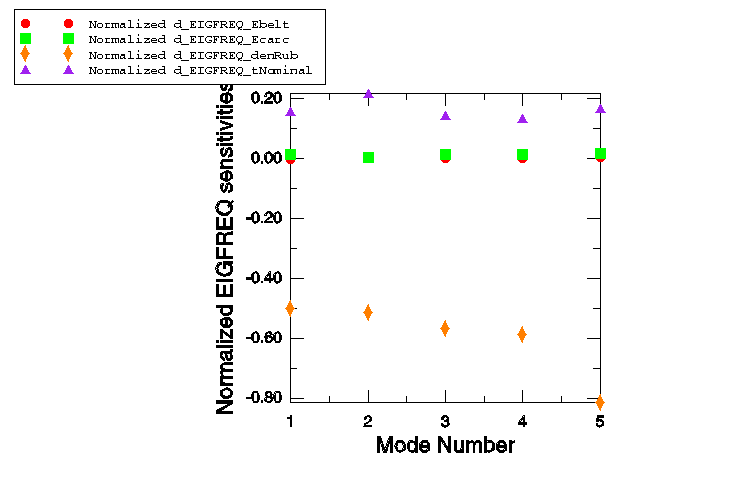

