# 14.2.3 Design sensitivity analysis of a windshield wiper

**Products: **Abaqus/Standard  Abaqus/Design  

In this example we consider a design sensitivity analysis of a statically loaded windshield wiper blade. The conventional wiper system is composed of three major subsystems: the blade-arm assembly, a linkage mechanism, and the electric motor. We restrict our design and analysis to the blade-arm subsystem. Wiping performance is determined by the dynamic performance of the wiper system, while safety regulations require that the blade wipe a specific area on the windshield surface. It is a major challenge to achieve systems that optimize wiping performance and satisfy the area conditions. The interaction between the force/deflection response of the blade (rubber) element and the friction at the blade-glass interface is a critical element in design. A design sensitivity analysis of the rubber-glass interaction gives insight that can be used to improve the design before undertaking the more complex dynamic stick-slip analysis. The sensitivity analysis also identifies the design parameters that are most effective in reducing the stress in highly stressed areas. Self-contact between the flanges of the rubber element is not considered in this example.

### Geometry, model properties, and design parameters

The geometry of the rubber blade is shown in [Figure 14.2.3--1](ch14s02aex153.md#sxmwiper-model). The arm is assumed to be stiff relative to the rubber blade and is modeled by prescribing fixed boundary conditions. The rubber blade is modeled as a plane strain model with 231 first-order hybrid elements. An incompressible hyperelastic material with a polynomial strain energy function is used to simulate the rubber material behavior. The windshield is assumed to be rigid and is modeled as an analytical rigid surface. Surface interaction between the blade and the windshield is modeled using finite-sliding contact with an isotropic Coulomb friction coefficient of 0.2. Three shape parameters and the coefficient of friction, , are chosen as design parameters for the design study. We choose  as a design parameter to study the effect of the friction coefficient on the blade-glass interface forces. The shape parameters that can be modified without requiring geometry changes to other parts of the assembly are chosen as design parameters. These shape parameters will help us to study the effect of aspects of wiper geometry on wiper stiffness. The shape parameters are the thickness, 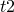, of the neck between the bottom two flanges; the thickness, 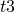, of the wiper tip; and the width, 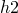, of the lower flange. The corresponding shape gradients (the derivatives of the nodal coordinates with respect to the shape design parameters) required as input to the sensitivity analysis are shown as symbol plots in [Figure 14.2.3--2](ch14s02aex153.md#sxmthick2-shape), [Figure 14.2.3--3](ch14s02aex153.md#sxmthick3-shape), and [Figure 14.2.3--4](ch14s02aex153.md#sxmflange-shape). These gradients are input using parameter shape variation and calculated using a custom Python script derived from the Abaqus/CAE replay file. This approach requires familiarity with the Abaqus Scripting Interface. Shape variation data can be generated more easily using Abaqus/CAE; details are given in ["Design sensitivity analysis: overview," Section 14.1.1](ch14s01abo01.md).

### Loading, boundary conditions, and design responses

An interference fit of 2.0 units between the blade and the windshield is used to simulate the static vertical load between them. The windshield is held fixed in the vertical direction, and the surface nodes of the upper flange are constrained in both directions. The wiping motion is simulated by prescribing a horizontal displacement of 9.0 units to the reference node of the windshield.

It is desirable to reduce the stress concentration in the rubber element since high stresses will degrade the lifecycle of the blade and affect performance. Consequently, the sensitivity of the Mises stress is taken as the primary design response in this model. Any design change should take into account the behavior of the contact pressure between the wiper and the windshield. To this end the sensitivities of CSTRESS are also selected as design responses. Including friction makes the stiffness matrix unsymmetric; hence, the analysis is run using the unsymmetric solver. Since we are interested in the history of the contact pressure at the tip, the incremental DSA formulation is chosen. To quantify the effect of neglecting the unsymmetric terms and of using total DSA, we also compare the maximum sensitivities for various combinations of DSA formulation and stiffness matrix symmetrization.

### Results and discussion

A contour plot of the Mises stress distribution on the deformed configuration of the rubber blade is shown in [Figure 14.2.3--5](ch14s02aex153.md#sxmwiper-mises). It is evident that the two necks between the flanges are the areas of interest. In a magnified contour plot of the Mises stress distribution in the necks ([Figure 14.2.3--6](ch14s02aex153.md#sxmwiper-mises1)) we can see that the stress concentration in the lower neck is higher than in the upper one. The normalized sensitivities of the maximum Mises stresses in the lower neck are listed in [Table 14.2.3--1](ch14s02aex153.md#sxmwiper-table). Sensitivities are normalized by dividing them by the maximum Mises value (67857.7 units in element 131 of the wiper blade) and then scaling the result by the initial value of the design parameter. We notice that the shape parameters have a direct effect (increasing the parameter increases stress and vice versa) and the friction coefficient has an inverse effect on the Mises stress. Reducing the thickness of the neck makes the wiper more flexible and reduces stress concentration. Increasing the friction coefficient increases the shear force at the tip. This increased shear force increases bending of the upper neck and decreases bending in the lower neck, thus reducing the stress concentration in the lower neck. We infer from the table that the Mises stress is more sensitive to  and  than to the flange width and friction coefficient. To reduce stress concentration, a design with changes in  and  is considered. A 20% reduction in  and a 10% reduction in  is selected. The predicted percentage reduction in the Mises stress is 6.76 (0.2832  0.2 + 0.1094  0.1).

The proposed design changes will affect the contact pressure at the wiper-windshield interface, and the sensitivity results are used to quantify this effect. The time history of the normalized sensitivities of contact pressure at a point at the tip is shown in [Figure 14.2.3--7](ch14s02aex153.md#sxmwiper-dcpress). Contact pressure at this point is most sensitive to . This result is somewhat unexpected since this design parameter does not affect the interface explicitly.  has a directly proportional effect, while  has an inversely proportional effect on the contact pressures. Thus, decreasing  will decrease the contact pressure while decreasing  will increase the contact pressure. The contact pressure histories for the proposed design and the current design are shown in [Figure 14.2.3--8](ch14s02aex153.md#sxmwiper-cpress1). The plots indicate that the reduced stress concentration in the proposed design comes at the cost of decreased wiper performance. (The proposed design has a lower contact pressure, which could be suboptimal.) If desired, the contact pressure can be positively influenced by considering a positive change in .

All results discussed above are obtained in an incremental DSA analysis using the unsymmetric solver. If the user is interested only in the results at particular increments (typically, the last increment), total DSA will be advantageous computationally. Similarly, neglecting the unsymmetric terms will improve computational efficiency. To quantify the error in such approximations, we compare the results for various combinations to the overall finite difference method (OFD). [Table 14.2.3--2](ch14s02aex153.md#sxmwiper-errortable) lists the relative error in the maximum Mises and contact pressure sensitivities compared to the results obtained using the OFD method. For the dominant shape parameter, , the sensitivity results of the maximum Mises stress are in good agreement with the OFD method for all the combinations. However, neglecting the unsymmetric terms in total DSA gives inaccurate results for the contact pressure sensitivities. The relative error is large for the less dominant shape parameters, with total DSA giving poor results for both the Mises and contact pressure sensitivities. Total DSA gives inaccurate results for sensitivities with respect to the friction coefficient. Although the sensitivity results are problem dependent, we can infer that total DSA may give poor results if we neglect unsymmetric terms. Further sensitivities of interaction pressures are more sensitive to approximations than the sensitivities of maximum stresses in the structures. Less significant sensitivities are affected more by approximations than the dominant sensitivities.

The proposed design changes are made and the analysis is rerun. A 9% reduction in the stress concentration is observed. Predicted and actual contact pressure histories are shown in [Figure 14.2.3--9](ch14s02aex153.md#sxmwiper-cpress2). The difference between the predicted and the actual results is due to the nonlinear dependence of the design response on the design parameter. However, the rerun confirms the prediction that the proposed design is more robust, with a possibly suboptimal wiping pressure.

### Input files

[dsawiper.inp](../eif/dsawiper.inp)

Primary wiper blade design sensitivity analysis.

[dsawiper_pred.inp](../eif/dsawiper_pred.inp)

Wiper blade analysis incorporating design changes.

[dsawiper_node.inp](../eif/dsawiper_node.inp)

Node description.

[dsawiper_elem.inp](../eif/dsawiper_elem.inp)

Element description.

[dsawiper_t2.inp](../eif/dsawiper_t2.inp)

Parameter shape variation data for thickness .

[dsawiper_t3.inp](../eif/dsawiper_t3.inp)

Parameter shape variation data for thickness .

[dsawiper_h2.inp](../eif/dsawiper_h2.inp)

Parameter shape variation data for width .

### Tables

**Table 14.2.3–1** Normalized sensitivities of maximum stress values.
| Design Parameter | Normalized Sensitivity |
| --- | --- |
|  | 0.2832 |
|  | 0.1094 |
|  | 0.0154 |
|  | 0.0026 |

**Table 14.2.3–2** Percentage error in maximum stress and contact pressure sensitivities.
| Design Parameter | Incremental DSA; Unsymmetric Solver | Incremental DSA; Symmetric Solver | Total DSA; Unsymmetric Solver | Total DSA; Symmetric Solver |
| --- | --- | --- | --- | --- |
|  | % Error MISES | % Error CPRESS | % Error MISES | % Error CPRESS | % Error MISES | % Error CPRESS | % Error MISES | % Error CPRESS |
|  | 0.02 | 0.00 | 0.06 | 0.24 | 0.02 | 0.11 | 2.4 | 22.15 |
|  | 0.01 | 0.01 | 0.02 | 0.12 | 1.81 | 61.56 | 1.70 | 53.20 |
|  | 0.37 | 0.00 | 12.35 | 0.13 | 1.12 | 94.41 | 12.36 | 93.01 |
|  | 1.51 | 0.88 | 1.97 | 0.43 | 51.6 | 0.88 | 28.90 | 21.21 |

### Figures

**Figure 14.2.3–1** Model of the rubber windshield wiper.

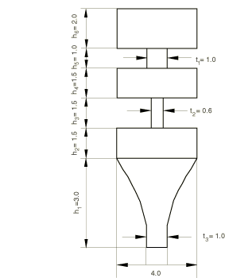

**Figure 14.2.3–2** Symbol plot of the shape variation with respect to .

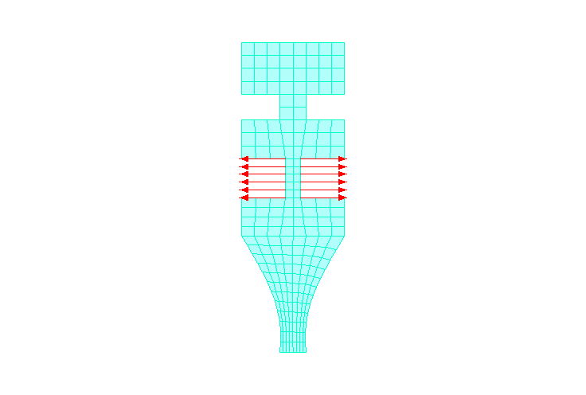

**Figure 14.2.3–3** Symbol plot of the shape variation with respect to .

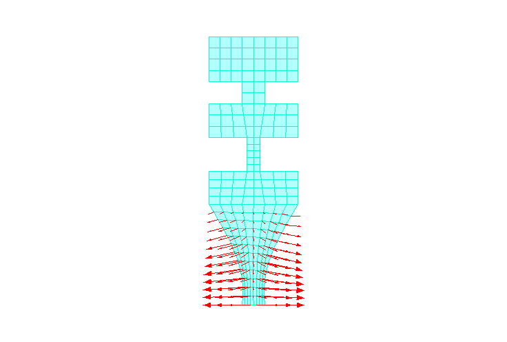

**Figure 14.2.3–4** Symbol plot of the shape variation with respect to .

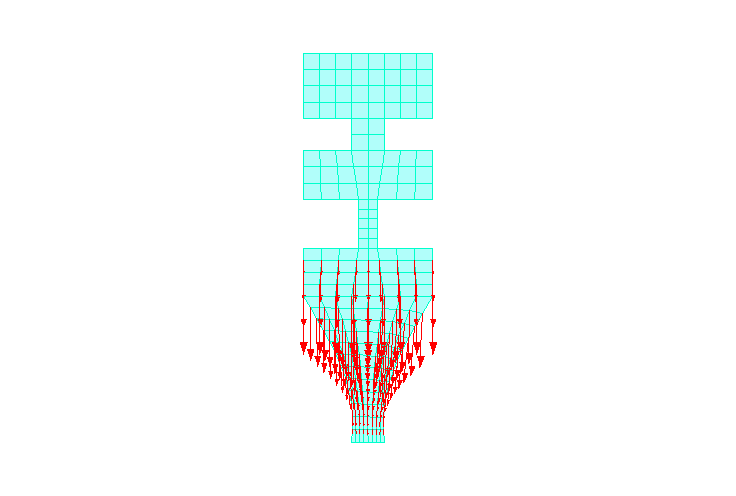

**Figure 14.2.3–5** Contour plot of Mises stress.

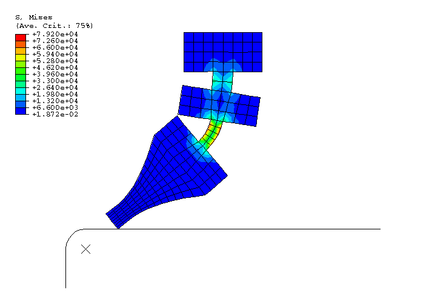

**Figure 14.2.3–6** Magnified contour plot of Mises stress.

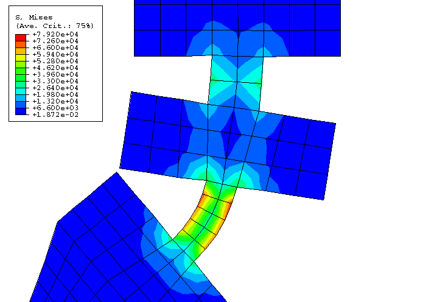

**Figure 14.2.3–7** Time history of the normalized sensitivity of contact pressure at the wiper tip.

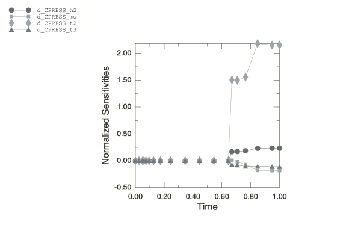

**Figure 14.2.3–8** Current and predicted contact pressure history.

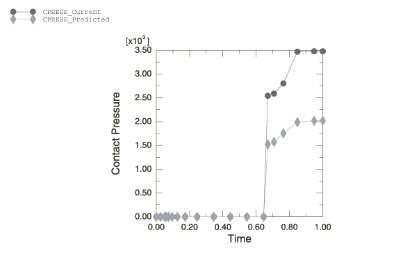

**Figure 14.2.3–9** Actual and predicted contact pressure history.

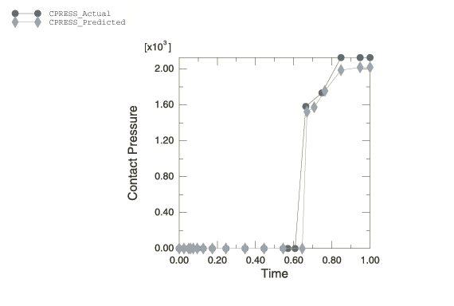

**Figure 14.2.3–10** Symbol plot of the computed shape variation with respect to .

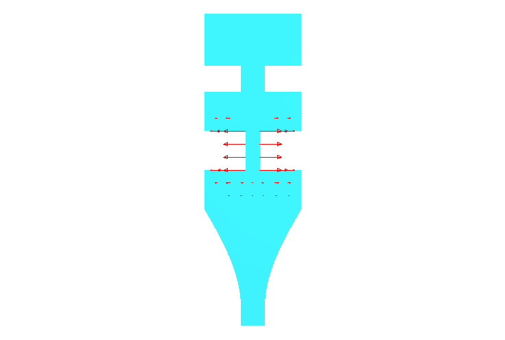

