# 14.2.4 橡胶衬套的设计敏感性分析

**产品：** Abaqus/Standard  Abaqus/Design

本例的目的是演示如何使用设计敏感性分析来改进橡胶衬套的设计。目标是改变衬套几何形状以降低最大轴向应力，从而延长使用寿命。设计敏感性分析提供了预测几何变化对应力集中的影响的手段，从而有助于识别重要设计参数并确定适当的设计变更。

### 几何形状、模型特性和设计参数

衬套由粘合到中央橡胶圆筒的内钢和外钢管组成（如图14.2.4-1所示）。假设衬套外周完全固定。衬套长457.2 mm（18.0 in），外径508.0 mm（20.0 in），内径228.6 mm（9.0 in）。钢为弹性， 杨氏模量 = 206.0 GPa（3.0×10^7 psi），泊松比 = 0.3。橡胶建模为在所有应变水平下相对于钢都相当软的完全不可压缩超弹性材料。橡胶的非线性弹性行为用应变不变量的二阶多项式应变能函数描述。

模型用标准轴对称单元离散，因为轴向加载导致纯轴对称变形。钢组件使用CAX4单元，橡胶组件使用CAX4H单元。刚性单元（单元类型RAX2）连接到两个模型中衬套内部以表示相对刚硬的轴。使用这些单元也简化了加载条件的施加。轴对称有限元网格如图14.2.4-1所示。10675.0 N（2400.0 lbs）大小的轴向力施加到刚体参考节点，而外钢管完全固定。

为设计敏感性分析考虑了两个设计参数：橡胶衬套在顶部和底部与内钢管粘合处的厚度t和圆角半径r（如图14.2.4-1所示）。这些参数代表了设计评估期间可能考虑的典型几何特性。

### 设计敏感性分析和设计参数

为了进行关于形状设计参数的设计敏感性分析，必须用参数形状变化指定节点坐标关于设计参数的梯度。获得这些梯度的一种简单方法是每次对一个形状设计参数r和t进行扰动，并记录扰动后的坐标。然后通过对初始和扰动节点坐标进行数值差分来找到梯度。在当前研究中，施加了约束：厚度变化导致连接厚度尺寸到圆角半径的节点线关于该线到圆角半径切点的连线旋转。Abaqus脚本接口命令`_computeShapeVariations()`提供了计算形状变化的半自动工具（见["设计敏感性分析：概述," 第14.1.1节](ch14s01abo01.md)）。

### 结果与讨论

变形网格如图14.2.4-2所示。图14.2.4-3显示了轴对称分析结束时衬套橡胶部分轴向应力的等值线。最大应力出现在靠近轴线的顶部圆角附近。图14.2.4-4和图14.2.4-5分别显示了轴向应力关于形状设计变量r和t的敏感性等值线。表14.2.4-1显示了最大轴向应力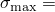 0.17 MPa（24.55 psi）关于形状设计变量的归一化敏感性。归一化通过将敏感性乘以特征尺寸（初始圆角半径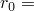 12.7 mm（0.5 in）和初始厚度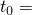 15.24 mm（0.6 in））并除以最大应力来进行。从该表可以推断，圆角半径的变化比橡胶厚度的变化对最大应力的影响更大。因此，期望改变r来修改应力。为了在轴向方向获得大约10%的最大应力减少，圆角半径增加

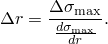

代入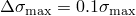和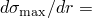 0.008 MPa/mm（28.75 psi/in）（见 图14.2.4-4）给出 2.25 mm（0.09049 in）。使用半径改为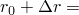 14.99 mm（0.59049 in）重新分析问题，得到最大轴向应力减少8.8%，略低于10%的目标。这是预期的，因为问题的非线性；要达到10%的减少，需要重复这个过程，这本质上是一个优化问题。

### 输入文件

[bushing_cax4_axi_dsa.inp](../eif/bushing_cax4_axi_dsa.inp)

轴对称模型的设计敏感性分析。

[bushing_node.inp](../eif/bushing_node.inp)

节点定义。

[bushing_steel.inp](../eif/bushing_steel.inp)

钢的单元定义。

[bushing_rubber.inp](../eif/bushing_rubber.inp)

橡胶的单元定义。

[bushing_rigid.inp](../eif/bushing_rigid.inp)

刚体的单元定义。

### 表

**表14.2.4-1** 最大应力的归一化敏感性。
| 参数 | 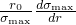 | 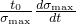 |
| --- | --- | --- |
| r | 0.58 | --- |
| t | --- | 0.11 |

### 图

**图14.2.4-1** 轴对称横截面。

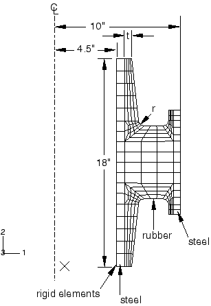

**图14.2.4-2** 轴向加载后的变形网格。

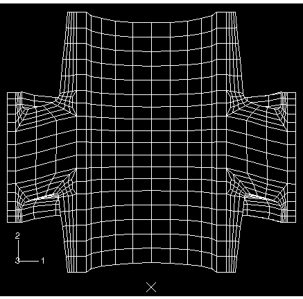

**图14.2.4-3** 轴向加载后橡胶轴向应力的变化。

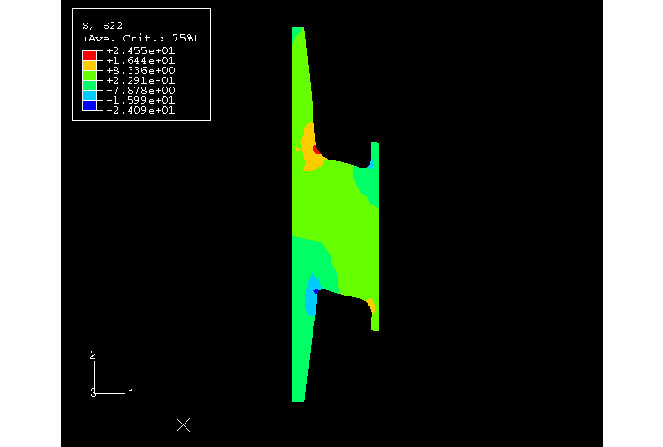

**图14.2.4-4** 轴向应力关于圆角半径r增加的敏感性变化。

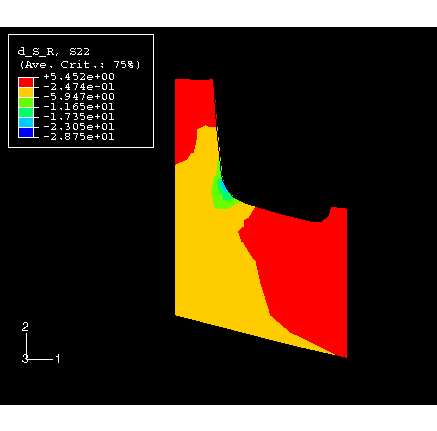

**图14.2.4-5** 轴向应力关于橡胶厚度t减少的敏感性变化。

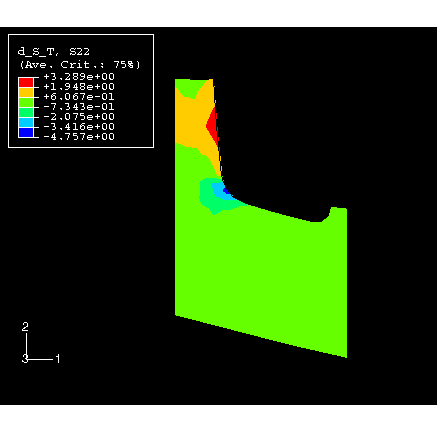

