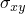
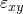

# 15.1.2 Joining data from multiple results files and converting file format: FJOIN


**Products: **Abaqus/Standard  Abaqus/Explicit  

This example illustrates how to use a FORTRAN program to extract specific data from different Abaqus results files and to join the data into a single results file. This program can also be used to convert the format of results files.

### Postprocessing

Sometimes it is desirable to combine a number of results files into a single file or to create a new results file by retrieving selected data from different results files. The **abaqus append** utility joins two results files by stripping the header information from the second results file and appending the step information to the end of the first results file. See ["Joining results (`.fil`) files," Section 3.2.14 of the Abaqus Analysis User's Guide](../usb/usb-link.md#usb-int-dappendfil), for more information on this utility.

This example postprocessing program demonstrates how a FORTRAN program can be used to extract specific information from results files created by separate analyses of the same model. In this example the stress and strain records in three analyses will be merged to create a new results file.

### Programming details

The general discussion on programming concepts and Abaqus FORTRAN interfaces in ["User postprocessing of Abaqus results files: overview," Section 15.1.1](ch15s01abo02.md), should be reviewed before running or modifying this program. Review of the results file format in [Chapter 5, "File Output Format," of the Abaqus Analysis User's Guide](../usb/usb-link.md#usbfchapter) is also recommended.

The program `FJOIN` (named `fjoin.f` on the Abaqus release media) prompts for the values of `NRU`, `LRUNIT(1,NRU)`, `LRUNIT(2,NRU)`, and `FNAME`. Then subroutines `INITPF` and `DBNRU` are called to complete the necessary initializations and file connections. Data processing starts with a double `DO`-loop looping over all of the records to be read, one-by-one, via a call to `DBFILE`. A record can be skipped or written to the new results file with or without any modifications. Each record is identified by its record key, which is stored in the second entry of the record (see ["Results file output format," Section 5.1.2 of the Abaqus Analysis User's Guide](../usb/usb-link.md#usb-out-fformat)).

Each file contains a number of header records, `1900`-series. These records contain general information about the model. Different analyses using the same model place essentially the same information in these records. Hence, when combining results files from different analyses of the same model, all `1900`-series records from the first file that is processed should be kept. Similar records in subsequent files should be skipped to avoid duplication and confusion. However, the `1910`, `1911`, `1922`, and `1980` records should be kept. They are useful for processing results within a substructure, output requests, and natural frequency extraction results.

The data for each increment of an analysis begin with the increment start record, which is identified by record key `2000`. Record `2000` is followed by the records that correspond to the data requested through file output options specified in the Abaqus input file. Record `1`, the element header record, is automatically written to the results file when element variables are requested. It is of interest when postprocessing since it contains important information about the element data, including the location of data within an element (i.e., whether data are written at the element integration points, the centroid, nodes, etc.). For this example, records `11` and `21` (the stress and strain records, respectively) are written to the results file since stress and strain were requested. The increment end record is identified by record key `2001`. When an end-of-file condition is encountered and the previously processed record is a `2001` record, a FORTRAN `CLOSE` is executed on the current FORTRAN unit number so that the processing of the next file can begin.

### Program compilation and linking

The **abaqus make** utility is designed to compile and link this type of postprocessing program. It will also make the `aba_param.inc` file available during compilation. The command to compile and link the `FJOIN` program is as follows:

```
abaqus make job=fjoin
```

This command will have to be repeated if FORTRAN errors are discovered during the compilation or link. The commands used by the **abaqus make** utility can be changed if necessary. The [Abaqus Installation and Licensing Guide](../sgb/sgb-link.md#sgb) lists the typical compile and link commands for each computer type.

### Program execution

Before program execution, the analysis jobs must be run to generate results files to be read by the program. In this example three jobs are run. The input files for these analyses are `fjoin002.inp`, `fjoin003.inp`, and `fjoin004.inp`. The results files from these analyses are output in binary format and are called `fjoin002.fil`, `fjoin003.fil`, and `fjoin004.fil`.

The `FJOIN` program will read these files via FORTRAN units `2`, `3`, and `4`. The name of the new file will be `fjoinxxx`. Before running the program, the results files must be renamed to `fjoinxxx.002`, `fjoinxxx.003`, and `fjoinxxx.004`. Note that the root file names are the same (defined using `FNAME`), and that the extensions are set to the FORTRAN unit numbers used to open the files.

When the program is executed using the command `abaqus fjoin`, the first prompt will be

```
Enter the number of files to be joined:
```

Enter `3` to set `NRU=3`. The second prompt will be
```
Enter the unit number of input file # 1:
```

Enter `2` to define `LRUNIT(1,1)=2`. At the third prompt,
```
Enter the format of input file # 1 (1-ASCII, 2-binary):
```

enter `2`. This sets `LRUNIT(2,1)=2` and means that the file being read is binary. The second and third prompts are repeated for each additional file to be processed. The program will then ask whether the new results file should be written in ASCII or binary format,
```
Enter the format of the output file (1-ASCII, 2-binary):
```

Enter `2` to set `LOUTF=2`, which specifies that binary format has been chosen for the new results file. The format of the output file may be different from the format of the input files, so this program can also be used to convert the format of results files. Finally, when the program issues the prompt
```
Enter the name of the input files (w/o extension):
```

enter `fjoinxxx` to define `FNAME` (the input files must have been given the root file name `fjoinxxx`; the output file will be created as `fjoinxxx.fin`).

As soon as the *n*th file has been processed, the message `END OF FILE #` *n* is written to the terminal. After all files have been processed, the program stops and the new results file is created. The new results file created by this program contains stress and strain records at all integration points in each element and at all nodal points.

### Analysis description

The structure is a 10  10 square plate with unit thickness. The plate lies in the *X–Y* plane such that its bottom edge coincides with the *x*-axis and the left edge coincides with the *y*-axis. The finite element model employs a 2  2 mesh of CPS8R elements. The material is linear elastic with Young's modulus = 30  106 and Poisson's ratio = 0.3. Three separate analyses are performed with displacement-controlled load steps.

In the first analysis ([fjoin002.inp](../eif/fjoin002.inp)), the plate is subjected to biaxial tension by prescribing a vertical displacement of 0.25 along the top edge, a horizontal displacement of 0.25 along the right edge, and symmetry boundary conditions on the left and bottom edges.

In the second analysis ([fjoin003.inp](../eif/fjoin003.inp)), the structure is forced to deform in simple shear by applying a horizontal displacement of 0.25 to the top edge while holding the bottom edge fixed and allowing the horizontal displacement to vary linearly with *y* along the left and right edges. The vertical displacement is zero everywhere.

In the third analysis ([fjoin004.inp](../eif/fjoin004.inp)), the plate is subjected to uniaxial tension by applying a displacement of 0.25 in the *y*-direction to the nodes along the top edge and symmetry boundary conditions to the nodes along the *x*- and *y*-axes.

### Results and discussion

Since the state of stress and strain is homogeneous, the integration point and nodal averaged values of stress and strain are identical everywhere. A typical record obtained at the end of each step is included below:

| Analysis |  |  |  |
| --- | --- | --- | --- |
| fjoin002.inp | 1.07 106 | 1.07 106 | 0.0 |
| fjoin003.inp | 0.0 | 0.0 | 2.88 105 |
| fjoin004.inp | 0.0 | 7.50 105 | 0.0 |

| Analysis |  |  |  |
| --- | --- | --- | --- |
| fjoin002.inp | 2.50 102 | 2.50 102 | 0.0 |
| fjoin003.inp | 0.0 | 0.0 | 2.50 102 |
| fjoin004.inp | 7.50 103 | 2.50 102 | 0.0 |

### Input files

[fjoin002.inp](../eif/fjoin002.inp)

First analysis file.

[fjoin003.inp](../eif/fjoin003.inp)

Second analysis file.

[fjoin004.inp](../eif/fjoin004.inp)

Third analysis file.

[fjoin.f](../eif/fjoin.f)

Postprocessing program.


