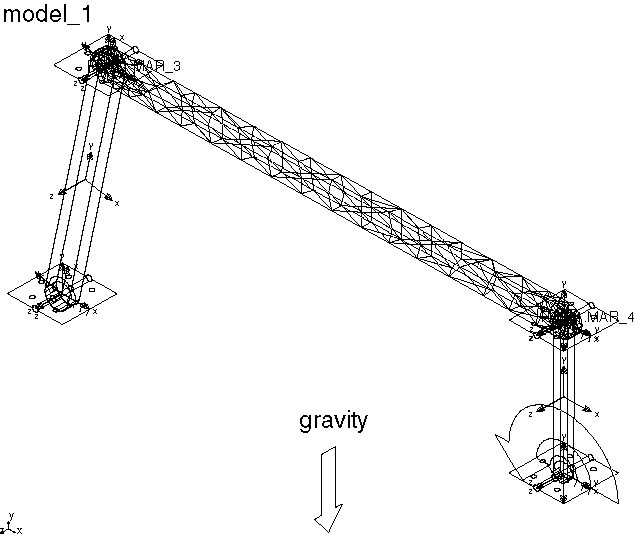

# 15.1.7 将Abaqus数据转换为用于MSC.ADAMS分析的模态中性文件格式


**产品：** Abaqus/Standard

### 目标

本示例演示**abaqus adams**翻译器的以下特性和技术：
- 为MSC.ADAMS组件创建Abaqus模型，
- 将Abaqus结果转换为MSC.ADAMS所需的模态中性（`.mnf`）文件，以及
- 显示ADAMS/Flex柔性分析的结果。

### 应用描述

本节说明了在动态分析期间调查模型中子结构柔性的两种方法。不同的情况是：
- 使用实体单元网格化的三维钢链接子结构，其节点处具有位移自由度，如图[图15.1.7-1](ch15s01aex160.md#exa-adm-examples-link)所示。多点约束将其连接到模型中的其他组件。该分析包括两个步：特征频率提取步和为柔性体定义的子结构生成步。
- 使用梁单元网格化的相同钢链接。由于梁单元在其节点处同时具有位移和旋转自由度，因此不需要多点约束将子结构连接到模型的其余部分。该分析包括两个步：特征频率提取步和为柔性体定义的子结构生成步。

### Abaqus建模方法和模拟技术

本节描述的两种情况采用相同的一般方法：

1. 为MSC.ADAMS模型的每个柔性组件创建Abaqus模型。每个组件建模为Abaqus子结构。
2. 运行Abaqus分析。
3. 运行**abaqus adams**翻译器，从分析生成的SIM数据库读取Abaqus结果，并为MSC.ADAMS创建模态中性（`.mnf`）文件。
4. 将模态中性文件读入MSC.ADAMS。必须为MSC.ADAMS中的每个柔性部件创建单独的模态中性文件。

### 分析案例摘要

| 案例1 | 使用实体单元建模的链接。 |
| --- | --- |
| 案例2 | 使用梁单元建模的链接。 |

### 案例1 使用实体单元建模的链接

本示例使用三维连续单元对简单柔性链接组件进行建模。

### 分析类型

该示例包括特征频率提取和子结构生成分析。

### 网格设计

该链接使用642个C3D10四面体实体单元（1368个节点）进行建模。

### 材料模型

本案例中使用的钢的弹性模量为2.07×10¹¹ N/m²（3.0×10⁷ lbf/in²），泊松比为0.29。模型的密度为7.8×10³。

### 边界条件

`RETNODES`节点集在1和6方向上固定。

### 约束

该分析包括两个多点约束：一个应用于`LEFTCYL`节点集，另一个应用于`RIGHTCYL`节点集。

### 分析步

该分析包括两个步：特征频率提取步和子结构生成分析步。

### 输出请求

作为子结构生成分析步的一部分，单元刚度矩阵和质量矩阵被写入元素集`PROP1`的SIM数据库。

### 运行程序

您可以使用以下过程执行链接与实体单元的分析。

1. 输入以下命令从Abaqus发布提供的压缩档案文件中提取输入文件： ``` abaqus fetch job=adams_ex1 abaqus fetch job=adams_ex1_nodes abaqus fetch job=adams_ex1_elements ```
2. 输入以下命令执行Abaqus分析： ``` abaqus job=adams_ex1 ```
3. 输入以下命令执行**abaqus adams**翻译器，并将Abaqus分析生成的SIM数据库中的结果翻译为用于ADAMS/Flex的模态中性文件： ``` abaqus adams job=adams_ex1 substructure_sim=adams_ex1_Z1 model_odb=adams_ex1 ```

### 结果与讨论

由于实体单元在其节点处仅具有位移自由度，因此使用多点约束提供到MSC.ADAMS模型中其他组件的连接。在链接中心线上的铰链孔中心处添加了两个节点。位于铰链孔面上的C3D10节点通过BEAM型多点约束连接到额外节点，允许节点在链接和其他MSC.ADAMS组件之间传递力和力矩。

用于定义单个子结构的选项在["将Abaqus数据翻译为MSC.ADAMS模态中性文件，" Abaqus Analysis User's Guide的第3.2.36节](../usb/usb-link.md#usb-int-dabaadmproc-input-overview)的"Abaqus子结构模型"中描述。计算20个固定界面振动模式以表示链接的动态行为。

MSC.ADAMS使用固定界面振动模式和约束模式来表征链接的柔性。Abaqus计算的链接的八个最低固定界面振动频率如[表15.1.7-1](ch15s01aex160.md#table-admsolidlink1)所示。这些频率在`adams_ex1.dat`文件中报告。**abaqus adams**翻译器将这些固定界面模式与静态约束模式结合，计算等效模态基，供ADAMS/Flex使用。该等效基的前六个频率大约为零。未约束模型的接下来八个频率如[表15.1.7-2](ch15s01aex160.md#table-admsolidlink2)所示。这些频率在执行**abaqus adams**翻译器时写入屏幕。

### 案例2 使用梁单元建模的链接

本示例使用三维梁单元对简单柔性链接组件进行建模。

### 分析类型

与案例1一样，本示例包括特征频率提取和子结构生成分析。

### 网格设计

梁模型网格使用10个B31单元（11个节点）。

### 材料模型

钢材定义与案例1相同。

### 边界条件

梁单元在其节点处同时具有位移和旋转自由度。

### 分析步

该分析包括两个步：特征频率提取步和子结构生成分析步。

### 运行程序

您可以使用以下过程执行链接与梁单元的分析。

1. 输入以下命令从Abaqus发布提供的压缩档案文件中提取输入文件： ``` abaqus fetch job=adams_ex2 ```
2. 输入以下命令执行Abaqus分析： ``` abaqus job=adams_ex2 ```
3. 输入以下命令执行**abaqus adams**翻译器，并将Abaqus分析生成的SIM数据库中的结果翻译为用于ADAMS/Flex的模态中性文件： ``` abaqus adams job=adams_ex2 substructure_sim=adams_ex2_Z1 model_odb=adams_ex2 ```

### 结果与讨论

梁模型和实体模型之间的主要区别在于，梁模型仅使用10个B31单元（11个节点）。由于梁单元在其节点处同时具有位移和旋转自由度，因此不需要多点约束将链接连接到其他MSC.ADAMS组件。模型的其余部分与链接的实体模型基本相同。

[表15.1.7-3](ch15s01aex160.md#table-admbeamlink)中显示了未约束模型的前八个非零频率。这些频率接近链接实体模型的频率。尽管Abaqus中此模型的计算成本比实体模型低得多，但两个模型在MSC.ADAMS中的计算成本非常相似，因为两个模型都有32个模式（12个约束模式和20个固定界面振动模式）。

### 输入文件

##### **案例1 使用实体单元建模的链接**

[adams_ex1.inp](../eif/adams_ex1.inp)

分析承受重力载荷的链接模型的输入文件。

[adams_ex1_nodes.inp](../eif/adams_ex1_nodes.inp)

案例1的节点定义。

[adams_ex1_elements.inp](../eif/adams_ex1_elements.inp)

案例1的单元定义。

##### **案例2 使用梁单元建模的链接**

[adams_ex2.inp](../eif/adams_ex2.inp)

分析承受重力载荷的链接模型的输入文件。

### 参考

**Abaqus Analysis User's Guide**
- ["将Abaqus数据翻译为MSC.ADAMS模态中性文件，" Abaqus Analysis User's Guide的第3.2.36节](../usb/usb-link.md#usb-int-dabaadmproc)

### 表格

**表15.1.7-1** 实体链接模型的固定界面振动频率。
| 频率（Hz） |
| --- |
| 206 |
| 391 |
| 570 |
| 1124 |
| 1228 |
| 1817 |
| 1879 |
| 2541 |

**表15.1.7-2** ADAMS/Flex使用的实体链接模型的非零频率。
| 频率（Hz） |
| --- |
| 194 |
| 535 |
| 574 |
| 1055 |
| 1551 |
| 1762 |
| 1801 |
| 2653 |

**表15.1.7-3** ADAMS/Flex使用的梁链接模型的非零频率。
| 频率（Hz） |
| --- |
| 205 |
| 555 |
| 610 |
| 1070 |
| 1618 |
| 1742 |
| 1775 |
| 2568 |

### 图表

**图15.1.7-1** 实体链接模型。



