# 1.1.4 Indentation of an elastomeric foam specimen with a hemispherical punch

**Products: **Abaqus/Standard  Abaqus/Explicit  Abaqus/Design  

In this example we consider a cylindrical specimen of an elastomeric foam, indented by a rough, rigid, hemispherical punch. Examples of elastomeric foam materials are cellular polymers such as cushions, padding, and packaging materials. This problem illustrates a typical application of elastomeric foam materials when used in energy absorption devices. The same geometry as the crushable foam model of ["Simple tests on a crushable foam specimen," Section 3.2.7 of the Abaqus Benchmarks Guide](../bmk/bmk-link.md#bmk-mat-crushablefoam), is used but with a slightly different mesh. Design sensitivity analysis is carried out for a shape design parameter and a material design parameter to illustrate the usage of design sensitivity analysis for a problem involving contact.

### Geometry and model

The axisymmetric model (135 linear 4-node elements) analyzed is shown in [Figure 1.1.4--1](ch01s01aex04.md#sxmhemipunch-model). The mesh refinement is biased toward the center of the foam specimen where the largest deformation is expected. The foam specimen has a radius of 600 mm and a thickness of 300 mm. The punch has a radius of 200 mm. The bottom nodes of the mesh are fixed, while the outer boundary is free to move.

A contact pair is defined between the punch, which is modeled by a rough spherical rigid surface, and a slave surface composed of the faces of the axisymmetric elements in the contact region. The friction coefficient between the punch and the foam is 0.8. A point mass of 200 kg representing the weight of the punch is attached to the rigid body reference node. The model is analyzed in both Abaqus/Standard and Abaqus/Explicit. 

### Material

The elastomeric foam material is defined using experimental test data. The uniaxial compression and simple shear data stress-strain curves are shown in [Figure 1.1.4--2](ch01s01aex04.md#hemipunch-stre-stra). Other available test data options are biaxial test data, planar test data, and volumetric test data. The test data are defined in terms of nominal stress and nominal strain values. Abaqus performs a nonlinear least-squares fit of the test data to determine the hyperfoam coefficients 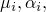 and .

Details of the formulation and usage of the hyperfoam model are given in ["Hyperelastic behavior in elastomeric foams," Section 22.5.2 of the Abaqus Analysis User's Guide](../usb/usb-link.md#usb-mat-chyperfoam); ["Hyperelastic material behavior," Section 4.6.1 of the Abaqus Theory Guide](../stm/stm-link.md#stm-mat-hyperelastic); and ["Fitting of hyperelastic and hyperfoam constants," Section 4.6.2 of the Abaqus Theory Guide](../stm/stm-link.md#stm-mat-fithyperconst). ["Fitting of elastomeric foam test data," Section 3.1.5 of the Abaqus Benchmarks Guide](../bmk/bmk-link.md#bmk-mat-foamdatafitting), illustrates the fitting of elastomeric foam test data to derive the hyperfoam coefficients.

For the material used in this example,  is zero, since the effective Poisson's ratio, , is zero as specified by the POISSON parameter. The order of the series expansion is chosen to be  2 since this fits the test data with sufficient accuracy. It also provides a more stable model than the  3 case.

The viscoelastic properties in Abaqus are specified in terms of a relaxation curve (shown in [Figure 1.1.4--3](ch01s01aex04.md#hemipunch-relax)) of the normalized modulus 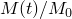, where 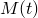 is the shear or bulk modulus as a function of time and 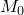 is the instantaneous modulus as determined from the hyperfoam model. This requires Abaqus to calculate the Prony series parameters from data taken from shear and volumetric relaxation tests. The relaxation data are specified as part of the definition of shear test data but actually apply to both shear and bulk moduli when used in conjunction with the hyperfoam model. Abaqus performs a nonlinear least-squares fit of the relaxation data to a Prony series to determine the coefficients, 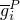, and the relaxation periods, . A maximum order of 2 is used for fitting the Prony series. If creep data are available, you can specify normalized creep compliance data to compute the Prony series parameters. 

A rectangular material orientation is defined for the foam specimen, so stress and strain are reported in material axes that rotate with the element deformation. This is especially useful when looking at the stress and strain values in the region of the foam in contact with the punch in the direction normal to the punch (direction “22”).

The rough surface of the punch is modeled by specifying a friction coefficient of 0.8 for the contact surface interaction. 

### Procedure and loading definitions

Two cases are analyzed. In the first case the punch is displaced statically downward to indent the foam, and the reaction force-displacement relation is measured for both the purely elastic and viscoelastic cases. In the second case the punch statically indents the foam through gravity loading and is then subjected to impulsive loading. The dynamic response of the punch is sought as it interacts with the viscoelastic foam.

#### Case 1

In Abaqus/Standard the punch is displaced downward by a prescribed displacement boundary condition in the first step, indenting the foam specimen by a distance of 250 mm. Geometric nonlinearity should be accounted for in this step, since the response involves large deformation. In the second step the punch is displaced back to its original position. Two analyses are performed—one using the static procedure for both steps and the other using the quasi-static procedure for both steps. During a static step the material behaves purely elastically, using the properties specified with the hyperfoam model. The quasi-static, direct-integration implicit dynamic, or fully coupled thermal-stress procedure must be used to activate the viscoelastic behavior. In this case the punch is pushed down in a period of one second and then moved back up again in one second. The accuracy of the creep integration in the quasi-static procedure can be controlled and is typically calculated by dividing an acceptable stress error tolerance by a typical elastic modulus. In this problem we estimate a stress error tolerance of about 0.005 MPa and use the initial elastic modulus, E 2 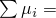 0.34, to determine an accuracy tolerance of 0.01.

In Abaqus/Explicit the punch is also displaced downward by a prescribed displacement boundary condition, indenting the foam by a depth of 250 mm. The punch is then lifted back to its original position. In this case the punch is modeled as either an analytical rigid surface or a discrete rigid surface defined with RAX2 elements. The entire analysis runs for 2 seconds. The actual time period of the analysis is large by explicit dynamic standards. Hence, to reduce the computational time, the mass density of the elements is increased artificially to increase the stable time increment without losing the accuracy of the solution. The mass scaling factor is set to 10, which corresponds to a speedup factor of 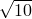. The reaction force-displacement relation is measured for both the elastic and viscoelastic cases.

#### Case 2

The Abaqus/Standard analysis is composed of three steps. The first step is a quasi-static step, where gravity loading is applied to the point mass of the punch. The gravity loading is ramped up in two seconds, and the step is run for a total of five seconds to allow the foam to relax fully. In the second step, which is a direct-integration implicit dynamic step, an impulsive load in the form of a half sine wave amplitude with a peak magnitude of 5000 N is applied to the punch over a period of one second. In the third step, also a direct-integration implicit dynamic step, the punch is allowed to move freely until the vibration is damped out by the viscoelastic foam. For a dynamic analysis with automatic time incrementation, the value of the half-increment residual tolerance for the direct-integration implicit dynamic procedure controls the accuracy of the time integration. For systems that have significant energy dissipation, such as this heavily damped model, a relatively high value of this tolerance can be chosen. We choose the tolerance to be 100 times a typical average force that we estimate (and later confirm from the analysis results) to be on the order of 50 N. Thus, the half-increment residual tolerance is 5000 N. For the second direct-integration implicit dynamic step we bypass calculation of initial accelerations at the beginning of the step, since there is no sudden change in load to create a discontinuity in the accelerations.

In the Abaqus/Explicit analysis the punch indents the foam quasi-statically through gravity loading and is then subjected to an impulsive loading. In the first step gravity loading is applied to the point mass of the punch, and the foam is allowed to relax fully. The mass scaling factor in this step is set to 10. In the second step a force in the form of a half sine wave is applied to the punch, and the dynamic response of the punch is obtained as it interacts with the viscoelastic foam. In the third step the load is removed, and the punch is allowed to move freely. Mass scaling is not used in Steps 2 and 3 since the true dynamic response is sought.

### Design sensitivity analysis

For the design sensitivity analysis (DSA) carried out with static steps in Abaqus/Standard, the hyperfoam material properties are given using direct input of coefficients based on the test data given above. For  2, the coefficients are  0.16245,  3.59734E05,  8.89239,  –4.52156, and 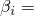 0.0. Since the quasi-static procedure is not supported for DSA, it is replaced with the static procedure and the viscoelastic material behavior is removed. In addition, since a more accurate tangent stiffness leads to improved sensitivity results, the solution controls are used to tighten the residual tolerance.

The material parameter  is chosen as one of the design parameters. The other (shape) design parameter used for design sensitivity analysis, *L*, represents the thickness of the foam at the free end (see [Figure 1.1.4--1](ch01s01aex04.md#sxmhemipunch-model)). The* z*-coordinates of the nodes on the top surface are assumed to depend on *L* via the equation 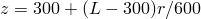. The *r*-coordinates are considered to be independent of *L*. To define this dependency in Abaqus, the gradients of the coordinates with respect to 

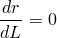

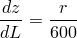

are given as part of the specification of parameter shape variation. 

### Results and discussion

This problem tests the hyperfoam material model in Abaqus but does not provide independent verification of the model. The results for all analyses are discussed in the following paragraphs.

#### Case 1

Deformation and contour plots for oriented S22 stress and LE22 strain are shown for the viscoelastic foam in [Figure 1.1.4--4](ch01s01aex04.md#hemipunch-plots-std-maxdef) through [Figure 1.1.4--6](ch01s01aex04.md#hemipunch-plots-std-le22) for the Abaqus/Standard analysis and [Figure 1.1.4--7](ch01s01aex04.md#hemipunch-plots-xpl-maxdef) through [Figure 1.1.4--9](ch01s01aex04.md#hemipunch-plots-xpl-le22) for the Abaqus/Explicit analysis. Even though the foam has been subjected to large strains, only moderate distortions occur because of the zero Poisson's ratio. The maximum logarithmic strain is on the order of 1.85, which is equivalent to a stretch of 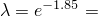 0.16 or a nominal compressive strain of 84%, indicating severe compression of the foam.

[Figure 1.1.4--10](ch01s01aex04.md#hemipunch-cmp-rxnhist) shows a comparison of the punch reaction force histories obtained with Abaqus/Standard and Abaqus/Explicit. In the viscoelastic case the stresses relax during loading and, consequently, lead to a softer response than in the purely elastic case. A comparison of the force-displacement responses obtained with Abaqus/Standard and Abaqus/Explicit is shown in [Figure 1.1.4--11](ch01s01aex04.md#hemipunch-cmp-rxnvdisp). The purely elastic material is reversible, while the viscoelastic material shows hysteresis.

#### Case 2

[Figure 1.1.4--12](ch01s01aex04.md#hemipunch-case2-deformed) shows various displaced configurations during the Case 2 analysis for Abaqus/Standard and Abaqus/Explicit. Displacement, velocity, and acceleration histories for the punch are shown in [Figure 1.1.4--13](ch01s01aex04.md#hemipunch-case2-plots1), [Figure 1.1.4--14](ch01s01aex04.md#hemipunch-case2-plots2), and [Figure 1.1.4--15](ch01s01aex04.md#hemipunch-case2-plots3), respectively. The displacement is shown to reach a steady value at the stress relaxation stage, followed by a severe drop due to the impulsive dynamic load. This is followed by a rebound and then finally by a rapid decay of the subsequent oscillations due to the strong damping provided by the viscoelasticity of the foam.

#### Abaqus/Design

[Figure 1.1.4--16](ch01s01aex04.md#hemipunch-du2l) and [Figure 1.1.4--17](ch01s01aex04.md#hemipunch-du2mu1) show the contours of sensitivity of the displacement in the *z*-direction to the design parameters  and , respectively. [Figure 1.1.4--18](ch01s01aex04.md#hemipunch-ds22l) and [Figure 1.1.4--19](ch01s01aex04.md#hemipunch-ds22mu1) show the contours of sensitivity of S22 to the design parameters *L* and , respectively. To provide an independent assessment of the results provided by Abaqus, sensitivities were computed using the overall finite difference (OFD) technique. The central difference method with a perturbation size of 0.1% of the value of the design parameter was used to obtain the OFD results. [Table 1.1.4--1](ch01s01aex04.md#norm-sens) shows that the sensitivities computed using Abaqus compare well with the overall finite difference results. 

### Input files

[indentfoam_std_elast_1.inp](../eif/indentfoam_std_elast_1.inp)

Case 1 of the Abaqus/Standard example using elastic properties of the foam, which is statically deformed in two [*STATIC](../key/key-link.md#usb-kws-hstatic) steps.

[indentfoam_std_elast_1_st.inp](../eif/indentfoam_std_elast_1_st.inp)

Case 1 of the Abaqus/Standard example (CAX4R elements with hourglass control based on total stiffness) using elastic properties of the foam, which is statically deformed in two [*STATIC](../key/key-link.md#usb-kws-hstatic) steps.

[indentfoam_std_elast_1_eh.inp](../eif/indentfoam_std_elast_1_eh.inp)

Case 1 of the Abaqus/Standard example (CAX4R elements with enhanced hourglass control) using elastic properties of the foam, which is statically deformed in two [*STATIC](../key/key-link.md#usb-kws-hstatic) steps.

[indentfoam_std_visco_1.inp](../eif/indentfoam_std_visco_1.inp)

Case 1 of the Abaqus/Standard example using viscoelastic properties of the foam, which is statically deformed in two [*VISCO](../key/key-link.md#usb-kws-hvisco) steps.

[indentfoam_std_visco_1_st.inp](../eif/indentfoam_std_visco_1_st.inp)

Case 1 of the Abaqus/Standard example (CAX4R elements with hourglass control based on total stiffness) using viscoelastic properties of the foam, which is statically deformed in two [*VISCO](../key/key-link.md#usb-kws-hvisco) steps.

[indentfoam_std_visco_1_eh.inp](../eif/indentfoam_std_visco_1_eh.inp)

Case 1 of the Abaqus/Standard example (CAX4R elements with enhanced hourglass control) using viscoelastic properties of the foam, which is statically deformed in two [*VISCO](../key/key-link.md#usb-kws-hvisco) steps.

[indentfoam_std_visco_2.inp](../eif/indentfoam_std_visco_2.inp)

Case 2 of the Abaqus/Standard example using viscoelastic properties of the foam.

[indentfoam_std_visco_2_surf.inp](../eif/indentfoam_std_visco_2_surf.inp)

Case 2 of the Abaqus/Standard example using viscoelastic properties of the foam. Surface-to-surface contact is utilized.

[indentfoam_xpl_elast_1.inp](../eif/indentfoam_xpl_elast_1.inp)

Case 1 of the Abaqus/Explicit example using elastic properties of the foam with the punch modeled as an analytical rigid surface.

[indentfoam_xpl_elast_1_subcyc.inp](../eif/indentfoam_xpl_elast_1_subcyc.inp)

Case 1 of the Abaqus/Explicit example using elastic properties of the foam with the punch modeled as an analytical rigid surface using the subcycling feature.

[indentfoam_xpl_elast_fac_1.inp](../eif/indentfoam_xpl_elast_fac_1.inp)

Case 1 of the Abaqus/Explicit example using elastic properties of the foam with the punch modeled as a faceted rigid surface.

[indentfoam_xpl_visco_1.inp](../eif/indentfoam_xpl_visco_1.inp)

Case 1 of the Abaqus/Explicit example using viscoelastic properties of the foam with the punch modeled as an analytical rigid surface.

[indentfoam_xpl_visco_2.inp](../eif/indentfoam_xpl_visco_2.inp)

Case 2 of the Abaqus/Explicit example using viscoelastic properties of the foam with the punch modeled as an analytical rigid surface.

[indentfoamhemipunch_dsa.inp](../eif/indentfoamhemipunch_dsa.inp)

Design sensitivity analysis.

### Table

**Table 1.1.4–1** Comparison of normalized sensitivities at the end of the analysis computed using Abaqus and the overall finite difference (OFD) method.
| Normalized sensitivity | Abaqus | OFD |
| --- | --- | --- |
| 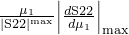 | 0.4921 | 0.4922 |
| 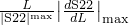 | 1.085 | 1.104 |
| 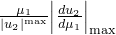 | 0.006925 | 0.006927 |
| 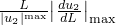 | 0.4059 | 0.4120 |
|  | 0.5084 | 0.5085 |
| 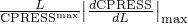 | 0.3252 | 0.3207 |

### Figures

**Figure 1.1.4–1** Model for foam indentation by a spherical punch.

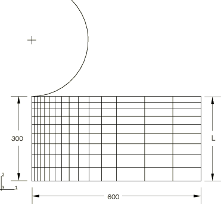

**Figure 1.1.4–2** Elastomeric foam stress-strain curves.

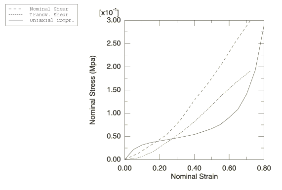

**Figure 1.1.4–3** Elastic modulus relaxation curve.

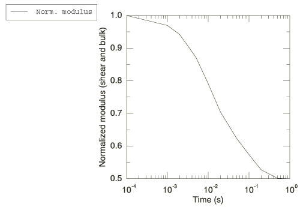

**Figure 1.1.4–4** Maximum deformation of viscoelastic foam: Case 1, Abaqus/Standard.

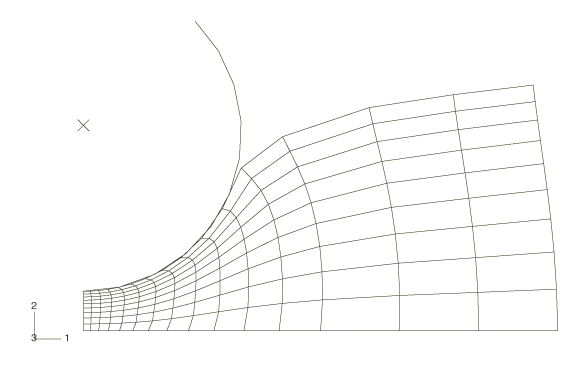

**Figure 1.1.4–5** S22 contour plot of viscoelastic foam: Case 1, Abaqus/Standard.

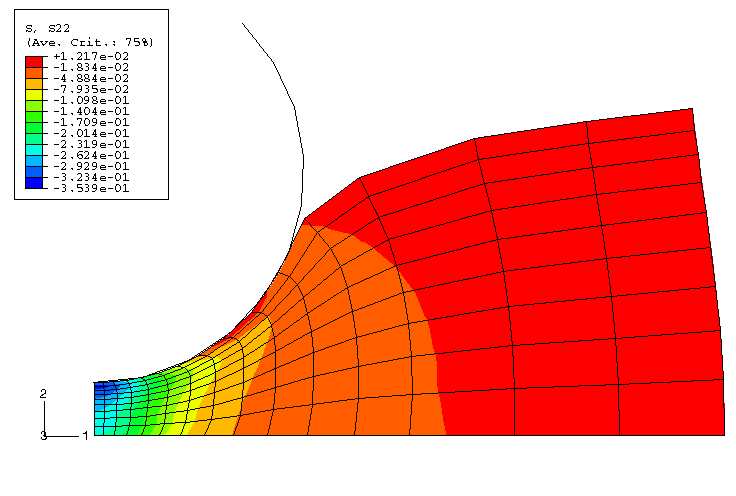

**Figure 1.1.4–6** LE22 contour plot of viscoelastic foam: Case 1, Abaqus/Standard.

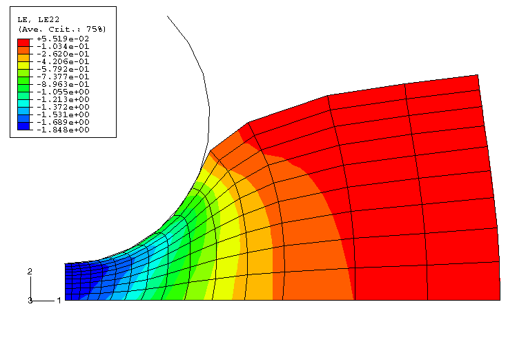

**Figure 1.1.4–7** Deformed plot at 1.0 s: Case 1, Abaqus/Explicit.

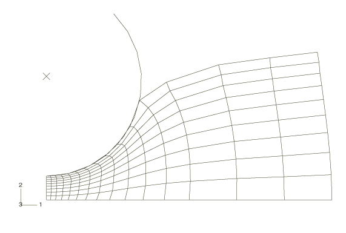

**Figure 1.1.4–8** S22 contour plot of viscoelastic foam at 1.0 s: Case 1, Abaqus/Explicit.

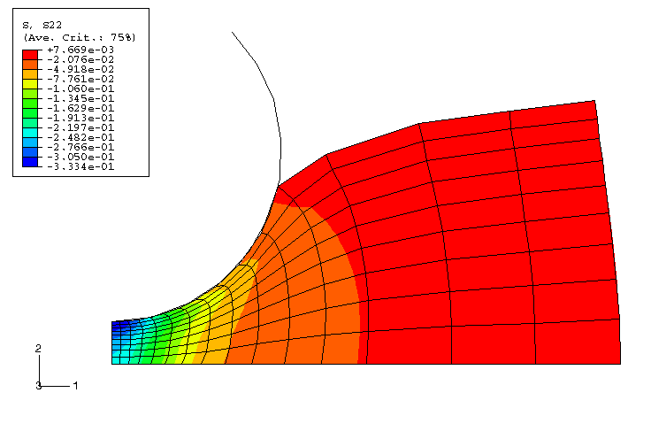

**Figure 1.1.4–9** LE22 contour plot of viscoelastic foam at 1.0 s: Case 1, Abaqus/Explicit.

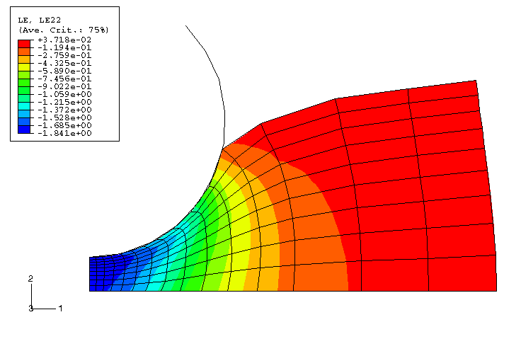

**Figure 1.1.4–10** Punch reaction force history: Case 1.

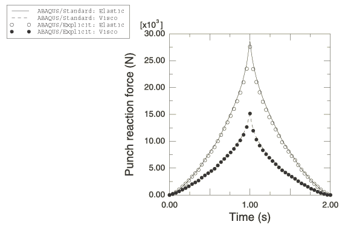

**Figure 1.1.4–11** Punch reaction force versus displacement response (loading-unloading curves): Case 1.

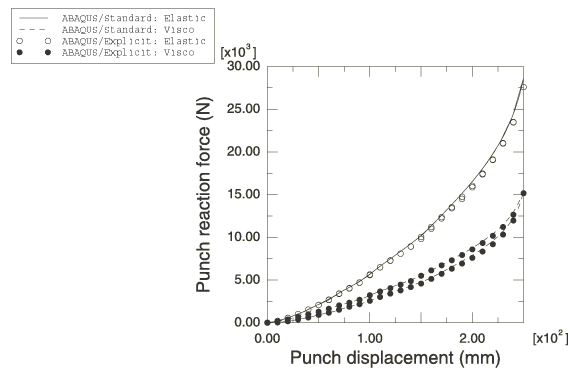

**Figure 1.1.4–12** Deformed shape plots at the end of visco and dynamic steps: Case 2, Abaqus/Standard (left) and Abaqus/Explicit (right).

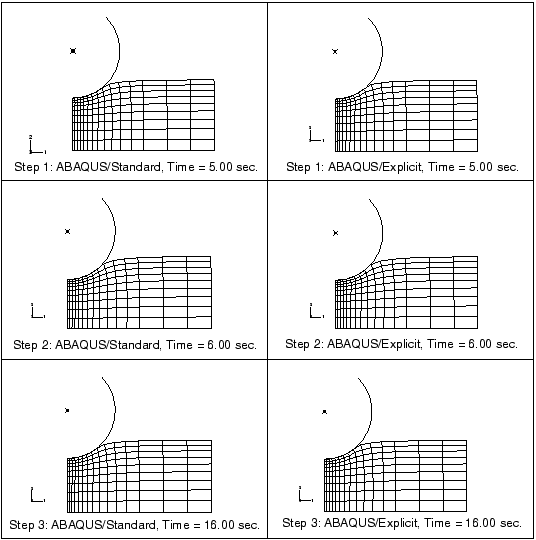

**Figure 1.1.4–13** Displacement histories of the punch: Case 2, Abaqus/Standard and Abaqus/Explicit.

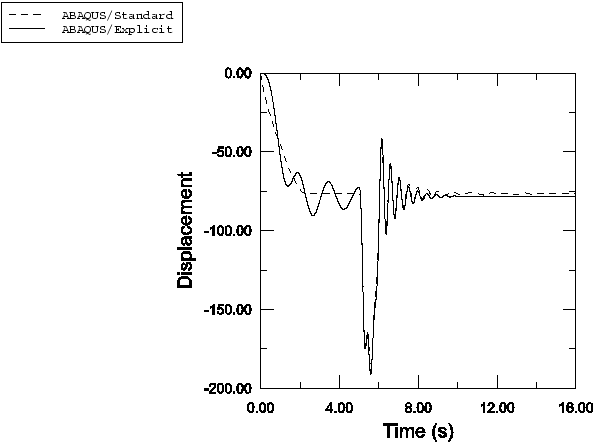

**Figure 1.1.4–14** Velocity histories of the punch: Case 2, Abaqus/Standard and Abaqus/Explicit.

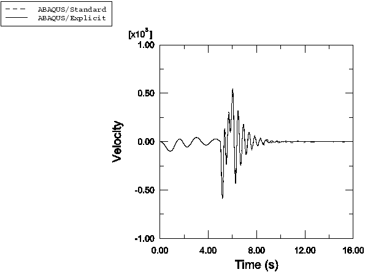

**Figure 1.1.4–15** Acceleration histories of the punch: Case 2, Abaqus/Standard and Abaqus/Explicit.

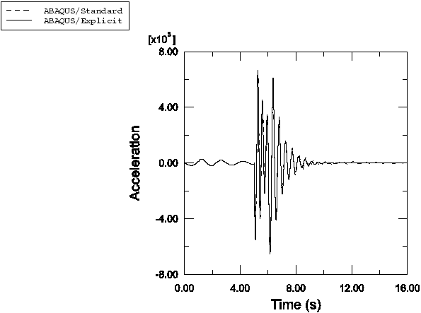

**Figure 1.1.4–16** Sensitivities at the end of the analysis for displacement in the *z*-direction with respect to *L*.

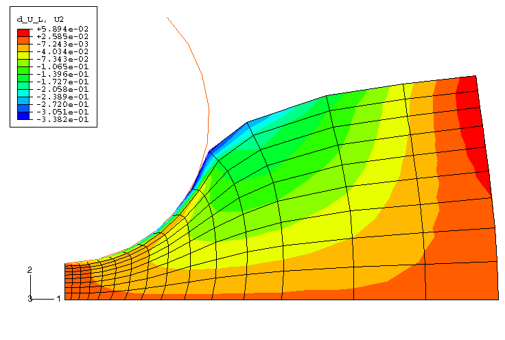

**Figure 1.1.4–17** Sensitivities at the end of the analysis for displacement in the *z*-direction with respect to .

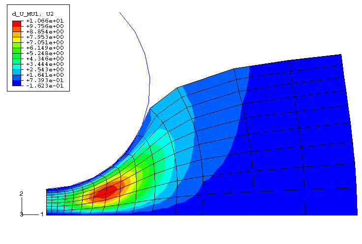

**Figure 1.1.4–18** Sensitivities at the end of the analysis for stress S22 with respect to *L*.

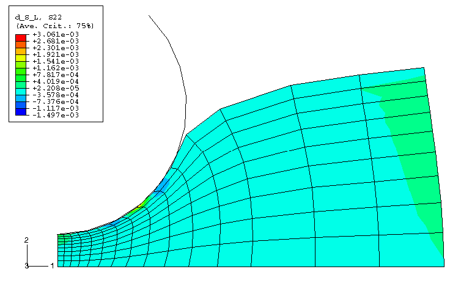

**Figure 1.1.4–19** Sensitivities at the end of the analysis for stress S22 with respect to .

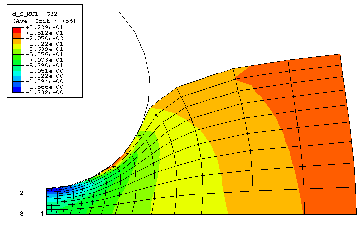

