# 1.1.7 Notched beam under cyclic loading

**Product: **Abaqus/Standard  

This example illustrates the use of the nonlinear isotropic/kinematic hardening material model to simulate the response of a notched beam under cyclic loading. The model has two features to simulate plastic hardening in cyclic loading conditions: the center of the yield surface moves in stress space (kinematic hardening behavior), and the size of the yield surface evolves with inelastic deformation (isotropic hardening behavior). This combination of kinematic and isotropic hardening components is introduced to model the Bauschinger effect and other phenomena such as plastic shakedown, ratchetting, and relaxation of the mean stress.

The component investigated in this example is a notched beam subjected to a cyclic 4-point bending load. The results are compared with the finite element results published by Benallal et al. (1988) and Doghri (1993). No experimental data are available.

### Geometry and model

The geometry and mesh are shown in [Figure 1.1.7--1](ch01s01aex07.md#sxmnotched-meshinit). [Figure 1.1.7--2](ch01s01aex07.md#sxmnotched-magview) shows the discretization in the vicinity of the notch, which is the region of interest in this analysis. Only one-half of the beam is modeled since the geometry and loading are symmetric with respect to the *x*= 0 plane. All dimensions are given in millimeters. The beam is 1 mm thick and is modeled with plane strain, second-order, reduced-integration elements (type CPE8R). The mesh is chosen to be similar to the mesh used by Doghri (1993). No mesh convergence studies have been performed.

### Material

The material properties reported by Doghri (1993) for a low-carbon (AISI 1010), rolled steel are used in this example.

A Young's modulus of *E*= 210 GPa and a Poisson's ratio of  = 0.3 define the elastic response of the material. The initial yield stress is 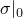 = 200 MPa.

The nonlinear evolution of the center of the yield surface is defined by the equation 

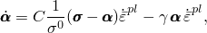

where  is the backstress, 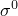 is the size of the yield surface (size of the elastic range),  is the equivalent plastic strain, and *C* = 25.5 GPa and  = 81 are the material parameters that define the initial hardening modulus and the rate at which the hardening modulus decreases with increasing plastic strain, respectively. The quantity 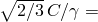 257 MPa defines the limiting value of the equivalent backstress 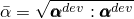; further hardening is possible only through the change in the size of the yield surface (isotropic hardening).

The isotropic hardening behavior of this material is modeled with the exponential law 

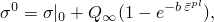

where  is the size of the yield surface (size of the elastic range),  = 2000 MPa is the maximum increase in the elastic range, and *b* = 0.26 defines the rate at which the maximum size is reached as plastic straining develops.

The material used for this simulation is cold rolled. This work hardened state is represented by specifying an initial equivalent plastic strain  = 0.43 (so that  = 411 MPa) and an initial backstress tensor 

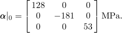

### Loading and boundary conditions

The beam is subjected to a 4-point bending load. Since only half of the beam is modeled, the model contains one concentrated load at a distance of 26 mm from the symmetry plane (see [Figure 1.1.7--1](ch01s01aex07.md#sxmnotched-meshinit)). The pivot point is 42 mm from the symmetry plane. The simulation runs 3 1/2 cycles over 7 time units. In each cycle the load is ramped from zero to 675 N and back to zero. An amplitude curve is used to describe the loading and unloading. The increment size is restricted to a maximum of 0.125 to force Abaqus to follow the prescribed loading/unloading pattern closely.

### Results and discussion

[Figure 1.1.7--3](ch01s01aex07.md#sxmnotched-meshdef) shows the final deformed shape of the beam after the 3 1/2 cycles of load; the final load on the beam is 675 N.

The deformation is most severe near the root of the notch. The results reported in [Figure 1.1.7--4](ch01s01aex07.md#sxmnotched-stressvstrain) and [Figure 1.1.7--5](ch01s01aex07.md#sxmnotched-backstress) are measured in this area (element 166, integration point 3). [Figure 1.1.7--4](ch01s01aex07.md#sxmnotched-stressvstrain) shows the time evolution of stress versus strain. Several important effects are predicted using this material model. First, the onset of yield occurs at a lower absolute stress level during the first unloading than during the first loading, which is the Bauschinger effect. Second, the stress-strain cycles tend to shift and stabilize so that the mean stress decreases from cycle to cycle, tending toward zero. This behavior is referred to as the relaxation of the mean stress and is most pronounced in uniaxial cyclic tests in which the strain is prescribed between unsymmetric strain values. Third, the yield surface shifts along the strain axis with cycling, whereas the shape of the stress-strain curve tends to remain similar from one cycle to the next. This behavior is known as ratchetting and is most pronounced in uniaxial cyclic tests in which the stress is prescribed between unsymmetric stress values. Finally, the hardening behavior during the first half-cycle is very flat relative to the hardening curves of the other cycles, which is typical of work hardened metals whose initial hardened state is a result of a large monotonic plastic deformation caused by a forming process such as rolling. The low hardening modulus is the result of the initial conditions on backstress, which places the center of the yield surface at a distance of 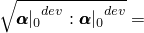 228 MPa away from the origin of stress space. Since this distance is close to the maximum possible distance (257 MPa), most of the hardening during the first cycle is isotropic.

These phenomena are modeled in this example primarily by the nonlinear evolution of the backstress, since the rate of isotropic hardening is very small. This behavior can be verified by conducting an analysis in which the elastic domain remains fixed throughout the analysis.

[Figure 1.1.7--5](ch01s01aex07.md#sxmnotched-backstress) shows the evolution of the direct components of the deviatoric part of the backstress tensor. The backstress components evolve most during the first cycle as the Bauschinger effect overcomes the initial hardening configuration. Only the deviatoric components of the backstress are shown so that the results obtained using Abaqus can be compared to those reported by Doghri (1993). Since Abaqus uses an extension of the Ziegler evolution law, a backstress tensor with nonzero pressure is produced, whereas the backstress tensor produced with the law used by Doghri (which is an extension of the linear Prager law) is deviatoric. Since the plasticity model considers only the deviatoric part of the backstress, this difference in law does not affect the other solution variables.

The results shown in [Figure 1.1.7--4](ch01s01aex07.md#sxmnotched-stressvstrain) and [Figure 1.1.7--5](ch01s01aex07.md#sxmnotched-backstress) agree well with the results reported by Doghri (1993).

### Input files

[cyclicnotchedbeam.inp](../eif/cyclicnotchedbeam.inp)

Input data.

[cyclicnotchedbeam_mesh.inp](../eif/cyclicnotchedbeam_mesh.inp)

Element and node data.

### References

Benallal,  A., R. Billardon, and I. Doghri, “An Integration Algorithm and the Corresponding Consistent Tangent Operator for Fully Coupled Elastoplastic and Damage Equations,” Communications in Applied Numerical Methods, vol. 4, pp. 731–740, 1988.

Doghri,  I., “Fully Implicit Integration and Consistent Tangent Modulus in Elasto-Plasticity,” International Journal for Numerical Methods in Engineering, vol. 36, pp. 3915–3932, 1993.

### Figures

**Figure 1.1.7–1** Undeformed mesh (dimensions in mm).

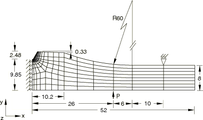

**Figure 1.1.7–2** Magnified view of the root of the notch.

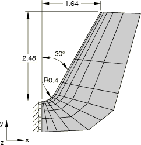

**Figure 1.1.7–3** Deformed mesh at the conclusion of the simulation. Displacement magnification factor is 3.

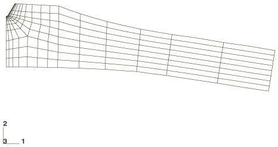

**Figure 1.1.7–4** Evolution of stress versus strain in the vicinity of the root of the notch.

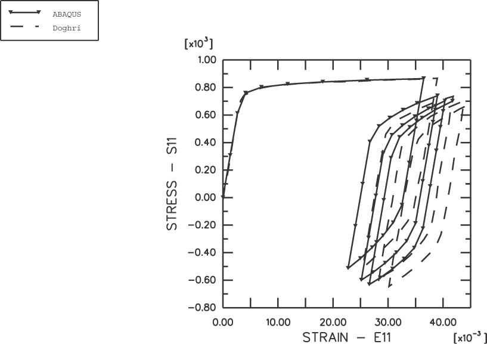

**Figure 1.1.7–5** Evolution of the diagonal components of the deviatoric part of the backstress tensor.

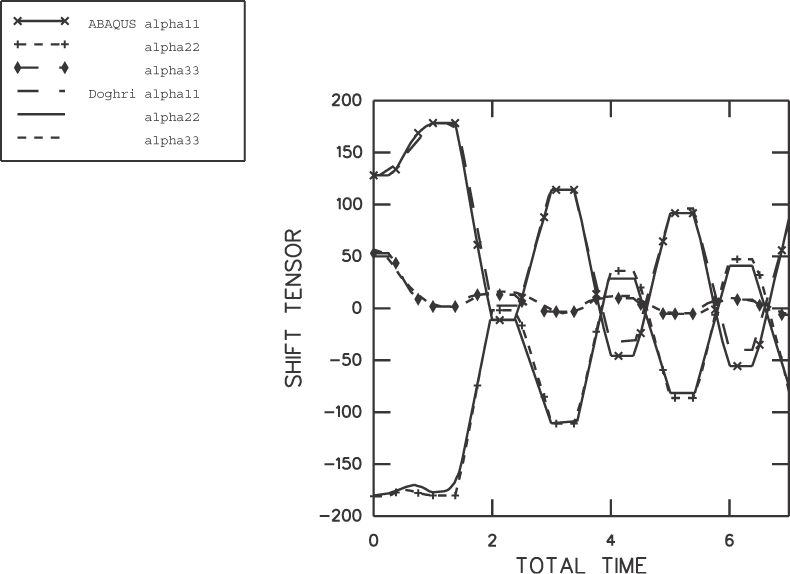

