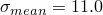
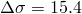
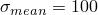
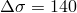
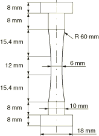
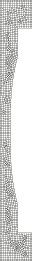
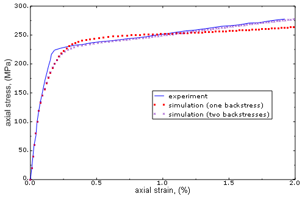
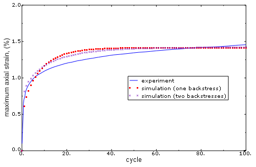

# 1.1.8 Uniaxial ratchetting under tension and compression

**Product: **Abaqus/Standard  

### Objectives

This example demonstrates the following Abaqus features and techniques: 
- using the nonlinear isotropic/kinematic hardening model to predict deformation in a specimen subjected to monotonic and cyclic loading; and
- modeling the effect of ratchetting (accumulation of plastic strain under a cyclic load).

### Application description

Preventing ratchetting is very important in the design of components subject to cyclic loading in the inelastic domain. The amount of plastic strain can accumulate continuously with an increasing number of cycles and may eventually cause material failure. Therefore, many cyclic plastic models have been developed with the goal of modeling ratchetting correctly. In this example we show that the combined isotropic/kinematic hardening model available in Abaqus can predict ratchetting and that the results obtained using this model correlate very well with experimental results. 

This example considers two loading conditions: monotonic deformation and uniaxial cyclic tension and compression.

### Geometry

The specimen studied is shown in [Figure 1.1.8--1](ch01s01aex08.md#ratchetting-specimen). All dimensions are specified in the figure. For the experiments (Portier et al., 2000) the specimens were obtained from a tube with an outer diameter of 130 mm and a wall thickness of 28 mm. The specimens were heat treated to ensure the initial isotropy of the material.

### Materials

The specimen is made of austenitic type 316 stainless steel. The material mechanical properties are listed in [Table 1.1.8--1](ch01s01aex08.md#ratchetting-material-properties). A detailed description of the calibration of parameters is given in ["Material parameters determination](ch01s01aex08.md#exa-ratchetting-parameters)” below.

### Boundary conditions and loading

 The specimen is constrained at the bottom surface in the longitudinal direction, and a load is applied to the top surface.

### Abaqus modeling approaches and simulation techniques

 In this example deformations of a specimen subject to monotonic and cyclic loads are studied. In both cases static analyses are performed. Taking advantage of the axial symmetry of the specimen, axisymmetric elements are used.

### Summary of analysis cases

| Case 1 | Static analysis of a specimen subject to a monotonic load. |
| --- | --- |
| Case 2 | Static analysis of a specimen subject to an unsymmetric cyclic load. |

### Case 1 Monotonic load

The experimental monotonic load data are used to calibrate the kinematic hardening model. The purpose of this case is to verify that the simulation results agree with the experimental results and to compare the accuracy of the results obtained using a model with one backstress and a model with two backstresses.

### Analysis types

A static stress analysis is performed.

### Mesh design

The specimen is meshed with CAX4R and CAX3 elements. The mesh is shown in [Figure 1.1.8--2](ch01s01aex08.md#ratchetting-mesh).

### Material model

The combined isotropic/kinematic hardening model is used to model the response of the material. This material model requires that the elastic parameters (Young's modulus and Poisson's ratio), the initial yield stress, the isotropic hardening parameters, and the kinematic hardening parameters are specified.

##### Material parameters determination

The elastic parameters, the initial yield stress, and the isotropic hardening parameters are assumed to be equal to those reported in Portier et al. (2000) for the Ohno and Wang model. The kinematic hardening component is defined by specifying half-cycle test data, where the data are obtained by digitizing the results reported by Portier et al. The values of all the parameters, including the kinematic hardening parameters obtained from the test data, are presented in [Table 1.1.8--1](ch01s01aex08.md#ratchetting-material-properties).

### Boundary conditions

The specimen is fixed in the longitudinal direction at the bottom surface.

### Loads

 A displacement of 0.45 mm is applied to the top surface.

### Results and discussion

The simulation and experimental results are presented graphically in [Figure 1.1.8--3](ch01s01aex08.md#ratchetting-monotonic-nls). The strains and stresses are computed by averaging the values in the elements lying at the center of the specimen. The experimental curve shows three distinct regions: a linear elastic region, an elastic-plastic transition zone, and an almost linear response region at large strain values. The model with two backstresses captures this response very well. One of the backstresses has a large value of the parameter , which captures the shape of the transition zone correctly, while the second backstress with a relatively small value of  captures the nearly linear response at large strains correctly. The parameter  in the model with one backstress has a relatively large value, which results in large discrepancies between the experimental and predicted responses at large strains.

### Case 2 Uniaxial tension and compression cyclic analysis

The objective of this case is to show that the combined isotropic/kinematic hardening model can be used to predict the response of a material subject to a cyclic load accurately and, in particular, to predict the ratchetting effect. In addition, the results obtained using a model with one backstress are compared to those obtained using a model with two backstresses.

### Analysis types

A static stress analysis is performed.

### Mesh design

The mesh is the same as in Case 1.

### Material model

The material model is the same as in Case 1.

### Boundary conditions

The specimen is fixed in the longitudinal direction at the bottom surface.

### Loads

A cyclic load of  MPa and  MPa is applied to the top surface of the specimen. This load produces an approximate cyclic load of  MPa and  MPa at the center part of the specimen.

### Results and discussion

The simulation results obtained for the model with one backstress and the model with two backstresses, together with the experimental results, are depicted in [Figure 1.1.8--4](ch01s01aex08.md#ratchetting-cyclic-nls). The strains were computed by averaging the strains in the elements lying at the center of the specimen. The figure shows that both simulation models are capable of predicting ratchetting. It also shows that the results obtained using the model with two backstresses correlate better with the experimental results.

### Discussion of results and comparison of cases

The results of the analyses show that the combined isotropic/kinematic hardening model can be used to predict the ratchetting effect accurately. In addition, a substantial improvement in the agreement between simulation and experimental results can be achieved by using a model with multiple backstresses instead of a model with a single backstress. The former model predicts more accurately the shape of the stress-strain curve in the monotonic loading case and the ratchetting strain in a cyclic loading case. In this example increasing the number of backstresses from one to two produced a substantial improvement in the results. However, further increasing the number of backstresses does not significantly improve the results. 

### Files

##### **Case 1 Monotonic**

[ratch_axi_monotonic_1.inp](../eif/ratch_axi_monotonic_1.inp)

Input file to analyze a specimen subjected to a monotonic load using the model with one backstress.

[ratch_axi_monotonic_2.inp](../eif/ratch_axi_monotonic_2.inp)

Input file to analyze a specimen subjected to a monotonic load using the model with two backstresses.

##### **Case 2 Cyclic**

[ratch_axi_unsymcyclic_1.inp](../eif/ratch_axi_unsymcyclic_1.inp)

Input file to analyze a specimen subjected to a cyclic load using the model with one backstress.

[ratch_axi_unsymcyclic_2.inp](../eif/ratch_axi_unsymcyclic_2.inp)

Input file to analyze a specimen subjected to a cyclic load using the model with two backstresses.

### References

**Abaqus Analysis User's Guide**
- ["Models for metals subjected to cyclic loading," Section 23.2.2 of the Abaqus Analysis User's Guide](../usb/usb-link.md#usb-mat-chardening)

**Abaqus Keywords Reference Guide**
- [*CYCLIC HARDENING](../key/key-link.md#usb-kws-mcyclichardening)
- [*PLASTIC](../key/key-link.md#usb-kws-mplastic)

**Other**

- Portier, L., S. Calloch, D. Marquis, and P. Geyer, "Ratchetting Under Tension-Torsion Loadings: Experiments and Modelling," International Journal of Plasticity, vol. 16, pp. 303--335, 2000.

### Table

**Table 1.1.8–1** Mechanical properties for 316 steel.
| **Material properties**: |
| --- |
|  | Young's modulus | 192.0 GPa |
|  | Poisson's ratio | 0.3 |
|  | Initial yield stress | 120.0 MPa |
| **Isotropic hardening parameters**: |
|  |  | *Q*∞ | 120.0 MPa |
|  |  | *b* | 13.2 |
| **Kinematic hardening parameters**: |
|  | Model with one backstress |
|  |  | *C* | 218.5 GPa |
|  |  | γ | 1956.6 |
|  | Model with two backstresses |
|  |  | *C*1 | 2.067 GPa |
|  |  | γ1 | 44.7 |
|  |  | *C*2 | 246.2 GPa |
|  |  | γ2 | 2551.4 |

### Figures

**Figure 1.1.8–1** Geometry and size of the specimen.

**Figure 1.1.8–2** Finite element mesh of the specimen.

**Figure 1.1.8–3** Stress-strain curves for monotonic tensile loading.

**Figure 1.1.8–4**  Maximum axial strain versus number of cycles.

