# 1.1.10 Shell-to-solid submodeling and shell-to-solid coupling of a pipe joint

**Products: **Abaqus/Standard  Abaqus/Explicit  Abaqus/CAE  

Submodeling is the technique used in Abaqus for analyzing a local part of a model with a refined mesh, based on interpolation of the solution from an initial global model (usually with a coarser mesh) onto the nodes on the appropriate parts of the boundary of the submodel. Shell-to-solid submodeling models a region with solid elements, when the global model is made up of shell elements. This example uses the scaling parameter in the submodel boundary condition to scale the values of prescribed boundary conditions for driven variables without requiring the global model to be rerun.

Shell-to-solid coupling is a feature in Abaqus by which three-dimensional shell meshes can be coupled automatically to three-dimensional solid meshes. Unlike shell-to-solid submodeling, which first performs a global analysis on a shell model followed by a submodel analysis with a continuum model, the shell-to-solid coupling model uses a single analysis, with solid and shell elements used in different regions.

Both shell-to-solid submodeling and shell-to-solid coupling provide cost-effective approaches to model enhancement. The purpose of this example is to demonstrate both capabilities in Abaqus. The analysis is tested as a static process in Abaqus/Standard and as a dynamic process in both Abaqus/Standard and Abaqus/Explicit. To demonstrate the shell-to-solid submodeling capability, the problem is solved quasi-statically in Abaqus/Explicit. The overall displacements are small, and to avoid noise-induced dynamic effects, the quasi-static Abaqus/Explicit analysis is run in double precision. 

In addition, an Abaqus Scripting Interface script is included that creates a shell global model using Abaqus/CAE. The script then uses data from the output database created by the analysis of the global model to drive a solid submodel. The script ends by displaying an overlay plot of the global model and the submodel in the Visualization module.

### Geometry and model

In this problem the joint between a pipe and a plate is analyzed. A pipe of radius 10 mm and thickness 0.75 mm is attached to a plate that is 10 mm long, 5 mm wide, and 1 mm thick. The pipe-plate intersection has a fillet radius of 1 mm. Taking advantage of the symmetry of the problem, only half the assembly is modeled. Both the pipe and the plate are assumed to be made of aluminum with *E* = 69  103 MPa,  = 0.3, and  = 2740 kg/m3.

 The global model for the submodeling analysis is meshed with S4R elements as shown in [Figure 1.1.10--1](ch01s01aex10.md#sxmpipejoint-globalshell). The fillet radius is not taken into consideration in the shell model. The static submodel is meshed using three-dimensional C3D20R continuum elements (see [Figure 1.1.10--2](ch01s01aex10.md#sxmpipejoint-solidmodel)). A coarser mesh using C3D8R elements is chosen for the dynamic tests. The shell-to-solid coupling model is meshed with S4R shell elements and C3D20R continuum elements as shown in [Figure 1.1.10--3](ch01s01aex10.md#sxmpipejoint-shell2solid). The continuum meshes used in the static submodeling and shell-to-solid coupling analyses are identical. The continuum meshes extend 10 mm along the pipe length, have a radius of 25 mm in the plane of the plate, and use four layers through the thickness. The continuum meshes accurately model the fillet radius at the joint. Hence, it is possible to calculate the stress concentration in the fillet. The problem could be expanded by adding a ring of welded material to simulate a welded joint (for this case the submodel would have to be meshed with new element layers representing the welded material at the joint). The example could also be expanded by including plastic material behavior in the submodel while using an elastic global model solution.

A reference static solution consisting entirely of C3D20R continuum elements is also included (see [Figure 1.1.10--4](ch01s01aex10.md#sxmpipejoint-solid)). The mesh of the reference solution in the vicinity of the joint is very similar to that used in the submodeling and shell-to-solid coupling analyses.

The geometry and material properties of the Abaqus/Explicit shell-to-solid coupling model are identical to the Abaqus/Standard models. The Abaqus/Explicit shell model is meshed with S4R elements, and the continuum model is meshed with C3D10M elements.

### Loading

The pipe is subjected to a concentrated load acting in the *x*-direction applied at the free end, representing a shear load on the pipe. An edge-based surface is defined at the free edge of the pipe. This surface is coupled to a reference node that is defined at the center of the pipe using a distributing coupling constraint. The concentrated load is applied to the reference point. For the submodeling approach the load magnitude is 10 N for the global analysis and 10 N and 20 N, respectively, in the two steps of the submodel analysis (a scale factor of 2.0 is applied to the displacements of the driven nodes in the second step of the submodel analysis). For the shell-to-solid coupling approach the load magnitude is 10 N and 20 N, respectively, in the two steps, as in the submodel analysis. For the dynamic cases the load is applied gradually over the entire step time by using a smooth-step amplitude curve.

### Kinematic boundary conditions

The plate is clamped along all edges. In the solid submodel, kinematic conditions are interpolated from the global model at two surfaces of the submodel: one lying within the pipe and the other within the plate. The default center zone size, equal to 10% of the maximum shell thickness, is used. Thus, only one layer of driven nodes lies within the center zone, and only these nodes have all three displacement components driven by the global solution. For the remaining driven nodes only the displacement components parallel to the global model midsurface are driven from the global model. Thus, a single row of nodes transmits the transverse shear forces from the shell solution to the solid model.

### Results and discussion

The loading and boundary conditions are such that the pipe is subjected to bending. The end of the pipe that is attached to the plate leads to deformation of the plate itself (see [Figure 1.1.10--5](ch01s01aex10.md#sxmpipejoint-overlay) and [Figure 1.1.10--6](ch01s01aex10.md#sxmpipejoint-shell2solid2)). From a design viewpoint the area of interest is the pipe-plate joint where the pipe is bending the plate. Hence, this area is modeled with continuum elements to gain a better understanding of the deformation and stress state.

[Figure 1.1.10--7](ch01s01aex10.md#sxmpipejoint-disp) shows the contours of the out-of-plane displacement component in the plate for both the static submodel and the shell-to-solid coupling analyses. The submodel is in good agreement with the displacement of the global shell model around the joint. The out-of-plane displacement for the shell-to-solid coupling is slightly less than that for the submodel analysis but is in good agreement with the reference solution shown in [Figure 1.1.10--8](ch01s01aex10.md#sxmpipejoint-disp1). 

The stress concentration in the fillet radius is obtained for the solid models. The maximum Mises stresses at the integration points and nodes for the reference solution, submodel, and shell-to-solid coupling analyses are shown in [Table 1.1.10--1](ch01s01aex10.md#table-shellsolidpipe). As illustrated in [Table 1.1.10--1](ch01s01aex10.md#table-shellsolidpipe) and [Figure 1.1.10--9](ch01s01aex10.md#sxmpipejoint-mises1), the Mises stress computed in the shell-to-solid coupling analysis agrees very well with the reference solution. The continuity of displacements and the minimal distortion of the stress field at the shell-to-solid interface indicates that the shell-to-solid coupling has been modeled accurately. The difference in the maximum Mises stress between the submodel analysis and the shell-to-solid coupling solution (see [Figure 1.1.10--10](ch01s01aex10.md#sxmpipejoint-mises2)) can be partially attributed to the fact that the global shell model is more flexible than the shell-to-solid coupling model. The *x*-displacement at the distributing coupling reference node for the global shell model due to the 10 N load is .605 mm compared to .513 mm for the shell-to-solid coupling analysis and .512 mm for the reference solution. Thus, the static submodel mesh is subjected to slightly higher deformation. If the global shell analysis is run with an *x*-displacement boundary condition of .513 mm on the reference node instead of a concentrated load of 10 N, the subsequent maximum nodal Mises stress in the submodel analysis drops to 80.2 MPa, which is in better agreement with the reference solution. [Figure 1.1.10--11](ch01s01aex10.md#sxmpipejoint-u3-sc) and [Figure 1.1.10--12](ch01s01aex10.md#sxmpipejoint-mises-sc) show, respectively, the comparison of the out-of-plane displacement component in the continuum-mesh plate and the comparison of the Mises stress for the submodel with scaled boundary condition and the shell-to-solid coupling model with scaled load. The submodel results are in good agreement with the shell-to-solid coupling results.

The relatively large difference between the maximum Mises stresses at the integration points and the nodes in the region of the fillet (as illustrated in [Table 1.1.10--1](ch01s01aex10.md#table-shellsolidpipe)) indicates that the mesh in the fillet region is probably too coarse and should be refined. No such refinement was performed in this example.

Overall, the Abaqus/Explicit shell-to-solid coupling analysis is in good agreement with the Abaqus/Standard shell-to-solid coupling results. The continuity of displacements and the minimal distortion of the stress field at the shell-to-solid interface indicate that the shell-to-solid coupling has been modeled accurately. The out-of-plane displacements of the plate predicted by Abaqus/Explicit are very close to the Abaqus/Standard values. The maximum nodal Mises stress in the fillet region is 56 MPa, and the *x*-displacement at the coupling constraint reference node for the global shell model due to the 10 N load is .423 mm. The Abaqus/Explicit analysis is solved quasi-statically by assigning a nominal density of 500 kg/m3 to the pipe-plate material and ramping up the load over 12,000 increments. Closer approximation to the static limit, achieved by reducing the density of the pipe-plate material to 50 kg/m3, results in a maximum Mises stress of 87 MPa in the fillet region, which is very close to the Abaqus/Standard result.

The results for the submodel dynamic cases agree well with the global results. Both Abaqus/Standard and Abaqus/Explicit submodels read the results of the same global Abaqus/Explicit analysis. Good agreement is also found between the Abaqus/Explicit and Abaqus/Standard submodel analyses.

### Input files

##### **Static and quasi-static input files**

[pipe_submodel_s4r_global.inp](../eif/pipe_submodel_s4r_global.inp)

S4R global model.

[pipe_submodel_s4r_global_n.inp](../eif/pipe_submodel_s4r_global_n.inp)

Node definitions for the S4R global model.

[pipe_submodel_s4r_global_e.inp](../eif/pipe_submodel_s4r_global_e.inp)

Element definitions for the S4R global model.

[pipe_submodel_c3d20r_sub_s4r.inp](../eif/pipe_submodel_c3d20r_sub_s4r.inp)

C3D20R submodel that uses the S4R global model. The scaling parameter is used in the second step.

[pipe_submodel_c3d20r_sub_s4r_n.inp](../eif/pipe_submodel_c3d20r_sub_s4r_n.inp)

Node definitions for the C3D20R submodel that uses the S4R global model.

[pipe_submodel_c3d20r_sub_s4r_e.inp](../eif/pipe_submodel_c3d20r_sub_s4r_e.inp)

Element definitions for the C3D20R submodel that uses the S4R global model.

[pipe_submodel_s4_global.inp](../eif/pipe_submodel_s4_global.inp)

S4 global model.

[pipe_submodel_s4_global_n.inp](../eif/pipe_submodel_s4_global_n.inp)

Node definitions for the S4 global model.

[pipe_submodel_s4_global_e.inp](../eif/pipe_submodel_s4_global_e.inp)

Element definitions for the S4 global model.

[pipe_submodel_c3d20r_sub_s4.inp](../eif/pipe_submodel_c3d20r_sub_s4.inp)

C3D20R submodel that uses the S4 global model.

[pipe_submodel_c3d20r_sub_s4_n.inp](../eif/pipe_submodel_c3d20r_sub_s4_n.inp)

Node definitions for the C3D20R submodel that uses the S4 global model.

[pipe_submodel_c3d20r_sub_s4_e.inp](../eif/pipe_submodel_c3d20r_sub_s4_e.inp)

Element definitions for the C3D20R submodel that uses the S4 global model.

[pipe_cae_c3d20rsub_s4.py](../eif/pipe_cae_c3d20rsub_s4.py)

Python script that creates an S4 global model and a C3D20R submodel using Abaqus/CAE.

[pipe_shell2solid_c3d20r_s4r.inp](../eif/pipe_shell2solid_c3d20r_s4r.inp)

Shell-to-solid coupling model with C3D20R and S4R elements. The load is scaled in the second step.

[pipe_shell2solid_c3d20r_s4r_n1.inp](../eif/pipe_shell2solid_c3d20r_s4r_n1.inp)

Node definitions for the shell-to-solid coupling model with C3D20R and S4R elements.

[pipe_shell2solid_c3d20r_s4r_n2.inp](../eif/pipe_shell2solid_c3d20r_s4r_n2.inp)

Node definitions for the shell-to-solid coupling model with C3D20R and S4R elements.

[pipe_shell2solid_c3d20r_s4r_n3.inp](../eif/pipe_shell2solid_c3d20r_s4r_n3.inp)

Node definitions for the shell-to-solid coupling model with C3D20R and S4R elements.

[pipe_shell2solid_c3d20r_s4r_e1.inp](../eif/pipe_shell2solid_c3d20r_s4r_e1.inp)

Element definitions for the shell-to-solid coupling model with C3D20R and S4R elements.

[pipe_shell2solid_c3d20r_s4r_e2.inp](../eif/pipe_shell2solid_c3d20r_s4r_e2.inp)

Element definitions for the shell-to-solid coupling model with C3D20R and S4R elements.

[pipe_shell2solid_c3d20r_s4r_e3.inp](../eif/pipe_shell2solid_c3d20r_s4r_e3.inp)

Element definitions for the shell-to-solid coupling model with C3D20R and S4R elements.

[pipe_shell2solid_c3d10_s4r.inp](../eif/pipe_shell2solid_c3d10_s4r.inp)

Shell-to-solid coupling model with C3D10 and S4R elements.

[pipe_shell2solid_c3d10_s4r_n1.inp](../eif/pipe_shell2solid_c3d10_s4r_n1.inp)

Node definitions for the shell-to-solid coupling model with C3D10 and S4R elements.

[pipe_shell2solid_c3d10_s4r_n2.inp](../eif/pipe_shell2solid_c3d10_s4r_n2.inp)

Node definitions for the shell-to-solid coupling model with C3D10 and S4R elements.

[pipe_shell2solid_c3d10_s4r_n3.inp](../eif/pipe_shell2solid_c3d10_s4r_n3.inp)

Node definitions for the shell-to-solid coupling model with C3D10 and S4R elements.

[pipe_shell2solid_c3d10_s4r_e1.inp](../eif/pipe_shell2solid_c3d10_s4r_e1.inp)

Element definitions for the shell-to-solid coupling model with C3D10 and S4R elements.

[pipe_shell2solid_c3d10_s4r_e2.inp](../eif/pipe_shell2solid_c3d10_s4r_e2.inp)

Element definitions for the shell-to-solid coupling model with C3D10 and S4R elements.

[pipe_shell2solid_c3d10_s4r_e3.inp](../eif/pipe_shell2solid_c3d10_s4r_e3.inp)

Element definitions for the shell-to-solid coupling model with C3D10 and S4R elements.

[pipe_shell2solidx_c3d10m_s4r.inp](../eif/pipe_shell2solidx_c3d10m_s4r.inp)

Abaqus/Explicit shell-to-solid coupling model with C3D10M and S4R elements.

[pipe_shell2solidx_c3d10m_s4r_n1.inp](../eif/pipe_shell2solidx_c3d10m_s4r_n1.inp)

Node definitions for the Abaqus/Explicit shell-to-solid coupling model with C3D10M and S4R elements.

[pipe_shell2solidx_c3d10m_s4r_n2.inp](../eif/pipe_shell2solidx_c3d10m_s4r_n2.inp)

Node definitions for the Abaqus/Explicit shell-to-solid coupling model with C3D10M and S4R elements.

[pipe_shell2solidx_c3d10m_s4r_n3.inp](../eif/pipe_shell2solidx_c3d10m_s4r_n3.inp)

Node definitions for the Abaqus/Explicit shell-to-solid coupling model with C3D10M and S4R elements.

[pipe_shell2solidx_c3d10m_s4r_e1.inp](../eif/pipe_shell2solidx_c3d10m_s4r_e1.inp)

Element definitions for the Abaqus/Explicit shell-to-solid coupling model with C3D10M and S4R elements.

[pipe_shell2solidx_c3d10m_s4r_e2.inp](../eif/pipe_shell2solidx_c3d10m_s4r_e2.inp)

Element definitions for the Abaqus/Explicit shell-to-solid coupling model with C3D10M and S4R elements.

[pipe_shell2solidx_c3d10m_s4r_e3.inp](../eif/pipe_shell2solidx_c3d10m_s4r_e3.inp)

Element definitions for the Abaqus/Explicit shell-to-solid coupling model with C3D10M and S4R elements.

[pipe_c3d20r.inp](../eif/pipe_c3d20r.inp)

Reference model with C3D20R elements.

[pipe_c3d20r_n.inp](../eif/pipe_c3d20r_n.inp)

Node definitions for the reference model with C3D20R elements.

[pipe_c3d20r_e.inp](../eif/pipe_c3d20r_e.inp)

Element definitions for the reference model with C3D20R elements.

##### **Dynamic input files**

[pipe_submodelx_s4r_global.inp](../eif/pipe_submodelx_s4r_global.inp)

Abaqus/Explicit S4R global model.

[pipe_submodelx_s4r_global_n.inp](../eif/pipe_submodelx_s4r_global_n.inp)

Node definitions for the Abaqus/Explicit S4R global model.

[pipe_submodelx_s4r_global_e.inp](../eif/pipe_submodelx_s4r_global_e.inp)

Element definitions for the Abaqus/Explicit S4R global model.

[pipe_submodelx_c3d8r_sub_s4r.inp](../eif/pipe_submodelx_c3d8r_sub_s4r.inp)

Abaqus/Explicit C3D8R submodel.

[pipe_submodelx_c3d8r_sub_s4r_n.inp](../eif/pipe_submodelx_c3d8r_sub_s4r_n.inp)

Node definitions for the Abaqus/Explicit C3D8R submodel.

[pipe_submodelx_c3d8r_sub_s4r_e.inp](../eif/pipe_submodelx_c3d8r_sub_s4r_e.inp)

Element definitions for the Abaqus/Explicit C3D8R submodel.

[pipe_submodel_c3d8r_sub_s4r.inp](../eif/pipe_submodel_c3d8r_sub_s4r.inp)

Abaqus/Standard C3D8R submodel.

[pipe_submodel_c3d8r_sub_s4r_n.inp](../eif/pipe_submodel_c3d8r_sub_s4r_n.inp)

Node definitions for the Abaqus/Standard C3D8R submodel.

[pipe_submodel_c3d8r_sub_s4r_e.inp](../eif/pipe_submodel_c3d8r_sub_s4r_e.inp)

Element definitions for the Abaqus/Standard C3D8R submodel.

### Table

**Table 1.1.10–1** Mises stress comparison for static analyses.
|  | Maximum integration point Mises stress (MPa) | Maximum nodal Mises stress (MPa) |
| --- | --- | --- |
| Shell-to-solid submodeling | 80.1 | 97.5 |
| Shell-to-solid coupling | 59.8 | 72.6 |
| Reference | 59.9 | 73.6 |

### Figures

**Figure 1.1.10–1** Global shell model of pipe-plate structure.

**Figure 1.1.10–2** Magnified solid submodel of the pipe-plate joint.

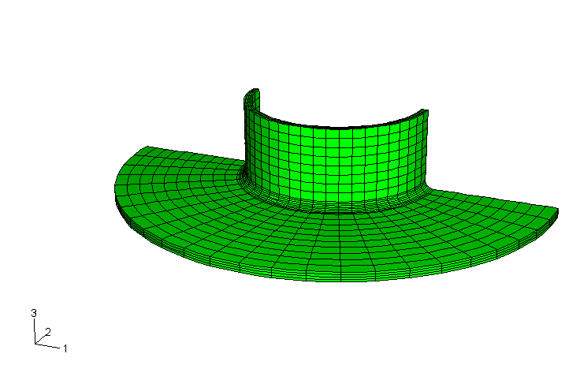

**Figure 1.1.10–3** Shell-to-solid coupling model of the pipe-plate joint.

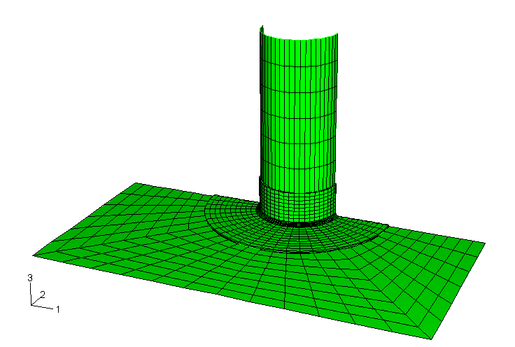

**Figure 1.1.10–4** Solid reference model of the pipe-plate joint.

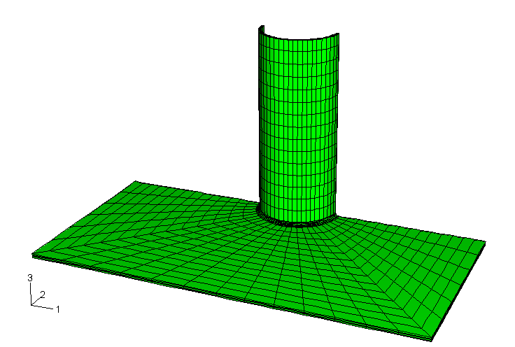

**Figure 1.1.10–5** Solid submodel overlaid on the shell model in the deformed state, using a magnification factor of 20.

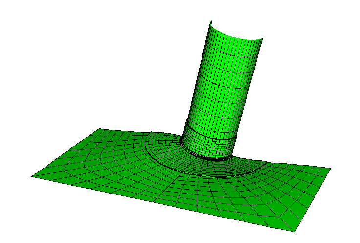

**Figure 1.1.10–6** Shell-to-solid coupling model in the deformed state, using a magnification factor of 20.

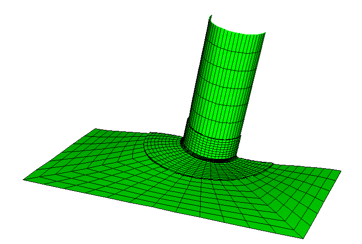

**Figure 1.1.10–7** Comparison of out-of-plane displacement in the continuum mesh plate for the submodel (top) and the shell-to-solid coupling analysis (bottom).

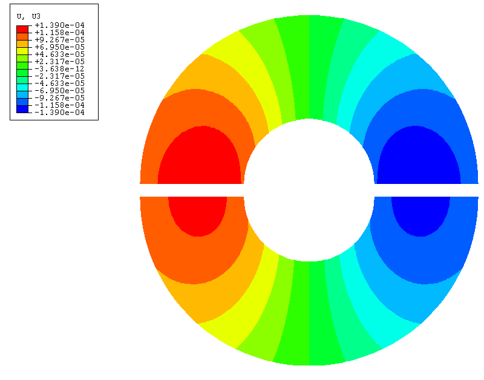

**Figure 1.1.10–8** Comparison of out-of-plane displacement in the plate for the reference solution (top) and the shell-to-solid coupling analysis (bottom).

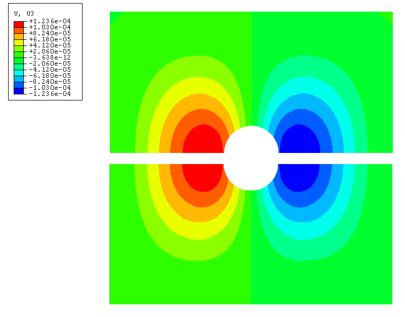

**Figure 1.1.10–9** Comparison of the Mises stress in the plate for the reference solution (top) and the shell-to-solid coupling analysis (bottom).

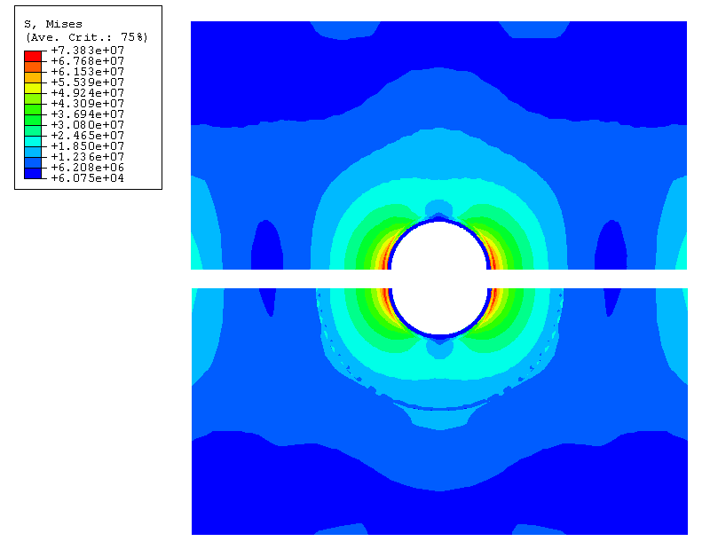

**Figure 1.1.10–10** Comparison of the Mises stress in the continuum mesh plate for the submodel (top) and the shell-to-solid coupling analysis (bottom).

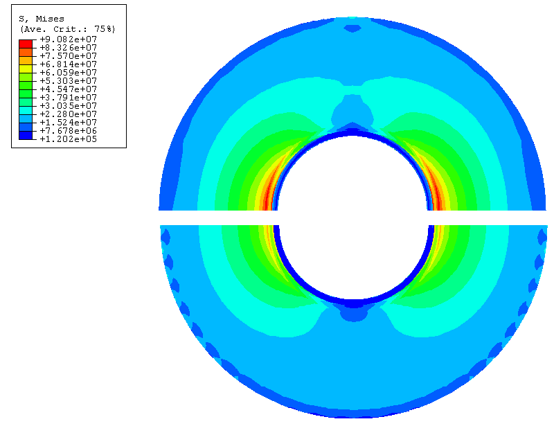

**Figure 1.1.10–11** Comparison of out-of-plane displacement in the continuum mesh plate for the submodel with scaled boundary (top) and the shell-to-solid coupling analysis with scaled load (bottom).

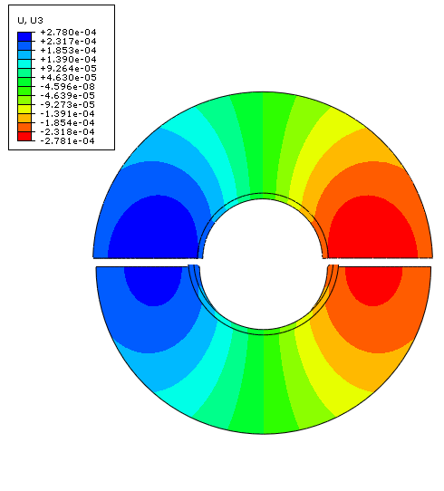

**Figure 1.1.10–12** Comparison of the Mises stress in the continuum mesh plate for the submodel with scaled boundary condition (top) and the shell-to-solid coupling analysis with scaled load (bottom).

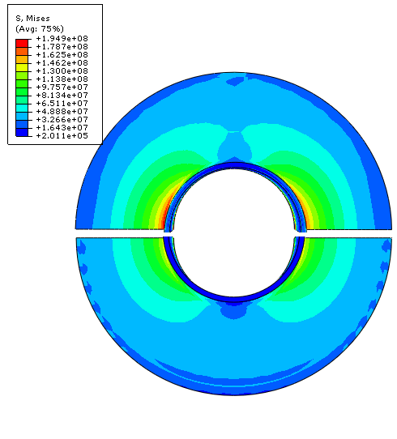

