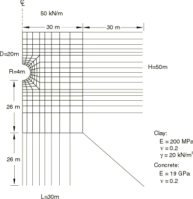
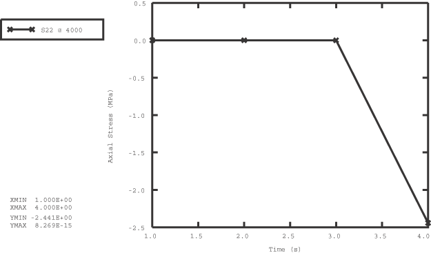
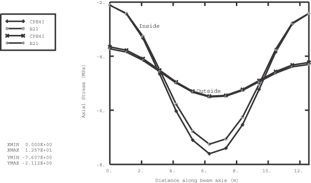

# 1.1.11 Stress-free element reactivation

**Product: **Abaqus/Standard  

This example demonstrates element reactivation for problems where new elements are to be added in a stress-free state. Typical examples include the construction of a gravity dam, in which unstressed layers of material are added to a mesh that has already deformed under geostatic load, or a tunnel in which a concrete or steel support liner is installed. Element pair reactivation during a step (["Element and contact pair removal and reactivation," Section 11.2.1 of the Abaqus Analysis User's Guide](../usb/usb-link.md#usb-anl-aelemremovrepl)) provides for this type of application directly because the strain in newly added elements corresponds to the deformation of the mesh since the reactivation.

Verification of the element pair reactivation capability is provided in ["Model change," Section 3.10 of the Abaqus Verification Guide](../ver/ver-link.md#verprcmodelchange).

### Problem description

The example considers the installation of a concrete liner to support a circular tunnel. Practical geotechnical problems usually involve a complex sequence of construction steps. The construction details determine the appropriate analysis method to represent these steps accurately. Such details have been avoided here for the sake of simplifying the illustration.

The tunnel is assumed to be excavated in clay, with a Young's modulus of 200 MPa and a Poisson's ratio of 0.2 (see [Figure 1.1.11--1](ch01s01aex11.md#sxmmodelchange-geom)). The diameter of the tunnel is 8 m, and the tunnel is excavated 20 m below ground surface. The material surrounding the excavation is discretized with first-order 4-node plane strain elements (element type CPE4). The infinite extent of the soil is represented by a 30-m-wide mesh that extends from the surface to a depth of 50 m below the surface. The left-hand boundary represents a vertical symmetry axis. Far-field conditions on the bottom and right-hand-side boundaries are modeled by infinite elements (element type CINPE4). No mesh convergence studies have been performed to establish if these boundary conditions are placed far enough away from the excavation.

An initial stress field due to gravitational and tectonic forces exists through the depth of the soil. It is assumed that this stress varies linearly with depth and that the ratio between the horizontal and vertical stress components is 0.5. The self weight of the clay is 20.0 kN/m3.

The excavation of the tunnel material is accomplished by applying the forces that are required to maintain equilibrium with the initial stress state in the surrounding material as loads on the perimeter of the tunnel. These loads are then reduced to zero to simulate the excavation. The three-dimensional effect of face advancement during excavation is taken into account by relaxing the forces gradually over several steps. The liner is installed after 40% relaxation of the loads. Further deformation continues to occur as the face of the excavation advances. This ongoing deformation loads the liner.

In the first input file the 150-mm-thick liner is discretized with one layer of incompatible mode elements (element type CPE4I). These elements are recommended in regions where bending response must be modeled accurately. In the second input file beam elements are used to discretize the liner. The liner is attached rigidly to the tunnel. The concrete is assumed to have cured to a strength represented by the elastic properties shown in [Figure 1.1.11--1](ch01s01aex11.md#sxmmodelchange-geom) by the time the liner is loaded. The liner is not shown in this diagram.

It is expected that an overburden load representing the weight of traffic and buildings exists after the liner is installed.

### Analysis method

The excavation and installation of the liner is modeled in four analysis steps. In the first step the initial stress state is applied and the liner elements are removed. Concentrated loads that are in equilibrium with the initial stress field are applied on the perimeter of the tunnel. These forces were obtained from an independent analysis where the displacements on the tunnel perimeter were constrained. The reaction forces at the constrained nodes are the loads applied here. The second step begins the tunnel excavation by reducing the concentrated loads on the tunnel surface. The loads are reduced by 40% in this step before the liner is installed in the third step. No deformation takes place in the soil or liner during the third step. In the fourth step the surface load is applied, and the excavation is completed by removing the remainder of the load on the tunnel perimeter.

In problems involving geometric nonlinearities with finite deformation, it is important to recognize that element reactivation occurs in the configuration at the start of the reactivation step. If the NLGEOM parameter were used in this problem, the thickness of the liner, when modeled with the continuum elements, would have a value at reactivation that would be different from its original value. This result would happen because the outside nodes (the nodes on the tunnel/liner interface) displace with the mesh, whereas the inside nodes remain at their current locations since liner elements are inactive initially. This effect is not relevant in this problem because geometric nonlinearities are not included. However, it may be significant for problems involving finite deformation, and it may lead to convergence problems in cases where elements are severely distorted upon reactivation. This problem would not occur in the model with beam elements because they have only one node through the thickness. In the model where the liner is modeled with continuum elements, the problem can be eliminated if the inner nodes are allowed to follow the outer nodes prior to reactivation, which can be accomplished by applying displacement boundary conditions on the inner nodes. Alternatively, the liner can be overlaid with (elastic) elements of very low stiffness. These elements use the same nodes as the liner but are so compliant that their effect on the analysis is negligible when the liner is present. They remain active throughout the analysis and ensure that the inner nodes follow the outer nodes, thereby preserving the liner thickness.

### Results and discussion

[Figure 1.1.11--2](ch01s01aex11.md#sxmmodelchange-linearstress) shows the stress state at a material point in the liner. The figure clearly indicates that the liner remains unstressed until reactivated.

[Figure 1.1.11--3](ch01s01aex11.md#sxmmodelchange-axialstress) compares the axial stress obtained from the CPE4I and beam elements at the top and bottom of the liner section. A local cylindrical coordinate system (["Orientations," Section 2.2.5 of the Abaqus Analysis User's Guide](../usb/usb-link.md#usb-int-corientation)) is used to orient the liner stresses in the continuum element model along the beam axis so that these stresses can be compared directly with the results of the beam element model. The small difference between the results can be attributed to the element type used in the discretization of the liner: the beam element model uses a plane stress condition, and the continuum element model uses a plane strain condition.

### Input files

[modelchangedemo_continuum.inp](../eif/modelchangedemo_continuum.inp)

[*MODEL CHANGE](../key/key-link.md#usb-kws-hmodelchange) with continuum elements.

[modelchangedemo_beam.inp](../eif/modelchangedemo_beam.inp)

[*MODEL CHANGE](../key/key-link.md#usb-kws-hmodelchange) with beam elements.

[modelchangedemo_node.inp](../eif/modelchangedemo_node.inp)

Nodal coordinates for the soil.

[modelchangedemo_element.inp](../eif/modelchangedemo_element.inp)

Element definitions for the soil.

### Figures

**Figure 1.1.11–1** Geometry and finite element discretization.

**Figure 1.1.11–2** Liner stress during analysis history.

**Figure 1.1.11–3** Axial stress along beam inside and outside.

