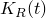

# 1.1.12 Transient loading of a viscoelastic bushing

**Product: **Abaqus/Standard  

This example demonstrates the automatic incrementation capability provided for integration of time-dependent material models and the use of the viscoelastic material model in conjunction with large-strain hyperelasticity in a typical design application. The structure is a bushing, modeled as a hollow, viscoelastic cylinder. The bushing is glued to a rigid, fixed body on the outside and to a rigid shaft on the inside, to which the loading is applied. A static preload is applied to the shaft, which moves the inner shaft off center. This load is held for sufficient time for steady-state response to be obtained. Then a torque is applied instantaneously and held for a long enough period of time to reach steady-state response. We compute the bushing's transient response to these events.

### Geometry and model

The viscoelastic bushing has an inner radius of 12.7 mm (0.5 in) and an outer radius of 25.4 mm (1.0 in). We assume that the bushing is long enough for plane strain deformation to occur. The problem is modeled with first-order reduced-integration elements (CPE4R). The mesh is regular, consisting of 6 elements radially, repeated 56 times to cover the 360 span in the hoop direction. The mesh is shown in [Figure 1.1.12--1](ch01s01aex12.md#sxmviscobushing-model). No mesh convergence studies have been performed.

The fixed outer body is modeled by fixing both displacement components at all the outside nodes. The nodes in the inner boundary of the bushing are connected, using a kinematic coupling constraint, to a node located in the center of the model. This node, thus, defines the inner shaft as a rigid body.

### Material

The material model is not defined from any particular physical material.

The instantaneous behavior of the viscoelastic material is defined by hyperelastic properties. A polynomial model with 1 (a Mooney-Rivlin model) is used for this, with the constants  27.56 MPa (4000 psi),  6.89 MPa (1000 psi), and  0.0029 MPa1 (0.00002 psi1).

The viscous behavior is modeled by a time-dependent shear modulus, , and a time-dependent bulk modulus, , each of which is expanded in a Prony series in terms of the corresponding instantaneous modulus,

The relative moduli  and  and time constants  are

| *i* |  |  |  sec |
| --- | --- | --- | --- |
| 1 | 0.2 | 0.5 | 0.1 |
| 2 | 0.1 | 0.2 | 0.2 |

This model results in an initial instantaneous Young's modulus of 206.7 MPa (30000 psi) and Poisson's ratio of 0.45. It relaxes pressures faster than shear stresses.

### Analysis

The analysis is done in four steps. The first step is a preload of 222.4 kN (50000 lbs) applied in the *x*-direction to the node in the center of the model in 0.001 sec with a static procedure (["Static stress analysis," Section 6.2.2 of the Abaqus Analysis User's Guide](../usb/usb-link.md#usb-anl-astatic)). The static procedure does not allow viscous material behavior, so this response is purely elastic. During the second step the load stays constant and the material is allowed to creep for 1 sec by using the quasi-static procedure (["Quasi-static analysis," Section 6.2.5 of the Abaqus Analysis User's Guide](../usb/usb-link.md#usb-anl-avisco)). Since 1 sec is a long time compared with the material time constants, the solution at that time should be close to steady state. The accuracy of the automatic time incrementation during creep response can be controlled. This accuracy tolerance is an upper bound on the allowable error in the creep strain increment in each time increment. It is chosen as 5  104, which is small compared to the elastic strains. The third step is another static step. Here the loading is a torque of 1129.8 N-m (10000 lb-in) applied in 0.001 sec. The fourth step is another quasi-static step with a time period of 1 sec.

### Results and discussion

[Figure 1.1.12--2](ch01s01aex12.md#sxmviscobushing-deform-static) through [Figure 1.1.12--5](ch01s01aex12.md#sxmviscobushing-deform-hold2) depict the deformed shape of the bushing at the end of each step. Each of the static loads produces finite amounts of deformation, which are considerably expanded during the holding periods. [Figure 1.1.12--6](ch01s01aex12.md#sxmviscobushing-dispandrotate) shows the displacement of the center of the bushing in the *x*-direction and its rotation as functions of time.

### Input file

[viscobushing.inp](../eif/viscobushing.inp)

Input data for the analysis.

### Figures

**Figure 1.1.12–1** Finite element model of viscoelastic bushing.

**Figure 1.1.12–2** Deformed model after horizontal static loading.

**Figure 1.1.12–3** Deformed model after first holding period.

**Figure 1.1.12–4** Deformed model after static moment loading.

**Figure 1.1.12–5** Deformed model after second holding period.

**Figure 1.1.12–6** Displacement and rotation of center of bushing.

