# 1.1.14 Damage and failure of a laminated composite plate

**Products: **Abaqus/Standard  Abaqus/Explicit  

This example demonstrates how the nonlinear material behavior of a composite laminate can be specified as a function of solution-dependent variables. The user subroutines [`USDFLD`](../sub/sub-link.md#sub-xsl-usdfld) in Abaqus/Standard and [`VUSDFLD`](../sub/sub-link.md#sub-xsl-vusdfld) in Abaqus/Explicit can be used to modify the standard linear elastic material behavior (for example, to include the effects of damage) or to change the behavior of the nonlinear material models in Abaqus. The material model in this example includes damage, resulting in nonlinear behavior. It also includes various modes of failure, resulting in abrupt loss of stress carrying capacity (Chang and Lessard, 1989). The analysis results are compared with experimental results.

### Problem description and material behavior

A composite plate with a hole in the center is subjected to in-plane compression. The plate is made of 24 plies of T300/976 graphite-epoxy in a [(45/+45)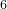]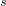 layup. Each ply has a thickness of 0.1429 mm (0.005625 in); thus, the total plate thickness is 3.429 mm (0.135 in). The plate has a length of 101.6 mm (4.0 in) and a width of 25.4 mm (1.0 in), and the diameter of the hole is 6.35 mm (0.25 in). The plate is loaded in compression in the length direction. The thickness of the plate is sufficient that out-of-plane displacements of the plate can be ignored. The compressive load is measured, as well as the length change between two points, originally a distance of 25.4 mm (1.0 in) apart, above and below the hole. The plate geometry is shown in [Figure 1.1.14--1](ch01s01aex14.md#sxmdmgplate-geom).

The material behavior of each ply is described in detail by Chang and Lessard. The initial elastic ply properties are longitudinal modulus 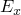=156512 MPa (22700 ksi), transverse modulus 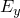=12962  MPa (1880 ksi), shear modulus 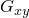=6964 MPa (1010 ksi), and Poisson's ratio 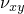=0.23. The material accumulates damage in shear, leading to a nonlinear stress-strain relation of the form 

where  is the (initial) ply shear modulus and the nonlinearity is characterized by the factor =2.44108 MPa3 (0.815 ksi3).

Failure modes in laminated composites are strongly dependent on geometry, loading direction, and ply orientation. Typically, one distinguishes in-plane failure modes and transverse failure modes (associated with interlaminar shear or peel stress). Since this composite is loaded in-plane, only in-plane failure modes need to be considered, which can be done for each ply individually. For a unidirectional ply as used here, five failure modes can be considered: matrix tensile cracking, matrix compression, fiber breakage, fiber matrix shearing, and fiber buckling. All the mechanisms, with the exception of fiber breakage, can cause compression failure in laminated composites.

The failure strength in laminates also depends on the ply layup. The effective failure strength of the layup is at a maximum if neighboring plies are orthogonal to each other. The effective strength decreases as the angle between plies decreases and is at a minimum if plies have the same direction. (This is called a ply cluster.) Chang and Lessard have obtained some empirical formulas for the effective transverse tensile strength; however, in this model we ignore such effects. Instead, we use the following strength properties for the T300/976 laminate: transverse tensile strength =102.4  MPa (14.86 ksi), ply shear strength 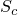=106.9 MPa (15.5 ksi), matrix compressive strength =253.0 MPa (36.7 ksi), and fiber buckling strength =2707.6 MPa (392.7 ksi).

The strength parameters can be combined into failure criteria for multiaxial loading. Four different failure modes are considered in the model analyzed here.
- *Matrix tensile cracking* can result from a combination of transverse tensile stress, , and shear stress, . The failure index, 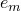, can be defined in terms of these stresses and the strength parameters,  and . When the index exceeds 1.0, failure is assumed to occur. Without nonlinear material behavior, the failure index has the simple form, 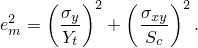 With nonlinear shear behavior taken into consideration, the failure index takes the more complex form, 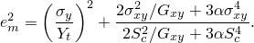
- *Matrix compressive failure* results from a combination of transverse compressive stress and shear stress. The failure criterion has the same form as that for matrix tensile cracking:  The same failure index is used since the previous two failure mechanisms cannot occur simultaneously at the same point. After the failure index exceeds 1.0, both the transverse stiffness and Poisson's ratio of the ply drop to zero.
- *Fiber-matrix shearing failure* results from a combination of fiber compression and matrix shearing. The failure criterion has essentially the same form as the other two criteria: 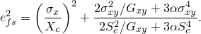 This mechanism can occur simultaneously with the other two criteria; hence, a separate failure index is used. Shear stresses are no longer supported after the failure index exceeds 1.0, but direct stresses in the fiber and transverse directions continue to be supported.
- *Fiber buckling failure* occurs when the maximum compressive stress in the fiber direction (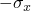) exceeds the fiber buckling strength, , independent of the other stress components: 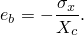 It is obvious that, unless the shear stress vanishes exactly, fiber-matrix shearing failure occurs prior to fiber buckling. However, fiber buckling may follow subsequent to fiber shearing because only the shear stiffness degrades after fiber-matrix shearing failure. Fiber buckling in a layer is a catastrophic mode of failure. Hence, after this failure index exceeds 1.0, it is assumed that the material at this point can no longer support any loads.

In this example the primary loading mode is shear. Therefore, failure of the plate occurs well before the fiber stresses can develop to a level where fiber buckling takes place, and this failure mode need not be taken into consideration.

Chang and Lessard assume that after failure occurs, the stresses in the failed directions drop to zero immediately, which corresponds to brittle failure with no energy absorption. This kind of failure model usually leads to immediate, unstable failure of the composite. This assumption is not very realistic: in reality, the stress-carrying capacity degrades gradually with increasing strain after failure occurs. Hence, the behavior of the composite after onset of failure is not likely to be captured well by this model. Moreover, the instantaneous loss of stress-carrying capacity also makes the postfailure analysis results strongly dependent on the refinement of the finite element mesh and the finite element type used.

### Material model implementation

To simulate the shear nonlinearity and the failure modes (matrix failure in tension or compression and fiber-matrix shear failure), the elastic properties are made linearly dependent on three field variables. The first field variable represents the matrix failure index, the second represents the fiber-matrix shear failure index, and the third represents the shear nonlinearity (damage) prior to failure. The dependence of the elastic material properties on the field variables is shown in [Table 1.1.14--1](ch01s01aex14.md#table-dmgplate-matprops).

To account for the nonlinearity, the nonlinear stress-strain relation must be expressed in a different form: the stress at the end of the increment must be given as a linear function of the strain. The most obvious way to do this is to linearize the nonlinear term, leading to the relation 

where *i* represents the increment number. This relation can be written in inverted form as 

thus providing an algorithm to define the effective shear modulus.

However, this algorithm is not very suitable because it is unstable at higher strain levels, which is readily demonstrated by stability analysis. Consider an increment where the strain does not change; i.e., 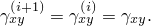 Let the stress at increment *i* have a small perturbation from 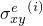, the exact solution at that increment: 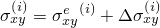. Similarly, at increment *i*+1, 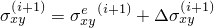. For the algorithm to be stable, 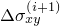 should not be larger than 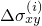. The perturbation in increment *i*+1 is calculated by substituting 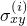 in the effective shear modulus equation and linearizing it about : 

where 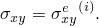 The perturbation in increment *i*+1 is larger than the perturbation in increment *i* if 

which, after elimination of 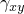, reduces to the expression 

Hence, instability occurs when the “nonlinear” part of the shear strain is larger than the “linear” part of the shear strain.

To obtain a more stable algorithm, we write the nonlinear stress-strain law in the form 

where  is an as yet unknown coefficient. In linearized form this leads to the update algorithm 

or, in inverted form, 

Following the same procedure as that for the original update algorithm, it is readily derived that a small perturbation, , in increment *i* reduces to zero in increment *i*+1 if 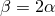. Hence, the optimal algorithm appears to be 

Finally, this relation is written in terms of the damage parameter *d*: 

where 

This relation is implemented in user subroutines `USDFLD` and `VUSDFLD`, and the value of the damage parameter is assigned directly to the third field variable used for definition of the elastic properties.

The failure indices are calculated with the expressions discussed earlier, based on the stresses at the start of the increment: 

The values of the failure indices are not assigned directly to the field variables: instead, they are stored as solution-dependent state variables. Only if the value of a failure index exceeds 1.0 is the corresponding user-defined field variable set equal to 1.0. After the failure index has exceeded 1.0, the associated user-defined field variable continues to have the value 1.0 even though the stresses may reduce significantly, which ensures that the material does not “heal” after it has become damaged.

### Finite element model

The plate consists of 24 plies of T300/976 graphite-epoxy in a [(45/+45)] layup. Instead of modeling each ply individually, we combine all plies in the 45 direction and all plies in the +45 direction. Consequently, only two layers need to be modeled separately:

1. A layer in the 45 direction with a thickness of 1.715 mm (0.0675 in).
2. A layer in the +45 direction with a thickness of 1.715 mm (0.0675 in).

The corresponding finite element model consists of two layers of CPS4 plane stress elements, with thicknesses and properties as previously discussed. The quarter-symmetry finite element model is shown in [Figure 1.1.14--1](ch01s01aex14.md#sxmdmgplate-geom).

The implementation of nonlinear material behavior with user-defined field variables is *explicit*: the nonlinearity is based on the state at the start of the increment. Hence, in Abaqus/Standard analyses the user must ensure that the time increments are sufficiently small, which is particularly important because the automatic time increment control in Abaqus/Standard is ineffective with the explicit nonlinearity implemented in [`USDFLD`](../sub/sub-link.md#sub-xsl-usdfld). If automatic time incrementation is used, the maximum time increment can be controlled from within subroutine [`USDFLD`](../sub/sub-link.md#sub-xsl-usdfld) with the variable `PNEWDT`. This capability is useful if there are other nonlinearities that require automatic time incrementation. In this example the only significant nonlinearity is the result of the material behavior. Hence, fixed time incrementation can be used effectively. In Abaqus/Explicit analyses the stable time increment is usually sufficiently small to ensure good accuracy.

### Results and discussion

For this problem experimental load-displacement results were obtained by Chang and Lessard. The experimental results, together with the numerical results obtained with Abaqus/Standard, are shown in [Figure 1.1.14--2](ch01s01aex14.md#sxmdmgplate-curves). The agreement between the experimental and numerical results is excellent up to the point where the load maximum is reached. After that, the numerical load-displacement curve drops off sharply, whereas the experimental data indicate that the load remains more or less constant. Chang and Lessard also show numerical results: their results agree with the results obtained by Abaqus but do not extend to the region where the load drops off. The dominant failure mode in this plate is fiber/matrix shear: failure occurs first at a load of approximately 12.15 kN (2700 lbs) and continues to grow in a stable manner until a load of approximately 13.5  kN (3000 lbs) is reached. [Figure 1.1.14--3](ch01s01aex14.md#sxmdmgplate-distrib) shows the extent of the damage in the Abaqus/Standard finite element model at the point of maximum load. In this figure an element is shaded if fiber/matrix shear failure has occurred at at least three integration points. These results also show excellent agreement with the results obtained by Chang and Lessard.

As discussed earlier, the sharp load drop-off in the numerical results is the result of the lack of residual stress carrying capacity after the failure criterion is exceeded. Better agreement could be reached only if postfailure material data were available. Without postfailure data the results are very sensitive to the mesh and element type, which is clearly demonstrated by changing the element type from CPS4 (full integration) to CPS4R (reduced integration). The results are virtually identical up to the point where first failure occurs. After that point the damage in the CPS4R model spreads more rapidly than in the CPS4 model until a maximum load of about 12.6  kN (2800 lbs) is reached. The load then drops off rapidly.

The problem is also analyzed with Abaqus/Standard models consisting of S4R and S4 elements. The elements have a composite section with two layers, with each layer thickness equal to the thickness of the plane stress elements in the CPS4 and CPS4R models. The results that were obtained with the S4R and S4 element models are indistinguishable from those obtained with the CPS4R element model.

The numerical results obtained with Abaqus/Explicit using the CPS4R element model (not shown) are consistent with those obtained with Abaqus/Standard.

### Input files

##### **Abaqus/Standard input files**

[damagefailcomplate_cps4.inp](../eif/damagefailcomplate_cps4.inp)

CPS4 elements.

[damagefailcomplate_cps4.f](../eif/damagefailcomplate_cps4.f)

User subroutine [`USDFLD`](../sub/sub-link.md#sub-xsl-usdfld) used in damagefailcomplate_cps4.inp.

[damagefailcomplate_node.inp](../eif/damagefailcomplate_node.inp)

Node definitions.

[damagefailcomplate_element.inp](../eif/damagefailcomplate_element.inp)

Element definitions.

[damagefailcomplate_cps4r.inp](../eif/damagefailcomplate_cps4r.inp)

CPS4R elements.

[damagefailcomplate_cps4r.f](../eif/damagefailcomplate_cps4r.f)

User subroutine [`USDFLD`](../sub/sub-link.md#sub-xsl-usdfld) used in damagefailcomplate_cps4r.inp.

[damagefailcomplate_s4.inp](../eif/damagefailcomplate_s4.inp)

S4 elements.

[damagefailcomplate_s4.f](../eif/damagefailcomplate_s4.f)

User subroutine [`USDFLD`](../sub/sub-link.md#sub-xsl-usdfld) used in damagefailcomplate_s4.inp.

[damagefailcomplate_s4r.inp](../eif/damagefailcomplate_s4r.inp)

S4R elements.

[damagefailcomplate_s4r.f](../eif/damagefailcomplate_s4r.f)

User subroutine [`USDFLD`](../sub/sub-link.md#sub-xsl-usdfld) used in damagefailcomplate_s4r.inp.

##### **Abaqus/Explicit input files**

[damagefailcomplate_cps4r_xpl.inp](../eif/damagefailcomplate_cps4r_xpl.inp)

CPS4R elements.

[damagefailcomplate_cps4r_xpl.f](../eif/damagefailcomplate_cps4r_xpl.f)

User subroutine [`VUSDFLD`](../sub/sub-link.md#sub-xsl-vusdfld) used in damagefailcomplate_cps4r_xpl.inp.

[damagefailcomplate_node.inp](../eif/damagefailcomplate_node.inp)

Node definitions.

[damagefailcomplate_element.inp](../eif/damagefailcomplate_element.inp)

Element definitions.

### Reference

Chang,  F-K., and L. B. Lessard, “Damage Tolerance of Laminated Composites Containing an Open Hole and Subjected to Compressive Loadings: Part I—Analysis,” Journal of Composite Materials, vol. 25, pp. 2–43, 1991.

### Table

**Table 1.1.14–1** Dependence of the elastic material properties on the field variables.
| Material State | Elastic Properties | FV1 | FV2 | FV3 |
| --- | --- | --- | --- | --- |
| No failure |  |  |  |  | 0 | 0 | 0 |
| Matrix failure |  | 0 | 0 |  | 1 | 0 | 0 |
| Fiber/matrix shear |  |  | 0 | 0 | 0 | 1 | 0 |
| Shear damage |  |  |  | 0 | 0 | 0 | 1 |
| Matrix failure and fiber/matrix shear |  | 0 | 0 | 0 | 1 | 1 | 0 |
| Matrix failure and shear damage |  | 0 | 0 | 0 | 1 | 0 | 1 |
| Fiber/matrix shear and shear damage |  |  | 0 | 0 | 0 | 1 | 1 |
| All failure modes |  | 0 | 0 | 0 | 1 | 1 | 1 |

### Figures

**Figure 1.1.14–1** Plate geometry.

**Figure 1.1.14–2** Experimental and numerical (Abaqus/Standard) load displacement curves.

**Figure 1.1.14–3** Distribution of material damage at maximum load obtained with Abaqus/Standard.

