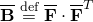
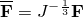

# 1.1.15 Analysis of an automotive boot seal

**Product: **Abaqus/Standard  

Boot seals are used to protect constant velocity joints and steering mechanisms in automobiles. These flexible components must accommodate the motions associated with angulation of the steering mechanism. Some regions of the boot seal are always in contact with an internal metal shaft, while other areas come into contact with the metal shaft during angulation. In addition, the boot seal may also come into contact with itself, both internally and externally. The contacting regions affect the performance and longevity of the boot seal.

In this example the deformation of the boot seal, caused by a typical angular movement of the shaft, is studied. It provides a demonstration and verification of the finite-sliding capability in three-dimensional deformable-to-deformable contact and self-contact in Abaqus. This problem also demonstrates how to model a hyperelastic material using the [`UMAT`](../sub/sub-link.md#sub-xsl-umat) user subroutine.

### Geometry and model

The boot seal with the internal shaft is shown in [Figure 1.1.15--1](ch01s01aex15.md#sxmbootseal-undeformed). The corrugated shape of the boot seal tightly grips the steering shaft at one end, while the other end is fixed. The rubber seal is modeled with first-order, hybrid brick elements with two elements through the thickness using symmetric model generation. The seal has a nonuniform thickness varying from a minimum of 3.0 mm to a maximum of 4.75 mm at the fixed end. The internal shaft is considered to be rigid and is modeled as an analytical rigid surface; the radius of the shaft is 14 mm. The rigid body reference node is located precisely in the center of the constant velocity joint.

The rubber is modeled as a slightly compressible neo-Hookean (hyperelastic) material with =0.752 MPa and =0.026 MPa1. For illustrative purposes an input file using the Marlow model is included; the model is defined using uniaxial test data generated by running a uniaxial test with the neo-Hookean model.

Contact is specified between the rigid shaft and the inner surface of the seal. Self-contact is specified on the inner and outer surfaces of the seal.

### Loading

The mounting of the boot seal and the angulation of the shaft are carried out in a three-step analysis. The inner radius at the neck of the boot seal is smaller than the radius of the shaft so as to provide a tight fit between the seal and the shaft. In the first step the initial interference fit is resolved, corresponding to the assembly process of mounting the boot seal onto the shaft. The automatic “shrink” fit method is utilized. The second step simulates the angulation of the shaft by specifying a finite rotation of 20 at the rigid body reference node of the shaft. During the third step the angulated shaft travels around the entire circumference to demonstrate the robustness of the algorithm.

### User subroutine for neo-Hookean hyperelasticity

In Abaqus/Standard user subroutine [`UHYPER`](../sub/sub-link.md#sub-xsl-uhyper) is used to define a hyperelastic material. However, in this problem we illustrate the use of user subroutine [`UMAT`](../sub/sub-link.md#sub-xsl-umat) as an alternative method of defining a hyperelastic material. In particular, we consider the neo-Hookean hyperelastic material model. The form of the neo-Hookean strain energy density function is given by

Here, , , and  are the strain invariants of the deviatoric left Cauchy-Green deformation tensor . This tensor is defined as , where  is the distortion gradient. ["Hyperelastic material behavior," Section 4.6.1 of the Abaqus Theory Guide](../stm/stm-link.md#stm-mat-hyperelastic), contains detailed explanations of these quantities.

The constitutive equation for a neo-Hookean material is

where  is the Cauchy stress. The material Jacobian, , is defined by the variation of the Kirchhoff stress

where  is the virtual rate of deformation and is defined as 

For a neo-Hookean material the components of  are given by

### Results and discussion

[Figure 1.1.15--2](ch01s01aex15.md#sxmbootseal-deformed) shows the deformed configuration of the model. The rotation of the shaft causes the stretching of one side and compression on the other side of the boot seal. The surfaces have come into self-contact on the compressed side. [Figure 1.1.15--3](ch01s01aex15.md#sxmbootseal-contours) shows the contours of maximum principal stresses in the boot seal.

Comparison of the analysis times when using fixed and automated contact patches shows that both analyses complete in approximately the same amount of time. This can be expected for this type of problem since the fixed contact patches are limited in size to a few elements. For the case with fixed contact patches the wavefront is somewhat larger, requiring more memory and solution time per iteration. However, this is offset by the time required to form new contact patches and to reorder the equations for the case with automatic contact patches. The results obtained with the model that uses user subroutine [`UMAT`](../sub/sub-link.md#sub-xsl-umat) are identical to those obtained using the built-in Abaqus material model.

### Input files

[bootseal.inp](../eif/bootseal.inp)

Analysis with node-to-surface contact.

[bootseal_surf.inp](../eif/bootseal_surf.inp)

Analysis with surface-to-surface contact.

[bootseal_2d.inp](../eif/bootseal_2d.inp)

Two-dimensional model for symmetric model generation in bootseal.inp.

[bootseal_2d_surf.inp](../eif/bootseal_2d_surf.inp)

Two-dimensional model for symmetric model generation in bootseal.inp using surface-to-surface contact.

[bootseal_umat.inp](../eif/bootseal_umat.inp)

Analysis with user subroutine [`UMAT`](../sub/sub-link.md#sub-xsl-umat).

[bootseal_2d_umat.inp](../eif/bootseal_2d_umat.inp)

Two-dimensional model for symmetric model generation in bootseal_umat.inp.

[bootseal_umat.f](../eif/bootseal_umat.f)

 [`UMAT`](../sub/sub-link.md#sub-xsl-umat) for the neo-Hookean hyperelasticity model.

[bootseal_marlow.inp](../eif/bootseal_marlow.inp)

Analysis with Marlow hyperelasticity model.

[bootseal_2d_marlow.inp](../eif/bootseal_2d_marlow.inp)

Two-dimensional model for symmetric model generation in bootseal_marlow.inp.

### Figures

**Figure 1.1.15–1** Undeformed model.

**Figure 1.1.15–2** Deformed configuration of half the model.

**Figure 1.1.15–3** Contours of maximum principal stress in the seal.

