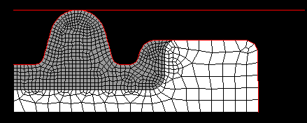
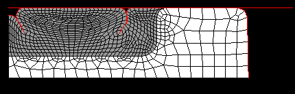
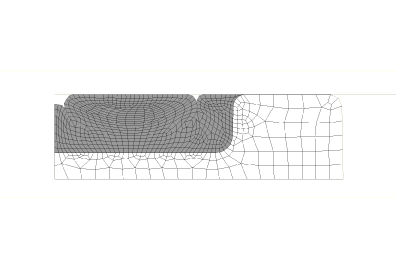
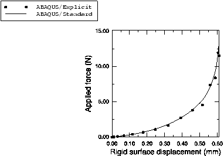

# 1.1.18 Self-contact in rubber/foam components: rubber gasket

**Products: **Abaqus/Standard  Abaqus/Explicit  

The self-contact capability in Abaqus is illustrated with two examples derived from the automotive component industry: this problem and the preceding one, which discusses a jounce bumper. These examples demonstrate the use of the single-surface contact capability available for two-dimensional large-sliding analysis. Components that deform and change their shape substantially can fold and have different parts of the surface come into contact with each other. In such cases it can be difficult to predict at the outset of the analysis where such contact may occur and, therefore, it can be difficult to define two independent surfaces to make up a contact pair.

This model is used to analyze an oil pan gasket, which enhances the sealing of the oil pan against the engine block. A primary objective of gasket designers is to reach or exceed a threshold value of contact pressure at the gasket bead/cover/engine block interfaces. Experience shows that, above such a threshold, oil will not leak. Another item of interest is the load-deflection curve obtained when compressing the gasket cross-section since it is indicative of the bolt load required to attain a certain gap between the oil pan and the engine block. Finally, the analysis provides details to ensure that stresses and strains are within acceptable bounds.

The rubber gasket is embedded in a plastic backbone. It has two planes of symmetry and a bead that, when compressed, provides the sealing effect ([Figure 1.1.18--1](ch01s01aex18.md#sxmselfcont-gasketmesh)). A flat rigid surface, parallel to one of the symmetry planes, pushes the gasket into the backbone. The geometry of the gasket is such that it folds in two different locations. In this model the entire free surface of the gasket and of the backbone is declared as a single surface allowed to contact itself. This modeling technique, although very simple, is more expensive because of the extensive contact searches required, as well as a larger wavefront of the equation system when using Abaqus/Standard.

The analysis is performed using both Abaqus/Standard and Abaqus/Explicit.

### Geometry and model

The rubber gasket is modeled as a quarter of a plane strain section, initially in contact with a flat rigid surface. The clearance between the plastic backbone and the surface is 0.612 mm (.024 in). The height of the bead in the gasket is 1.097 mm (.043 in). The backbone is modeled with a linear elastic material with a Young's modulus of 8000.0 MPa (1160 ksi) and a Poisson's ratio of 0.4. In Abaqus/Standard the gasket is modeled as a fully incompressible hyperelastic material, which is much softer than the backbone material at all strain levels. In Abaqus/Explicit a small amount of compressibility is assumed for the gasket material. The nonlinear elastic behavior of the gasket is described by a strain energy function that is a first-order polynomial in the strain invariants. The model is discretized with first-order quadrilaterals. Standard elements are used for the backbone. In Abaqus/Standard full-integration hybrid elements are used for the gasket, while reduced-integration elements are used to model the gasket in Abaqus/Explicit. The interface between the gasket and the backbone is assumed to be glued with no special treatment required. A single surface definition covers all of the free surface of the gasket and the backbone. Through the definition of contact pairs, this surface is allowed to contact both the rigid surface and itself. A small amount of friction (Coulomb coefficient of 0.05) is applied to the interface with the rigid surface, which is assumed to be lubricated. Sticking surface behavior, through the specification of rough friction (["Frictional behavior," Section 37.1.5 of the Abaqus Analysis User's Guide](../usb/usb-link.md#usb-cni-afriction)), is applied when the gasket contacts itself, denoting a clean surface.

### Results and discussion

The gasket analysis is a single-step procedure in which the rigid surface moves down almost all of the backbone clearance (0.61 mm or .024 in). The relative rigidity of the backbone forces the rubber gasket to fit inside the cavity provided by the backbone, folding in two regions ([Figure 1.1.18--2](ch01s01aex18.md#sxmselfcont-gmeshpostload) and [Figure 1.1.18--3](ch01s01aex18.md#sxmselfcont-gmeshpostload-xpl)). Although the general vicinity of the location of the folds can be estimated from the initial configuration, their exact locations are difficult to predict.

The deformed shape of the gasket and the locations of the folds predicted by Abaqus/Standard and Abaqus/Explicit agree well. The rigid surface load-displacement curve is also in good agreement, as shown in [Figure 1.1.18--4](ch01s01aex18.md#sxmselfcont-rfvsu).

### Acknowledgements

SIMULIA would like to thank Mr. DeHerrera of Freudenberg-NOK General Partnership for providing these examples.

### Input files

[selfcontact_gask.inp](../eif/selfcontact_gask.inp)

Gasket model for Abaqus/Standard.

[selfcontact_gask_xpl.inp](../eif/selfcontact_gask_xpl.inp)

Gasket model for Abaqus/Explicit.

[selfcontact_gask_node.inp](../eif/selfcontact_gask_node.inp)

Node definitions for the gasket model.

[selfcontact_gask_element1.inp](../eif/selfcontact_gask_element1.inp)

Element definitions for the rubber part of the gasket model.

[selfcontact_gask_element2.inp](../eif/selfcontact_gask_element2.inp)

Element definitions for the backbone part of the gasket model.

[selfcontact_gask_c3d8h.inp](../eif/selfcontact_gask_c3d8h.inp)

Three-dimensional gasket model for Abaqus/Standard.

### Figures

**Figure 1.1.18–1** Gasket initial mesh.

**Figure 1.1.18–2** Gasket mesh after loading as predicted by Abaqus/Standard.

**Figure 1.1.18–3** Gasket mesh after loading as predicted by Abaqus/Explicit.

**Figure 1.1.18–4** Rigid surface load-displacement curve.

