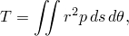
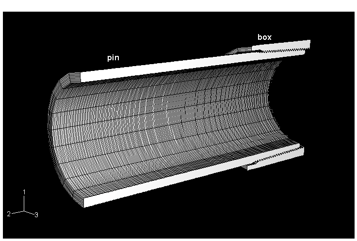
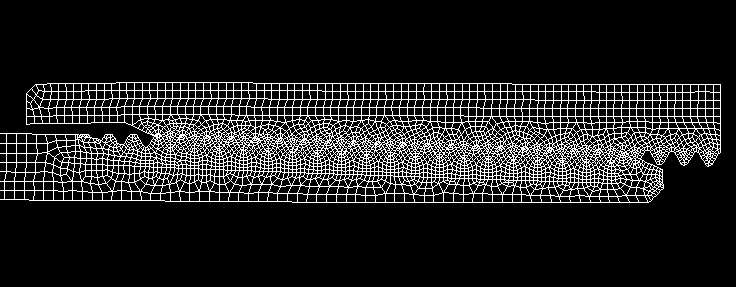
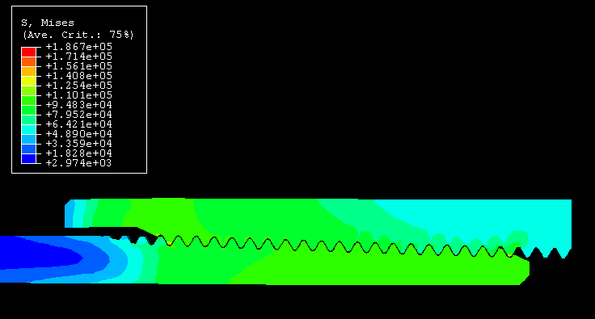
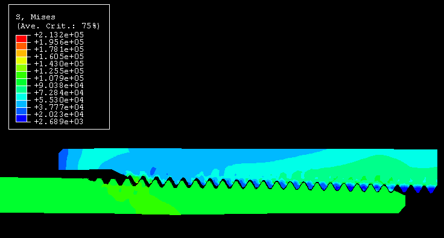
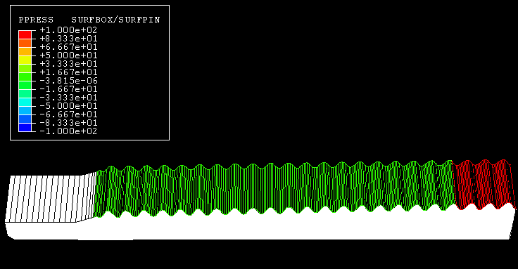
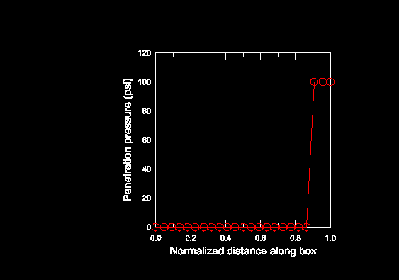
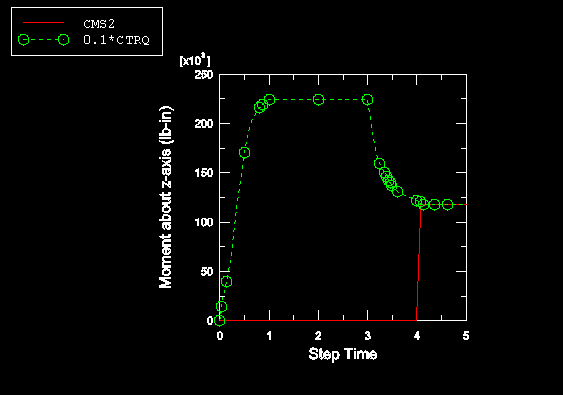

# 1.1.20 Axisymmetric analysis of a threaded connection

**Product: **Abaqus/Standard  

Threaded connectors are commonly used components in the piping and offshore industry. They must withstand a variety of loading conditions: thread engagement, torque, bending, axial pullout, internal pressure under operating and overload conditions, and potential fluid leakage through threaded connections. Abaqus provides a wide range of modeling, analysis, and output capabilities that can be used to assess the design of a connector under these and other loading conditions.

Two Abaqus methods that are particularly useful for analyzing threaded connectors are the specification of an allowable contact interference and of pressure penetration loads. 
- The automatic "shrink" fit method can be used to automatically resolve the overclosure of two contacting surfaces. This method is applicable only during the first step of an analysis, and it cannot be used with self-contact. See ["Modeling contact interference fits in Abaqus/Standard," Section 36.3.4 of the Abaqus Analysis User's Guide](../usb/usb-link.md#usb-cni-acontactinterference), for details.
- The surface-based pressure penetration capability described in ["Pressure penetration loading," Section 37.1.7 of the Abaqus Analysis User's Guide](../usb/usb-link.md#usb-cni-apressurepenetration), is used to simulate pressure penetration between contacting surfaces. This capability is provided for simulating cases where a joint between two deforming bodies (for example, between two components threaded onto each other) or between a deforming body and a rigid surface (such as a soft gasket used in a joint) is exposed at one or multiple ends to a fluid pressure. This pressure will penetrate into the joint and load the surfaces forming the joint until some area of the surfaces is reached where the contact pressure between the abutting surfaces exceeds the critical value specified in the pressure penetration load, cutting off further penetration.

The contact output variables in Abaqus can provide the designer a wealth of information about the performance of a connector during all steps of an analysis. When modeling surface-based contact with axisymmetric elements (CAX- and CGAX-type elements) an output quantity of particular use is the maximum torque that can be transmitted about the *z*-axis by a specified contact pair. The maximum torque, *T*, is a scalar value defined as 

where *p* is the pressure transmitted across the interface, *r* is the radius to a point on the interface, and *s* is the current distance along the interface in the *r*–*z* plane. *T* is not a real torque; it is a computed limit of torque that a contact pair may transmit about the *z*-axis assuming that all the slave nodes on the contact surface are slipping and that the friction coefficient is set to 1. The actual maximum torque that can be transmitted about the *z*-axis by a specified contact pair can be estimated by scaling *T* by the friction coefficient specified for the contact pair. The value of *T* can be output by requesting the contact output variable CTRQ.

This example demonstrates the usefulness of the specification of allowable contact interference and of pressure penetration loads as well as the Abaqus contact output variables in an axisymmetric analysis of a particular threaded connector.

### Geometry and model

A three-dimensional cut-away view of the threaded connection assembly analyzed in this example is shown in [Figure 1.1.20--1](ch01s01aex20.md#sxmthreadedconnection-model). Although the actual threads are helical, they are represented with an axisymmetric geometry. Previous experience has shown this simplification to be appropriate for these types of problems. Both the “pin” and the “box” are made from steel with a Young's modulus of 207 GPa (30  106 psi) and a Poisson's ratio of 0.3, which is characterized by a von Mises plasticity model. The unthreaded section of the pin has inner and outer radii of 48.6 mm (1.913 in) and 57.2 mm (2.25 in), respectively. The major diameter of the threads on the pin (diameter measured at the crest of the threads) is slightly larger than the major diameter of the threads on the box (diameter measured at the roots of the threads); thus, there is an initial interference between the threads on the pin and on the box.

The deformed axisymmetric mesh (after the initial interference has been resolved) in the vicinity of the threads is illustrated in [Figure 1.1.20--2](ch01s01aex20.md#sxmthreadedconnection-mesh). Contact is modeled by the interaction of contact surfaces defined by grouping specific faces of the elements in the contacting regions. 

### Loading and boundary conditions

Two analyses of the threaded connection are performed: an axisymmetric analysis using CAX4 elements and an axisymmetric analysis with twist using CGAX4 elements. The first four steps for the two analyses are identical. The CGAX4 model has an additional fifth step.

The initial interference fit of the threads on the pin and box is resolved in the first step using the automatic “shrink” fit method with a friction coefficient of 0. In the second step the assembly is held fixed while the friction coefficient is changed from 0 to 0.1 using changes to friction properties. An internal gauge pressure of 0.689 MPa (100 psi) is applied to the connector in the third step. The pressure on the contact surfaces is applied using pressure penetration loading. In the first three steps the displacements in the 2-direction are constrained to be zero at both ends of the assembly. To simulate an axial load in the fourth step, a displacement boundary condition of 0.254 cm (0.1 in) is applied to the end of the box in the 2-direction. In the fifth step for the CGAX4 model the end of the pin is held fixed while the end of the box is rotated 0.1 radians about the 2-axis, simulating a torque being applied to the connector. The actual torques generated about the 2-axis by the frictional stresses in the fifth step are given by the output variable CMS2. This value is compared to the estimated value given by CTRQ for the fourth step.

### Results and discussion

All analyses are performed as large-displacement analyses. The results from the first four steps for both models are identical. [Figure 1.1.20--3](ch01s01aex20.md#sxmthreadedconnection-mises) and [Figure 1.1.20--4](ch01s01aex20.md#sxmthreadedconnection-mises1), respectively, show the Mises stress distributions in the threaded assembly after the overclosure has been resolved in Step 1 and after the displacement boundary condition has been applied in Step 4. As is illustrated in [Figure 1.1.20--4](ch01s01aex20.md#sxmthreadedconnection-mises1), some of the threads on the pin are beginning to pull out at the end of Step 4. However, plots of the pressure penetration on the contact surface of the box in [Figure 1.1.20--5](ch01s01aex20.md#sxmthreadedconnection-ppress) and [Figure 1.1.20--6](ch01s01aex20.md#sxmthreadedconnection-ppress1) show that the seal of the threads is maintained; thus, no leakage is indicated. If the seal had failed, the penetration pressure on the box surface in contact with the pin would be 0.689 MPa (100 psi) instead of 0. Other contact output variables such as CPRESS and COPEN provide additional information about the contact state throughout the analysis.

The scaled values of CTRQ (scaled by the friction coefficient of 0.1) and the values of CMS2 for all five steps in the CGAX4 analysis are illustrated in [Figure 1.1.20--7](ch01s01aex20.md#sxmthreadedconnection-ctrq). The value of CTRQ at the end of Step 4 is 1.22  106 lb-in, which translates into an estimated maximum torque of 1.22  105 lb-in for a friction coefficient of 0.1. The value of CMS2 computed during Step 5 for the CGAX4 model is 1.18  105 lb-in. The 3.7% difference in this example between the predicted and actual torque values can be attributed to a slight change in the normal pressure distribution between the contact surfaces that occurs when the box is rotated. The value of CMS2 is zero for the first four steps since no frictional stresses are generated between the contact surfaces until the fifth step. The value of CTRQ increases in the first step as the overclosure is resolved and dips in the fourth step due to the change in the contact pressure as the box is pulled away from the pin (see [Figure 1.1.20--7](ch01s01aex20.md#sxmthreadedconnection-ctrq)).

### Acknowledgements

SIMULIA gratefully acknowledges the ExxonMobil Upstream Research Corporation for their cooperation in implementing the CTRQ output variable and for supplying the geometry, mesh, and material properties used in this example.

### Input files

[threadedconnector_cax4.inp](../eif/threadedconnector_cax4.inp)

Axisymmetric analysis of the threaded connector using CAX4 elements.

[threadedconnector_cax4_n.inp](../eif/threadedconnector_cax4_n.inp)

Node definitions for the axisymmetric analysis of the threaded connector using CAX4 elements.

[threadedconnector_cax4_e.inp](../eif/threadedconnector_cax4_e.inp)

Element definitions for the axisymmetric analysis of the threaded connector using CAX4 elements.

[threadedconnector_cgax4.inp](../eif/threadedconnector_cgax4.inp)

Axisymmetric analysis of the threaded connector using CGAX4 elements.

[threadedconnector_cgax4_n.inp](../eif/threadedconnector_cgax4_n.inp)

Node definitions for the axisymmetric analysis of the threaded connector using CGAX4 elements.

[threadedconnector_cgax4_e.inp](../eif/threadedconnector_cgax4_e.inp)

Element definitions for the axisymmetric analysis of the threaded connector using CGAX4 elements.

### Figures

**Figure 1.1.20–1** Three-dimensional cut-away view of the threaded connection.

**Figure 1.1.20–2** Axisymmetric mesh in the vicinity of the threads after the initial interference has been resolved.

**Figure 1.1.20–3** Stress distribution in the threads after the initial overclosure has been resolved. 

**Figure 1.1.20–4** Stress distribution in the threads after axial loading. 

**Figure 1.1.20–5** Pressure penetration on box contact surface after axial loading. 

**Figure 1.1.20–6** Plot of pressure penetration on box contact surface after axial loading. 

**Figure 1.1.20–7** Comparison of 0.1*CTRQ to CMS2 for the CGAX4 model.

