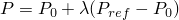
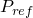
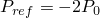
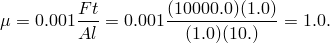

# 1.2.1 Snap-through buckling analysis of circular arches

**Product: **Abaqus/Standard  

It is often necessary to study the postbuckling behavior of a structure whose response is unstable during part of its loading history. Two of the models in this example illustrate the use of the modified Riks method, which is provided to handle such cases. The method is based on moving with fixed increments along the static equilibrium path in a space defined by the displacements and a proportional loading parameter. The actual load value may increase or decrease as the solution progresses. The modified Riks method implemented in Abaqus is described in ["Modified Riks algorithm," Section 2.3.2 of the Abaqus Theory Guide](../stm/stm-link.md#stm-anl-modifiedriks).

The other two models illustrate the use of viscous damping. One example applies viscous damping as a feature of surface contact, which allows for the definition of a “viscous” pressure that is proportional to the relative velocity between the surfaces. The implementation of this option in Abaqus is described in ["Contact pressure definition," Section 5.2.1 of the Abaqus Theory Guide](../stm/stm-link.md#stm-ifc-contactpress). The other example applies volume proportional damping to the model. The implementation of this option is described in the automatic stabilization section of ["Solving nonlinear problems," Section 7.1.1 of the Abaqus Analysis User's Guide](../usb/usb-link.md#usb-anl-anonlineareqns).

Three separate cases are considered here. The first is a clamped shallow arch subjected to a pressure load. Reference solutions for this case are given by Ramm (1981) and Sharafi and Popov (1971). The second case is the instability analysis of a clamped-hinged circular arch subjected to a point load. The exact analytical solution for this problem is given by DaDeppo and Schmidt (1975). The third case is a modification of the shallow arch problem in which the ends are pinned rather than clamped and the arch is depressed with a rigid punch.

### Model and solution control

The shallow circular arch is shown in [Figure 1.2.1--1](ch01s02aex26.md#sxmsnapbuckle-circarch). Since the deformation is symmetric, one-half of the arch is modeled. Ten elements of type B21 (linear interpolation beams) are used. A uniform pressure is first applied to snap the arch through. The loading is then reversed so that the behavior is also found as the pressure is removed.

The deep circular arch is shown in [Figure 1.2.1--2](ch01s02aex26.md#sxmsnapbuckle-hingedarch). One end of the arch is clamped, and the other is hinged. A concentrated load is applied at the apex of the arch. The arch undergoes extremely large deflections but small strains. Because of the asymmetric boundary conditions, the arch will sway toward the hinged end and then collapse. The arch is almost inextensible for most of the response history. Sixty elements of type B31H are used. Hybrid elements are used because they are most suitable for problems such as this.

Solution controls are used to set a very tight convergence tolerance because the problem contains more than one equilibrium path. If tight tolerances are not used, the response might follow a path that is different from the one shown.

In the Riks procedure actual values of load magnitudes cannot be specified. Instead, they are computed as part of the solution, as the “load proportionality factor” multiplying the load magnitudes given on the loading data lines. User-prescribed load magnitudes serve only to define the direction and to estimate the magnitude of the initial increment of the load for a step. This initial load increment is the product of the ratio of the initial time increment to the time period and the load magnitudes given in the loading options. The user can terminate a Riks analysis by specifying either a maximum load proportionality factor or a maximum displacement at a node, or both. When a solution point is computed at which either of these limits is crossed, the analysis will stop. In any event, or if neither option is used, the analysis ends when the maximum number of increments for the step is exceeded.

In snap-through studies such as these, the structure can carry increasing load after a complete snap. Therefore, the analysis is terminated conveniently by specifying a maximum load proportionality factor.

For the clamped shallow arch the initial snap occurs at a pressure of about 1000 (force/length2 units). Thus, 250 (force/length2 units) seems to be a reasonable estimate for the first increment of load to be applied. Accordingly, an initial time increment of 0.05 is specified for a time period of 1.0 and a pressure load of 5000 (force/length2 units). The solution will have been sufficiently developed at a pressure of about 2000 (force/length2 units). Therefore, the analysis is terminated when the load proportionality factor exceeds 0.4.

To illustrate the use of Riks in several steps, a second step is included in which the pressure is taken off the arch so that it will snap back toward its initial configuration. At any point in a Riks analysis, the actual load is given by , where  is the load at the end of the previous step,  is the load magnitude prescribed in the current step, and  is the load proportionality factor. The arch is unloaded so that in the initial time increment, a pressure of approximately 0.15 is removed. Using an initial time increment of 0.05 in a time period of 1.0, a load of  is prescribed for this restarted step. Furthermore, we want the analysis to end when all the load is removed and the arch has returned to its initial configuration. Therefore, a displacement threshold of 0.0 is set for the center of the arch. The analysis terminates when this limit is crossed. Because Abaqus must pick up the load magnitude at the end of the initial Riks step to start the next step, any step following a Riks step can be done only as a restart job from the previous step.

For the deep clamped-hinged arch, the initial snap occurs at a load of about 900 (force units). The load magnitude specified is 100 (force units), and the maximum load proportionality factor is specified as 9.5.

The shallow arch depressed with a rigid punch is shown in [Figure 1.2.1--3](ch01s02aex26.md#sxmsnapbuckle-archwpunch). The analysis uses the same model of the arch as the first problem. However, the end is pinned rather than clamped, and load is applied through the displacement of the punch. The pinned boundary condition makes the problem more unstable than the clamped-end case. A preliminary analysis in which the arch is depressed with a prescribed displacement of the midpoint of the arch shows that the force will become negative during snap-through. Thus, if the arch is depressed with a rigid punch, the Riks method will not help convergence because, at the moment of snap-through, the arch separates from the punch, and the movement of the punch no longer controls the displacement of the arch. Therefore, contact damping is introduced to aid in convergence. Viscous damping with surface contact adds a pressure that is proportional to the relative velocity to slow down the separation of the arch from the punch.

The viscous damping clearance is set to 10.0, and the fraction of the clearance interval is set to 0.9; the damping is constant for a clearance of up to 9.0. Since the arch is 4.0 units high, the distance traveled by the top of the arch from the initial position to the final snap-through position is 8.0 units. This distance is clearly larger than the clearance between the middle of the arch and the tip of the punch at any time during the analysis. Thus, the viscous damping is in effect for the whole period when the arch has separated from the punch.

To choose the viscous damping coefficient, note that it is given as pressure per relative velocity. The relevant pressure is obtained by dividing the approximate peak force (10000.0) by the contact area (1.0). The relevant velocity is obtained by dividing the distance over which the top of the arch travels (8.0 from initial to snapped position, which can be rounded to 10.0) by the time (approximately 1.0, the total time of the step). A small percentage (0.1%) of this value is used for the viscous damping coefficient: 

With  1.0, the analysis runs to completion. Another analysis was run with a smaller value of  0.1, but the viscous damping was not sufficient to enable the analysis to pass the point of snap-through. Thus, a damping coefficient of 1.0 was determined to be an appropriate value.

Automatic stabilization based on volume proportional damping is also considered for the shallow arch compressed with a rigid punch, as an alternative to contact damping. Two forms of automatic stabilization are considered: one with a constant damping factor that is chosen by default (see ["Automatic stabilization of static problems with a constant damping factor" in "Solving nonlinear problems," Section 7.1.1 of the Abaqus Analysis User's Guide](../usb/usb-link.md#usb-anl-anonlineareqns-stabilize)), and one with an adaptive damping factor (see ["Adaptive automatic stabilization scheme" in "Solving nonlinear problems," Section 7.1.1 of the Abaqus Analysis User's Guide](../usb/usb-link.md#usb-anl-anonlineareqns-stabilize-adaptive)).

### Results and discussion

The results for the clamped shallow arch are shown in [Figure 1.2.1--4](ch01s02aex26.md#sxmsnapbuckle-loadvdispc), where the downward displacement of the top of the arch is plotted as a function of the pressure. The algorithm obtains this solution in 12 increments, with a maximum of three iterations in an increment. At the end of 12 increments the displacement of the top of the arch is about 7.5 length units. This represents a complete snap through, as the original rise of the arch was 4 length units. [Figure 1.2.1--5](ch01s02aex26.md#sxmsnapbuckle-deform-step1) and [Figure 1.2.1--6](ch01s02aex26.md#sxmsnapbuckle-deform-step2) show a series of deformed configuration plots for this problem. Several other authors have examined this same case and have obtained essentially the same solution (see Ramm, 1981, and Sharafi and Popov, 1971).

The results for the deep clamped-hinged arch are shown in [Figure 1.2.1--7](ch01s02aex26.md#sxmsnapbuckle-loadvdisph), where the displacement of the top of the arch is plotted as a function of the applied load. [Figure 1.2.1--8](ch01s02aex26.md#sxmsnapbuckle-deform-h) shows a series of deformed configuration plots for this problem. The arch collapses unstably at the peak load. Following this, the beam stiffens rapidly as the load increases. The ability of the Riks method to handle unstable response is well-illustrated by this example.

The results of the preliminary analysis of the prescribed displacement of a pinned shallow arch are shown in [Figure 1.2.1--9](ch01s02aex26.md#sxmsnapbuckle-forcevdisp), with the displacement of the top of the arch plotted as a function of the reaction force at that point. This plot shows the negative force that develops during snap-through. A series of deformed configuration plots for the pinned shallow arch depressed with a punch and with viscous damping introduced is shown in [Figure 1.2.1--10](ch01s02aex26.md#sxmsnapbuckle-deformwpunch), with one plot showing the arch separated from the punch. [Figure 1.2.1--11](ch01s02aex26.md#sxmsnapbuckle-forcebetw) is a plot of the force between the punch and the top of the arch. The force is positive until snap-through, when the arch separates from the punch and a negative viscous force develops. Once the snap-through is complete, the force drops to zero as the punch continues to move down while separated from the arch. When the punch contacts the arch, a positive force develops again.

Similar results are produced when the contact viscous damping is replaced by volume proportional damping (with either constant or adaptive damping coefficients). A sequence of configurations like [Figure 1.2.1--10](ch01s02aex26.md#sxmsnapbuckle-deformwpunch) is obtained, in which separation of the arch from the punch occurs during snap-through. At the end of the analysis the amount of energy dissipated is similar to the amount dissipated with the viscous damping option.

You can use the **abaqus restartjoin** execution procedure to extract data from the output database created by a restart analysis and append the data to a second output database. For more information, see ["Joining output database (`.odb`) files from restarted analyses," Section 3.2.21 of the Abaqus Analysis User's Guide](../usb/usb-link.md#usb-int-drestartjoinproc).

### Input files

[snapbuckling_shallow_step1.inp](../eif/snapbuckling_shallow_step1.inp)

Initial analysis step for the shallow arch.

[snapbuckling_shallow_unload.inp](../eif/snapbuckling_shallow_unload.inp)

Restart run to obtain the unloading response of the shallow arch.

[snapbuckling_deep.inp](../eif/snapbuckling_deep.inp)

Deep arch.

[snapbuckling_shallow_midpoint.inp](../eif/snapbuckling_shallow_midpoint.inp)

Shallow arch loaded by a fixed displacement of the midpoint.

[snapbuckling_shallow_punch.inp](../eif/snapbuckling_shallow_punch.inp)

Shallow arch loaded by the displacement of a rigid punch.

[snapbuckling_b21h_deep.inp](../eif/snapbuckling_b21h_deep.inp)

60 elements of type B21H used for the deep clamped-hinged arch analysis.

[snapbuckling_b32h_deep.inp](../eif/snapbuckling_b32h_deep.inp)

30 elements of type B32H used for the deep clamped-hinged arch analysis.

[snapbuckling_restart1.inp](../eif/snapbuckling_restart1.inp)

Restart analysis of snapbuckling_shallow_step1.inp during the RIKS step.

[snapbuckling_restart2.inp](../eif/snapbuckling_restart2.inp)

Restart analysis of snapbuckling_restart1.inp during the RIKS step. This illustrates restarting an existing RIKS restart analysis.

[snapbuckling_shallow_stabilize.inp](../eif/snapbuckling_shallow_stabilize.inp)

Same as snapbuckling_shallow_punch.inp with the surface contact viscous damping replaced by the volume proportional damping of [*STATIC](../key/key-link.md#usb-kws-hstatic), STABILIZE.

[snapbuckling_shallow_stabilize_adap.inp](../eif/snapbuckling_shallow_stabilize_adap.inp)

Same as snapbuckling_shallow_punch.inp with the surface contact viscous damping replaced by adaptive stabilization of [*STATIC](../key/key-link.md#usb-kws-hstatic), STABILIZE, ALLSDTOL.

### References

DaDeppo, D. A., and R. Schmidt, “Instability of Clamped-Hinged Circular Arches Subjected to a Point Load,”* Transactions of the American Society of Mechanical Engineers*, Journal of Applied Mechanics, pp. 894–896, Dec. 1975.

Ramm, E., “Strategies for Tracing the Nonlinear Response Near Limit Points,” in *Nonlinear Finite Element Analysis in Structural Mechanics*, edited by W. Wunderlich, E. Stein and K. J. Bathe, Springer Verlag, Berlin, 1981.

Sharifi, P., and E. P. Popov, “Nonlinear Buckling Analysis of Sandwich Arches,” Proc. ASCE, Journal of the Engineering Mechanics Division, vol. 97, pp. 1397–1412, 1971.

### Figures

**Figure 1.2.1–1** Clamped shallow circular arch.

**Figure 1.2.1–2** Deep clamped-hinged arch.

**Figure 1.2.1–3** Pinned shallow arch with rigid punch.

**Figure 1.2.1–4** Load versus displacement curve for clamped shallow arch.

**Figure 1.2.1–5** Deformed configuration plots for clamped shallow arch–Step 1.

**Figure 1.2.1–6** Deformed configuration plots for clamped shallow arch–Step 2.

**Figure 1.2.1–7** Load versus displacement curves for deep clamped-hinged arch.

**Figure 1.2.1–8** Deformed configuration plots for deep clamped-hinged arch.

**Figure 1.2.1–9** Force versus displacement curve for fixed displacement of pinned shallow arch.

**Figure 1.2.1–10** Deformed configuration plots for pinned arch depressed with rigid punch.

**Figure 1.2.1–11** Force between the punch and the top of the pinned arch.

