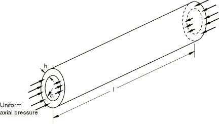
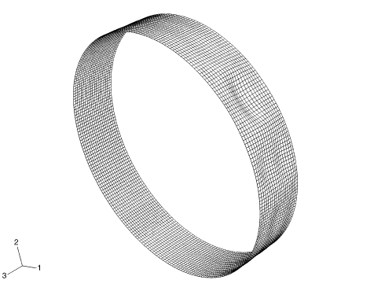
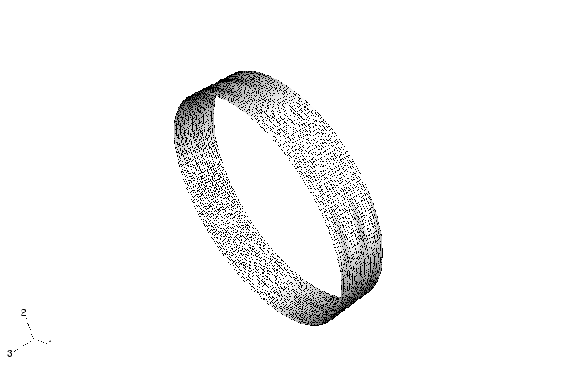
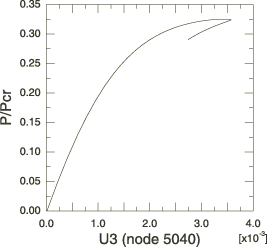

# 1.2.6 Buckling of an imperfection-sensitive cylindrical shell


**Product: **Abaqus/Standard  

This example serves as a guide to performing a postbuckling analysis using Abaqus for an imperfection-sensitive structure. A structure is imperfection sensitive if small changes in an imperfection change the buckling load significantly. Qualitatively, this behavior is characteristic of structures with closely spaced eigenvalues. For such structures the first eigenmode may not characterize the deformation that leads to the lowest buckling load. A cylindrical shell is chosen as an example of an imperfection-sensitive structure.

### Geometry and model

The cylinder being analyzed is depicted in [Figure 1.2.6--1](ch01s02aex31.md#sxmbuckshell-geom). The cylinder is simply supported at its ends and is loaded by a uniform, compressive axial load. A uniform internal pressure is also applied to the cylinder. The material in the cylinder is assumed to be linear elastic. The thickness of the cylinder is 1/500 of its radius, so the structure can be considered to be a thin shell.

The finite element mesh uses the fully integrated S4 shell element. This element is based on a finite membrane strain formulation and is chosen to avoid hourglassing. A full-length model is used to account for both symmetric and antisymmetric buckling modes. A fine mesh, based on the results of a refinement study of the linear eigenvalue problem, is used. The convergence of the mesh density is based on the relative change of the eigenvalues as the mesh is refined. The mesh must have several elements along each spatial deformation wave; therefore, the level of mesh refinement depends on the modes with the highest wave number in the circumferential and axial directions.

### Solution procedure

The solution strategy is based on introducing a geometric imperfection in the cylinder. In this study the imperfections are linear combinations of the eigenvectors of the linear buckling problem. If details of imperfections caused in a manufacturing process are known, it is normally more useful to use this information as the imperfection. However, in many instances only the maximum magnitude of an imperfection is known. In such cases assuming the imperfections are linear combinations of the eigenmodes is a reasonable way to estimate the imperfect geometry (Arbocz, 1987).

Determining the most critical imperfection shape that leads to the lowest collapse load of an axially compressed cylindrical shell is an open research issue. The procedure discussed in this example does not, therefore, claim to compute the lowest collapse load. Rather, this example discusses one approach that can be used to study the postbuckling response of an imperfection-sensitive structure.

The first stage in the simulation is a linear eigenvalue buckling analysis. To prevent rigid body motion, a single node is fixed in the axial direction. This constraint is in addition to the simply supported boundary conditions noted earlier and will not introduce an overconstraint into the problem since the axial load is equilibrated on opposing edges. The reaction force in the axial direction should be zero at this node.

The second stage involves introducing the imperfection into the structure using geometric imperfections. A single mode or a combination of modes is used to construct the imperfection. To compare the results obtained with different imperfections, the imperfection size must be fixed. The measure of the imperfection size used in this problem is the out-of-roundness of the cylinder, which is computed as the radial distance from the axis of the cylinder to the perturbed node minus the radius of the perfect structure. The scale factor associated with each eigenmode used to seed the imperfection is computed with a FORTRAN program. The program reads the results file produced by the linear analysis and determines the scale factors so that the out-of-roundness of the cylinder is equal to a specified value. This value is taken as a fraction of the cylinder thickness.

The final stage of the analysis simulates the postbuckling response of the cylinder for a given imperfection. The primary objective of the simulation is to determine the static buckling load. The modified Riks method is used to obtain a solution since the problem under consideration is unstable. The Riks method can also be used to trace the unstable and stable solution branches of a buckled structure. However, with imperfection-sensitive structures the first buckling mode is usually catastrophic, so further continuation of the analysis is usually not undertaken. When using a static Riks step, the tolerance used for the force residual convergence criteria may need to be tightened to ensure that the solution algorithm does not retrace its original loading path once the limit point is reached. Simply restricting the maximum arc length allowed in an increment is normally not sufficient.

### Parametric study

There are two factors that significantly alter the buckling behavior: the shape of the imperfection and the size of the imperfection. A convenient way to investigate the effects of these factors on the buckling response is to use the parametric study capabilities of Abaqus. A Python script file is used to perform the study. The script executes the linear analysis, runs the FORTRAN routine to create an input file with a specified imperfection size, and finally executes the postbuckling analysis.

Before executing the script, copy the FORTRAN routine [cylsh_maximp.f](../eif/cylsh_maximp.f) to your work directory using the Abaqus **fetch** command,

```
`abaqus fetch` `job`=`cylsh_maximp.f`
```
 and compile it using the Abaqus **make** command,
```
`abaqus make` `job`=`cylsh_maximp.f`
```

Parametrized template input data are used to generate variations of the parametric study. The script allows the analyst to vary the eigenmodes used to construct the imperfection, out-of-roundness measure, cylindrical shell geometry (radius, length, thickness), mesh density, material properties (Young's modulus and Poisson's ratio), etc. The results presented in the following section, however, are based on an analysis performed with a single set of parameters.

### Results and discussion

The results for both the linear eigenvalue buckling and postbuckling analyses are discussed below.

#### Linear eigenvalue buckling

The Lanczos eigensolver is used to extract the linear buckling modes. This solver is chosen because of its superior accuracy and convergence rate relative to wavefront solvers for problems with closely spaced eigenvalues. [Table 1.2.6--1](ch01s02aex31.md#table-eigenest) lists the first 19 eigenvalues of the cylindrical shell. The eigenvalues are closely spaced with a maximum percentage difference of 1.3%.

The geometry, loading, and material properties of the cylindrical shell analyzed in this example are characterized by their axisymmetry. As a consequence of this axisymmetry the eigenmodes associated with the linear buckling problem will be either (1) axisymmetric modes associated with a single eigenvalue, including the possibility of eigenmodes that are axially symmetric but are twisted about the symmetry axis or (2) nonaxisymmetric modes associated with repeated eigenvalues (Wohlever, 1999). The nonaxisymmetric modes are characterized by sinusoidal variations (n-fold symmetry) about the circumference of the cylinder. For most practical engineering problems and as illustrated in [Table 1.2.6--1](ch01s02aex31.md#table-eigenest), it is usually found that a majority of the buckling modes of the cylindrical shell are nonaxisymmetric.

The two orthogonal eigenmodes associated with each repeated eigenvalue span a two-dimensional space, and as a result any linear combination of these eigenmodes is also an eigenmode; i.e., there is no preferred direction. Therefore, while the shapes of the orthogonal eigenmodes extracted by the eigensolver will always be the same and span the same two-dimensional space, the phase of the modes is not fixed and might vary from one analysis to another. The lack of preferred directions has consequences with regard to any imperfection study based upon a linear combination of nonaxisymmetric eigenmodes from two or more distinct eigenvalues. As the relative phases of eigenmodes change, the shape of the resulting imperfection and, therefore, the postbuckling response, also changes. To avoid this situation, postprocessing is performed after the linear buckling analysis on each of the nonaxisymmetric eigenmode pairs to fix the phase of the eigenmodes before the imperfection studies are performed. The basic procedure involves calculating a scaling factor for each of the eigenvectors corresponding to a repeated eigenvalue so that their linear combination generates a maximum displacement of 1.0 along the global *X*-axis. This procedure is completely arbitrary but ensures that the postbuckling response calculations are repeatable.

For the sake of consistency the maximum radial displacement associated with a unique eigenmode is also scaled to 1.0. These factors are further scaled to satisfy the out-of-roundness criterion mentioned earlier.

#### Postbuckling response

The modes used to seed the imperfection are taken from the first 19 eigenmodes obtained in the linear eigenvalue buckling analysis. Different combinations are considered: all modes, unique eigenmodes, and pairs of repeated eigenmodes. An imperfection size (i.e., out-of-roundness) of 0.5 times the shell thickness is used in all cases. The results indicate that the cylinder buckles at a much lower load than the value predicted by the linear analysis (i.e., the value predicted using only the lowest eigenmode of the system). An imperfection based on mode 1 (a unique eigenmode) results in a buckling load of about 90% of the predicted value. When the imperfection was seeded with a combination of all modes (1–19), a buckling load of 33% of the predicted value was obtained. [Table 1.2.6--2](ch01s02aex31.md#table-sumloads) lists the buckling loads predicted by Abaqus (as a fraction of linear eigenvalue buckling load) when different modes are used to seed the imperfection.

The smallest predicted buckling load in this study occurs when using modes 12 and 13 to seed the imperfection, yet the results obtained when the imperfection is seeded using all 19 modes indicate that a larger buckling load can be sustained. One possible explanation for this is that the solution strategy used in this study (discussed earlier) involves using a fixed value for the out-of-roundness of the cylinder as a measure of the imperfection size. Thus, when multiple modes are used to seed the imperfection, the overall effect of any given mode is less than it would be if only that mode were used to seed the imperfection. The large number of closely spaced eigenvalues and innumerable combinations of eigenmodes clearly demonstrates the difficulty of determining the collapse load of structures such as the cylindrical shell. In practice, designing imperfection-sensitive structures against catastrophic failure usually requires a combination of numerical and experimental results as well as practical building experience.

The final deformed configuration shown in [Figure 1.2.6--2](ch01s02aex31.md#sxmcylshell-deformed) uses a displacement magnification factor of 5 and corresponds to using all the modes to seed the imperfection. Even though the cylinder appears to be very short, it can in fact be classified as a moderately long cylinder using the parameters presented in Chajes (1985). The cylinder exhibits thin wall wrinkling; the initial buckling shape can be characterized as dimples appearing on the side of the cylinder. The compression of the cylinder causes a radial expansion due to Poisson's effect; the radial constraint at the ends of the cylinder causes localized bending to occur at the ends. This would cause the shell to fold into an accordion shape. (Presumably this would be seen if self-contact was specified and the analysis was allowed to run further. This is not a trivial task, however, and modifications to the solution controls would probably be required. Such a simulation would be easier to perform with Abaqus/Explicit.) This deformed configuration is in accordance with the perturbed reference geometry, shown in [Figure 1.2.6--3](ch01s02aex31.md#sxmcylshell-undeformed). To visualize the imperfect geometry, an imperfection size of 5.0 times the shell thickness (i.e., 10 times the value actually used in the analysis) was used to generate the perturbed mesh shown in this figure. The deformed configuration in the postbuckling analysis depends on the shape of the imperfection introduced into the structure. Seeding the structure with different combinations of modes and imperfection sizes produces different deformed configurations and buckling loads. As the results vary with the size and shape of the imperfection introduced into the structure, there is no solution to which the results from Abaqus can be compared.

The load-displacement curve for the case when the first 19 modes are used to seed the imperfection is shown in [Figure 1.2.6--4](ch01s02aex31.md#sxmcylshell-loaddisp). The figure shows the variation of the applied load (normalized with respect to the linear eigenvalue buckling load) versus the axial displacement of an end node. The peak load that the cylinder can sustain is clearly visible.

### Input files

[cylsh_buck.inp](../eif/cylsh_buck.inp)

Linear eigenvalue buckling problem.

[cylsh_postbuck.inp](../eif/cylsh_postbuck.inp)

Postbuckling problem.

[cylsh_maximp.f](../eif/cylsh_maximp.f)

FORTRAN program to compute the scaling factors for the imperfection size.

[cylsh_script.psf](../eif/cylsh_script.psf)

Python script to generate the parametrized input files.

### References

Arbocz,  J., “Post-Buckling Behaviour of Structures: Numerical Techniques for More Complicated Structures,” in *Lecture Notes in Physics*, Ed. H. Araki et al., Springer-Verlag, Berlin, 1987, pp. 84–142.

Chajes, A., “Stability and Collapse Analysis of Axially Compressed Cylindrical Shells,” in *Shell Structures: Stability and Strength*, Ed. R. Narayanan, Elsevier, New York, 1985, pp. 1–17.

Wohlever, J. C., “Some Computational Aspects of a Group Theoretic Finite Element Approach to the Buckling and Postbuckling Analyses of Plates and Shells-of-Revolution,” in *Computer Methods in Applied Mechanics and Engineering*, vol. 170, pp. 373–406, 1999.

### Tables

**Table 1.2.6–1** Eigenvalue estimates for the first 19 modes.
| Mode number | Eigenvalue |
| --- | --- |
| 1 | 11723 |
| 2, 3 | 11724 |
| 4, 5 | 11728 |
| 6, 7 | 11734 |
| 8, 9 | 11744 |
| 10, 11 | 11757 |
| 12, 13 | 11775 |
| 14, 15 | 11798 |
| 16, 17 | 11827 |
| 18, 19 | 11864 |

**Table 1.2.6–2** Summary of predicted buckling loads.
| Mode used to seed the imperfection | Normalized buckling load |
| --- | --- |
| 1 | 0.902 |
| 2, 3 | 0.625 |
| 4, 5 | 0.480 |
| 6, 7 | 0.355 |
| 8, 9 | 0.351 |
| 10, 11 | 0.340 |
| 12, 13 | 0.306 |
| 14, 15 | 0.323 |
| 16, 17 | 0.411 |
| 18, 19 | 0.422 |
| All modes (1--19) | 0.325 |

### Figures

**Figure 1.2.6–1** Cylindrical shell with uniform axial loading.



**Figure 1.2.6–2** Final deformed configuration of the cylindrical shell (first 19 eigenmodes used to seed the imperfection; displacement magnification factor of 5.0; normalized end load = 0.29).



**Figure 1.2.6–3** Perturbed geometry of the cylindrical shell (imperfection factor = 5  thickness for illustration only; actual imperfection factor used = .5  thickness).



**Figure 1.2.6–4** Normalized applied load versus axial displacement at node 5040 (first 19 modes used to seed the imperfection).




