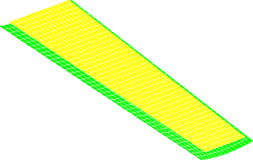
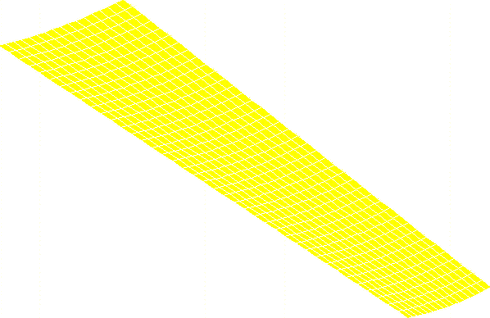
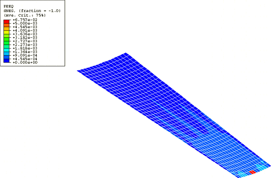
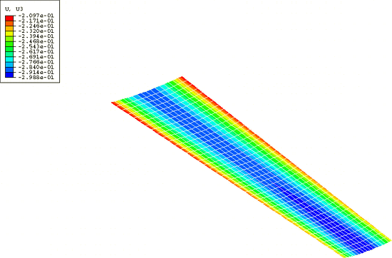

# 1.3.17 Unstable static problem: thermal forming of a metal sheet

**Product: **Abaqus/Standard  

This example demonstrates the use of automatic contact stabilization to avoid unstable static problems. Geometrically nonlinear static problems can become unstable for a variety of reasons. Instability may occur in contact problems, either because of chattering or because contact intended to prevent rigid body motions is not established initially. Localized instabilities can also occur; they can be either geometrical, such as local buckling, or material, such as material softening.

This problem models the thermal forming of a metal sheet; the shape of the die may make it difficult to place the undeformed sheet exactly in initial contact, in which case the initial rigid body motion prevention algorithm is useful. Metal forming problems are characterized by relatively simply shaped parts being deformed by relatively complex-shaped dies. The initial placement of the workpiece on a die or the initial placement of a second die may not be a trivial geometrical exercise for an engineer modeling the forming process. Abaqus accepts initial penetrations in contact pairs and instantaneously tries to resolve them; as long as the geometry allows for this to happen without excessive deformation, the misplacement of the workpiece usually does not cause problems. On the other hand, if the workpiece is initially placed away from the dies, serious convergence problems may arise. Unless there are enough boundary conditions applied or a stabilization method is used, singular finite element systems of equations result because one or more of the bodies has free rigid body motions. This typically arises when the deformation is applied through loads instead of boundary conditions. Contact stabilization can be helpful for avoiding convergence problems while contact is established without significantly influencing the results of interest (see ["Automatic stabilization of rigid body motions in contact problems" in "Adjusting contact controls in Abaqus/Standard," Section 36.3.6 of the Abaqus Analysis User's Guide](../usb/usb-link.md#usb-cni-acontacttrouble-stabilize)).

This example looks at the thermal forming of an aluminum sheet. The deformation is produced by applying pressure and gravity loads to push the sheet against a sculptured die. The deformation is initially elastic. Through heating, the yield stress of the material is lowered until permanent plastic deformations are produced. Subsequently, the assembly is cooled and the pressure loads are removed, leaving a formed part with some springback. Although the sheet is initially flat, the geometrical nature of the die makes it difficult to determine the exact location of the sheet when it is placed on the die. Therefore, an initial gap between the two bodies is modeled, as shown in [Figure 1.3.17--1](ch01s03aex48.md#sxmstable-thermmesh). 

### Geometry and model

The model consists of a trapezoidal sheet 10.0 m (394.0 in) long, tapering from 2.0 m (78.75 in) to 3.0 m (118.0 in) wide, and 10.0 mm (0.4 in) thick. The die is a ruled surface controlled by two circles of radii 13.0 m (517.0 in) and 6.0 m (242.0 in) and dimensions slightly larger than the sheet. The sheet is initially placed over 0.2 m (7.9 in) apart from the die. The sheet has a longitudinal symmetry boundary condition, and one node prevents the remaining nodes from experiencing in-plane rigid body motion. The die is fixed throughout the analysis. The sheet mesh consists of 640 S4R shell elements, while the die is represented by 640 R3D4 rigid elements. The material is an aluminum alloy with a flow stress of 1.0  108 Pa (14.5 ksi) at room temperature. A flow stress of 1.0  103 Pa (0.15 psi) at 400C is also provided, essentially declaring that at the higher temperature the material will flow plastically at any stress. A Coulomb friction coefficient of 0.1 is used to model the interaction between the sheet and die.

### Results and discussion

The analysis consists of three steps. In the first step a gravity load and a pressure load of 1.0  105 Pa (14.5 psi) are applied, both pushing the sheet against the die. This step is aided by contact stabilization to prevent unrestrained motion of the sheet prior to establishing contact with the die. In this case, contact stabilization normal to the nearby contact surfaces provides adequate stabilization. Avoiding tangential contact stabilization is recommended, if possible, because tangential contact stabilization is more likely to influence solution variables. The clearance distance range over which the contact stabilization is effective has been specified in this example such that contact stabilization is active for the initial separation distance between the sheet and die. Abaqus ramps down the contact stabilization such that no contact stabilization remains at the end of the first step. This guarantees that the viscous forces decrease to zero, thus avoiding any discontinuity in the forces at the start of the next step. The shape and relatively low curvatures of the die are such that the deformation at the end of the step is elastic ([Figure 1.3.17--2](ch01s03aex48.md#sxmstable-thermpress)). In the second step a two-hour heating (from room temperature to 360C) and cooling (back to 50C) cycle is applied to the loaded assembly. As a result of the decrease in flow stress permanent (plastic) deformation develops, as shown in [Figure 1.3.17--3](ch01s03aex48.md#sxmstable-thermdeform). Finally, in the third step the pressure load is removed and the springback of the deformed sheet is calculated, as depicted in [Figure 1.3.17--4](ch01s03aex48.md#sxmstable-thermsprngbk).

### Acknowledgements

SIMULIA would like to thank British Aerospace Airbus, Ltd. for providing the basic data from which this example was derived.

### Input files

[unstablestatic_forming.inp](../eif/unstablestatic_forming.inp)

Thermal forming model.

[unstablestatic_forming_surf.inp](../eif/unstablestatic_forming_surf.inp)

Thermal forming model with surface-to-surface contact.

### Figures

**Figure 1.3.17–1** Initial placement of the sheet apart from the die.

**Figure 1.3.17–2** Elastic deformation after gravity and pressure loading.

**Figure 1.3.17–3** Permanent deformation produced by heating.

**Figure 1.3.17–4** Springback.

