# 1.3.18 Inertia welding simulation using Abaqus/Standard and Abaqus/CAE


**Products: **Abaqus/Standard  Abaqus/CAE  

### Objectives

This example demonstrates the following Abaqus features:
- thermal-mechanical coupling for inertia welding simulation,
- semi-automatic remeshing using Python scripting and output database scripting methods for extracting deformed configurations,
- defining a complex friction law in a user subroutine,
- flywheel loading through user subroutine definitions, and
- combining and presenting results from a sequence of output database (`.odb`) files.

### Application description

This example examines the inertia friction welding process of the pipes shown in [Figure 1.3.18--1](ch01s03aex49.md#inertiaweld-configuration). The specific arrangement considered is the resulting as-welded configuration shown in [Figure 1.3.18--2](ch01s03aex49.md#inertiaweld-3d). In this weld process kinetic energy is converted rapidly to thermal energy at a frictional interface. The resulting rapid rise in interface temperature is exploited to produce high-quality welds. In this example the weld process is simulated, and the initial temperature rise and material plastic flow are observed. An important factor in the process design is control of the initial speed of the flywheel so that, when the flywheel stops, the temperature rises to just below the melting point, which in turn results in significant flow of material in the region of the weld joint. Understanding the friction, material properties, and heat transfer environment are important design aspects in an effective inertia welding process; therefore, simulation is a helpful tool in the process design.

### Geometry

The weld process in this example is shown in [Figure 1.3.18--1](ch01s03aex49.md#inertiaweld-configuration), where two pipes are positioned for girth-weld joining. The two pipes are identical, each with a length of 21.0 mm, an inside radius of 42.0 mm, and an outside radius of 48.0 mm. The pipes are adjacent, touching each other initially at the intended weld interface.

### Materials

The pipes are made of Astroloy, a high-strength alloy used in gas turbine components. [Figure 1.3.18--3](ch01s03aex49.md#stress-curves) shows flow stress curves as a function of temperature and plastic strain rate. At temperatures relevant to the welding process, the material is highly sensitive to plastic strain rate and temperature. Specific heat is a function of temperature, as shown in [Figure 1.3.18--4](ch01s03aex49.md#specific-heat).

Other material properties are defined as follows:

| Young's modulus: | 180,000 MPa |
| --- | --- |
| Poisson's ratio: | 0.3 |
| Density: | 7.8 109 Mg/mm3 |
| Conductivity: | 14.7 W/m/C at 20C |
| 28 W/m/C at 1200C |

### Initial conditions

The pipes are initially set at 20C, representing room temperature. 

### Boundary conditions and loading

A pressure of 360 MPa is applied to the top surface of the upper pipe. The initial rotational velocity of the flywheel is set at 48.17 rad/s, or 7.7 revolutions per second. The mass moment of inertia of the flywheel is 102,000 Mg mm2. 

### Interactions

The principal interaction occurs at the weld interface between the pipes; however, a secondary concern is the possibility of contact of weld flash with the side of the pipes. The weld-interface friction behavior is assumed to follow that described by Moal and Massoni (1995), where the ratio of shear stress to the prescribed pressure is observed to be a complex function of interface slip rate. The heat generation from the frictional sliding, combined with plastic deformation, contributes to the temperature rise in the pipes.

### Abaqus modeling approaches and simulation techniques

Abaqus/CAE and Abaqus/Standard are used together to affect the weld simulation in a way that permits extreme deformation of the pipes in the weld region. This process is automated through the use of Python scripts. Three cases are studied in this example.

### Summary of analysis cases

| Case 1 | Initial flywheel velocity = 48.17 rad/s. This case produces a successful weld. |
| --- | --- |
| Case 2 | Initial flywheel velocity = 20.0 rad/s. This case illustrates an unsuccessful weld scenario; the flywheel has insufficient energy to begin the weld process. |
| Case 3 | Initial flywheel velocity = 70.0 rad/s. This case illustrates an unsuccessful weld scenario; the flywheel has excessive energy, resulting in a temperature rise into the liquidus regime of the pipe material. |

The following sections discuss analysis considerations that are applicable to all the cases. Python scripts that generate the model databases and Abaqus/Standard input files are provided for Case 1, with instructions in the scripts for executing the Case 2 and Case 3 simulations.

### Analysis types

The analysis is nonlinear, quasi-static with thermal-mechanical coupling. A fully coupled temperature-displacement procedure is used.

### Analysis techniques

The key feature required for successful simulation of this process is remeshing. In this example, because of the large deformation near the weld region, multiple analyses are employed to limit element distortion. These analyses are executed in sequence, with remeshing performed between executions, and are automated through the use of Python scripts. 

At each remesh point the current model configuration represents a significant change in the pipes' shape and in the current analysis mesh. Abaqus/CAE is used to extract the outer surface of the pipes, reseed the surface, and remesh the pipe regions. This process employs the Abaqus Scripting Interface [`PartFromOdb`](../ker/ker-link.md#ker-part-partfromodb-pyc) command, which is used to extract orphan mesh parts representing the deformed pipes. These parts are then passed to the [`Part2DGeomFrom2DMesh`](../ker/ker-link.md#ker-part-part2dgeomfrom2dmesh-pyc) command. This command creates a geometric Part object from the orphan mesh imported earlier. Once the profile of the deformed part has been created, options in the Mesh module are used to remesh the part. The new mesh results in a new Abaqus/Standard analysis, and the map solution procedure maps state variables from the previous analysis (see ["Mesh-to-mesh solution mapping," Section 12.4.1 of the Abaqus Analysis User's Guide](../usb/usb-link.md#usb-anl-amapsolution)).

### Mesh design

The pipes are modeled as axisymmetric. The element formulation used is the fully coupled temperature-displacement axisymmetric elements with twist degrees of freedom (element types CGAX4HT and CGAX3HT), where the twist degree of freedom enables modeling of rotation and shear deformation in the out-of-plane direction. The hybrid formulation is required to handle the incompressible nature of the material during the plastic flow. The mesh is divided into two regions for each pipe. In the region near the weld interface, smaller elements are created (see [Figure 1.3.18--5](ch01s03aex49.md#initial-mesh)). During the remeshing process, the region near the weld surface is recalculated so that the new flash region is also meshed with smaller elements (see [Figure 1.3.18--6](ch01s03aex49.md#remesh-design)).

### Material model

The material model defined for this example approximates the high-temperature behavior of Astroloy, where it is reported by Soucail et al. (1992) using a Norton-Hoff constitutive law to describe the temperature and strain-rate viscoplastic behavior. A similar model is defined in Abaqus as a rate-dependent perfectly plastic material model. For the loading in this model, these material parameters result in the onset of local plastic flow only after the interface temperature has exceeded roughly 1200C, near the material solidus temperature of 1250C. Above this temperature the Mises flow stress is highly sensitive to variations in temperature and strain rate. A special adjustment in the flow stress at high strain rates is necessary to avoid divergence during the iteration procedure of the nonlinear solution. In the material model definition an extreme case of stress data is defined when the strain rate is 1.0  106 s1. Stress data when the strain rate equals zero are also defined to be the same as the stress data at strain rate 1.0  105 s1. As a result of large deformation, thermal expansion is not considered in the material model. 

It is assumed that 90% of the inelastic deformation energy contributes to the internal heat generation, which is the Abaqus default for inelastic heat fraction.

### Initial conditions

An initial temperature of 20C is specified for the entire model. The flywheel initial velocity is specified as a solution-dependent variable initial condition for the user element (see `[inertiaweld_sub.f](../eif/inertiaweld_sub.f)`).

### Boundary conditions

The bottom pipe is fixed completely. The top pipe is free of boundary conditions.

### Loads

A pressure of 360 MPa is applied as a distributed load on the top surface of the upper pipe.

The heat flux resulting from frictional heat generation is considered to be many times greater than any heat lost due to convection. Thus, all boundaries are assumed to be adiabatic.

### Interactions

Five interactions are defined: four contact interactions and one actuator-sensor interaction.

The contact interactions include a pair of interactions that define the weld interface between the pipes, which is identified in [Figure 1.3.18--1](ch01s03aex49.md#inertiaweld-configuration). This pair of interactions is symmetrical: one interaction defines the top pipe as the master surface with the bottom pipe as the slave surface, and the second interaction reverses the master-slave pairing. This “balanced master-slave” arrangement is important for the analysis to obtain more uniform contact pressure in the weld interface and to avoid hourglass effects, and it is combined with a softened contact interaction property to promote a sharing of the local contact pressure among nodes on both sides of the interface.

To simulate the Moal and Massoni (1995) friction definition, the weld interface friction model is defined in user subroutine [`FRIC`](../sub/sub-link.md#sub-xsl-fric) (see `[inertiaweld_sub.f](../eif/inertiaweld_sub.f)`). This model is nonlocal in the sense that the interface pressure for all contact nodes is the applied pressure of 360 MPa, and the sliding velocity is computed based on the rotational angular velocity of the flywheel. This treatment of the friction force helps stabilize the solution. Frictional heat generation is calculated based on the frictional traction and the sliding velocity. Nondefault contact controls definitions are used to improve convergence. These definitions include delaying the friction computation upon contact and automatic tolerance control to avoid contact chattering.

The two remaining contact interactions address the possibility of self-contact near the weld area in the pipes. Self-contact in the flash area can cause problems during remeshing: the [`Part2DGeomFrom2DMesh`](../ker/ker-link.md#ker-part-part2dgeomfrom2dmesh-pyc) command that was used to generate the new, current configuration geometry performs curve-fit operations that can result in self intersections of the boundary, which lead to invalid part topology and a meshing failure. To avoid this problem, a softened contact model that introduces a normal pressure with a small separation distance (0.01 mm) is used. It is important to keep this separation distance as small as practical to avoid causing any nonphysical contact behavior.

The actuator-sensor interaction, which acts through user subroutine [`UEL`](../sub/sub-link.md#sub-xsl-uel), enables the simulation of a flywheel attached to the top pipe. The user element also has a sensor role in the analysis, measuring the weld upset, or axial shortening, of the weld assembly. When a critical user-defined upset distance is exceeded, the user element subroutine calls `XIT` to terminate the analysis and signal a remesh point. This parameter, the allowed “upset distance,” correlates well with the extent of mesh deformation in the weld region.

### Analysis steps

Each of the analyses run in the simulation sequence uses a single fully coupled temperature-displacement step. Since the duration of the step is controlled by the user element, as described above, it is not known a priori for each analysis. Therefore, the step duration is set in each analysis to be the total remaining time for the simulation, a time that is reached only in the final analysis in the simulation sequence.

### Solution controls

Full Newton iteration is used for the nonlinear solution. Automatic time stepping is based on the maximum temperature change in each increment. Results from the previous increment are used as the initial guess in the current increment, with the parabolic extrapolation technique adopted to transfer the previous state to the current state.

Heat fluxes due to frictional heat generation can cause contact chattering. To overcome this difficulty, contact controls with the automatic tolerances parameter are used.

### Output requests

Field output of temperature, stress, and equivalent plastic strain is requested. Various energy measures are requested for history output, allowing you to record the flywheel energy change during the simulation.

### Convergence

In general, convergence is difficult in the initial increments, especially after remeshing. More iterations are also observed near the end of the analysis-run sequence when deformation increases and the mesh distortion becomes severe.

### Run procedure

This example is run using the Abaqus/CAE Python scripts provided. Use the following command to run the example:

```
abaqus cae –script inertiaweld.py
```
The simulation results in a sequence of separate output database (.`odb`) files, each corresponding to one of the analyses. 

For postprocessing convenience a number of scripts are provided for evaluating simulation results across the sequence of files. Use the following command to create the `inertia_weld_animation.avi` animation file:

```
abaqus cae –script inertiaweld_movie.py
```

Run the following Python scripts to create *X–Y* plots:
- `[inertiaweld_xy.py](../eif/inertiaweld_xy.py)`, for a history plot of energy results.
- `[inertiaweld_upset.py](../eif/inertiaweld_upset.py)`, for a history plot of assembly upset.
- `[inertiaweld_maxtemp.py](../eif/inertiaweld_maxtemp.py)`, for a history plot of the maximum temperature.

### Discussion of results and comparison of cases

This example focuses mainly on the successful weld case, Case 1. Case 2 and Case 3 are provided to show the precarious nature of the inertia weld process, where it is essential to select the flywheel size correctly, measured by the mass moment of inertia, and the initial velocity of the flywheel. Case 2 and Case 3 illustrate why simulation is a valuable tool in the weld process design as each case clearly shows that the selected process parameters do not result in a successful weld.

#### Welding success: Case 1

The example simulation creates multiple output database (`.odb`) files, requiring 22 remeshings to reach the simulation time of 5.0 seconds. The results in the first analysis before the first remeshing show that the temperature rises very fast near the weld interface. At about 1.6 seconds the temperature reaches 1172C and the material starts to flow, squeezing out to form flash (see [Figure 1.3.18--7](ch01s03aex49.md#t-178)). After 2.31 seconds and 5 remeshings the flash extends enough to fold back and contact the pipe (see [Figure 1.3.18--8](ch01s03aex49.md#t-231)). At 3.51 seconds the flywheel velocity slows down to 3.51 rad/s, the temperature starts to drop, and the material flow slows down. At this point a considerable amount of flash build-up can be observed (see [Figure 1.3.18--9](ch01s03aex49.md#t-351)). After 5.0 seconds the flywheel stops, the temperature drops below 1000C, and the pipes are welded (see [Figure 1.3.18--10](ch01s03aex49.md#t-50)).

The flash prediction in [Figure 1.3.18--11](ch01s03aex49.md#abq-flash-result) is in good agreement with those shown by Moal and Massoni (1995). [Figure 1.3.18--12](ch01s03aex49.md#energy) plots the kinetic energy history (created with `[inertiaweld_xy.py](../eif/inertiaweld_xy.py)`) and shows how the flywheel slows down and stops. The “RemeshPoints” marks indicate the time at which the remeshing procedure occurred. The upset distance during the welding process is shown in [Figure 1.3.18--13](ch01s03aex49.md#upset) (created with `[inertiaweld_upset.py](../eif/inertiaweld_upset.py)`). The curve of the maximum temperature for Case 1 is plotted in [Figure 1.3.18--14](ch01s03aex49.md#maxtemp) (created with `[inertiaweld_maxtemp.py](../eif/inertiaweld_maxtemp.py)`).

#### Insufficient flywheel energy: Case 2

If a lower initial flywheel velocity is selected, the temperature may not reach a level high enough for the material to flow. For this case the initial velocity is reduced to 20 rad/s. [Figure 1.3.18--15](ch01s03aex49.md#case2) shows the configuration at 5.0 seconds, where not much deformation is observed and the temperature near the interface is about 250C. The history plot of the maximum temperature for Case 2 in [Figure 1.3.18--14](ch01s03aex49.md#maxtemp) shows the pipe temperature reaches only 700C about 1.1 seconds before it cools down. In this case the material is not hot enough to initiate the material flow, and welding will not be successful.

#### Excessive flywheel energy: Case 3

If a higher initial velocity of the flywheel is selected, the material becomes so hot that it starts to melt. For this case the initial velocity of the flywheel is set at 70 rad/s. [Figure 1.3.18--16](ch01s03aex49.md#case3) shows that the temperature rapidly reaches 1360C (at about 0.9 seconds), which is well beyond the melting temperature at 1250C, before convergence failures stop the analysis. [Figure 1.3.18--14](ch01s03aex49.md#maxtemp) shows the history plot of the maximum temperature in the pipes for Case 3. In this case the excessive energy results in melting and a failed weld. 

### Python scripts

[inertiaweld.py](../eif/inertiaweld.py)

Main Python script to control model building, remeshing, and the analyses.

[inertiaweld_solver_param.py](../eif/inertiaweld_solver_param.py)

Script to initialize base options for an Abaqus/Standard analysis.

[inertiaweld_utils.py](../eif/inertiaweld_utils.py)

Script to define utility functions, such as applying seeds and replacing the part after deformation.

[inertiaweld_original_build.py](../eif/inertiaweld_original_build.py)

Script to create the initial model.

[inertiaweld_job_param.py](../eif/inertiaweld_job_param.py)

Script to provide control parameters and input data, such as mesh size and simulation time.

[inertiaweld_remesh_build.py](../eif/inertiaweld_remesh_build.py)

Script to create a remeshed model and provide input files for restart.

[inertiaweld_movie.py](../eif/inertiaweld_movie.py)

Script to create an animation of this welding simulation.

[inertiaweld_xy.py](../eif/inertiaweld_xy.py)

Script to create an *X–Y* plot of flywheel kinetic energy history.

[inertiaweld_upset.py](../eif/inertiaweld_upset.py)

Script to create an *X–Y* plot of the upset history.

[inertiaweld_maxtemp.py](../eif/inertiaweld_maxtemp.py)

Script to create an *X–Y* plot of the maximum temperature history during the welding process.

### Input files

[inertiaweld_sub.f](../eif/inertiaweld_sub.f)

FORTRAN file containing user subroutines [`UEL`](../sub/sub-link.md#sub-xsl-uel) and [`FRIC`](../sub/sub-link.md#sub-xsl-fric).

### References

**Abaqus Analysis User's Guide**
- ["Mesh-to-mesh solution mapping," Section 12.4.1 of the Abaqus Analysis User's Guide](../usb/usb-link.md#usb-anl-amapsolution)

**Abaqus Keywords Reference Guide**
- [*MAP SOLUTION](../key/key-link.md#usb-kws-mmapsolution)

**Abaqus User Subroutines Reference Guide**
- ["FRIC," Section 1.1.8 of the Abaqus User Subroutines Reference Guide](../sub/sub-link.md#sub-rtn-ufric)
- ["UEL," Section 1.1.28 of the Abaqus User Subroutines Reference Guide](../sub/sub-link.md#sub-rtn-uuel)
- ["Terminating an analysis," Section 2.1.15 of the Abaqus User Subroutines Reference Guide](../sub/sub-link.md#sub-utl-uxit)

**Abaqus Scripting Reference Guide**
- ["PartFromOdb," Section 37.1.11 of the Abaqus Scripting Reference Guide](../ker/ker-link.md#ker-part-partfromodb-pyc)
- ["Part2DGeomFrom2DMesh," Section 37.1.14 of the Abaqus Scripting Reference Guide](../ker/ker-link.md#ker-part-part2dgeomfrom2dmesh-pyc)

**Other**

- Moal, A., and E. Massoni, "Finite Element Simulation of the Inertia Welding of Two Similar Parts," Engineering Computations, vol. 12, pp. 497--512, 1995.
- Soucail, M., A. Moal, L. Naze, E. Massoni, C. Levaillant, and Y. Bienvenu, "Microstructural Study and Numerical Simulation of Inertia Friction Welding of Astroloy," 7th International Symposium on Superalloys, Seven Springs, USA, 1992.

### Figures

**Figure 1.3.18–1** Inertia weld configuration for two pipes.

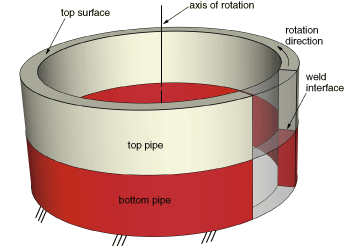

**Figure 1.3.18–2** Half-section view of the inertia welding final as-welded configuration showing the temperature fields at 5 seconds after welding begins.

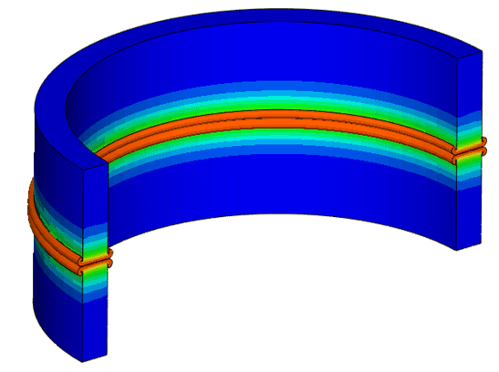

**Figure 1.3.18–3** Flow stress curves.

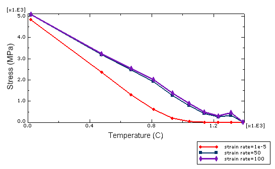

**Figure 1.3.18–4** Specific heat curve (N mm/kg/C).

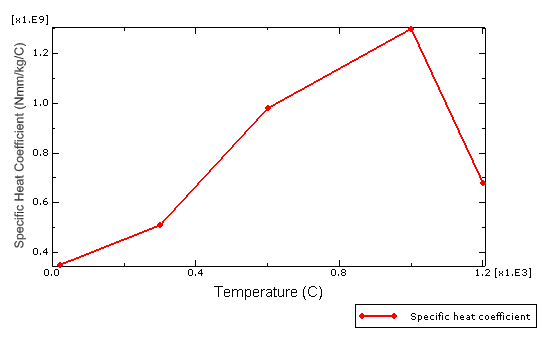

**Figure 1.3.18–5** Initial mesh.

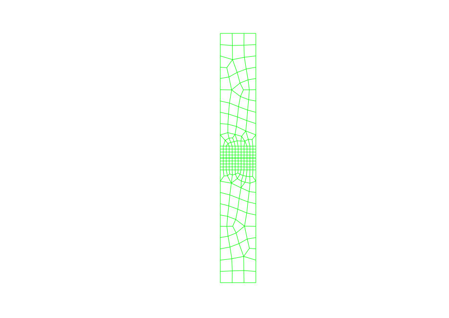

**Figure 1.3.18–6** Typical mesh design on a deformed configuration pair of parts.

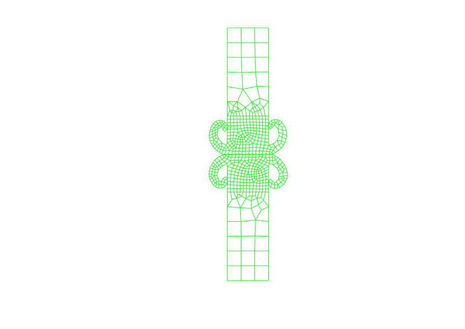

**Figure 1.3.18–7** Temperature at 1.78 sec.

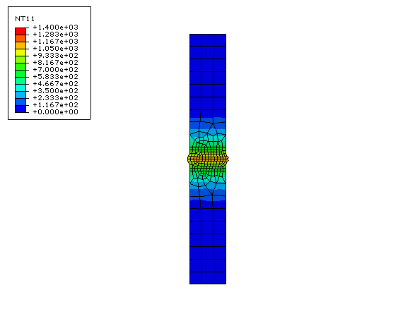

**Figure 1.3.18–8** Temperature at 2.31 sec.

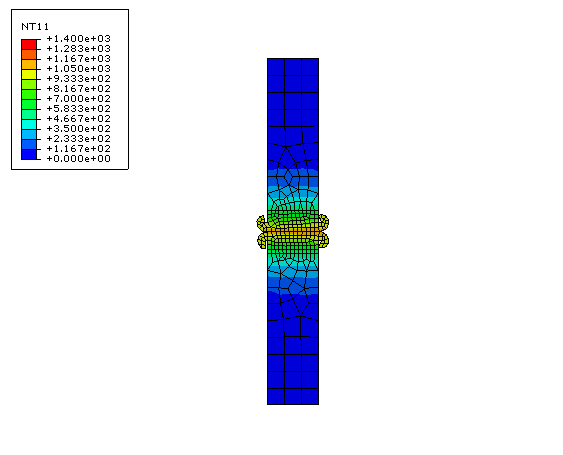

**Figure 1.3.18–9** Temperature at 3.51 sec.

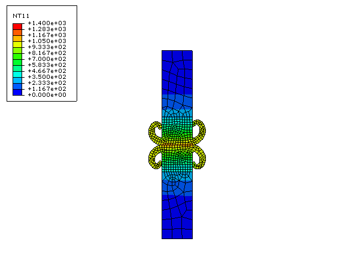

**Figure 1.3.18–10** Temperature at 5.0 sec.


**Figure 1.3.18–11** Flash prediction in current analysis.

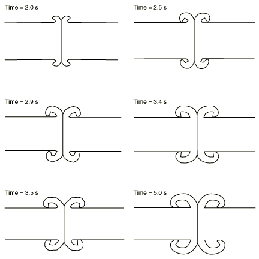

**Figure 1.3.18–12** Kinetic energy history showing the flywheel slowdown.

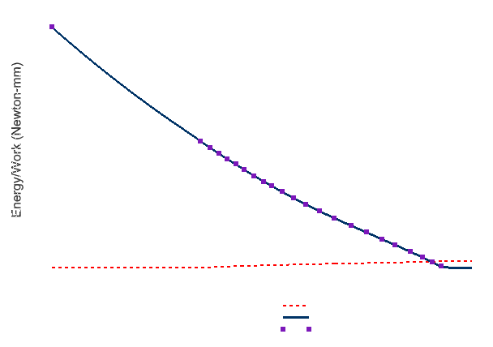

**Figure 1.3.18–13** Assembly upset (shortening) history.

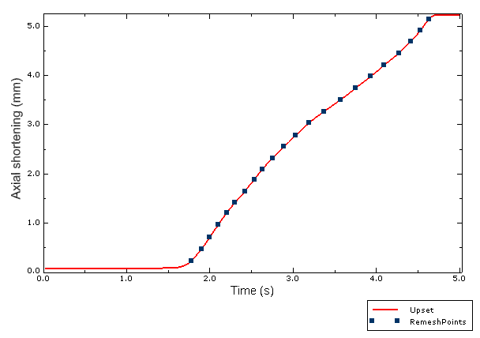

**Figure 1.3.18–14** Maximum temperature history comparisons of the three cases. Case 1: Successful weld; Case 2: Failed weld with insufficient flywheel energy; Case 3: Failed weld with excessive flywheel energy.

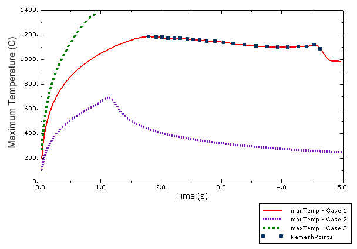

**Figure 1.3.18–15** Temperature distribution at 5.0 sec for Case 2 (insufficient flywheel energy for welding).

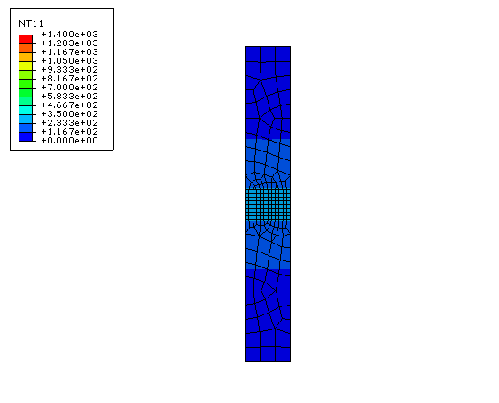

**Figure 1.3.18–16** Temperature distribution at 0.9 sec for Case 3 (excessive initial flywheel energy results in a rapid temperature rise into the melting regime).

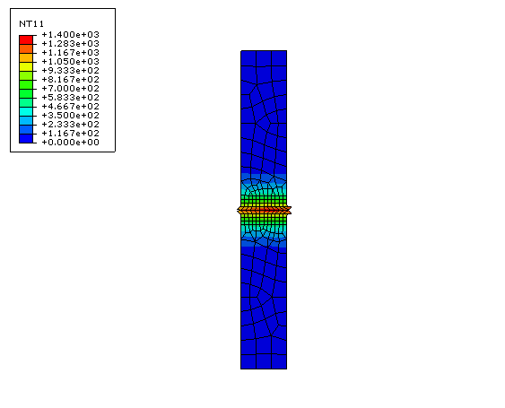


