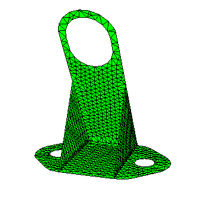
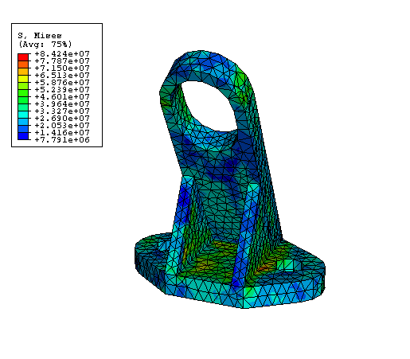

# 1.3.19 Moldflow translation examples


**Product: **Abaqus/Standard  

### Objectives

This example demonstrates the following features of the **abaqus moldflow** translator:
- transforming finite element model information from a Moldflow analysis into a partial Abaqus input file,
- adding appropriate data for the analysis,
- performing natural frequency analyses, and
- calculating deformation due to initial stresses.

### Application description

The results of a Moldflow simulation, which models the plastics injection mold-filling process, include calculations of material properties and residual stresses in the plastic part. Two types of parts, a filled bracket and an unfilled bracket, are studied in this example to illustrate how you can transform finite element model information from a Moldflow simulation into a partial Abaqus input file, adding boundary conditions and step data, and requesting output.

### Abaqus modeling approaches and simulation techniques

This example illustrates the use of the **abaqus moldflow** translator.

### Summary of analysis cases

| Case 1 | Natural frequency analysis of a fiber-filled bracket. |
| --- | --- |
| Case 2 | Natural frequency analysis of an unfilled bracket. |
| Case 3 | Deformation due to initial stresses in a three-dimensional filled bracket. |

### Run procedure

The three cases share the same general approach. The following procedure summarizes the typical usage of the **abaqus moldflow** translator:

1. Export the data from Moldflow simulation as follows: - For a midplane Moldflow simulation, export the finite element mesh data to a file named `*job-name*.pat` and the results data (material properties and residual stresses) to a file named `*job-name*.osp`. - For a three-dimensional solid Moldflow simulation using Moldflow Version MPI 6, run the Visual Basic script `mpi2abq.vbs` to export the finite element mesh data to a file named `*job-name*_mesh.inp` and the results data to `.xml` files.
2. Run the **abaqus moldflow** translator to create a partial Abaqus input (`.inp`) file from the Moldflow interface files.
3. Edit the Abaqus input file to add appropriate data for the analysis (for example, add boundary conditions and step data).
4. Submit the Abaqus input file for analysis.

#### Extracting the files

All files associated with these analyses are included with the Abaqus release; you can use the Abaqus **fetch** utility to extract example problem files from the compressed archive files.

To extract all the relevant files for a particular example problem, enter the following commands:

| Case 1 | `abaqus fetch job=moldflow_ex1*` |
| --- | --- |
| Case 2 | `abaqus fetch job=moldflow_ex2*` |
| Case 3 | `abaqus fetch job=bracket3d_mpi6*` |

For information on using wildcard expressions with the Abaqus **fetch** utility, see ["Fetching sample input files," Section 3.2.16 of the Abaqus Analysis User's Guide](../usb/usb-link.md#usb-int-dfetchproc).

### Case 1: Natural frequency analysis of a fiber-filled bracket

The bracket in Case 1 consists of 926 nodes and 1719 S3R elements. The model contains seven different element sets. Each element set has a different thickness and is modeled as a laminated composite with 20 layers. 

Ten unrestrained vibration modes are computed. The first six frequencies are approximately zero. The frequencies for the first four flexible modes are listed in [Table 1.3.19--1](ch01s03aex50.md#mfl-filledtable).

The Abaqus finite element model is shown in [Figure 1.3.19--1](ch01s03aex50.md#mfl-bracket). 

### Case 2: Natural frequency analysis of an unfilled bracket

Case 2 uses the same Abaqus finite element model as Case 1, but the material properties are transversely isotropic. The shell section definition is homogeneous instead of composite. Twenty-one equally spaced Simpson integration points are used through the shell thickness.

The frequencies for the first four flexible vibration modes of the unfilled bracket are listed in [Table 1.3.19--2](ch01s03aex50.md#mfl-unfilledtable). The unfilled material in this example is softer than the filled material in Case 1; consequently, the frequencies are lower.

### Case 3: Deformation due to initial stresses in a three-dimensional filled bracket

Case 3 uses a solid Abaqus finite element model that is similar to the model used in Case 1.

To execute the **abaqus moldflow** translator, enter the following command:

```
abaqus moldflow job=bracket3d_mpi6 3D initial_stress=on
```

A contour plot of initial stresses is shown in [Figure 1.3.19--2](ch01s03aex50.md#mfl-bracket3d-stress2). 

### Input files

##### **Case 1**

[moldflow_ex1.inp](../eif/moldflow_ex1.inp)

Input file to analyze a fiber-filled bracket.

##### **Case 2**

[moldflow_ex2.inp](../eif/moldflow_ex2.inp)

Input file to analyze an unfilled bracket.

### Reference

**Abaqus Analysis User's Guide**
- ["Translating Moldflow data to Abaqus input files," Section 3.2.37 of the Abaqus Analysis User's Guide](../usb/usb-link.md#usb-int-dmflabaproc)

### Tables

**Table 1.3.19–1** Frequencies for the first four flexible modes for the fiber-filled bracket.
| Mode | Frequency, Hz |
| --- | --- |
| 7 | 334 |
| 8 | 430 |
| 9 | 740 |
| 10 | 752 |

**Table 1.3.19–2** Frequencies for the first four flexible modes for the unfilled bracket.
| Mode | Frequency, Hz |
| --- | --- |
| 7 | 146 |
| 8 | 217 |
| 9 | 363 |
| 10 | 371 |

### Figures

**Figure 1.3.19–1** Finite element mesh of the fiber-filled bracket.



**Figure 1.3.19–2** Contour plot of the initial stresses for the filled bracket using Moldflow Version MPI 6.




