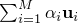
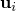
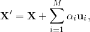
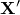
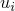
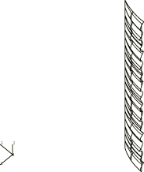
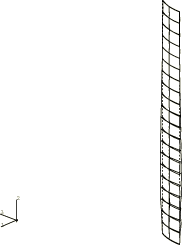

# 15.1.4 Creation of a perturbed mesh from original coordinate data and eigenvectors: FPERT


**Product: **Abaqus/Standard  

This example illustrates the use of a FORTRAN program to create a perturbed mesh by superimposing a small imperfection in the form of the weighted sum of several buckling modes on the initial geometry. The program retrieves the original nodal coordinates and the desired eigenvectors from an Abaqus results file, then calculates new nodal coordinates for the perturbed mesh.

### General description

Collapse studies of a structure's postbuckling load-displacement (Riks) behavior are often conducted to verify that the critical buckling load and mode predicted by an eigenvalue buckling analysis are accurate. They are also done to investigate the effect of an initial geometric imperfection on the load-displacement response. A typical assumption is that an imperfection made up of a combination of the eigenmodes associated with the lowest eigenvalues will be the most critical. One method of introducing an imperfection of this type into the model is by adding  to the original mesh coordinates. In this case  is the *i*th eigenmode,  is a scaling factor of the *i*th eigenmode, and *M* is the total number of eigenmodes extracted in the buckling analysis. Since the eigenvector is typically normalized to a maximum absolute value of one,  is usually some fraction of a geometric parameter, such as the shell thickness. The postprocessing program described below can be used to introduce an imperfection of this type into a model.

The perturbation procedure is illustrated in ["Buckling of a cylindrical shell under uniform axial pressure," Section 1.2.3 of the Abaqus Benchmarks Guide](../bmk/bmk-link.md#bmk-anl-bucklecylshell). An eigenvalue buckling analysis, `fpert001`, is run first. This analysis creates the results file, `fpert001.fil`, which contains the original nodal coordinates and the eigenvectors for the buckling modes. This results file is then used to generate a perturbed mesh for the postbuckling load-displacement analysis. The postprocessing program perturbs the original mesh using the relation



where  is the vector containing the new global coordinates;  is the vector of original coordinates; *M* is the number of buckling modes; and  is the imperfection factor for the *i*th eigenvector, . The new coordinates are written to the file `fpert002.015`, which is read by the load-displacement analysis `fpert002`.

### Programming details

The general discussion on programming concepts and Abaqus FORTRAN interfaces in ["User postprocessing of Abaqus results files: overview," Section 15.1.1](ch15s01abo02.md), should be reviewed before running or modifying this program. Review of the results file format in [Chapter 5, "File Output Format," of the Abaqus Analysis User's Guide](../usb/usb-link.md#usbfchapter) is also recommended. 

The `FPERT` program (this program is named `fpert.f` on the Abaqus release media) makes some assumptions concerning the type of results file it will be reading. Variables `NRU`, `LRUNIT(1,NRU)`, and `LRUNIT(2,NRU)` are initialized within the program to `1`, `8`, and `2`. These values indicate that one file will be read, the FORTRAN unit used will be `8`, and the file type will be binary. See ["Accessing the results file information," Section 5.1.3 of the Abaqus Analysis User's Guide](../usb/usb-link.md#usb-out-faccessinfo), for more information on opening and initializing postprocessing files.

Once the file specification parameters are set, the `INITPF` and `DBNRU` subroutines are called to open and ready the file, whose name is stored in `FNAME`, for reading. The file to which the perturbed coordinates are to be written can be directly opened using a FORTRAN `OPEN` statement. The Abaqus file utilities are not necessary since the file is a plain text file.

The records with the original nodal coordinates are read using the `DBFILE` routine and stored in the local array `COORDS(3,8000)`. The first index of the `COORDS` array indicates the *x*-, *y*-, and *z*-coordinate of the node. The second index indicates the node number. The second dimension should be increased if there are more than 8000 nodes in a model.

Components of the eigenvector are stored in the local array `DISP(6,8000)`. This array holds up to 6 displacement terms for each node. The second dimension should be increased if there are more than 8000 nodes in a model. Subroutine `NODEGEN`, a subroutine local to this postprocessing program, is then called to compute the new nodal coordinates. Once all the requested mode shapes are computed, the new nodal coordinates are written to the plain text file opened earlier.

### Program compilation and linking

The **abaqus make** utility is designed to compile and link this type of postprocessing program. It will also make the `aba_param.inc` file available during compilation. The command to compile and link the `FPERT` program is as follows:

```
abaqus make job=fpert
```
This command will have to be repeated if FORTRAN errors are discovered during the compilation or link. The commands used by the **abaqus make** utility can be changed if necessary. The [Abaqus Installation and Licensing Guide](../sgb/sgb-link.md#sgb) lists the typical compile and link commands for each computer type.

### Program execution

Before the program is executed, an eigenvalue buckling job must have been run with Abaqus. In this example the input file `fpert001.inp` is used to generate the results file `fpert001.fil`. When the `FPERT` program is executed using the command `abaqus fpert`, the first prompt will be

```
Enter the name of the results file (w/o .fil):
```
Enter `fpert001` to define `FNAME`. The second prompt will be
```
Enter the mode shape(s) to be used in calculating the perturbed
mesh (zero when finished):
```
Enter `1` followed by `0`, since this is the only eigenvector available in the results file for this example. At the third prompt,
```
Enter the imperfection factor to be introduced into the geometry
for this eigenmode:
```
enter `0.25`. This sets  = 0.25, the shell thickness for this model. The program then processes the data and writes the nodal coordinates for the new mesh to `fpert002.015`.

### Analysis description

For a full discussion of the analysis, refer to ["Buckling of a cylindrical shell under uniform axial pressure," Section 1.2.3 of the Abaqus Benchmarks Guide](../bmk/bmk-link.md#bmk-anl-bucklecylshell). The input file `fpert001.inp` (same file as `bucklecylshell_s9r5_n3.inp`) contains a 2  20 mesh of S9R5 elements and data lines for a buckling analysis. The input file `fpert002.inp` contains data lines for a Riks analysis using a perturbed mesh. The source code for the `FPERT` program is in `fpert.f`.

### Results and discussion

Plots produced by these analyses are shown in [Figure 15.1.4--1](ch15s01aex157.md#exafpert-eigen) and [Figure 15.1.4--2](ch15s01aex157.md#exafpert-riks). [Figure 15.1.4--1](ch15s01aex157.md#exafpert-eigen) is obtained from the eigenvalue buckling analysis and shows the original (cylindrical) mesh and the critical buckling mode. [Figure 15.1.4--2](ch15s01aex157.md#exafpert-riks) is generated when the load level has reached a local maximum (increment 8) in the Riks analysis using the perturbed mesh.

### Input files

[fpert001.inp](../eif/fpert001.inp)

Eigenvalue buckling analysis.

[fpert002.inp](../eif/fpert002.inp)

Riks analysis using a perturbed mesh.

[fpert.f](../eif/fpert.f)

Postprocessing program.

### Figures

**Figure 15.1.4–1** Undeformed shape and eigenvalue buckling mode.



**Figure 15.1.4–2** Deformed shape at first peak load in Riks analysis.




